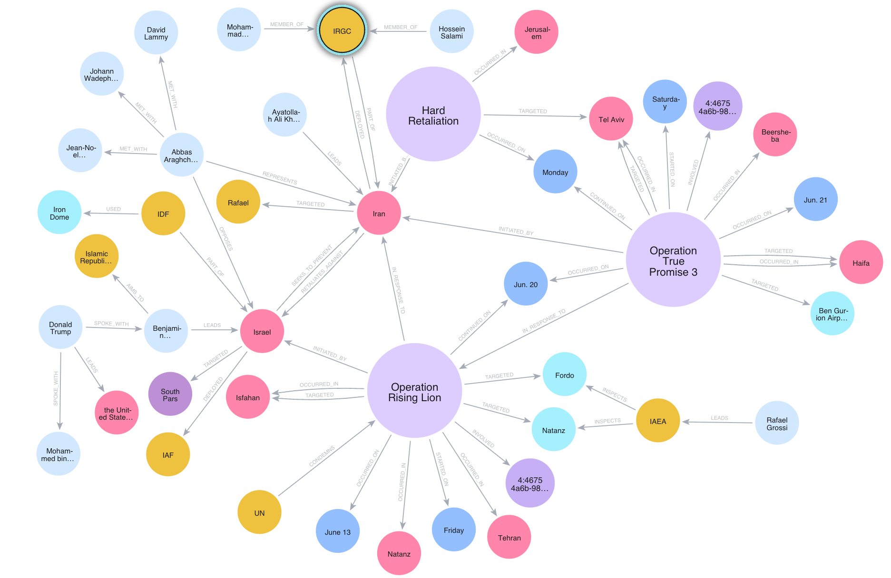

# International Relations & Conflict
## Israel-Iran Conflict

### Escalation & Military Actions
- *13477* [Missiles launched from Iran, sirens sounded across Israel](https://www.israelnationalnews.com/news/410393) *arutz-sheva*
- *13483* [15 fighter jets: IAF completes strikes on missile launch sites in western Iran](https://www.israelnationalnews.com/news/410386) *arutz-sheva*
- *13494* [IAF destroys Iranian missile launchers, eliminates IRGC commander](https://www.israelnationalnews.com/news/410376) *arutz-sheva*
- *13542* ['It's heavy on the heart': Israelis survey damage in city hit by Iranian missile](https://www.bbc.com/news/articles/cx270vklvv7o) *bbc-me*
- *13543* ['Destruction all around': BBC reports from Israeli city targeted by Iran](https://www.bbc.com/news/videos/cvg92jnylzxo) *bbc-me*
- *13753* [Iranian drones land in Israel in fresh operation](https://en.mehrnews.com/news/233415/Iranian-drones-land-in-Israel-in-fresh-operation) *mehr-news*
- *13766* [Iran attacks Ben Gurion Airport, military centers in Israel](https://en.mehrnews.com/news/233401/Iran-attacks-Ben-Gurion-Airport-military-centers-in-Israel) *mehr-news*
- *13771* [Israel&apos;s Military Withdraws Claim of Quick Victory over Iran Following Retaliatory Strikes](https://tn.ai/3339602) *tasnim-news*
- *13788* [Iran Delivers Heavy Blows to Israeli Targets in Central Tel Aviv](https://tn.ai/3339212) *tasnim-news*
- *13790* [Drones Take Lead in New Stage of Iran’s Attacks on Israeli Targets](https://tn.ai/3339275) *tasnim-news*
- *13795* [Israel hits Iranian nuclear research facility after talks in Switzerland falter](https://www.cbc.ca/news/world/israel-iran-1.7567750?cmp=rss) *cbc-top*
- *13809* [Israel says it launched strikes on Iran missile facilities](https://www.dw.com/en/israel-says-it-launched-strikes-on-iran-missile-facilities/live-72990787?maca=en-rss-en-all-1573-rdf) *dw*
- *12429* [Israel-Iran conflict unleashes wave of AI disinformation](https://www.bbc.com/news/articles/c0k78715enxo) *bbc-top*
- *12474* [Crisis - which crisis? Israel-Iran another huge challenge for government](https://www.bbc.com/news/articles/c5yxn52dz5ro) *bbc-pol*
- *12484* [Where is Israel's operation heading?](https://www.bbc.com/news/articles/ce829v2qzyro) *bbc-me*
- *12486* [Israel-Iran strikes: What are the worst-case scenarios?](https://www.bbc.com/news/articles/c74n23y1x48o) *bbc-me*
- *12487* [Iran is reeling from Israel's unprecedented attack - and it is only the start](https://www.bbc.com/news/articles/cvg72ny4xeyo) *bbc-me*
- *12490* [Watch: Explosions and damage across Israel as Iran launches fresh air strikes](https://www.bbc.com/news/videos/cre9e4y2n17o) *bbc-me*
- *12491* ['A very long night of attacks, with fears of more to come'](https://www.bbc.com/news/videos/c3rpg2qj377o) *bbc-me*
- *12492* [Watch: Israel strikes targets across Iran as leaders vow to fight](https://www.bbc.com/news/videos/czdy9nj73l8o) *bbc-me*
- *12493* [Analysis: Why has Israel chosen to attack Iran now?](https://www.bbc.com/news/videos/c1kv9ejy10yo) *bbc-me*
- *12765* [Iran and Israel announce more strikes as conflict enters fourth day](https://www.cnbc.com/2025/06/16/israel-vows-iran-will-pay-the-price-as-attacks-continue-for-a-fourth-day.html) *cnbc-politics*
- *12767* ['Tehran will burn:' Israel and Iran strike at each other in new wave of attacks](https://www.cnbc.com/2025/06/13/trump-urges-iran-to-reach-nuclear-deal-before-there-is-nothing-left-.html) *cnbc-politics*
- *12768* [Israel-Iran strikes likely just the opening salvo as region and markets brace for what comes next](https://www.cnbc.com/2025/06/13/iran-launches-100-drones-at-israel-in-response-to-missile-attack.html) *cnbc-politics*
- *12932* [20-25 Iranian missiles trigger widespread air raid alerts in Israel](https://www.egyptindependent.com/20-25-iranian-missiles-trigger-widespread-air-raid-alerts-in-israel/) *egyptian-independant*
- *12951* [Iran targets Israel's Channel 14 headquarters (+VIDEO)](https://en.mehrnews.com/news/233384/Iran-targets-Israel-s-Channel-14-headquarters-VIDEO) *mehr-news*
- *12952* [Advanced Israeli drone destroyed over Iran](https://en.mehrnews.com/news/233383/Advanced-Israeli-drone-destroyed-over-Iran) *mehr-news*
- *12957* [Iran pounds Israel's Rafael company in Haifa attack](https://en.mehrnews.com/news/233377/Iran-pounds-Israel-s-Rafael-company-in-Haifa-attack) *mehr-news*
- *12959* [Iran launches fresh wave of airstrikes on Israel](https://en.mehrnews.com/live/233375/Iran-launches-fresh-wave-of-airstrikes-on-Israel) *mehr-news*
- *12963* [Israeli Attack on Ambulance in Tehran Tantamount to Deliberate Murder: Spokesman](https://tn.ai/3339096) *tasnim-news*
- *12968* [Israel is targeting Iran's nuclear sites. Here's what we know about the radiation risks](https://www.cbc.ca/news/world/israel-iran-nuclear-radiation-risks-1.7566544?cmp=rss) *cbc-top*
- *13001* [Iran calls Israeli attack a 'betrayal' of diplomacy](https://www.dw.com/en/iran-calls-israeli-attack-a-betrayal-of-diplomacy/live-72979030?maca=en-rss-en-all-1573-rdf) *dw*
- *13014* [Why Israel is hitting Iran's vital energy infrastructure](https://www.dw.com/en/why-israel-is-hitting-iran-s-vital-energy-infrastructure/a-72936222?maca=en-rss-en-all-1573-rdf) *dw*
```
13477,13483,13494,13542,13543,13753,13766,13771,13788,13790,13795,13809,12429,12474,12484,12486,12487,12490,12491,12492,12493,12765,12767,12768,12932,12951,12952,12957,12959,12963,12968,13001,13014
```

[Video of summary](https://drive.google.com/file/d/1-0StRf4gkBY5WMAmv16q2KtOoRADwOYU/view?usp=sharing)

The Israel-Iran Conflict: A Region on the Brink.

Good evening. For decades, the simmering tensions between Israel and Iran have largely played out through proxies and covert operations. But in the past week, we have witnessed an unprecedented and alarming shift: a direct, overt military confrontation between these two regional powers. As sirens rang out across Israel and explosions rocked cities in Iran, the world has been left asking one critical question: "Until when?" This conflict, barely a week old, has already reshaped the geopolitical landscape, triggering a cascade of events with far-reaching implications.
The current hostilities, referred to as Israel's "Operation Rising Lion" and Iran's "True Promise Operation 3," commenced on Friday, June 13, 2025, with large-scale Israeli air strikes targeting Iran.
This initial offensive was met by immediate and significant Iranian retaliation, including six waves of attacks overnight that sent millions in Israel scrambling for shelter.
Reports from both sides confirm intense fighting, with the sounds of explosions reverberating through major urban centers such as Tel Aviv, Jerusalem, and Tehran.
The Israeli army has already cautioned its residents to "stay alert," indicating that the current exchanges could mark the beginning of a "prolonged campaign against Iran".
The sheer scale of this direct confrontation is described as "unprecedented" for Israel and the "biggest assault on its territory since the Iran-Iraq War of 1980-1988" for Iran.

The transition from a conflict primarily waged through proxy forces and clandestine operations to direct, large-scale military engagements between two sovereign states represents a profound change in the strategic calculations of both nations. This shift suggests that the traditional deterrence mechanisms, which previously confined the conflict to the shadows, have either eroded or been deliberately discarded. This new phase implies a heightened willingness by both Israel and Iran to accept greater risk, possibly stemming from perceived existential threats on Israel's part regarding Iran's nuclear program, or a desire by Iran to assert its power and retaliate forcefully. This readiness to cross previously unbreached boundaries renders the current situation far more volatile and less predictable than past regional tensions, significantly increasing the potential for miscalculation and unintended escalation. When both belligerents publicly commit to a "prolonged campaign" and continuous "retaliatory assaults," it establishes a perilous cycle of escalation. Each strike by one side is then framed as a "justified response" by the other, making it exceptionally difficult to find pathways for de-escalation or diplomatic resolutions. This dynamic fosters a competitive environment where each party feels compelled to respond with increasing force to uphold credibility, deter future attacks, and demonstrate unwavering resolve, rather than prioritizing a reduction in hostilities. This significantly elevates the potential for the conflict to spiral beyond the control of either side, leading to a broader regional conflagration or a more devastating outcome.

The Battlefield: Strikes, Counter-Strikes, and Casualties

The past week has witnessed a relentless exchange of fire, with both nations unleashing their arsenals. Israel's "Operation Rising Lion" has systematically targeted Iran's strategic capabilities, while Iran's "True Promise Operation 3" has sought to inflict damage on Israeli territory. The human cost, while still being tallied, is already tragically evident.

Israel's military actions, dubbed "Operation Rising Lion," began with initial strikes on June 13 that targeted and eliminated senior Iranian military commanders and nuclear scientists, including Major General Mohammad Bagheri and Dr. Mohammad Mehdi Tehranchi.
The operations quickly expanded to strike Iran's nuclear facilities, missile sites, air defenses, military bases, an airport, and other critical infrastructure.
Specific targets included two centrifuge production sites in Isfahan, which were hit in two waves, marking the second attack on Isfahan. Other sites such as Natanz, centrifuge workshops near Tehran, laboratories in Isfahan, and the Arak heavy water reactor were also struck.
Israel claims to have significantly degraded Iran's offensive capabilities, asserting that it has taken out over 50% of Iran's missile launchers, thereby creating a "bottleneck" in their ability to fire towards Israel.
Beyond Iran's borders, Israeli forces also targeted Iranian proxy forces, hitting a Hezbollah "infrastructure site" near Naqoura, Lebanon, and eliminating a Hezbollah militant near Baraashit.
High-profile assassinations continued, with Israel claiming responsibility for the deaths of Saeed Izadi, a Quds Force commander accused of financing Hamas for the October 7, 2023, attack, in Qom; Behnam Shahriyari, head of the Quds Force's weapons transfer unit, responsible for supplying Hezbollah, Hamas, and Houthi rebels, in western Iran; and a commander of Iran's drone force.

In retaliation, Iran launched "True Promise Operation 3," initiating six waves of attacks that included missiles striking Rishon LeZion, just south of Tel Aviv, and drones hitting the Galilee and Negev regions.
The Islamic Revolution Guards Corps (IRGC) announced the 18th phase of this operation, deploying Shahed 136 drones and precision solid and liquid-fuel missiles.
Iran claimed successful destruction of predetermined targets at Ben Gurion Airport and military operational logistics centers, asserting that Israel's advanced defense systems failed to intercept their drones, compelling Israelis to seek shelter.
Iranian media reported that their missiles targeted the Israeli regime's Channel 14 live broadcast headquarters in Haifa and the Rafael company, a major Israeli military contractor.
Iran also claimed that an Israeli advanced drone attempting to enter its airspace was destroyed over Ilam Province by air defenses.
Israeli media, including Channel 12, acknowledged that six out of ten Iranian missiles hit their targets during one round of attacks, with one striking Holon, south of Tel Aviv, causing a large fire and damaging a multi-story building.

The human cost of this conflict is mounting. In Israel, initial reports indicated three fatalities (two in Rishon LeZion, one in Ramat Gan) and 76 injuries across the country.
Later reports updated this to 19 killed and 23 injured from a rocket attack in central Israel, including a 16-year-old and two men in serious condition from shrapnel injuries.
Damage in Rishon LeZion included shattered windows, caved roofs, damaged cars, and destroyed homes.
Four dead and 87 injured were reported at four sites in central Israel, with collapsed buildings and fires.
In Iran, sources reported 78 killed by Friday night and approximately 800 injured by Saturday.
Iranian state television claimed 60 people, including 20 children, were killed in an Israeli strike on a block of flats in Tehran.
A Washington-based Iranian human rights group reported at least 657 killed, including 263 civilians, and over 2,000 wounded overall.
An Iranian ambulance was reportedly attacked in Tehran, killing three civilian medical personnel, an act Iran has deemed a war crime under the Geneva Conventions.
Additionally, a 16-year-old was killed and two others injured in an Israeli strike on a residential building in Qom.

The systematic and widespread targeting of Iran's core military and nuclear infrastructure, alongside the elimination of key commanders, suggests that Israel has moved beyond a strategy of "mowing the grass"—a term for periodic, limited strikes to degrade capabilities and deter. Instead, Israel appears to be pursuing a more decisive, potentially regime-altering strategy. This approach aims to inflict significant, long-term damage rather than merely achieving temporary setbacks, indicating a higher-stakes engagement. This could reflect a belief that the long-term threat of a nuclear-armed Iran outweighs the immediate dangers of military action, and implies a calculated reliance on potential external support for the most challenging strikes, such as those on deeply buried facilities.

Despite the sheer volume of Iranian projectiles, the reported destruction and casualties in Israel appear significantly lower than those reported in Iran. This stark difference highlights a notable asymmetry in defensive capabilities. Israel's advanced multi-tiered air defense systems, including the Iron Dome and the newly deployed "Lightning" system 1, appear highly effective in intercepting incoming threats. Conversely, Iran's ability to penetrate these defenses with precision and inflict widespread damage seems limited. This disparity could influence future strategic calculations, potentially prompting Iran to seek more advanced offensive capabilities or asymmetric responses, while Israel might feel emboldened by its demonstrated defensive prowess.

The conflict has also expanded into the realm of psychological warfare, evidenced by both Israeli and Iranian forces targeting media infrastructure. The IRGC struck Israel's Channel 14 headquarters in Haifa, while Israel targeted the Islamic Republic of Iran Broadcasting (IRIB) headquarters in Tehran.
The targeting of media outlets, even state-affiliated ones, extends the conflict beyond purely military objectives. By attempting to disrupt public information channels and potentially sow fear or confusion, both sides are seeking to control narratives and influence public morale. This tactic suggests an understanding that the battle for public perception, both domestically and internationally, is as crucial as the physical battlefield, indicating a more comprehensive and insidious form of warfare.

### **Major Military Actions and Casualties (June 13-21, 2025\)**

| Date | Attacker | Operation/Response Name | Key Targets | Locations | Reported Killed | Reported Injured | Key Damage Description | Source |
| :---- | :---- | :---- | :---- | :---- | :---- | :---- | :---- | :---- |
| June 13 | Israel | Operation Rising Lion | Senior Iranian military commanders & nuclear scientists | Iran (unspecified) | Multiple (incl. Maj. Gen. Bagheri) | N/A | N/A | 1 |
| June 13 | Israel | Operation Rising Lion | Nuclear facilities, missile sites, air defenses, military bases, airport, infrastructure | Iran (widespread) | 78 (Iran UN envoy), 657 (human rights group) | 800 (Iran health official), 2000+ (human rights group) | Widespread damage, incl. block of flats in Tehran (60 killed, 20 children) | 1 |
| June 13-21 | Iran | True Promise Operation 3 (18 waves) | Israeli military/strategic sites, Ben Gurion Airport, military logistics centers, civilian areas | Rishon LeZion, Ramat Gan, Galilee, Negev, Holon, Haifa, Beersheba, Dan Envelope | 3 (initial, Israel); 19 (later, Israel) | 76 (initial, Israel); 23 (later, Israel) | Shattered windows, caved roofs, damaged cars, destroyed homes, large fire, damaged multi-story building, collapsed buildings, fires, hit Channel 14 HQ | 1 |
| June 20 | Iran | True Promise Operation 3 | Rafael company (military contractor) | Israel (unspecified) | N/A | N/A | Hit Rafael company | 1 |
| June 20 | Iran | True Promise Operation 3 | Israeli advanced drone | Ilam Province, Iran | N/A | N/A | Drone destroyed, crashed in mountains | 1 |
| June 21 | Israel | Operation Rising Lion | Nuclear research facility (centrifuge sites) | Isfahan, Iran | N/A | N/A | Damage to facility, smoke rising | 1 |
| June 21 | Israel | Operation Rising Lion | Hezbollah infrastructure site, Hezbollah militant | Naqoura, Baraashit, Lebanon | 1 (militant) | N/A | Infrastructure site hit, militant eliminated | 1 |
| June 21 | Israel | Operation Rising Lion | Saeed Izadi (Quds Force commander), Behnam Shahriyari (Quds Force weapons transfer), Drone force commander | Qom, Western Iran | 3 (commanders) | N/A | Apartment hit, vehicle hit | 1 |
| June 21 | Israel | Operation Rising Lion | Nuclear sites (Natanz, Isfahan), Centrifuge workshops (Karaj, Tehran), Arak heavy water reactor | Natanz, Isfahan, Karaj, Tehran, Arak | N/A | N/A | Pilot enrichment plant destroyed, 4 critical buildings damaged, centrifuge facilities damaged, heavy water reactor hit (no radiological effects) | 1 |
| June 21 | Iran | True Promise Operation 3 | Shahran oil depot | Tehran, Iran | N/A | N/A | Depot targeted, situation under control | 1 |
| June 21 | Iran | True Promise Operation 3 | Residential building | Qom, Iran | 1 (16-year-old) | 2 | Residential building hit | 1 |
| June 21 | Iran | True Promise Operation 3 | Ambulance | Tehran, Iran | 3 (medical personnel) | N/A | Ambulance attacked | 1 |
| June 21 | Israel | Operation Rising Lion | Weapon production sites (Quds Force, IRGC, Iranian military) | Tehran, Iran | N/A | N/A | Wide-scale strikes on numerous sites | 1 |

## **Iran's Nuclear Ambitions: The Core Target**

At the heart of Israel's campaign lies Iran's nuclear program, a long-standing source of profound concern for Jerusalem. The strikes have systematically targeted key facilities, raising urgent questions about proliferation and the potential for catastrophic radiological consequences.

Israel's "Operation Rising Lion" explicitly aims to "destroy the Iranian nuclear program" and eliminate what Prime Minister Netanyahu calls an "existential threat" \[1. This strategic objective has manifested in the systematic targeting of various Iranian nuclear facilities. The Natanz site, specifically a pilot fuel enrichment plant located above ground, was reportedly destroyed.
In Isfahan, a nuclear research facility was attacked in two waves, with two centrifuge production sites as primary targets. This marked the second attack on Isfahan, and four "critical buildings," including the Uranium Conversion Facility, sustained damage.
Centrifuge production facilities in Karaj and Tehran were also reportedly damaged.
The Arak (Khondab) Heavy Water Research Reactor was hit; while it was under construction and not operational, it contained no nuclear material, thus no radiological effects were reported.
Of particular concern is the Fordow facility, buried deep underground in a mountain, which is widely considered beyond the reach of all but America's specialized "bunker-buster" bombs. Israeli media reports suggest the current objective is to cut off access to this site, and two explosions were heard near the facility \[1, S\_B0, 1\].

Iran consistently maintains that its nuclear program is solely for peaceful purposes. However, it is the only non-nuclear-weapon state known to enrich uranium up to 60% purity, a level far beyond what is needed for civilian power generation and a relatively short technical step away from weapons-grade material.
The International Atomic Energy Agency (IAEA) has found Iran in breach of its non-proliferation obligations and has threatened to refer the matter to the UN Security Council 1\]. The IAEA's latest report indicates that Iran has accumulated enough 60% enriched uranium to potentially produce nine nuclear bombs 1\].

The IAEA Director-General, Rafael Grossi, has repeatedly issued urgent warnings against attacks on nuclear facilities, emphasizing that they "should never take place" and "could result in radioactive releases with great consequences" 1\]. Grossi specifically highlighted the Bushehr nuclear power plant, Iran's only commercial reactor, stating unequivocally that a direct hit would lead to a "very high release of radioactivity to the environment" and that disabling its power lines could cause a reactor core melt.
Experts, including James Acton and Fabian Hinz, concur that attacking Bushehr would be "foolhardy" and could trigger an "absolute radiological catastrophe".
Despite the ongoing attacks, the IAEA reported no increase in radiation levels at Natanz or Isfahan as of Friday morning. However, Grossi noted a "sharp degradation to nuclear safety and security in Iran" and warned of potential future dangers.
The IAEA maintains that it can guarantee the non-development of nuclear weapons through a "watertight inspection system".

Israel's consistent and widespread targeting of Iran's nuclear infrastructure, including the assassination of scientists and commanders, underscores its perception of Iran's nuclear capability as an immediate and intolerable existential threat that cannot be managed through conventional deterrence or diplomacy alone. This indicates a strategic choice to pursue a military solution, accepting the high risks of escalation. This approach suggests a belief that the long-term threat of a nuclear-armed Iran outweighs the immediate dangers of military action. The willingness to target facilities like Fordow, which requires US "bunker-busters," also implies a calculated reliance on potential US support for the most difficult strikes.

The IAEA's dire warnings about radiological release, particularly concerning the Bushehr nuclear power plant, highlight a critical humanitarian and environmental risk that extends far beyond the immediate conflict zone. A direct hit on a nuclear power plant, unlike military or enrichment facilities, could lead to a Chernobyl- or Fukushima-level event, spreading radioactive fallout across borders, contaminating vital resources, and impacting public health for generations. This potential for a transnational catastrophe elevates the conflict from a regional security issue to a global humanitarian and environmental concern, implying that international actors have a vested interest in preventing such an outcome, regardless of their political alignment. This scenario also suggests a potential "red line" for international intervention if such an event were to unfold.

A significant point of divergence exists between intelligence assessments. US intelligence agencies maintain that Iran is *not* currently building a nuclear weapon.
This stands in stark contrast to Israeli claims that Iran is at the "90th minute" to developing a bomb. This direct contradiction from authoritative intelligence sources creates substantial ambiguity regarding the actual imminence of an Iranian nuclear weapon. If US intelligence assesses no active bomb program, Israel's aggressive military campaign might be seen as a pre-emptive strike based on a different interpretation of the threat, or potentially a political narrative designed to justify military action. This discrepancy complicates international efforts to mediate and build consensus, as the very premise of the conflict's urgency is disputed, potentially fueling distrust and hindering diplomatic solutions.

### **Status of Iran's Key Nuclear Facilities and IAEA Oversight**

| Facility Name | Type of Facility | Reported Israeli Targeting/Damage | IAEA Assessment of Damage/Radiation | Key IAEA Statements/Warnings | Strategic Importance/Vulnerability |
| :---- | :---- | :---- | :---- | :---- | :---- |
| Natanz | Uranium Enrichment Plant | Pilot fuel enrichment plant reportedly destroyed; attacks announced | Pilot plant destroyed; no increase in radiation levels observed (as of Fri morning) | Can guarantee non-development through "watertight inspection system" | Main enrichment facility |
| Isfahan | Nuclear Research Facility, Centrifuge Production Site | Attacked in two waves; two centrifuge production sites targeted; 4 "critical buildings" damaged (incl. Uranium Conversion Facility) | 4 critical buildings damaged; no increase in radiation levels observed (as of Fri morning) | "Sharp degradation to nuclear safety and security" | Key research and production site |
| Fordow | Uranium Enrichment Facility | Explosions heard near site; Israeli aim to cut off access | Not aware of damage yet | Considered out of reach for all but US "bunker-buster" bombs | Deep underground, highly protected |
| Bushehr | Commercial Nuclear Power Plant | Not targeted by Israel | N/A | "Very high release of radioactivity if hit"; "Foolhardy to attack"; "Absolute radiological catastrophe" if hit | Only commercial reactor; most serious consequences if hit |
| Arak (Khondab) | Heavy Water Reactor | Hit by Israeli military strikes | Not operational; no nuclear material; no radiological effects | N/A | Under construction, not operational |
| Karaj, Tehran workshops | Centrifuge Production Facilities | Reportedly damaged | Damaged | N/A | Key production sites |

## **The Diplomatic Chessboard: US, Europe, and Regional Players**

As missiles fly, the diplomatic efforts to contain this escalating crisis appear fraught with complexity, marked by canceled talks, European appeals for restraint, and the often-unpredictable pronouncements from Washington.

A sixth round of US-Iran nuclear talks, which had been scheduled for Sunday, June 22, 2025, in Oman, was abruptly canceled. Iranian Foreign Minister Abbas Araghchi stated unequivocally that discussions could not proceed while Iran was subjected to Israel's "barbarous" attacks.
Iranian state television echoed this sentiment, reporting that the talks, set to take place in Muscat, Oman, were suspended indefinitely.

European powers have actively sought to de-escalate the situation. European officials, including French President Emmanuel Macron, have expressed hope for future discussions and pledged to "accelerate negotiations" with Tehran.
In a phone call initiated by Iranian President Masoud Pezeshkian, Macron reiterated concerns about Iran's nuclear program and demanded the release of French citizens Cecile Kohler and Jacques Paris, who are held in Iran on espionage charges.
A meeting involving the German, French, and UK foreign ministers with Araghchi in Geneva concluded with the impression that Iran was "fundamentally willing to continue talks," but only on the condition that Israeli "aggression ceases".
Germany, in particular, emphasized the critical nature of the situation and the indispensable role of US involvement in finding a lasting solution.

The role of the United States, and particularly President Donald Trump's stance, has been a significant and often contradictory factor in the diplomatic landscape. Trump issued a "maximum" two-week deadline for Iran to avoid possible US military strikes, urging them to make a deal "before there is nothing left".
He has explicitly dismissed European mediation efforts, stating that "Iran doesn't want to speak to Europe. They want to speak to us".
In a notable contradiction, Trump asserted that his own Director of National Intelligence, Tulsi Gabbard, was "wrong" in her assessment that Iran is not currently building a nuclear weapon.
Despite the US State Department's claims of non-involvement in Israel's "unilateral action," Trump expressed satisfaction with Israel's performance and confirmed that the US was aware of Tel Aviv's plan. Reports indicate that Trump is weighing active US military involvement, a prospect Iranian Foreign Minister Araghchi described as "very unfortunate" and "very, very dangerous".
Significantly, Trump reportedly vetoed an Israeli plan to eliminate Iran's Supreme Leader Ayatollah Ali Khamenei. The escalating conflict remains a key topic of discussion at the ongoing G7 meeting.

President Trump's statements and actions regarding the conflict are notably inconsistent and contradictory. He sets ultimatums for Iran, dismisses European diplomatic efforts, contradicts his own intelligence chief, and simultaneously praises Israeli strikes while signaling a desire for peace. This erratic diplomatic posture creates profound uncertainty for all parties involved. For Israel, it might be perceived as a tacit endorsement for aggressive action, while for Iran, it renders US intentions opaque and potentially fuels distrust, hindering any genuine diplomatic engagement. This unpredictability itself becomes a destabilizing factor, making miscalculation more likely as actors struggle to interpret and react to a constantly shifting US position, thereby undermining any coherent international strategy for de-escalation.

The timing of Israel's unprecedented strikes, coinciding with scheduled US-Iran nuclear talks, has led Iranian officials to suspect that the talks were a "ploy" and that the strikes were "designed to kill President Trump's chances of striking a deal". This suggests that Israel's military campaign was not merely a response to a perceived threat but a deliberate strategic maneuver to derail any potential diplomatic breakthrough between the US and Iran. By launching large-scale attacks precisely when negotiations were set to resume, Israel effectively created conditions under which Iran refused to come to the table, thereby eliminating a diplomatic pathway that Israel views with suspicion. This implies a preference for military solutions over negotiated ones, potentially reflecting a deep-seated distrust of any deal that might allow Iran to retain nuclear capabilities.

The diverse and often conflicting approaches from international and regional actors reveal a fragmented global response to the crisis. European nations prioritize diplomacy and stability, while the US (under President Trump) oscillates between threats and a desire for a deal. Regional players such as Turkey and Pakistan are pursuing their own diplomatic maneuvers, sometimes at odds with major powers. For instance, Pakistan nominated President Trump for the 2026 Nobel Peace Prize for his role in de-escalating the India-Pakistan conflict, with some analysts suggesting this might be an attempt to dissuade him from intervening in Iran.
Turkish Foreign Minister Hakan Fidan, speaking at an Organization of Islamic Cooperation (OIC) meeting, asserted that the "Middle East has an 'Israel problem'" and urged Muslim nations to stand with Iran, warning that Israel is leading the region to "the brink of total disaster".
This lack of a unified front or a coherent international strategy makes it significantly harder to exert collective pressure for de-escalation or to establish a credible framework for resolution, allowing the conflict to potentially fester and expand.

## **Economic Fallout: Energy Markets and Sanctions**

Beyond the immediate human toll, this conflict carries a substantial economic price, particularly for global energy markets and Iran's already strained economy. The targeting of vital infrastructure threatens to ripple across the world.

The escalating conflict has significantly unsettled global energy markets. Initial fears of disruption to regional oil exports caused oil prices to surge by 9% on Friday, though they later saw a slight decrease.
An intensification of Israeli targeting of Iranian energy facilities could trigger a new, sharp spike in global oil and gas prices.
Further concerns include the potential closure of the Strait of Hormuz by Iran or increased attacks on Red Sea shipping by Houthi rebels, both of which would severely restrict global oil movement and supply. Such disruptions would inevitably contribute to global inflation, exacerbating the cost of living crisis for many countries, including the United Kingdom.
A prolonged conflict could also necessitate increased tax burdens in affected nations.

Israel's attacks have specifically targeted Iran's key oil and gas facilities, indicating a deliberate strategy to inflict economic pain. On Saturday, Israeli attacks struck Iran's energy infrastructure, including vital oil storage sites, refineries, and power stations.
A major target was the massive South Pars gas field, located off Iran's southern Bushehr province, which is the world's largest natural gas reservoir and the source of most of Iran's gas production. This attack forced a partial suspension of production at the field.
Iranian Foreign Minister Araghchi condemned the South Pars attack as an attempt to "expand the war beyond" Iran.
The Shahran oil depot in Tehran was also targeted in an Israeli attack.
This move goes beyond purely military objectives and signals a clear intent to wage economic warfare. By directly attacking Iran's primary source of revenue from energy exports, Israel aims to degrade Tehran's ability to fund its military, nuclear program, and regional proxies. This strategy is designed to create internal pressure on the Iranian regime by exacerbating its economic woes, potentially leading to social unrest or a weakening of its strategic capabilities.

Iran is a significant player in the global energy sector, possessing the world's second-largest proven natural gas reserves and the third-largest crude oil reserves. Its energy exports account for a substantial portion of its government revenue, reaching $144 billion from 2021 to 2023\.
However, Iran's economy is already "reeling from a raft of crises such as soaring inflation and a collapsing currency," a result of decades of mismanagement and one of the world's most stringent sanction regimes.
US sanctions, reimposed after President Trump unilaterally withdrew from the 2015 nuclear deal, have severely curtailed Iran's oil and natural gas exports, banking, and shipping sectors.
Despite its vast hydrocarbon reserves, much of Iran's potential remains untapped due to a lack of advanced technology and billions of dollars in new investment needed to modernize its oil and gas sectors. The country also faces endemic energy shortages, declining production, and outdated equipment, leading to rolling power blackouts.

While sanctions are intended to pressure a regime, their long-term impact on Iran's economy has created a fragile state. The current military strikes, by directly hitting revenue-generating assets, could push the economy to a breaking point. This could lead to increased domestic instability and public discontent, potentially achieving a desired outcome for Israel, which is the weakening of the regime. However, this approach could also backfire by strengthening the resolve of hardliners within Iran, who might argue that acquiring nuclear weapons is the only viable deterrence against such comprehensive attacks, thereby accelerating proliferation efforts. The desperation caused by economic collapse could also lead to more unpredictable and aggressive actions.

A crucial broader implication of this conflict is its effect on global economic interconnectedness. Rising oil prices would directly contribute to global inflation, exacerbating the cost of living crisis for many countries, including the United Kingdom.
Furthermore, a significant, albeit unintended, consequence is the direct benefit to adversaries such as Russia, which would see billions more dollars flood into Kremlin coffers to fund its ongoing war against Ukraine. This demonstrates the profound interconnectedness of the global economy and geopolitical events. A regional conflict, even if geographically distant, can have immediate and tangible economic consequences for ordinary citizens worldwide through energy price shocks and inflation. The unintended consequence of benefiting an adversary by providing additional funding for another ongoing conflict highlights how complex and intertwined global crises have become, making isolated policy responses increasingly ineffective.

## **The Digital Front: Information Warfare and AI's Role**

In this modern conflict, the battlefield extends far beyond physical borders and into the digital realm. A torrent of disinformation, often powered by artificial intelligence, is shaping perceptions, blurring the lines between fact and fiction, and marking a new chapter in information warfare.

BBC Verify reported an "astonishing" volume of disinformation online since June 13, with dozens of posts aiming to amplify the perceived effectiveness of Iran's response to Israeli strikes.
This conflict marks "the first time generative AI has been used at scale during a conflict," fundamentally altering the landscape of information warfare.
A significant portion of this content includes AI-generated videos boasting of Iran's military capabilities and fake clips purporting to show the aftermath of strikes on Israeli targets.
The three most viewed fake videos identified by BBC Verify collectively amassed over 100 million views across multiple platforms.
Examples include an image with 27 million views depicting dozens of missiles falling on Tel Aviv, and another video claiming to show a missile strike on a Tel Aviv building at night.
AI-generated fakes have also focused on claims of the destruction of Israeli F-35 fighter jets, with one widely shared post claiming to show a damaged F-35 in the Iranian desert, exhibiting clear signs of AI manipulation such as civilians being the same size as nearby vehicles and a lack of impact signs in the sand.
Another video with 21.
million views on TikTok, claiming to show an F-35 being shot down, was later revealed to be footage from a flight simulator video game and was subsequently removed by TikTok.
Pro-Israeli accounts have also engaged in disinformation, recirculating old clips of protests and gatherings in Iran, falsely claiming they depicted mounting dissent against the government and support for Israel's military campaign.
This included a widely shared AI-generated video falsely purporting to show Iranians chanting "we love Israel" on the streets of Tehran.
As speculation grew about potential US strikes on Iranian nuclear sites, some accounts began posting AI-generated images of B-2 bombers over Tehran.

The proliferation of disinformation is facilitated by various actors. Certain accounts have become "super-spreaders" of disinformation, experiencing significant growth in their follower counts; for instance, "Daily Iran Military" on X saw its followers increase by 85% in under a week.
Many obscure accounts with blue ticks and seemingly official names have appeared, prolifically posting misleading content, though their true operators remain unclear.
Well-known accounts, previously active in the Israel-Gaza war and other conflicts, are also contributing to the spread of disinformation, with motivations varying from political agendas to attempts to monetize the conflict through social media platform payouts for high view counts.
Notably, official sources in both Iran and Israel have shared fake images. State media in Tehran has disseminated fake footage of strikes and an AI-generated image of a downed F-35 jet, while the Israel Defense Forces (IDF) shared old, unrelated footage of missile barrages, which received a community note on X.
The reliability of information is further complicated by AI chatbots like X's Grok, which in some cases insisted that AI videos were real, even when they contained clear signs of AI content, and cited trusted news sources for its erroneous claims.

The unprecedented use of generative AI at scale in this conflict represents a profound shift in information warfare. This technology allows for the rapid creation and dissemination of highly convincing, yet entirely fabricated, visual and textual content. The ease with which these fakes can be produced and spread, coupled with their high view counts, means that public perception can be significantly manipulated, blurring the lines between reality and fiction. This makes it increasingly difficult for individuals to discern accurate information, potentially leading to widespread confusion, distrust in traditional media, and a heightened susceptibility to narratives designed to serve specific political or military objectives. The weaponization of information, particularly through AI, has become a critical component of modern conflict, impacting public opinion, morale, and potentially even policy decisions.

The focus of some AI fakes on the alleged destruction of advanced Western weaponry, such as the F-35 fighter jets, is particularly noteworthy. If the barrage of clips were real, Iran would have destroyed 15% of Israel's F-35 fleet, a clearly exaggerated claim.
This specific targeting of advanced military hardware in disinformation campaigns suggests a strategic objective beyond merely exaggerating success. Analysts have linked some of this focus to Russian influence operations, which have recently shifted from undermining support for the war in Ukraine to sowing doubts about the capability of Western, particularly American, weaponry.
This indicates a broader geopolitical maneuver where the conflict between Israel and Iran is being leveraged by external actors to advance their own strategic narratives and weaken the perceived strength of their rivals. This highlights how AI-driven disinformation can serve multiple, interconnected strategic goals across different global conflicts.

## **Conclusion**

The direct military confrontation between Israel and Iran marks a profound and dangerous escalation in a long-simmering regional rivalry. This past week has seen an unprecedented shift from proxy warfare to overt, large-scale strikes, signaling a heightened risk tolerance by both sides and a potential "race to the bottom" in de-escalation efforts. The human toll, though still being assessed, is tragically evident in both nations, with civilian casualties and widespread damage to infrastructure.

Israel's "Operation Rising Lion" appears to be a maximalist effort aimed at fundamentally degrading Iran's nuclear program and strategic military capabilities, even at the risk of regional conflagration. The systematic targeting of key nuclear facilities and the assassination of top commanders underscore this decisive approach. While Israel's advanced air defense systems have demonstrated remarkable effectiveness, limiting the damage from Iran's numerous retaliatory strikes, the potential for a catastrophic radiological release from a hit on Iran's Bushehr nuclear power plant remains a grave, transnational concern. The conflicting intelligence assessments regarding Iran's nuclear weapon ambitions further complicate international efforts to de-escalate and find common ground.

On the diplomatic front, the situation is characterized by complexity and unpredictability. Nuclear talks have been canceled, and while European powers strive for mediation and de-escalation, the United States, under President Trump, has adopted a fluctuating stance, oscillating between ultimatums, praise for Israeli actions, and calls for peace. This erratic US posture, coupled with the perception that Israeli military actions are designed to derail diplomatic solutions, creates an environment of profound uncertainty, hindering a unified international response.

Economically, the conflict has immediate global repercussions, primarily through its impact on energy markets. Israel's deliberate targeting of Iran's vital oil and gas infrastructure represents a strategic move to exert economic pressure, exacerbating Iran's already strained economy, which is reeling from decades of sanctions and mismanagement. This economic warfare, however, carries the inherent risk of destabilizing global energy prices, contributing to inflation worldwide, and inadvertently benefiting adversaries such as Russia.

Finally, the conflict has unfolded on a new digital battlefield, characterized by an "astonishing" volume of disinformation, often powered by artificial intelligence. This marks a new era in information warfare, where AI-generated content blurs the lines between fact and fiction, manipulates public perception, and serves broader geopolitical agendas, including efforts to undermine the perceived strength of Western military technology. The pervasive nature of this digital front means that the battle for narratives is as critical as the physical conflict, influencing public opinion and potentially prolonging the crisis.

The trajectory of this conflict remains highly perilous and unpredictable. The interplay of direct military action, nuclear proliferation concerns, complex diplomatic maneuvers, economic pressures, and sophisticated information warfare creates a volatile landscape where miscalculation could lead to far-reaching and devastating consequences, extending well beyond the immediate borders of Israel and Iran.

### Diplomatic & International Reactions
- *13727* [Israel-Iran conflict: European diplomatic efforts in Geneva struggle to prevent escalation](https://www.lemonde.fr/en/international/article/2025/06/21/israel-iran-conflict-european-diplomatic-efforts-in-geneva-struggle-to-prevent-escalation_6742571_4.html) *lemonde*
- *13741* [Arab FMs condemn Israeli aggression, urge Iran-Israel de-escalation](https://www.egyptindependent.com/arab-fms-condemn-israeli-aggression-urge-iran-israel-de-escalation/) *egyptian-independant*
- *13750* [Iran FM warns US not to engage in Israeli war on Iran](https://en.mehrnews.com/news/233418/Iran-FM-warns-US-not-to-engage-in-Israeli-war-on-Iran) *mehr-news*
- *13755* [UNHRC rapporteurs condemn Israel aggression against Iran](https://en.mehrnews.com/news/233413/UNHRC-rapporteurs-condemn-Israel-aggression-against-Iran) *mehr-news*
- *13759* [Iran not sure it can trust US after Israel’s aggression](https://en.mehrnews.com/news/233408/Iran-not-sure-it-can-trust-US-after-Israel-s-aggression) *mehr-news*
- *13760* [OIC holds session to discuss Israeli aggression against Iran](https://en.mehrnews.com/news/233407/OIC-holds-session-to-discuss-Israeli-aggression-against-Iran) *mehr-news*
- *13768* [Iran's foreign minister in Turkey for OIC meeting](https://en.mehrnews.com/news/233399/Iran-s-foreign-minister-in-Turkey-for-OIC-meeting) *mehr-news*
- *13774* [UN Experts, Special Rapporteurs Condemn Israeli Aggression against Iran](https://tn.ai/3339563) *tasnim-news*
- *13777* [Araqchi Warns US Not to Engage in Israeli War on Iran](https://tn.ai/3339539) *tasnim-news*
- *13780* [Arab League Denounces Israeli Aggression on Iran](https://tn.ai/3339439) *tasnim-news*
- *13787* [Iran Steps Up Diplomacy to Halt Israeli Aggression as OIC Convenes in Turkey](https://tn.ai/3339328) *tasnim-news*
- *13802* [With no embassy in Tehran, Canada reacts to turmoil in Iran from afar](https://www.cbc.ca/news/world/iran-emergency-canada-no-embassy-1.7567370?cmp=rss) *cbc-top*
- *12757* ['Now is the time for restraint:' World leaders react to Israel's strikes on Iran](https://www.cnbc.com/2025/06/13/world-leaders-react-to-israels-strikes-on-iran.html) *cnbc-europe*
- *12914* [European powers urge Iran to continue nuclear talks with US](https://www.lemonde.fr/en/international/article/2025/06/20/european-powers-urge-iran-to-continue-us-nuclear-talks_6742554_4.html) *lemonde*
- *12929* [Egypt Forms Crisis Committee Amid Escalating Iran-Israel Conflict](https://egyptianstreets.com/2025/06/17/egypt-forms-crisis-committee-amid-escalating-iran-israel-conflict/) *egyptian-streets*
- *12939* [UN Secretary-General calls for end to Israel war against Iran](https://en.mehrnews.com/news/233394/UN-Secretary-General-calls-for-end-to-Israel-war-against-Iran) *mehr-news*
- *12942* [Iran not negotiate with any side until Israel stop attacks](https://en.mehrnews.com/news/233391/Iran-not-negotiate-with-any-side-until-Israel-stop-attacks) *mehr-news*
- *12943* [Iran FM holding talks with Europe in Geneva](https://en.mehrnews.com/news/233390/Iran-FM-holding-talks-with-Europe-in-Geneva) *mehr-news*
- *12965* [Iran Urges Collective Action against Israeli War Crimes](https://tn.ai/3339056) *tasnim-news*
- *13003* [Iran-Israel war: Will India need to pick a side?](https://www.dw.com/en/iran-israel-war-will-india-need-to-pick-a-side/a-72983963?maca=en-rss-en-all-1573-rdf) *dw*
- *13027* [Israel attacks put pressure on Germany's Middle East policies](https://www.dw.com/en/israel-attacks-put-pressure-on-germany-s-middle-east-policies/a-72900451?maca=en-rss-en-all-1573-rdf) *dw*
```
13727,13741,13750,13755,13759,13760,13768,13774,13777,13780,13787,13802,12757,12914,12929,12939,12942,12943,12965,13003,13027
```
### Iran Nuclear Program
- *13527* [Tulsi Gabbard now says Iran could produce nuclear weapon 'within weeks'](https://www.bbc.com/news/articles/c056zqn6vvyo) *bbc-top*
- *13577* [Iran’s uranium enrichment secures independence, peaceful atom — supreme leader](https://tass.com/world/1968185) *tass*
- *13584* [Tehran could weigh nuclear deal with US with Iran-based enrichment consortium — Axios](https://tass.com/world/1968163) *tass*
- *13719* [Israel weighs options to destroy Fordow if it has to go it alone without help from the US](https://www.foxnews.com/world/israel-weighs-options-destroy-fordow-has-go-alone-without-help-from-u-s) *fox-world*
- *13761* [Iran complains about IAEA chief’s approach](https://en.mehrnews.com/news/233406/Iran-complains-about-IAEA-chief-s-approach) *mehr-news*
- *13786* [Iran Complains to UN about Grossi’s Biased Conduct](https://tn.ai/3339392) *tasnim-news*
- *13478* [IAEA warns of 'significant danger' at Iran's Natanz nuclear facility](https://www.israelnationalnews.com/news/410391) *arutz-sheva*
- *13485* [Europe, Iran talk nuclear program amidst Israel-Tehran war](https://www.israelnationalnews.com/news/410384) *arutz-sheva*
- *12417* [Iran rules out new nuclear talks until attacks stop](https://www.bbc.com/news/articles/ckg505kl3zpo) *bbc-top*
- *12817* [European diplomats urge Iran to continue US nuclear talks in first face-to-face since strikes started](https://www.foxnews.com/world/european-diplomats-urge-iran-continue-us-nuclear-talks-first-face-to-face-since-strikes-started) *fox-world*
- *12818* [As Iran talks get underway, expert raises alarm over lack of plan to secure nuclear material](https://www.foxnews.com/world/iran-talks-get-underway-expert-raises-alarm-over-lack-plan-secure-nuclear-material) *fox-world*
- *12819* [UN nuclear chief says Iran has material to build bombs, but no plan to do so](https://www.foxnews.com/world/un-nuclear-chief-says-iran-has-material-build-bombs-no-plan-do-so) *fox-world*
- *12948* [What happened in first round of Iran-E3 talks?](https://en.mehrnews.com/news/233386/What-happened-in-first-round-of-Iran-E3-talks) *mehr-news*
- *12954* [IAEA chief delivers speech over Israeli aggression on Iran](https://en.mehrnews.com/news/233381/IAEA-chief-delivers-speech-over-Israeli-aggression-on-Iran) *mehr-news*
```
13527,13577,13584,13719,13761,13786,13478,13485,12417,12817,12818,12819,12948,12954
```
### Public & Societal Impact
- *13700* [Here’s what a post-Ayatollah Iran could look like if war with Israel leads to regime’s fall](https://www.foxnews.com/world/heres-what-post-ayatollah-iran-could-look-like-war-israel-leads-regimes-fall) *fox-latest*
- *13751* [Businesses , markets reopen in Tehran](https://en.mehrnews.com/news/233417/Businesses-markets-reopen-in-Tehran) *mehr-news*
- *13758* [FM hails Iranians' strong solidarity amid imposed Israel war](https://en.mehrnews.com/news/233410/FM-hails-Iranians-strong-solidarity-amid-imposed-Israel-war) *mehr-news*
- *13781* [Businesses Reopen in Tehran](https://tn.ai/3339451) *tasnim-news*
- *13783* [Iranian Police Defuse Bomb in Tehran](https://tn.ai/3339422) *tasnim-news*
- *12430* ['Everyone is scared': Iranians head to Armenia to escape conflict with Israel](https://www.bbc.com/news/articles/c4ge7ej6824o) *bbc-top*
- *12431* [Young anti-regime Iranians divided over conflict](https://www.bbc.com/news/articles/clyn2nv21q9o) *bbc-top*
- *12482* ['Don't let beautiful Tehran become Gaza': Iranians tell of shock and confusion](https://www.bbc.com/news/articles/clylwvzxy4wo) *bbc-me*
- *12485* ['They're weak': Israelis back conflict with Iran in neighbourhood struck by missile](https://www.bbc.com/news/articles/cwyvykgnzq9o) *bbc-me*
- *12587* [Video shows moment man throws yogurt on two women in Iran](https://www.cnn.com/videos/world/2023/04/03/man-throws-yogurt-on-women-iran-president-raisi-hijab-is-law-nada-bashir-ovn-intl-ldn-vpx.cnn) *cnn*
- *12588* [Israeli military veterans, a backbone of protest movement, vow to keep demonstrating](https://www.cnn.com/2023/04/03/middleeast/israel-protests-military-veterans-intl-cmd/index.html) *cnn*
- *12912* [Despite destruction and death, Israelis widely support war against Iran](https://www.lemonde.fr/en/international/article/2025/06/20/despite-destruction-and-death-israelis-widely-support-war-against-iran_6742551_4.html) *lemonde*
- *12938* [84% of Iranians support Iran missile response to Israel](https://en.mehrnews.com/news/233395/84-of-Iranians-support-Iran-missile-response-to-Israel) *mehr-news*
- *12944* [Normal life in Iranian cities amid Israel threats](https://en.mehrnews.com/photo/233389/Normal-life-in-Iranian-cities-amid-Israel-threats) *mehr-news*
- *12955* [Sari people denounce Israel aggression on Iran](https://en.mehrnews.com/photo/233374/Sari-people-denounce-Israel-aggression-on-Iran) *mehr-news*
- *12958* [People in Semnan denounce Israeli attacks against Iran](https://en.mehrnews.com/news/233371/People-in-Semnan-denounce-Israeli-attacks-against-Iran) *mehr-news*
- *12997* [Iran: Can war with Israel trigger regime change?](https://www.dw.com/en/iran-can-war-with-israel-trigger-regime-change/a-72988384?maca=en-rss-en-all-1573-rdf) *dw*
- *12999* [Fact check: Protests against the Israel-Iran conflict?](https://www.dw.com/en/fact-check-protests-against-the-israel-iran-conflict/a-72985421?maca=en-rss-en-all-1573-rdf) *dw*
```
13700,13751,13758,13781,13783,12430,12431,12482,12485,12587,12588,12912,12938,12944,12955,12958,12997,12999
```
### Red Sea & Regional Maritime Conflict
- *13607* [Houthis say their strike prevented US military plane from landing in Israel](https://tass.com/world/1968081) *tass*
```
13607
```
## Israel-Gaza Conflict
### Daily Updates & Overview
- *12654* [June 17, 2024 - Israel-Gaza news](https://www.cnn.com/middleeast/live-news/israel-hamas-war-gaza-news-06-17-24/index.html) *cnn-me*
- *12655* [June 13, 2024 Israel-Hamas war](https://www.cnn.com/middleeast/live-news/israel-hamas-war-gaza-news-06-13-24/index.html) *cnn-me*
- *12656* [June 12, 2024 Israel-Hamas war](https://www.cnn.com/middleeast/live-news/israel-hamas-war-gaza-news-06-12-24-intl/index.html) *cnn-me*
- *12657* [June 10, 2024 Israel-Hamas war](https://www.cnn.com/middleeast/live-news/israel-hamas-war-gaza-news-06-10-24/index.html) *cnn-me*
- *12658* [June 10, 2024 - Israel-Hamas war](https://www.cnn.com/2024/06/10/middleeast/israel-hamas-war-gaza-news-06-10-24/index.html) *cnn-me*
- *12659* [June 9, 2024 Israel-Hamas war](https://www.cnn.com/middleeast/live-news/israel-hamas-war-gaza-news-06-09-24/index.html) *cnn-me*
- *12660* [June 8, 2024 - Israel-Gaza news](https://www.cnn.com/middleeast/live-news/israel-hamas-war-gaza-news-06-08-24/index.html) *cnn-me*
- *12661* [June 6, 2024 Israel-Hamas war](https://www.cnn.com/middleeast/live-news/israel-hamas-war-gaza-news-06-06-24/index.html) *cnn-me*
- *12662* [June 5, 2024 Israel-Hamas war](https://www.cnn.com/middleeast/live-news/israel-hamas-war-gaza-news-06-05-24/index.html) *cnn-me*
- *12663* [June 1, 2024 - Israel-Gaza news](https://www.cnn.com/middleeast/live-news/israel-hamas-war-gaza-news-06-01-24/index.html) *cnn-me*
- *12664* [May 30, 2024 Israel-Hamas war](https://www.cnn.com/middleeast/live-news/israel-hamas-war-gaza-news-05-30-24/index.html) *cnn-me*
- *12665* [May 29, 2024 Israel-Hamas war](https://www.cnn.com/middleeast/live-news/israel-hamas-war-gaza-news-05-29-24/index.html) *cnn-me*
- *12666* [May 28, 2024 - Israel-Hamas war](https://www.cnn.com/middleeast/live-news/israel-hamas-war-gaza-news-05-28-24/index.html) *cnn-me*
- *12667* [May 27, 2024 - Israel-Hamas war](https://www.cnn.com/middleeast/live-news/israel-hamas-war-gaza-news-05-27-24/index.html) *cnn-me*
- *12668* [May 26, 2024 Israel-Hamas war](https://www.cnn.com/middleeast/live-news/israel-hamas-war-gaza-news-05-26-24/index.html) *cnn-me*
- *12669* [May 24, 2024 Israel-Hamas war](https://www.cnn.com/middleeast/live-news/israel-hamas-war-gaza-news-05-24-24/index.html) *cnn-me*
- *12670* [May 22, 2024 Israel-Hamas war](https://www.cnn.com/middleeast/live-news/iran-israel-hamas-war-gaza-news-05-22-24/index.html) *cnn-me*
- *12671* [May 21, 2024 Israel-Hamas war, Iran president death news](https://www.cnn.com/middleeast/live-news/israel-hamas-war-gaza-news-05-21-24/index.html) *cnn-me*
- *12672* [May 20, 2024 Israel-Hamas war](https://www.cnn.com/middleeast/live-news/israel-hamas-war-gaza-news-05-20-24/index.html) *cnn-me*
- *12675* [May 19, 2024 - Israel-Gaza news](https://www.cnn.com/middleeast/live-news/israel-hamas-war-gaza-news-05-19-24/index.html) *cnn-me*
- *12677* [May 17, 2024 Israel-Hamas war](https://www.cnn.com/middleeast/live-news/israel-hamas-war-gaza-news-05-17-24/index.html) *cnn-me*
- *12678* [May 14, 2024 Israel-Hamas war](https://www.cnn.com/middleeast/live-news/israel-hamas-war-gaza-news-05-14-24/index.html) *cnn-me*
- *12679* [May 13, 2024 Israel-Hamas war](https://www.cnn.com/middleeast/live-news/israel-hamas-war-gaza-news-05-13-24/index.html) *cnn-me*
```
12654,12655,12656,12657,12658,12659,12660,12661,12662,12663,12664,12665,12666,12667,12668,12669,12670,12671,12672,12675,12677,12678,12679
```
### Humanitarian Situation & Civilian Impact
- *13544* [Video shows crowds in Gaza scale fence to rush for aid](https://www.bbc.com/news/videos/c14k60lzv00o) *bbc-me*
- *13579* [Israeli strike on school in Gaza Strip kills 18 people — TV](https://tass.com/world/1968179) *tass*
- *13800* [This activist spent 4 gruelling days in Israeli custody, but says he'll try again to bring aid to Gaza](https://www.cbc.ca/news/world/aid-vessel-gaza-madleen-thiago-avila-1.7567344?cmp=rss) *cbc-top*
- *12489* ['I begged for help, but only God answered': Growing dangers of pregnancy and childbirth in Gaza](https://www.bbc.com/news/articles/c626ljrp21yo) *bbc-me*
- *12676* [Devastation in Gaza as Israel wages war on Hamas](https://www.cnn.com/middleeast/live-news/israel-hamas-war-gaza-news-05-18-24/index.html) *cnn-me*
- *12928* [At Least 51 Killed in Gaza While Waiting for Aid, Health Officials Say](https://egyptianstreets.com/2025/06/17/at-least-51-killed-in-gaza-while-waiting-for-aid-health-officials-say/) *egyptian-streets*
```
13544,13579,13800,12489,12676,12928
```
### Ceasefire & Peace Efforts
- *13602* [UN Security Council to vote on draft resolution demanding ceasefire in Gaza](https://tass.com/world/1968095) *tass*
- *13609* [Mediators aim to reach Gaza truce before Eid al-Adha holiday — REPORT](https://tass.com/world/1968069) *tass*
```
13602,13609
```
### Targeted Strikes
- *13488* [Hamas finance chief eliminated in Gaza strike](https://www.israelnationalnews.com/news/410381) *arutz-sheva*
```
13488
```
## Israel-Palestine Conflict
### West Bank Operations & Arrests
- *13622* [20 suspected terrorists detained by Israeli military in West Bank — IDF](https://tass.com/world/1968035) *tass*
- *12650* [Several dead after Israeli joint security forces raid in West Bank](https://www.cnn.com/2022/10/25/middleeast/israel-forces-raid-nablus-palestine-intl-hnk/index.html) *cnn-me*
```
13622,12650
```
### Civilian Accounts & Activism
- *12600* [Palestinian taxi driver recounts surviving attack by right-wing protesters](https://www.cnn.com/videos/world/2023/03/31/israel-protests-rise-taxi-driver-attacked-robertson-pkg-intl-vpx.cnn) *cnn*
- *12419* [Palestine Action to be banned after activists break into RAF base](https://www.bbc.com/news/articles/cn81g4e0nlyo) *bbc-top*
- *13725* [Anti-Israel activist Mahmoud Khalil released following judge's order](https://www.foxnews.com/us/anti-israel-activist-mahmoud-khalil-released-following-judges-order) *fox-us*
- *12826* [Judge orders anti-Israel ringleader Mahmoud Khalil to be released on bail](https://www.foxnews.com/politics/judge-orders-anti-israel-ringleader-mahmoud-khalil-released-bail) *fox-politics*
- *12918* [US judge orders release of pro-Palestinian Columbia student Mahmoud Khalil](https://www.lemonde.fr/en/international/article/2025/06/20/us-judge-orders-release-of-pro-palestinian-columbia-student-mahmoud-khalil_6742555_4.html) *lemonde*
- *12984* [Mahmoud Khalil 'not a danger to the community,' says U.S. judge in ordering release of student protester](https://www.cbc.ca/news/world/mahmoud-khalil-freed-1.7567219?cmp=rss) *cbc-top*
```
12600,12419,13725,12826,12918,12984
```
## Syria-Israel Conflict
### Israeli Strikes in Syria
- *13601* [Syrian authorities deny shelling Israeli territory](https://tass.com/world/1968099) *tass*
- *13603* [Israeli warplanes deliver strike on Syria’s south — IDF](https://tass.com/world/1968093) *tass*
- *13611* [Israeli artillery shells targets in southern Syria after launch of projectiles from there](https://tass.com/world/1968065) *tass*
```
13601,13603,13611
```
## US Foreign Policy
### Middle East Policy
- *13479* [Gallant urges US to finish Iran nuclear job](https://www.israelnationalnews.com/news/410390) *arutz-sheva*
- *12760* [Trump weighs potential U.S. military strike on Iran, demands ‘unconditional surrender’](https://www.cnbc.com/2025/06/17/trump-iran-israel-khamenei.html) *cnbc-politics*
- *12761* [Trump signals escalation in Israel-Iran conflict as he leaves G7 summit early](https://www.cnbc.com/2025/06/17/g7-leaders-urge-de-escalation-in-middle-east-blame-iran-for-instability-and-terror-.html) *cnbc-politics*
- *12803* [WATCH: Dem senators blame Trump for Iran crisis as GOP urges him to stand firm with Israel](https://www.foxnews.com/politics/watch-dem-senators-blame-trump-iran-crisis-gop-urges-him-stand-firm-israel) *fox-latest*
- *12805* ['She's wrong': Trump says Tulsi Gabbard incorrect about Iran not having nuclear weapon capabilities](https://www.foxnews.com/politics/shes-wrong-trump-says-tulsi-gabbard-incorrect-about-iran-not-having-nuclear-weapon-capabilities) *fox-latest*
- *12829* [Foreign policy experts rip Tim Walz's claim that China has 'moral authority' in Middle East conflict](https://www.foxnews.com/politics/foreign-policy-experts-dismiss-tim-walzs-claim-china-has-moral-authority-middle-east-conflict) *fox-politics*
- *12830* [Trump 'doesn't need permission' from Congress to strike Iran, expert says](https://www.foxnews.com/politics/trump-doesnt-need-permission-from-congress-strike-iran-expert-says) *fox-politics*
- *12831* [Inside the Situation Room, where Trump and his national security team are weighing next steps on Iran](https://www.foxnews.com/politics/inside-situation-room-where-trump-his-national-security-team-weighing-next-steps-iran) *fox-politics*
- *12835* [Bernie Sanders says Israeli PM 'wrong' both in the past and now: 'We must not get involved in Netanyahu’s war'](https://www.foxnews.com/politics/bernie-sanders-says-israeli-pm-wrong-both-past-now-we-must-not-get-involved-netanyahus-war) *fox-politics*
```
13479,12760,12761,12803,12805,12829,12830,12831,12835
```
### Ukraine Policy
- *13612* [US hopes talks on Ukraine will not last for years - Department of State](https://tass.com/world/1968063) *tass*
- *13620* [Trump remains positive about progress of Ukraine settlement — White House](https://tass.com/world/1968039) *tass*
- *13621* [Kiev did not notify Trump about plans to attack Russian airfields — White House](https://tass.com/world/1968043) *tass*
```
13612,13620,13621
```
### Cuba Policy
- *13641* [US trade embargo against Cuba must be lifted — Medvedev](https://tass.com/politics/1967991) *tass*
```
13641
```
### Citizen Assistance Abroad
- *12792* [State Department says it has provided guidance to more than 25,000 people in Israel, West Bank and Iran](https://www.foxnews.com/politics/state-dept-says-has-provided-guidance-more-than-25000-people-israel-west-bank-iran) *fox-latest*
```
12792
```
## US-China Relations
### Trade & Economic Relations
- *13576* [Trump says 'always liked' Xi Jinping, but dealing with him 'extremely hard'](https://tass.com/world/1968189) *tass*
- *13050* [How the fragile US-China trade truce is unraveling](https://www.dw.com/en/how-the-fragile-us-china-trade-truce-is-unraveling/a-72755224?maca=en-rss-en-all-1573-rdf) *dw*
```
13576,13050
```
### Security & Espionage
- *12511* [China declines US proposal for phone call between defense chiefs on civilian unmanned airship incident](http://eng.chinamil.com.cn/view/2023-02/09/content_10217238.htm) *chinamil*
- *12520* [China condemns US attack on civilian unmanned airship and reserves the right to deal with similar situations](http://eng.chinamil.com.cn/view/2023-02/05/content_10216604.htm) *chinamil*
- *12576* [Suspected Chinese spy balloon was able to transmit information back to Beijing](https://www.cnn.com/2023/04/03/politics/chinese-spy-balloon/index.html) *cnn*
```
12511,12520,12576
```
### Taiwan
- *12577* [Beijing promised to 'fight back' over Taiwan leader's US visit. But this time it has more to lose](https://www.cnn.com/2023/04/04/asia/tsai-ing-wen-taiwan-mccarthy-meeting-analysis-intl-hnk/index.html) *cnn*
- *12524* [Taiwan parties, groups lodge protest against potential McCarthy visit](http://eng.chinamil.com.cn/view/2023-02/01/content_10215810.htm) *chinamil*
```
12577,12524
```
### Geopolitical Rivalry
- *13625* [Russia, China won't sell each other out for US perks — Russian official](https://tass.com/politics/1968027) *tass*
- *13588* [West exerts unprecedented pressure on China — Belarusian president](https://tass.com/world/1968143) *tass*
- *12746* [Europe is trying to woo Southeast Asia — but it won’t win it over the U.S. or China](https://www.cnbc.com/2025/06/16/europe-is-trying-to-woo-southeast-asia-but-it-wont-win-it-over-the-us-or-china.html) *cnbc-asia*
```
13625,13588,12746
```
## China Foreign Relations (non-US)
### Bilateral Cooperation
- *13567* [Belarus, China agree to enhance their cooperation — Lukashenko](https://tass.com/world/1968213) *tass*
- *13592* [Xi says China views Beijing-Minsk relations in strategic terms](https://tass.com/world/1968129) *tass*
- *12498* [Xi calls for high-level China-Africa community with shared future](http://eng.chinamil.com.cn/view/2023-02/18/content_10218008.htm) *chinamil*
- *12507* [AMAN-23: China-Pakistan friendship will make the sea more peaceful and secure](http://eng.chinamil.com.cn/view/2023-02/13/content_10217579.htm) *chinamil*
- *12528* [Xi extends condolences to Pakistani president over severe terror attack in Peshawar](http://eng.chinamil.com.cn/view/2023-02/02/content_10216116.htm) *chinamil*
```
13567,13592,12498,12507,12528
```
### Stance on International Issues
- *13747* [What’s behind Russia and China’s lack of support for Iran?](https://www.egyptindependent.com/whats-behind-russia-and-chinas-lack-of-support-for-iran/) *egyptian-independant*
- *12500* [Chinese envoy urges NATO to contribute positively to world peace, stability](http://eng.chinamil.com.cn/view/2023-02/18/content_10218005.htm) *chinamil*
- *12532* [Xiplomacy: How China becomes a strong buttress to UN](http://eng.chinamil.com.cn/view/2023-02/04/content_10216496.htm) *chinamil*
- *12515* [China provides emergency aid to Türkiye, Syria](http://eng.chinamil.com.cn/view/2023-02/08/content_10217035.htm) *chinamil*
```
13747,12500,12532,12515
```
## EU Foreign Policy
### EU-Israel Relations
- *12919* [EU review suggests Israel in breach of cooperation deal over Gaza](https://www.lemonde.fr/en/international/article/2025/06/20/eu-review-suggests-israel-in-breach-of-cooperation-deal-over-gaza_6742552_4.html) *lemonde*
```
12919
```
## Middle East Diplomacy
### Regional Meetings
- *13754* [Iran, Iraq foreign ministers hold meeting](https://en.mehrnews.com/news/233414/Iran-Iraq-foreign-ministers-hold-meeting) *mehr-news*
- *13757* [Iran, Saudi Arabia foreign ministers hold meeting](https://en.mehrnews.com/news/233411/Iran-Saudi-Arabia-foreign-ministers-hold-meeting) *mehr-news*
```
13754,13757
```
## South Asia Diplomacy
### India-Pakistan Conflict
- *13549* [Pakistani PM asks Putin to help resolve conflict with India — aide](https://tass.com/world/1968319) *tass*
```
13549
```
## Russia Foreign Policy
### Geopolitical Engagements
- *13561* [Press review: Kiev’s terrorist acts risk derailing talks as NATO expands Arctic footprint](https://tass.com/pressreview/1968153) *tass*
- *13767* [Putin warns of spreading conflict in region](https://en.mehrnews.com/news/233400/Putin-warns-of-spreading-conflict-in-region) *mehr-news*
```
13561,13767
```
## Japan Foreign Policy
### Middle East Evacuation
- *13648* [2 SDF planes leave Japan for Djibouti for possible Mideast evacuation](https://mainichi.jp/english/articles/20250621/p2g/00m/0na/028000c) *mainichi*
```
13648
```
### Defense Spending
- *13657* [US reportedly asked Japan to raise defense spending to 3.5% of GDP](https://mainichi.jp/english/articles/20250621/p2g/00m/0na/009000c) *mainichi*
- *13785* [Japan Scraps US Meeting After Washington Demands More Defense Spending](https://tn.ai/3339401) *tasnim-news*
```
13657,13785
```
### NATO Relations
- *12552* [Japan PM to visit Netherlands from Tuesday for NATO summit](https://mainichi.jp/english/articles/20250620/p2g/00m/0na/045000c) *mainichi*
```
12552
```
## Armenia-Turkey Relations
### Diplomatic Talks
- *12920* [Armenia PM hails talks with Erdogan during 'historic' visit to Turkey](https://www.lemonde.fr/en/international/article/2025/06/20/armenia-pm-arrives-in-turkey-for-historic-visit-in-bid-to-mend-ties_6742535_4.html) *lemonde*
```
12920
```
## Ukraine Conflict Diplomacy
### Peace Talks Efforts
- *13617* [Zelensky’s chief of staff meets with Witkoff to discuss Russia-Ukraine talks](https://tass.com/world/1968057) *tass*
- *13631* [Chief of Zelensky office briefs Kellogg on Russia-Ukraine talks](https://tass.com/world/1968013) *tass*
```
13617,13631
```
## NATO & Ukraine
### Membership Prospects
- *13574* [Zelensky likely to be invited to NATO summit but excluded from working meetings — agency](https://tass.com/world/1968197) *tass*
- *13583* [Ukraine's NATO membership off the table at upcoming The Hague summit — news agency](https://tass.com/world/1968165) *tass*
```
13574,13583
```
## International Cooperation
### Evacuation Operations
- *12868* [Spain trying to evacuate its citizens from Wuhan along with French, British nationals](https://elpais.com/elpais/2020/01/28/inenglish/1580220348_402354.html#?ref=rss&format=simple&link=link) *el-pais*
```
12868
```
## Geopolitics
### Asia-Pacific Security
- *13646* [Opinion: 80 years on, could Okinawa again become a battlefield?](https://mainichi.jp/english/articles/20250621/p2a/00m/0op/016000c) *mainichi*
- *13710* [Arrest of Chinese nationals in swing state, Israel's fight with Iran are 'wake up' call on CCP threat: experts](https://www.foxnews.com/politics/arrest-chinese-nationals-swing-state-israels-fight-iran-wake-up-call-ccp-threat-experts) *fox-latest*
```
13646,13710
```
### Peace Deals
- *12998* [Why justice is crucial in the US-led DRC-Rwanda peace deal](https://www.dw.com/en/why-justice-is-crucial-in-the-us-led-drc-rwanda-peace-deal/a-72988294?maca=en-rss-en-all-1573-rdf) *dw*
```
12998
```
## UK Foreign Policy
### Israel Evacuation Plan
- *12459* [UK preparing to charter flights from Israel, Lammy says](https://www.bbc.com/news/articles/cdez72x9pkdo) *bbc-pol*
```
12459
```
### Iran Relations
- *13522* [Tangled history and trouble today - what is the UK's plan on Iran?](https://www.bbc.com/news/articles/c3vdkk5gp1qo) *bbc-top*
```
13522
```
# Politics & Government
## US Politics
### Donald Trump's Legal Issues
- *12569* [Trump pleads not guilty to 34 felony counts](https://edition.cnn.com/webview/politics/live-news/trump-indictment-stormy-daniels-news-04-03-23/index.html) *cnn*
- *12570* [Haberman reveals why Trump attacked judge and his family in speech](https://www.cnn.com/videos/politics/2023/04/05/maggie-haberman-donald-trump-speech-indictment-reaction-sot-cnntm-vpx.cnn) *cnn*
- *12572* [READ: Trump indictment related to hush money payment](https://cnn.it/411KYN7) *cnn*
- *12766* [Trump loses bid for appeals court bid to rehear E. Jean Carroll case](https://www.cnbc.com/2025/06/13/trump-carroll-appeal-sex-abuse.html) *cnbc-politics*
- *13721* [Judge Boasberg orders Rubio to refer Trump officials' Signal messages to DOJ to ensure preservation](https://www.foxnews.com/politics/judge-boasberg-orders-rubio-refer-trump-officials-signal-messages-doj-ensure-preservation) *fox-politics*
```
12569,12570,12572,12766,13721
```
### Donald Trump's Policy & Administration
- *13571* [Trump slams use of Biden’s autopen as one of biggest scandals in American history](https://tass.com/world/1968205) *tass*
- *13600* [Musk criticizes Trump’s government spending bill as it harms his interests — portal](https://tass.com/world/1968105) *tass*
- *13605* [New anti-Russian sanctions ready, need to be approved by Congress, Trump — envoy](https://tass.com/economy/1968085) *tass*
- *13653* [Federal judge blocks Trump effort to keep Harvard from hosting foreign students](https://mainichi.jp/english/articles/20250621/p2g/00m/0in/016000c) *mainichi*
- *13684* [Trump to extend TikTok deadline for third time, pushing decision out another 90 days](https://www.cnbc.com/2025/06/17/trump-to-extend-tiktok-deadline-for-third-time-another-90-days.html) *cnbc-us*
- *13709* [Mexican mayor applauds Trump’s 'cleaning house' deportation plan](https://www.foxnews.com/media/mexican-mayor-applauds-trumps-cleaning-house-deportation-plan) *fox-latest*
- *13810* [US updates: Trump admin slashes jobs at Voice of America](https://www.dw.com/en/us-updates-trump-admin-slashes-jobs-at-voice-of-america/live-72990588?maca=en-rss-en-all-1573-rdf) *dw*
- *12716* [Supreme Court rejects fast track of Trump tariff challenge by toy companies](https://www.cnbc.com/2025/06/20/supreme-court-rejects-fast-track-of-trump-tariff-challenge-by-toy-companies.html) *cnbc-top*
- *12811* [Trump says Harvard agreement on international students may be announced within a week](https://www.foxnews.com/us/trump-says-harvard-agreement-international-students-may-announced-within-week) *fox-latest*
- *12933* [Trump grants TikTok another 90-day extension in enforcement of sale-or-ban law](https://www.egyptindependent.com/trump-grants-tiktok-another-90-day-extension-in-enforcement-of-sale-or-ban-law/) *egyptian-independant*
- *12972* [Judge halts Trump's attempt to keep international students from Harvard](https://www.cbc.ca/news/world/trump-harvard-foreign-students-order-1.7567393?cmp=rss) *cbc-top*
```
13571,13600,13605,13653,13684,13709,13810,12716,12811,12933,12972
```
### Donald Trump's Public Statements & Criticism
- *13692* [Trump gets his long-sought military parade as protests erupt nationwide](https://www.cnbc.com/2025/06/14/trump-parade-washington.html) *cnbc-politics*
- *13694* [Americans agree with Trump that Iran poses threat to United States: poll](https://www.foxnews.com/politics/americans-agree-trump-iran-poses-threat-united-states-poll) *fox-latest*
- *12601* [Giving Marjorie Taylor Greene a platform isn't good for America](https://www.cnn.com/2023/04/03/opinions/60-minutes-marjorie-taylor-greene-interview-obeidallah/index.html) *cnn*
- *12814* ['The View' host Ana Navarro pleads for Obama to speak out against Trump's 'American nightmare'](https://www.foxnews.com/media/the-view-host-ana-navarro-pleads-obama-speak-out-against-trumps-american-nightmare) *fox-latest*
- *12823* [Dem lawmaker sparks social media firestorm with 'cringe' anti-Trump guitar performance: 'Talk about tone-deaf'](https://www.foxnews.com/politics/dem-lawmaker-sparks-social-media-firestorm-cringe-anti-trump-guitar-performance-talk-about-tone-deaf) *fox-politics*
- *12828* [‘This guy’: Slurring Biden takes shot at Trump, those trying to ‘erase our history’ at Juneteenth church event](https://www.foxnews.com/politics/biden-lambasts-juneteenth-critics-black-church-speech-signs-cross-avoid-naming-trump) *fox-politics*
- *13042* [What Trump-Musk feud means for tech billionaire's business empire](https://www.dw.com/en/what-trump-musk-feud-means-for-tech-billionaire-s-business-empire/a-72811209?maca=en-rss-en-all-1573-rdf) *dw*
```
13692,13694,12601,12814,12823,12828,13042
```
### Immigration Policy & Enforcement
- *12736* [NYC mayoral candidate Brad Lander released after arrest by ICE](https://www.cnbc.com/2025/06/17/brad-lander-ice-mayoral-comptroller.html) *cnbc-us*
- *12813* [Kentucky wanted this fight: Former AG backs illegal immigrant tuition lawsuit as voter-approved](https://www.foxnews.com/politics/doj-lawsuit-against-kentuckys-illegal-immigrant-tuition-discount) *fox-latest*
- *12825* [Large city signs onto deal with ICE: 'Keep the American people safe'](https://www.foxnews.com/politics/large-city-signs-onto-deal-ice-keep-american-people-safe) *fox-politics*
- *12834* [Vance to meet with federal law enforcement, Marines in LA amid anti-ICE riots](https://www.foxnews.com/politics/vance-meet-federal-law-enforcement-marines-la-amid-anti-ice-riots) *fox-politics*
```
12736,12813,12825,12834
```
### Legislative & Executive Actions
- *13723* [User’s manual to the Big, Beautiful Bill this weekend and early next week](https://www.foxnews.com/politics/users-manual-big-beautiful-bill-weekend-early-next-week) *fox-politics*
- *12685* [GOP prepared to block vote to replace Feinstein on Senate Judiciary](https://www.cnn.com/2023/04/18/politics/schumer-senate-feinstein-vote-cardin/index.html) *cnn-us*
- *12687* [McCarthy makes plea for Republicans to back debt ceiling plan](https://www.cnn.com/2023/04/18/politics/mccarthy-debt-limit-plan/index.html) *cnn-us*
- *12721* [House, Senate tax bills both end many clean energy credits: 'It's just a question of timeline,' expert says](https://www.cnbc.com/2025/06/20/gop-big-beautiful-bill-would-end-many-clean-energy-tax-credits.html) *cnbc-top*
- *12796* [Several provisions fail to pass muster with Senate rules in 'big, beautiful bill'](https://www.foxnews.com/politics/several-provisions-fail-pass-muster-senate-rules-big-beautiful-bill) *fox-latest*
- *12833* [HHS gives California deadline to overhaul federally-funded sex ed program 'indoctrinating' kids](https://www.foxnews.com/politics/hhs-gives-california-deadline-overhaul-federally-funded-sex-ed-program-indoctrinating-kids) *fox-politics*
```
13723,12685,12687,12721,12796,12833
```
### Political Commentary & Campaigns
- *12832* [Rahm Emanuel on potential 2028 White House run: 'I have something I think I can offer'](https://www.foxnews.com/politics/rahm-emanuel-potential-2028-white-house-run-i-have-something-i-think-i-can-offer) *fox-politics*
- *13024* [How the LA protests may boost appetite for authoritarianism](https://www.dw.com/en/how-the-la-protests-may-boost-appetite-for-authoritarianism/a-72898958?maca=en-rss-en-all-1573-rdf) *dw*
- *12856* [The shoestring superpower](https://elpais.com/elpais/2020/01/22/inenglish/1579700969_637171.html#?ref=rss&format=simple&link=link) *el-pais*
```
12832,13024,12856
```
### G7 Summit & International Influence
- *13654* [Editorial: Directionless G7 must find its footing after Trump-dominated Canada summit](https://mainichi.jp/english/articles/20250621/p2a/00m/0op/002000c) *mainichi*
- *13697* [Trump cuts G-7 summit short as Israel–Iran conflict escalates during his 22nd week in office](https://www.foxnews.com/politics/trump-cuts-g-7-summit-short-israel-iran-conflict-escalates-during-his-22nd-week-office) *fox-latest*
- *12764* [As G7 leaders meet, allies ask: Is Trump with us or against us?](https://www.cnbc.com/2025/06/16/as-the-g7-meets-in-canada-allies-ask-is-trump-with-us-or-against-us.html) *cnbc-politics*
```
13654,13697,12764
```
## German Politics
### Domestic Policy
- *13635* [Baerbock to be paid €13,000 monthly to chair 80th session of UN General Assembly](https://tass.com/world/1968005) *tass*
- *12603* [Syrian refugee elected mayor of German town, years after fleeing war](https://www.cnn.com/2023/04/04/europe/germany-mayor-syrian-refugee-intl/index.html) *cnn*
- *13009* [Germany: One in four immigrants doesn't want to stay](https://www.dw.com/en/germany-one-in-four-immigrants-doesn-t-want-to-stay/a-72936625?maca=en-rss-en-all-1573-rdf) *dw*
- *13045* [Germany updates: Migrants have 'imported' antisemitism, says Merz](https://www.dw.com/en/germany-updates-migrants-have-imported-antisemitism-says-merz/live-72811723?maca=en-rss-en-all-1573-rdf) *dw*
- *13061* [German Cabinet approves stricter asylum measures](https://www.dw.com/en/german-cabinet-approves-stricter-asylum-measures/a-72786672?maca=en-rss-en-all-1573-rdf) *dw*
- *13038* [Russia's war emigrants pursue careers in German politics](https://www.dw.com/en/russia-s-war-emigrants-pursue-careers-in-german-politics/a-72783942?maca=en-rss-en-all-1573-rdf) *dw*
```
13635,12603,13009,13045,13061,13038
```
### Party Relations & Leaders
- *13049* [Germany's Merz 'extremely satisfied' with Trump talks](https://www.dw.com/en/germany-s-merz-extremely-satisfied-with-trump-talks/live-72794062?maca=en-rss-en-all-1573-rdf) *dw*
- *13063* [High hopes as Germany's Merz meets US President Trump](https://www.dw.com/en/high-hopes-as-germany-s-merz-meets-us-president-trump/a-72787681?maca=en-rss-en-all-1573-rdf) *dw*
```
13049,13063
```
### Public Opinion on Foreign Affairs
- *13052* [Germany: Voter trust in US and Israel decreasing](https://www.dw.com/en/germany-voter-trust-in-us-and-israel-decreasing/a-72796059?maca=en-rss-en-all-1573-rdf) *dw*
```
13052
```
## Iranian Politics
### Government & Leadership
- *13763* [Leader’s advisor Ali Shamkhani issues message](https://en.mehrnews.com/news/233404/Leader-s-advisor-Ali-Shamkhani-issues-message) *mehr-news*
- *13765* [Pezeshkian tasks Govt. with operating at full strength](https://en.mehrnews.com/news/233402/Pezeshkian-tasks-Govt-with-operating-at-full-strength) *mehr-news*
- *12673* [Iran's President Raisi killed in helicopter crash](https://www.cnn.com/middleeast/live-news/raisi-iran-president-helicopter-crash-05-20-24/index.html) *cnn-me*
- *12674* [May 19, 2024 helicopter crash involving Iranian president](https://www.cnn.com/middleeast/live-news/raisi-iran-president-helicopter-crash/index.html) *cnn-me*
- *12940* [Full speech of FM Aragchi in Human Rights Council](https://en.mehrnews.com/news/233393/Full-speech-of-FM-Aragchi-in-Human-Rights-Council) *mehr-news*
```
13763,13765,12673,12674,12940
```
## UK Politics
### Government & Policy Decisions
- *12428* [Why today's vote is so significant](https://www.bbc.com/news/articles/c79qzdpl144o) *bbc-top*
- *12468* [Why did the government sign the Chagos deal now?](https://www.bbc.com/news/articles/cp3ql9k3vdqo) *bbc-pol*
- *12471* [The new UK-EU deal at a glance](https://www.bbc.com/news/articles/czdy3r6q9mgo) *bbc-pol*
- *12472* [Chris Mason: Tariffs deal a triumph for Starmer - up to a point](https://www.bbc.com/news/articles/c86glg9zeejo) *bbc-pol*
- *12480* [Watch: Mel Stride pushed to say sorry for Liz Truss's mini-budget](https://www.bbc.com/news/videos/cvgq707q82jo) *bbc-pol*
- *12996* [UK Parliament backs assisted dying bill in historic vote](https://www.dw.com/en/uk-parliament-backs-assisted-dying-bill-in-historic-vote/a-72988943?maca=en-rss-en-all-1573-rdf) *dw*
```
12428,12468,12471,12472,12480,12996
```
### Political Parties & Dynamics
- *12432* ['Noses out of joint': Colleagues reveal what Reform's Zia Yusuf is like to work for](https://www.bbc.com/news/articles/c991epp257lo) *bbc-top*
- *12477* [Why Labour is strengthening ties with China after years of rollercoaster relations](https://www.bbc.com/news/articles/c071jr159p0o) *bbc-pol*
```
12432,12477
```
## Russian Politics
### Ukraine War Aims
- *13811* [Putin: 'All of Ukraine is ours' in theory, eyes Sumy city](https://www.dw.com/en/putin-all-of-ukraine-is-ours-in-theory-eyes-sumy-city/a-72990253?maca=en-rss-en-all-1573-rdf) *dw*
- *12995* [Putin says 'all of Ukraine is ours' as he eyes Sumy city](https://www.dw.com/en/putin-says-all-of-ukraine-is-ours-as-he-eyes-sumy-city/a-72990253?maca=en-rss-en-all-1573-rdf) *dw*
```
13811,12995
```
## European Politics
### Elections & Leadership
- *12580* [French minister under fire for Playboy magazine cover](https://www.cnn.com/2023/04/02/europe/french-minister-playboy-cover-intl/index.html) *cnn*
- *12581* [Why did Finland's PM lose? Reporter explains the key issue voters cared about](https://www.cnn.com/videos/world/2023/04/03/finland-prime-minister-sanna-marin-concedes-election-right-wing-party-wins-ovn-intl-ldn-vpx.cnn) *cnn*
- *12583* [Finland's Prime Minister Sanna Marin concedes election](https://www.cnn.com/2023/04/02/europe/sanna-marin-finland-elections-concedes-intl/index.html) *cnn*
- *13070* [How French billionaires push the far-right agenda](https://www.dw.com/en/how-french-billionaires-push-the-far-right-agenda/a-72762156?maca=en-rss-en-all-1573-rdf) *dw*
```
12580,12581,12583,13070
```
### Immigration Policy
- *12476* [The country where the left (not the far right) made hardline immigration laws](https://www.bbc.com/news/articles/c1mgkd93r4yo) *bbc-pol*
```
12476
```
### Political Figures & Ideologies
- *13707* [Meet Ramaduro: Europe’s progressive, Soros-trained autocrat and enemy of Trumpism](https://www.foxnews.com/opinion/meet-ramaduro-europes-progressive-soros-trained-autocrat-enemy-trumpism) *fox-latest*
```
13707
```
## China Politics
### Military & Leadership
- *12545* [Xi presents certificate of order to promote military officer to rank of general](http://eng.chinamil.com.cn/view/2023-01/18/content_10213041.htm) *chinamil*
```
12545
```
## Turkey Politics
### Kurdish Influence
- *12589* [Erdogan's political fate may be determined by Turkey's Kurds](https://www.cnn.com/2023/04/03/middleeast/kurdish-kingmaker-turkish-elections-mime-intl/index.html) *cnn*
```
12589
```
## General Politics
### Political Alliances
- *12904* [Revolting alliances](https://elpais.com/elpais/2019/12/10/inenglish/1575967803_084948.html#?ref=rss&format=simple&link=link) *el-pais*
```
12904
```
### Resource Management
- *12730* [Mineral-rich Greenland says it doesn't want to become a great mining nation. Here's why](https://www.cnbc.com/2025/06/20/mineral-rich-greenland-doesnt-want-to-become-a-great-mining-nation.html) *cnbc-top*
```
12730
```
# Economy & Business
## Global Economy & Markets
### Energy Markets & Oil Prices
- *13573* [Russian LNG supplies to Europe down 2.4% in January-May](https://tass.com/economy/1968201) *tass*
- *13658* [Japan's energy firms wary of oil supply amid Middle East tensions](https://mainichi.jp/english/articles/20250621/p2g/00m/0na/007000c) *mainichi*
- *13679* [How regime change in Iran could affect global oil prices](https://www.cnbc.com/2025/06/21/how-regime-change-in-iran-could-affect-global-oil-prices.html) *cnbc-top*
- *12599* [What OPEC's surprise oil cut means for gas prices](https://www.cnn.com/2023/04/03/energy/gas-prices-opec/index.html) *cnn*
- *12727* [Oil prices fall about 2% as Trump holds off on Iran strike, hopes for negotiations](https://www.cnbc.com/2025/06/20/oil-prices-brent-wti-iran-israel-trump.html) *cnbc-top*
- *12741* [Top oil CEOs sound the alarm as Israel-Iran strikes escalate](https://www.cnbc.com/2025/06/17/shell-totalenergies-ceos-sound-alarm-as-israel-iran-strikes-escalate.html) *cnbc-asia*
- *12751* [Why Iran won't block the Hormuz Strait oil artery even as war with Israel looms](https://www.cnbc.com/2025/06/13/israel-iran-conflict-why-tehran-wont-block-the-hormuz-strait.html) *cnbc-asia*
- *13029* [Oil prices soar as Iran-Israel tensions shake global economy](https://www.dw.com/en/oil-prices-soar-as-iran-israel-tensions-shake-global-economy/a-72892747?maca=en-rss-en-all-1573-rdf) *dw*
- *13085* [EU, UK push for lowering Russian oil price cap amid US reticence](https://www.dw.com/en/eu-uk-push-for-lowering-russian-oil-price-cap-amid-us-reticence/a-72644399?maca=en-rss-en-all-1573-rdf) *dw*
- *13091* [Nord Stream: Could Germany return to Russian gas imports?](https://www.dw.com/en/nord-stream-could-germany-return-to-russian-gas-imports/a-72329126?maca=en-rss-en-all-1573-rdf) *dw*
```
13573,13658,13679,12599,12727,12741,12751,13029,13085,13091
```
### Precious Metals & Safe Havens
- *13556* [Diamond prices mixed in May — industry agency](https://tass.com/economy/1968279) *tass*
- *12737* [Gold may no longer be precious metals market's best trade in safe-haven rally](https://www.cnbc.com/2025/06/17/gold-precious-metals-trade-treasuries-dollar.html) *cnbc-us*
- *12742* [Gold outshines Treasurys, yen and Swiss franc as the ultimate safe haven](https://www.cnbc.com/2025/06/17/gold-outshines-treasurys-yen-and-swiss-franc-year-to-date.html) *cnbc-asia*
```
13556,12737,12742
```
### Cryptocurrency
- *13560* [Moscow Exchange launches trade in Bitcoin futures for qualified investors](https://tass.com/economy/1968239) *tass*
- *12590* [Dogecoin jumps after Elon Musk replaces Twitter bird with Shiba Inu](https://www.cnn.com/2023/04/03/investing/dogecoin-elon-musk-twitter/index.html) *cnn*
- *12729* [Circle shares extend their rally after Senate passes landmark stablecoin bill](https://www.cnbc.com/2025/06/20/circle-shares-extend-their-rally-after-senate-passes-landmark-stablecoin-bill.html) *cnbc-top*
```
13560,12590,12729
```
### Global Resources
- *12750* [China's tight grip on rare earths shows little sign of weakening](https://www.cnbc.com/2025/06/13/chinas-tight-grip-on-rare-earths-shows-little-sign-of-weakening.html) *cnbc-asia*
- *12752* [India moves to tap its rare earth reserves. Experts say it could become an alternative to China](https://www.cnbc.com/2025/06/13/india-moves-to-tap-its-rare-earth-reserves-can-it-ease-reliance-on-china.html) *cnbc-asia*
- *13028* [Why do countries want rare earth elements?](https://www.dw.com/en/why-do-countries-want-rare-earth-elements/a-72734530?maca=en-rss-en-all-1573-rdf) *dw*
```
12750,12752,13028
```
## US Economy
### Federal Reserve & Monetary Policy
- *13685* [The Fed is likely to keep rates the same but give a forecast that moves markets. What to expect](https://www.cnbc.com/2025/06/17/the-fed-is-likely-to-keep-rates-the-same-but-give-a-forecast-that-moves-markets-what-to-expect.html) *cnbc-us*
- *12728* [Ron Insana: Waller's hopes for a rate cut could be cut short by a 1970s replay](https://www.cnbc.com/2025/06/20/ron-insana-wallers-hopes-for-a-rate-cut-could-be-cut-short-by-a-1970s-replay.html) *cnbc-top*
- *12735* [Fed Governor Waller says central bank could cut rates as early as July](https://www.cnbc.com/2025/06/20/fed-governor-waller-says-central-bank-could-cut-rates-as-early-as-july.html) *cnbc-us*
- *12738* [Investors see stagflation ahead but slow interest rate cuts, CNBC Fed survey finds](https://www.cnbc.com/2025/06/17/investor-see-stagflation-ahead-but-slow-interest-rate-cuts-cnbc-fed-survey-finds.html) *cnbc-us*
```
13685,12728,12735,12738
```
### Trade & Tariffs
- *13682* ['Tariff engineering' is making a comeback as businesses employ creative ways to skirt higher duties](https://www.cnbc.com/2025/06/18/businesses-tweak-products-to-qualify-for-lowter-tariffed-categories-.html) *cnbc-us*
- *13749* [So, has anything actually gotten more expensive because of Trump’s tariffs?](https://www.egyptindependent.com/so-has-anything-actually-gotten-more-expensive-because-of-trumps-tariffs/) *egyptian-independant*
- *13084* [Beyond Trump's film tariffs: Is Hollywood really in decline?](https://www.dw.com/en/beyond-trump-s-film-tariffs-is-hollywood-really-in-decline/a-72679784?maca=en-rss-en-all-1573-rdf) *dw*
- *13074* [Trump remittance tax to hit Africans hard](https://www.dw.com/en/trump-remittance-tax-to-hit-africans-hard/a-72695501?maca=en-rss-en-all-1573-rdf) *dw*
```
13682,13749,13084,13074
```
### Consumer & Retail Trends
- *13678* [Why electricity prices are surging for U.S. households](https://www.cnbc.com/2025/06/21/why-electricity-prices-are-surging-for-us-households.html) *cnbc-top*
- *12622* [Retail spending fell in March as consumers pull back](https://www.cnn.com/2023/04/14/economy/march-retail-sales/index.html) *cnn-world*
- *12739* [Homebuilder sentiment nears pandemic low as economic uncertainty plagues consumers](https://www.cnbc.com/2025/06/17/homebuilder-sentiment-june-2025.html) *cnbc-us*
```
13678,12622,12739
```
### Banking & Financial Stability
- *12620* [Markets digest bank earnings after recent turmoil](https://www.cnn.com/business/live-news/stock-market-bank-earnings/index.html) *cnn-world*
- *12624* [Silicon Valley Bank collapse renews calls to address disparities impacting entrepreneurs of color](https://www.cnn.com/2023/04/13/business/silicon-valley-bank-entrepreneurs-of-color-reaj/index.html) *cnn-world*
```
12620,12624
```
## China's Economy
### Economic Growth & Trends
- *12689* [China's economy is off to a solid start, rising 4.5% in Q1 2023](https://www.cnn.com/2023/04/17/economy/china-gdp-q1-2023-intl-hnk/index.html) *cnn-us*
```
12689
```
### Property Market
- *13681* [China's property sector has been in an extended slump. Shrinking population is making it worse](https://www.cnbc.com/2025/06/21/china-population-decline-hurting-property-market.html) *cnbc-top*
```
13681
```
### Export & Industry Strategy
- *13688* [CNBC's The China Connection newsletter: Chinese exporters increasingly need to build brands to survive](https://www.cnbc.com/2025/06/18/cnbcs-the-china-connection-newsletter-chinese-exporters-need-to-build-brands.html) *cnbc-asia*
```
13688
```
### Corporate Issues
- *12593* [China Renaissance suspends trading, delays results after founder's disappearance](https://www.cnn.com/2023/04/03/investing/china-renaissance-delays-results-missing-ceo-intl-hnk/index.html) *cnn*
```
12593
```
## German Economy
### Economic Indicators
- *13628* [Bankruptcies may grow by 11% in Germany this year — research](https://tass.com/economy/1968019) *tass*
- *13818* [Germany updates: Russian imports fell 95% since Ukraine war](https://www.dw.com/en/germany-updates-russian-imports-fell-95-since-ukraine-war/live-72866025?maca=en-rss-en-all-1573-rdf) *dw*
```
13628,13818
```
### Energy Policy
- *13057* [Why is the EU still buying Russian fertilizer?](https://www.dw.com/en/why-is-the-eu-still-buying-russian-fertilizer/a-72727474?maca=en-rss-en-all-1573-rdf) *dw*
```
13057
```
### Business Environment & Policy
- *13062* [How Munich became Europe's tech startup capital](https://www.dw.com/en/how-munich-became-europe-s-tech-startup-capital/a-72776718?maca=en-rss-en-all-1573-rdf) *dw*
- *13086* [How Trump's anti-woke push affects German firms' DEI policy](https://www.dw.com/en/how-trump-s-anti-woke-push-affects-german-firms-dei-policy/a-72676465?maca=en-rss-en-all-1573-rdf) *dw*
```
13062,13086
```
## Russian Economy
### Economic Performance
- *13575* [Russia’s National Wealth Fund totals $148 bln as of June 1 — finance ministry](https://tass.com/economy/1968195) *tass*
- *13585* [Sales of new passenger cars in Russia down 28% in May to 91,200 units](https://tass.com/economy/1968161) *tass*
```
13575,13585
```
## UK Economy
### Public Spending
- *13540* [Spending Review: Where key money is being spent... in 99 seconds](https://www.bbc.com/news/videos/cvgvxl13nz2o) *bbc-pol*
```
13540
```
### Currency Performance
- *12582* [Britain's pound is beating every other major currency this year](https://www.cnn.com/2023/04/04/investing/british-pound-currency-dollar/index.html) *cnn*
```
12582
```
## Japan Economy
### Export Performance
- *13689* [Japan exports fall at sharpest pace in 8 months as U.S. shipments plummet](https://www.cnbc.com/2025/06/18/japan-exports-fall-at-sharpest-pace-in-8-months-down-1point7percent.html) *cnbc-asia*
```
13689
```
## European Economy
### Central Bank Policy
- *13051* [ECB eyes end to cuts after trimming key interest rate to 2%](https://www.dw.com/en/ecb-eyes-end-to-cuts-after-trimming-key-interest-rate-to-2/a-72803445?maca=en-rss-en-all-1573-rdf) *dw*
```
13051
```
## Business & Industry
### Food & Beverage
- *12691* [McDonald's is upgrading its burgers](https://www.cnn.com/2023/04/17/business/mcdonalds-burgers/index.html) *cnn-us*
```
12691
```
### Financial Services
- *12594* [HSBC's top execs face tense shareholders calling for a breakup](https://www.cnn.com/2023/04/03/business/hsbc-spin-off-hk-shareholder-meeting-intl-hnk/index.html) *cnn*
```
12594
```
### Consumer Industry
- *12585* [The $500 billion beauty industry's 'green' ambitions are a patchwork at best. And they're falling short](https://www.cnn.com/style/article/beauty-skincare-climate/index.html) *cnn*
```
12585
```
### Shipping Industry
- *12937* [Big shipping line suspends activities in Israel's Haifa](https://en.mehrnews.com/news/233396/Big-shipping-line-suspends-activities-in-Israel-s-Haifa) *mehr-news*
```
12937
```
### Aviation Industry
- *13019* [Aviation shake-up: Airbus surges ahead of Boeing](https://www.dw.com/en/aviation-shake-up-airbus-surges-ahead-of-boeing/a-72919095?maca=en-rss-en-all-1573-rdf) *dw*
```
13019
```
### Tech Industry
- *12692* [Google-parent stock drops on fears it could lose search market share to AI-powered rivals](https://www.cnn.com/2023/04/17/tech/google-ai-search-engine-stock-drop/index.html) *cnn-us*
- *12712* [Chip stocks fall on report U.S. could terminate waivers for Taiwan Semi and others](https://www.cnbc.com/2025/06/20/chip-stocks-china.html) *cnbc-top*
- *12748* [Nvidia-mania took over Europe this week. Here's what I learned from Jensen Huang](https://www.cnbc.com/2025/06/14/nvidia-what-i-learned-following-jensen-huang-around-europe.html) *cnbc-asia*
- *12754* [Spotify's Daniel Ek leads $694 million investment in defense startup Helsing](https://www.cnbc.com/2025/06/17/spotifys-daniel-ek-leads-investment-in-defense-startup-helsing.html) *cnbc-europe*
- *13699* [Fox News AI Newsletter: Amazon to cut workforce due to new tech](https://www.foxnews.com/tech/ai-newsletter-amazon-cut-workforce-due-new-tech) *fox-latest*
```
12692,12712,12748,12754,13699
```
### Trump Business Interests
- *12763* [Trump Organization announces mobile plan, $499 smartphone](https://www.cnbc.com/2025/06/16/trump-mobile-phone-plan.html) *cnbc-politics*
```
12763
```
### Entertainment Industry
## International Economy
### Trade Corridors
- *13022* [India's Modi set to advance trade corridor talks in Cyprus](https://www.dw.com/en/india-s-modi-set-to-advance-trade-corridor-talks-in-cyprus/a-72921803?maca=en-rss-en-all-1573-rdf) *dw*
```
13022
```
### Economic Impact of Conflict
### Tariffs Impact
- *12877* [Spain’s olive oil industry is already feeling the impact of Trump’s tariffs](https://elpais.com/elpais/2020/01/23/inenglish/1579785432_071027.html#?ref=rss&format=simple&link=link) *el-pais*
```
12877
```
# Military & Defense
## US Military
### Strategic Air Force
- *13698* [B-2 stealth bombers appear to be on the move hours before Trump expected at White House](https://www.foxnews.com/world/b-2-stealth-bombers-appear-move-hours-before-trump-expected-white-house) *fox-latest*
```
13698
```
### Ukraine Aid
- *13599* [Pentagon chief to skip Ukraine aid contact group meeting for first time — agency](https://tass.com/world/1968107) *tass*
```
13599
```
### Military Strategy & Assessment
- *13634* [US used info about fighting in Ukraine to assess potential conflict in Asia Pacific](https://tass.com/world/1968007) *tass*
- *12820* [Only the US military can take out Iran’s ‘most dangerous’ nuclear site](https://www.foxnews.com/world/only-us-military-can-take-out-irans-most-dangerous-nuclear-site) *fox-world*
```
13634,12820
```
### Military Aid
- *13481* [Report: US bolsters Israeli defenses amid Iran's missile onslaught](https://www.israelnationalnews.com/news/410388) *arutz-sheva*
```
13481
```
## Israeli Military
### Military Capabilities
- *12483* [Israel's smaller, sophisticated military opposes larger Iran](https://www.bbc.com/news/articles/cx2lxkpekedo) *bbc-me*
- *12749* [What is Israel's Iron Dome? Here's how the missile defense system works](https://www.cnbc.com/2025/06/13/israel-iron-dome.html) *cnbc-asia*
- *13769* [Israel, US exhausting missile interceptors: US official](https://en.mehrnews.com/news/233398/Israel-US-exhausting-missile-interceptors-US-official) *mehr-news*
```
12483,12749,13769
```
### Defense Industry
- *12755* [Stands shuttered at some Israeli defense firm showcasing at Paris Air Show](https://www.cnbc.com/2025/06/16/some-israeli-weapons-firms-stands-shuttered-at-paris-air-show.html) *cnbc-europe*
- *13016* [Israel says weapons exhibits blocked off at Paris Air Show](https://www.dw.com/en/israel-says-weapons-exhibits-blocked-off-at-paris-air-show/a-72929506?maca=en-rss-en-all-1573-rdf) *dw*
- *13487* [IDF Chief of Staff: We must be ready for a prolonged campaign](https://www.israelnationalnews.com/news/410382) *arutz-sheva*
```
12755,13016,13487
```
## Iranian Military
### Defense Capabilities & Strategy
- *13764* [US interests in region within Iran's reach](https://en.mehrnews.com/news/233403/US-interests-in-region-within-Iran-s-reach) *mehr-news*
- *13789* [Iran’s Defense Power Non-Negotiable, FM Stresses](https://tn.ai/3339233) *tasnim-news*
- *12931* [Iran deploys multi-warhead missile for first time, posing unprecedented threat to Israel’s Iron Dome](https://www.egyptindependent.com/iran-deploys-multi-warhead-missile-for-first-time-posing-unprecedented-threat-to-israels-iron-dome/) *egyptian-independant*
- *12941* [Suprises of Iran Armed Forces to bring Israel to its knees](https://en.mehrnews.com/news/233392/Suprises-of-Iran-Armed-Forces-to-bring-Israel-to-its-knees) *mehr-news*
- *12953* [IRGC says hit Israel's military centers, defense industries](https://en.mehrnews.com/news/233382/IRGC-says-hit-Israel-s-military-centers-defense-industries) *mehr-news*
- *12956* [Iran to defend its territorial integrity with all might](https://en.mehrnews.com/news/233379/Iran-to-defend-its-territorial-integrity-with-all-might) *mehr-news*
- *12964* [IRGC: Offensive Power of Iran’s Ballistic Missiles on the Rise](https://tn.ai/3339071) *tasnim-news*
- *12950* [Operation True Promise 3: 'Rise of Pheonix'](https://en.mehrnews.com/news/233380/Operation-True-Promise-3-Rise-of-Pheonix) *mehr-news*
```
13764,13789,12931,12941,12953,12956,12964,12950
```
## Chinese Military
### Aerospace & Naval Capabilities
- *12531* [China's Y-20 large transport aircraft sees a magnificent decade in sky](http://eng.chinamil.com.cn/view/2023-01/31/content_10215713.htm) *chinamil*
- *12502* [China's AG600 amphibious aircraft expected to enter market in 2025](http://eng.chinamil.com.cn/view/2023-02/18/content_10217996.htm) *chinamil*
- *12527* [China's AG600 amphibious aircraft starts airworthiness flight-test phase](http://eng.chinamil.com.cn/view/2023-02/02/content_10216108.htm) *chinamil*
```
12531,12502,12527
```
### Recruitment & Personnel
- *12542* [China gears up for 2023 military recruitment](http://eng.chinamil.com.cn/view/2023-01/18/content_10212978.htm) *chinamil*
```
12542
```
### Peacekeeping Operations
- *12523* [Chinese peacekeepers safeguard peace with practical actions](http://eng.chinamil.com.cn/view/2023-02/03/content_10216421.htm) *chinamil*
- *12535* [Chinese peacekeepers to Mali receive new-type MRAP vehicles](http://eng.chinamil.com.cn/view/2023-01/29/content_10214985.htm) *chinamil*
```
12523,12535
```
### Regional Defense Diplomacy
- *12504* [Chinese defense working group visits Laos, Vietnam and Brunei](http://eng.chinamil.com.cn/view/2023-02/16/content_10217829.htm) *chinamil*
```
12504
```
### Taiwan Stance
- *12497* [PLA to resolutely smash any "Taiwan independence" secessionist moves and foreign interference: Defense Spokesperson](http://eng.chinamil.com.cn/view/2023-02/23/content_10218330.htm) *chinamil*
```
12497
```
## German Military
### Defense Modernization
- *13054* [Germany needs up to 60,000 more troops, says defense chief](https://www.dw.com/en/germany-needs-up-to-60-000-more-troops-says-defense-chief/a-72795302?maca=en-rss-en-all-1573-rdf) *dw*
```
13054
```
## UK Military
### Defense Spending & Strategy
- *12466* [Britain's defence review has grand ambition. Now it needs the money](https://www.bbc.com/news/articles/cq547x5v1ego) *bbc-pol*
```
12466
```
## Japan Military
### Arms Export Policy
- *12745* [Why a pacifist Japan seems to be doubling down on arms exports](https://www.cnbc.com/2025/06/17/pacifist-japan-seems-to-be-doubling-down-on-arms-exports.html) *cnbc-asia*
```
12745
```
## International Military Cooperation
### Joint Military Exercises
- *12499* [China, Russia, South Africa to hold 2nd joint maritime exercise](http://eng.chinamil.com.cn/view/2023-02/19/content_10218061.htm) *chinamil*
- *12540* [South African navy to host Russian, Chinese counterparts for maritime exercise](http://eng.chinamil.com.cn/view/2023-01/23/content_10213926.htm) *chinamil*
```
12499,12540
```
### Bilateral Defense Ties
- *13547* [Belarus’ defense ministry expects to strengthen cooperation with Pakistan significantly](https://tass.com/world/1968325) *tass*
```
13547
```
### Military Aid
- *13629* [Kiev unable to carry out attacks on Russian airfields without US intel — military expert](https://tass.com/world/1968017) *tass*
```
13629
```
## Ukraine Conflict
### Attacks on Russian Territory
- *13613* [Ukraine’s attack on Russian military airfields raises risks much higher — Kellogg](https://tass.com/world/1968061) *tass*
- *13012* [Ukraine updates: 15 killed in wave of Russian strikes](https://www.dw.com/en/ukraine-updates-15-killed-in-wave-of-russian-strikes/live-72939966?maca=en-rss-en-all-1573-rdf) *dw*
```
13613,13012
```
## West Africa Conflict
### Insurgent Attacks
- *12451* [Jihadists on 200 motorbikes storm Niger army base](https://www.bbc.com/news/articles/cm20m07kdy3o) *bbc-world*
```
12451
```
## Global Nuclear Arsenal
### Warhead Status
- *13569* [Total number of nuclear warheads worldwide rises to 12,340 year-on-year — experts](https://tass.com/world/1968209) *tass*
```
13569
```
# Technology & Science
## Aerospace & Space
### Space Exploration Missions
- *12579* [The four astronauts NASA picked for the first crewed moon mission in 50 years](https://www.cnn.com/2023/04/03/world/artemis-2-astronaut-crew-scn/index.html) *cnn*
- *13047* [Japan's ispace fails second lunar landing mission](https://www.dw.com/en/japan-s-ispace-fails-second-lunar-landing-mission/a-72810183?maca=en-rss-en-all-1573-rdf) *dw*
```
12579,13047
```
### Space Program Development
- *12543* [CASC releases Blue Book of China Aerospace Science and Technology Activities 2022](http://eng.chinamil.com.cn/view/2023-01/19/content_10213288.htm) *chinamil*
- *12513* [China's spacecraft tracking ship Yuanwang-7 departs for mission](http://eng.chinamil.com.cn/view/2023-02/08/content_10217134.htm) *chinamil*
```
12543,12513
```
## Cybersecurity
### Mobile Security
- *12584* [Hundreds of millions at risk from Chinese shopping app malware](https://cnn.it/40OSomK) *cnn*
```
12584
```
### Chip Industry & Security
- *12591* [Micron Technology: China probes US chip maker for cybersecurity risks as tech tension escalates](https://www.cnn.com/2023/04/03/tech/china-micron-probe-us-chip-war-intl-hnk/index.html) *cnn*
- *12747* [Taiwan blacklists China's Huawei and SMIC, further aligning with U.S. trade policy](https://www.cnbc.com/2025/06/16/taiwan-blacklists-china-huawei-smic-further-aligning-with-us-trade-policy-.html) *cnbc-asia*
```
12591,12747
```
## Autonomous Vehicles
### Development & Industry
- *12718* [Everything we know about Tesla's robotaxi launch in Austin](https://www.cnbc.com/2025/06/20/tesla-robotaxi-launch-austin.html) *cnbc-top*
- *12994* [Autonomous driving: VW wants to overtake Tesla](https://www.dw.com/en/autonomous-driving-vw-wants-to-overtake-tesla/a-72990067?maca=en-rss-en-all-1573-rdf) *dw*
```
12718,12994
```
## General Technology
### Marine Technology
- *13528* [Tech tycoon Mike Lynch's sunken superyacht raised from seabed near Sicily](https://www.bbc.com/news/articles/czjk7z0r178o) *bbc-top*
```
13528
```
### Internet Regulation
- *13733* [Pornhub back online in France after self-blocking over age check row](https://www.lemonde.fr/en/pixels/article/2025/06/21/pornhub-back-online-in-france-after-self-blocking-over-age-check-row_6742568_13.html) *lemonde*
```
13733
```
### Vision Technology
- *13072* [Infrared contact lens lets humans to see in dark](https://www.dw.com/en/infrared-contact-lens-lets-humans-to-see-in-dark/a-72749143?maca=en-rss-en-all-1573-rdf) *dw*
```
13072
```
### Aviation Regulations
- *12634* [Here's the real reason to turn on airplane mode when you fly](https://www.cnn.com/travel/article/airplane-mode-reasons-why/index.html) *cnn-world*
```
12634
```
## Scientific Research
### Archaeology
- *13058* [Dead Sea Scrolls older than previously thought says AI](https://www.dw.com/en/dead-sea-scrolls-older-than-previously-thought-says-ai/a-72788163?maca=en-rss-en-all-1573-rdf) *dw*
```
13058
```
## UK Technology
### Quantum Computing Policy
- *13690* [CNBC's UK Exchange newsletter: A quantum quandary for the UK government](https://www.cnbc.com/2025/06/18/cnbcs-uk-exchange-newsletter-a-quantum-quandary-for-the-uk-government.html) *cnbc-europe*
```
13690
```
# Society & Culture
## Social Issues
### Immigration & Public Reaction
- *13643* [Many Americans are witnessing immigration arrests for the first time and reacting](https://mainichi.jp/english/articles/20250621/p2g/00m/0in/026000c) *mainichi*
- *13701* [Anti-ICE activists help migrant child rapist escape arrest in Colorado: officials](https://www.foxnews.com/us/anti-ice-activists-help-migrant-child-rapist-escape-arrest-colorado-officials) *fox-latest*
- *13703* ['Red flags' expose paid agitators in violent anti-ICE riots, CEO says](https://www.foxnews.com/us/red-flags-expose-paid-agitators-violent-anti-ice-riots-ceo-says) *fox-latest*
```
13643,13701,13703
```
### Workplace Dynamics
- *13705* [White men are ‘walking around on eggshells at work’, afraid to speak freely: Survey](https://www.foxnews.com/media/white-men-walking-around-eggshells-work-afraid-speak-freely-survey) *fox-latest*
```
13705
```
### Social Incidents & Public Order
- *13784* [VP Vance Says US Troops still ‘Necessary’ in Los Angeles](https://tn.ai/3339403) *tasnim-news*
- *12906* [The world’s most dangerous place: Washington D.C.](https://elpais.com/elpais/2019/10/25/inenglish/1572000457_996195.html#?ref=rss&format=simple&link=link) *el-pais*
- *12808* [Newark Airport passengers face lengthy delays due to staffing shortages](https://www.foxnews.com/us/newark-airport-passengers-face-lengthy-delays-due-staffing-shortages) *fox-latest*
```
13784,12906,12808
```
### Family & Relationships
- *12525* [Family reunions and best wishes for a better life](http://eng.chinamil.com.cn/view/2023-02/05/content_10216593.htm) *chinamil*
- *12690* [Even when wives make as much as husbands, they still do more at home](https://www.cnn.com/2023/04/16/success/husbands-wives-earning-division-of-labor-pew-survey/index.html) *cnn-us*
- *12436* [China has millions of single men - could dating camp help them find love?](https://www.bbc.com/news/articles/c1e0p9eg6gyo) *bbc-top*
```
12525,12690,12436
```
### Social Cohesion & Public Sentiment
- *13495* [How to create national solidarity?](https://www.israelnationalnews.com/news/410375) *arutz-sheva*
- *13770* [The blood of these innocent citizens will drown Israel](https://en.mehrnews.com/news/233397/The-blood-of-these-innocent-citizens-will-drown-Israel) *mehr-news*
```
13495,13770
```
## Iran Society
### Cultural & Public Events
- *12947* [Epic Friday prayer in Tehran ; slap in face of Israel](https://en.mehrnews.com/photo/233385/Epic-Friday-prayer-in-Tehran-slap-in-face-of-Israel) *mehr-news*
```
12947
```
### Public Solidarity
### General News
- *12651* [Iran](https://www.cnn.com/specials/middleeast/iran?utm_source=section) *cnn-me*
```
12651
```
## German Society
### Urban Depopulation
- *13808* [German cities offer free stays to fight depopulation](https://www.dw.com/en/german-cities-offer-free-stays-to-fight-depopulation/a-72981797?maca=en-rss-en-all-1573-rdf) *dw*
```
13808
```
### Social Trends
- *13005* [Germany sees sharp rise in incidents of Islamophobia](https://www.dw.com/en/germany-sees-sharp-rise-in-incidents-of-islamophobia/live-72941511?maca=en-rss-en-all-1573-rdf) *dw*
```
13005
```
### Retirement
- *13081* [Retirement in Europe: How long will we have to work?](https://www.dw.com/en/retirement-in-europe-how-long-will-we-have-to-work/a-72690409?maca=en-rss-en-all-1573-rdf) *dw*
```
13081
```
## China Society
### Employment
- *12501* [China to help ex-service personnel secure employment](http://eng.chinamil.com.cn/view/2023-02/18/content_10218004.htm) *chinamil*
```
12501
```
### Travel Trends
- *12547* [Chinese tourists returning to Japan with new travel style](https://mainichi.jp/english/articles/20250620/p2g/00m/0li/055000c) *mainichi*
```
12547
```
### Expat Life
- *12852* [Spaniard in Wuhan faces tough choice: Stay with husband or evacuate](https://elpais.com/elpais/2020/01/29/inenglish/1580285397_402552.html#?ref=rss&format=simple&link=link) *el-pais*
```
12852
```
## Israel Society
### Cultural Greetings
- *13489* [Shabbat Shalom from Israel! Updates continue from North America](https://www.israelnationalnews.com/news/383503) *arutz-sheva*
```
13489
```
## Japanese Society
### Online Activism
- *12548* [Lone Japanese activist attracts attention from foreigners through videos posted online](https://mainichi.jp/english/articles/20250620/p2a/00m/0na/019000c) *mainichi*
```
12548
```
### Rural Revitalization
- *12636* [They bought an abandoned 'ghost house' in the Japanese countryside](https://www.cnn.com/travel/article/couple-turned-abandoned-japanese-home-into-guest-house/index.html) *cnn-world*
```
12636
```
## Panamanian Society
### Protests & State of Emergency
- *13773* [Panama Declares Emergency in Western Province after Deadly Pension Protests](https://tn.ai/3339549) *tasnim-news*
```
13773
```
## Spanish Society
### Immigration Trends
- *12875* [Why Venezuelans from all generations are flocking to Madrid](https://elpais.com/elpais/2020/01/22/inenglish/1579677475_869932.html#?ref=rss&format=simple&link=link) *el-pais*
```
12875
```
## Brazil Society
### Gambling Addiction
- *13008* [Betting ads swamp Brazilian football as addiction spikes](https://www.dw.com/en/betting-ads-swamp-brazilian-football-as-addiction-spikes/a-72941493?maca=en-rss-en-all-1573-rdf) *dw*
```
13008
```
## Ukraine Society
### Prisoner Repatriation
- *13812* [What's next for Ukrainians returning from Russian prisons?](https://www.dw.com/en/what-s-next-for-ukrainians-returning-from-russian-prisons/a-72976196?maca=en-rss-en-all-1573-rdf) *dw*
```
13812
```
## General Human Interest
### Unique Discoveries
- *13529* [Girl's message in a bottle gets reply 31 years later](https://www.bbc.com/news/articles/cgmwgeykr8xo) *bbc-top*
```
13529
```
### Survival Stories
- *12592* [Man rides out tornado inside van. See the footage](https://www.cnn.com/videos/weather/2023/04/02/little-rock-arkansas-tornado-man-inside-van-cnntmw-vpx.cnn) *cnn*
- *12616* [A snowboarder got buried upside down in snow. See skier's quick reaction.](https://www.cnn.com/videos/us/2023/03/31/snowboarder-rescue-mt-baker-washington-cprog-lon-orig-na.cnn) *cnn*
- *12635* ['I was up to my waist down a hippo's throat.' He survived, and here's his advice](https://www.cnn.com/travel/article/hippo-attack-avoid-survive-paul-templer/index.html) *cnn-world*
```
12592,12616,12635
```
### Celebrity News
- *13718* [Jeff Bezos, Lauren Sanchez to wed during three-day Venice extravaganza that's sparking local fury](https://www.foxnews.com/entertainment/jeff-bezos-lauren-sanchez-wed-during-three-day-venice-extravaganza-thats-sparking-local-fury) *fox-latest*
- *12609* [Emma Heming Willis shares family photos as daughter Mabel turns 11](https://www.cnn.com/2023/04/03/entertainment/emma-willis-mabel-birthday-photos-intl-scli/index.html) *cnn*
- *12935* [Justin Baldoni and Blake Lively’s legal fight isn’t over](https://www.egyptindependent.com/justin-baldoni-and-blake-livelys-legal-fight-isnt-over/) *egyptian-independant*
```
13718,12609,12935
```
### Accidents
- *12439* [Retired professor killed in Canada national park rockfall](https://www.bbc.com/news/articles/crenznxy18po) *bbc-top*
```
12439
```
## Arts & Entertainment
### Film Industry & Festivals
- *13608* [Yura Borisov may star in Luca Guadagnino’s new film — magazine](https://tass.com/society/1968075) *tass*
- *13087* [Hitler's food tasters inspire new film](https://www.dw.com/en/hitler-s-food-tasters-inspire-new-film/a-72570410?maca=en-rss-en-all-1573-rdf) *dw*
- *13092* [German filmmaker Mascha Schilinski wins Jury Prize at Cannes](https://www.dw.com/en/german-filmmaker-mascha-schilinski-wins-jury-prize-at-cannes/a-72539251?maca=en-rss-en-all-1573-rdf) *dw*
- *13094* [Dissident Iranian filmmaker Jafar Panahi wins best film at Cannes](https://www.dw.com/en/dissident-iranian-filmmaker-jafar-panahi-wins-best-film-at-cannes/a-72641831?maca=en-rss-en-all-1573-rdf) *dw*
```
13608,13087,13092,13094
```
### Music Industry & Artists
- *12434* [BTS is back - but the K-pop superstars are returning to a changed industry](https://www.bbc.com/news/articles/cvg64xvxk4ro) *bbc-top*
- *12618* [Shania Twain calls for equal pay and more diversity in country music](https://www.cnn.com/2023/04/03/entertainment/shania-twain-equal-diversity/index.html) *cnn*
- *13013* [Bach's music sounds out against war and discrimination](https://www.dw.com/en/bach-s-music-sounds-out-against-war-and-discrimination/a-72939455?maca=en-rss-en-all-1573-rdf) *dw*
- *13034* [Revisiting Bach's St. John Passion in queer and Arabian versions](https://www.dw.com/en/revisiting-bach-s-st-john-passion-in-queer-and-arabian-versions/a-72788111?maca=en-rss-en-all-1573-rdf) *dw*
- *13080* [Did Mozart have friends?](https://www.dw.com/en/did-mozart-have-friends/a-72696692?maca=en-rss-en-all-1573-rdf) *dw*
```
12434,12618,13013,13034,13080
```
### Photography & Visual Arts
- *12605* [Kwame Brathwaite, photographer of 'Black is Beautiful' movement, dies at 85](https://www.cnn.com/style/article/kwame-brathwaite-obituary-tan/index.html) *cnn*
- *12629* [Scientists identify secret ingredient in Leonardo da Vinci paintings](https://www.cnn.com/style/article/old-masters-da-vinci-egg-yolk-painting-scn/index.html) *cnn-world*
- *13032* [Avant-garde nail art creator, Günther Uecker, dies aged 95](https://www.dw.com/en/avant-garde-nail-art-creator-günther-uecker-dies-aged-95/a-72865701?maca=en-rss-en-all-1573-rdf) *dw*
- *13041* [Berlin pays tribute to Christo and Jeanne-Claude's iconic 'Wrapped Reichstag'](https://www.dw.com/en/berlin-pays-tribute-to-christo-and-jeanne-claude-s-iconic-wrapped-reichstag/a-72815248?maca=en-rss-en-all-1573-rdf) *dw*
```
12605,12629,13032,13041
```
### Fashion & Style
- *12628* [Look of the Week: Blackpink headline Coachella in Korean hanboks](https://www.cnn.com/style/article/blackpink-coachella-2023-hanboks-lotw/index.html) *cnn-world*
- *12631* ['A definitive backslide.' Inside fashion's worrying runway trend](https://www.cnn.com/style/article/fashion-week-fall-winter-2023-size-diversity-skinny-wegovy/index.html) *cnn-world*
```
12628,12631
```
### Architecture & Design
- *12633* [The surreal facades of America's strip clubs](https://www.cnn.com/style/article/francois-prost-gentlemens-club/index.html) *cnn-world*
```
12633
```
### Media & Pop Culture
- *12612* [See 'Star Wars' legend react to Acosta's Darth Vader impression](https://www.cnn.com/videos/media/2023/04/02/mark-hamill-star-wars-jim-acosta-skywalker-cprog-acostanr-vpx.cnn) *cnn*
- *12630* [How Playboy cut ties with Hugh Hefner to create a post-MeToo brand](https://www.cnn.com/style/article/playboy-the-conversation/index.html) *cnn-world*
- *12889* [Is Spain’s Antonio Banderas an ‘actor of color’?](https://elpais.com/elpais/2020/01/16/inenglish/1579172122_964523.html#?ref=rss&format=simple&link=link) *el-pais*
```
12612,12630,12889
```
### Literature
- *13048* [A voice for democracy: Thomas Mann's lasting literary legacy](https://www.dw.com/en/a-voice-for-democracy-thomas-mann-s-lasting-literary-legacy/a-72700303?maca=en-rss-en-all-1573-rdf) *dw*
```
13048
```
## Cultural Heritage
### Preservation & Recognition
- *13762* [Iran urges UNESCO to support its cultural heritage](https://en.mehrnews.com/news/233405/Iran-urges-UNESCO-to-support-its-cultural-heritage) *mehr-news*
- *12455* [Serpents to saints: The fascinating journey of India's spiritual art](https://www.bbc.com/news/articles/cq69dn77577o) *bbc-world*
- *13076* [Berlin's Museum Island reflects city's tumultuous history](https://www.dw.com/en/berlin-s-museum-island-reflects-city-s-tumultuous-history/a-72687373?maca=en-rss-en-all-1573-rdf) *dw*
```
13762,12455,13076
```
### Military & Festivals
- *12538* [China's overseas mission troops hold activities to celebrate Chinese New Year](http://eng.chinamil.com.cn/view/2023-01/29/content_10214759.htm) *chinamil*
```
12538
```
### Space & Festivals
- *12541* [Chinese astronauts send Spring Festival greetings from space station](http://eng.chinamil.com.cn/view/2023-01/21/content_10213656.htm) *chinamil*
```
12541
```
## Travel & Tourism
### Travel Destinations & Trends
- *12637* [Relaxed entry rules make it easier than ever to visit this stunning Asian nation](https://www.cnn.com/travel/article/mongolia-reasons-to-visit-2023/index.html) *cnn-world*
- *12638* [The most beautiful sections of China's Great Wall](https://www.cnn.com/travel/article/china-beautiful-great-wall-sections-cmd/index.html) *cnn-world*
- *13069* [What is the answer to overtourism?](https://www.dw.com/en/what-is-the-answer-to-overtourism/a-72700713?maca=en-rss-en-all-1573-rdf) *dw*
```
12637,12638,13069
```
## Philanthropy
### Educational Initiatives
- *12640* [Nelly Cheboi, who creates computer labs for Kenyan schoolchildren, is CNN's Hero of the Year](https://www.cnn.com/2022/12/11/us/cnn-heroes-all-star-tribute-hero-of-the-year/index.html) *cnn-world*
```
12640
```
# Legal & Justice
## US Legal System
### Court Cases & Rulings
- *13708* [Federal judge asks if National Guard deployment in Los Angeles violates Posse Comitatus Act](https://www.foxnews.com/us/federal-judge-asks-national-guard-deployment-los-angeles-violates-posse-comitatus-act) *fox-latest*
- *13480* [Landmark SCOTUS ruling: American terror victims can sue PA, PLO](https://www.israelnationalnews.com/news/410389) *arutz-sheva*
```
13708,13480
```
### Public Corruption
- *12827* [Four plead guilty in massive bribery scheme at agency Democrats fought to protect from DOGE](https://www.foxnews.com/politics/four-plead-guilty-massive-bribery-scheme-agency-democrats-fought-protect-from-doge) *fox-politics*
```
12827
```
### Gun Violence Lawsuit
- *12684* [Family of victim and survivors of Indianapolis FedEx mass shooting file lawsuit against gun magazine manufacturer and distributors](https://www.cnn.com/2023/04/16/us/lawsuit-indianapolis-fedex-mass-shooting/index.html) *cnn-us*
```
12684
```
## German Legal System
### Court Rulings & Cases
- *13819* [German court to rule on banned right-wing extremist magazine](https://www.dw.com/en/german-court-to-rule-on-banned-right-wing-extremist-magazine/a-72860076?maca=en-rss-en-all-1573-rdf) *dw*
- *13007* [Dispute with the Hohenzollerns ends after almost 100 years](https://www.dw.com/en/dispute-with-the-hohenzollerns-ends-after-almost-100-years/a-64969994?maca=en-rss-en-all-1573-rdf) *dw*
- *13023* [Germany updates: Syrian 'torture' doctor sentenced to life](https://www.dw.com/en/germany-updates-syrian-torture-doctor-sentenced-to-life/live-72920858?maca=en-rss-en-all-1573-rdf) *dw*
- *13082* [German court rejects climate case against energy giant RWE](https://www.dw.com/en/german-court-rejects-climate-case-against-energy-giant-rwe/a-72693362?maca=en-rss-en-all-1573-rdf) *dw*
```
13819,13007,13023,13082
```
## International Law
### War Crimes & Human Rights
- *13728* [Theodor Meron: 'Sometimes the worst atrocities produce the most significant changes in the law'](https://www.lemonde.fr/en/international/article/2025/06/21/law-expert-theodor-meron-sometimes-the-worst-atrocities-produce-the-most-significant-changes-in-the-law_6742565_4.html) *lemonde*
- *13756* [Israel worst violator of international human rights law](https://en.mehrnews.com/news/233412/Israel-worst-violator-of-international-human-rights-law) *mehr-news*
```
13728,13756
```
### Human Rights Activism
- *13040* [German activist Maja T. goes on hunger strike in Hungary](https://www.dw.com/en/german-activist-maja-t-goes-on-hunger-strike-in-hungary/a-72821582?maca=en-rss-en-all-1573-rdf) *dw*
```
13040
```
## Crime & Investigations
### US Crime
- *13693* [Vance Luther Boelter sought in fatal shooting of Minnesota Rep. Melissa Hortman](https://www.cnbc.com/2025/06/14/minnesota-democrats-legislator-shootings.html) *cnbc-politics*
- *12682* [He was free for 2 years. Now Crosley Green is back in prison for a crime he says he didn't commit](https://www.cnn.com/2023/04/17/us/crosley-green-prison-return/index.html) *cnn-us*
- *12683* [Tennessee Air National Guardsman applied to be a hitman online, the FBI says. It was a spoof website and now he's facing charges](https://www.cnn.com/2023/04/17/us/tennessee-air-national-guardsman-hitman-online-application/index.html) *cnn-us*
- *12844* [Former DEA snitch known as 'Bowling Ball' charged with extorting cocaine kingpins](https://www.foxnews.com/us/former-dea-snitch-known-bowling-ball-charged-extorting-cocaine-kingpins) *fox-us*
- *12845* [Blue city mayor nearly kidnapped before claiming city is getting safer: police](https://www.foxnews.com/us/blue-city-mayor-nearly-kidnapped-after-claiming-city-getting-safer-police) *fox-us*
- *12847* [Knife-wielding illegal migrant accused of threatening US Attorney on Albany, NY streets](https://www.foxnews.com/us/knife-wielding-illegal-migrant-accused-threatening-us-attorney-albany-ny-streets) *fox-us*
- *12903* [Expensive murders](https://elpais.com/elpais/2020/01/14/inenglish/1578998961_101594.html#?ref=rss&format=simple&link=link) *el-pais*
```
13693,12682,12683,12844,12845,12847,12903
```
### Russian Crime
- *12573* [Russian authorities detain suspect over St. Petersburg cafe blast](https://edition.cnn.com/webview/europe/live-news/russia-ukraine-war-news-04-03-23/index.html) *cnn*
- *12574* [Video shows moment of deadly explosion at cafe in Russia](https://www.cnn.com/videos/world/2023/04/02/russian-military-blogger-vladlen-tatarsky-killed-cafe-explosion-chance-vpx.cnn) *cnn*
```
12573,12574
```
### Romanian Crime
- *12423* [Tristan Tate faces probe over alleged Romanian election interference](https://www.bbc.com/news/articles/cdez7r0dgy7o) *bbc-top*
```
12423
```
### Spanish Crime
- *12896* [Alleged fraudster ‘Little Nicolás’: “They sent me to a school where everyone was rich except for me”](https://elpais.com/elpais/2019/12/17/inenglish/1576576926_113262.html#?ref=rss&format=simple&link=link) *el-pais*
```
12896
```
### German Crime
- *13037* [Germany: Car drives into crowd in Passau](https://www.dw.com/en/germany-car-drives-into-crowd-in-passau/live-72829409?maca=en-rss-en-all-1573-rdf) *dw*
```
13037
```
### International Crime
- *12488* [Syria former prison guard – 'I showed them no mercy'](https://www.bbc.com/news/videos/c78034xn2jpo) *bbc-me*
```
12488
```
## Security
### US Security
- *12841* [FBI increases surveillance of Iran-backed operatives in US: source](https://www.foxnews.com/us/fbi-increases-surveillance-iran-backed-operatives-us-source) *fox-us*
```
12841
```
# Environment & Health
## Environmental Issues
### Natural Disasters
- *13536* [Watch Indonesian volcano spew ash over 11km into the sky](https://www.bbc.com/news/videos/c0rvwrqgqljo) *bbc-world*
- *13068* [Mount Etna: 5 facts about Europe's most active volcano](https://www.dw.com/en/mount-etna-5-facts-about-europe-s-most-active-volcano/a-72775252?maca=en-rss-en-all-1573-rdf) *dw*
- *13075* [How does Switzerland predict landslides?](https://www.dw.com/en/how-does-switzerland-predict-landslides/a-72739293?maca=en-rss-en-all-1573-rdf) *dw*
```
13536,13068,13075
```
### Pollution & Waste
- *12438* [Hundreds of Lime bikes dumped in canals and rivers posing risk of pollution, charity warns](https://www.bbc.com/news/articles/c8d1528yvy2o) *bbc-top*
- *12626* [These were the best and worst places for air quality in 2021, new report shows](https://www.cnn.com/2022/03/22/world/air-pollution-2021-iqair-report-climate/index.html) *cnn-world*
```
12438,12626
```
### Water Scarcity
- *12625* [Not only is Lake Powell's water level plummeting because of drought, its total capacity is shrinking, too](https://www.cnn.com/2022/03/21/us/lake-powell-capacity-shrinking-drought-climate/index.html) *cnn-world*
- *13011* [Drought has many faces and many impacts](https://www.dw.com/en/drought-has-many-faces-and-many-impacts/a-72935093?maca=en-rss-en-all-1573-rdf) *dw*
```
12625,13011
```
### Ocean Health
- *13035* [What's the state of our oceans?](https://www.dw.com/en/what-s-the-state-of-our-oceans/a-72855805?maca=en-rss-en-all-1573-rdf) *dw*
```
13035
```
### Invasive Species
- *13002* [How dangerous are invasive insects in Europe?](https://www.dw.com/en/how-dangerous-are-invasive-insects-in-europe/a-72985905?maca=en-rss-en-all-1573-rdf) *dw*
```
13002
```
### Marine Biology
- *12598* [Scientists film deepest ever fish on seabed off Japan](https://www.cnn.com/2023/04/03/asia/deepest-fish-filmed-off-japan-scn-intl-hnk/index.html) *cnn*
- *12608* [See the world's deepest fish](https://www.cnn.com/videos/travel/2023/04/03/snailfish-deepest-fish-on-camera-lon-orig-ao-cprog-scn.cnn) *cnn*
```
12598,12608
```
## Climate Change
### Corporate Accountability
- *13814* [Major oil companies face first 'climate death' lawsuit](https://www.dw.com/en/major-oil-companies-face-first-climate-death-lawsuit/a-72899631?maca=en-rss-en-all-1573-rdf) *dw*
```
13814
```
### Mitigation & Adaptation
- *12627* [Big-box stores could help slash emissions and save millions by putting solar panels on roofs. Why aren't more of them doing it?](https://www.cnn.com/2022/03/20/us/solar-power-on-big-box-store-rooftops-climate/index.html) *cnn-world*
- *13018* [What can governments do to stop extreme heating?](https://www.dw.com/en/what-can-governments-do-to-stop-extreme-heating/a-72926148?maca=en-rss-en-all-1573-rdf) *dw*
- *13044* [Adapting roads, rails and bridges to extreme heat](https://www.dw.com/en/adapting-roads-rails-and-bridges-to-extreme-heat/a-72563060?maca=en-rss-en-all-1573-rdf) *dw*
- *13055* [How hard is fire fighting as temperatures rise?](https://www.dw.com/en/how-hard-is-fire-fighting-as-temperatures-rise/a-72762835?maca=en-rss-en-all-1573-rdf) *dw*
- *13090* [What role does your money play in fueling the climate crisis?](https://www.dw.com/en/what-role-does-your-money-play-in-fueling-the-climate-crisis/a-72567221?maca=en-rss-en-all-1573-rdf) *dw*
```
12627,13018,13044,13055,13090
```
### Glacial Melt Impacts
- *13078* [What are the real impacts of melting glaciers?](https://www.dw.com/en/what-are-the-real-impacts-of-melting-glaciers/a-72701132?maca=en-rss-en-all-1573-rdf) *dw*
```
13078
```
## Public Health
### Vaccine Policy
- *13805* [National vaccine registry needed amid measles resurgence, Canada's outgoing top doctor says](https://www.cbc.ca/radio/whitecoat/theresa-tam-national-vaccine-registry-1.7566745?cmp=rss) *cbc-top*
```
13805
```
### Drug Use & Risks
- *13053* [Health risks of synthetic drug use in Europe still unknown](https://www.dw.com/en/health-risks-of-synthetic-drug-use-in-europe-still-unknown/a-72784040?maca=en-rss-en-all-1573-rdf) *dw*
```
13053
```
### General Health Issues
- *12604* [Study finds slightly higher risk of autism diagnosis in areas with more lithium in drinking water, but experts say more research is needed](https://www.cnn.com/2023/04/03/health/autism-lithium-study/index.html) *cnn*
```
12604
```
### Mental Health
- *13816* [Former Germany star Lina Magull opens up about mental health struggles](https://www.dw.com/en/former-germany-star-lina-magull-opens-up-about-mental-health-struggles/a-72873698?maca=en-rss-en-all-1573-rdf) *dw*
- *12595* [Lawmaker speaks out about his struggle with depression](https://www.cnn.com/videos/politics/2023/04/02/john-fetterman-depression-downward-spiral-acostanr-sot-vpx.cnn) *cnn*
```
13816,12595
```
## Medical Research
### Vaccine Development
- *12586* [A new approach to a Covid-19 nasal vaccine shows early promise](https://www.cnn.com/2023/04/03/health/nasal-vaccine-sterilizing-immunity/index.html) *cnn*
```
12586
```
### Drug Approval Process
- *12726* [Healthy Returns: What to know about the FDA’s plan to speed up some drug reviews](https://www.cnbc.com/2025/06/20/healthy-returns-fda-drug-reviews.html) *cnbc-top*
```
12726
```
### Microbiome Research
- *13039* [Fecal transplants: Study is a 'wake-up call' for the field](https://www.dw.com/en/fecal-transplants-study-is-a-wake-up-call-for-the-field/a-72817699?maca=en-rss-en-all-1573-rdf) *dw*
```
13039
```
### Blood Alternatives
- *13026* [Can lab-made blood make up for global shortages?](https://www.dw.com/en/can-lab-made-blood-make-up-for-global-shortages/a-72874887?maca=en-rss-en-all-1573-rdf) *dw*
```
13026
```
## Agriculture
### Pest Control
- *12838* [US government to build $8.5M fly-breeding facility to combat cattle parasite threat](https://www.foxnews.com/us/us-government-build-8-5m-fly-breeding-facility-combat-cattle-parasite-threat) *fox-us*
```
12838
```
## Humanitarian Aid
### Aid for Iran
- *13752* [UNRC, British Red Cross express solidarity with IRCS](https://en.mehrnews.com/news/233416/UNRC-British-Red-Cross-express-solidarity-with-IRCS) *mehr-news*
```
13752
```
# Sports
## Football (Soccer)
### Player & Team Performance
- *13533* ['What a character!' - Pant celebrates century in style](https://www.bbc.com/sport/cricket/videos/cly8gjnyy8jo) *bbc-top*
- *12447* ['It's perfect for me' - £116m Wirtz 'wants to win everything' with Liverpool](https://www.bbc.com/sport/football/articles/cg4rl52kee2o) *bbc-top*
- *12610* [Some fans whistle as Lionel Messi's name is announced as Paris Saint-Germain's season hits new low](https://www.cnn.com/2023/04/03/football/lionel-messi-psg-whistles-fans-spt-intl/index.html) *cnn*
- *13056* [Cristiano Ronaldo overshadows Kimmich on captain's special night](https://www.dw.com/en/cristiano-ronaldo-overshadows-kimmich-on-captain-s-special-night/a-72793825?maca=en-rss-en-all-1573-rdf) *dw*
- *13073* [PSG and Qatar finally reach Champions League summit](https://www.dw.com/en/psg-and-qatar-finally-reach-champions-league-summit/a-72746785?maca=en-rss-en-all-1573-rdf) *dw*
```
13533,12447,12610,13056,13073
```
### Club & National Team Management
- *12611* [Chelsea searches for new manager as Premier League breaks record for most sackings in a single season](https://www.cnn.com/2023/04/03/football/chelsea-graham-potter-manager-premier-league-spt-intl/index.html) *cnn*
- *13031* [Germany names squad for Women's Euros](https://www.dw.com/en/germany-names-squad-for-women-s-euros/a-72886463?maca=en-rss-en-all-1573-rdf) *dw*
- *13088* [Bayer Leverkusen appoint Erik ten Hag as head coach](https://www.dw.com/en/bayer-leverkusen-appoint-erik-ten-hag-as-head-coach/a-72675950?maca=en-rss-en-all-1573-rdf) *dw*
- *13792* [Ricardo Sa Pinto to Travel to Tehran](https://tn.ai/3339131) *tasnim-news*
```
12611,13031,13088,13792
```
### World Cup & International Competitions
- *13033* [World Cup 2026: How much of an impact could host politics have?](https://www.dw.com/en/world-cup-2026-how-much-of-an-impact-could-host-politics-have/a-72856488?maca=en-rss-en-all-1573-rdf) *dw*
```
13033
```
### Sports in Conflict Zones
- *13077* [Despite India-Pakistan conflict, Real Kashmir FC endures](https://www.dw.com/en/despite-india-pakistan-conflict-real-kashmir-fc-endures/a-72733044?maca=en-rss-en-all-1573-rdf) *dw*
```
13077
```
### Player Background
- *13067* [Germany defender Jonathan Tah and his Ivory Coast connection](https://www.dw.com/en/germany-defender-jonathan-tah-and-his-ivory-coast-connection/a-72778403?maca=en-rss-en-all-1573-rdf) *dw*
```
13067
```
## Cricket
### Test Match Performance
- *12448* [Jaiswal & Gill star as India dominate England on day one](https://www.bbc.com/sport/cricket/videos/c4gdzj9z4zqo) *bbc-top*
```
12448
```
## Basketball
### Collegiate Sports
- *12613* [Angel Reese defends gesture directed towards Caitlin Clark after LSU national title win; calls out double standard after being 'unapologetically' her](https://www.cnn.com/2023/04/03/sport/angel-reese-gesture-caitlin-clark-lsu-iowa-spt-intl/index.html) *cnn*
- *12617* [2023 March Madness: Will UConn or San Diego State triumph in the national championship game that 'means everything?'](https://www.cnn.com/2023/04/03/sport/march-madness-championship-game-final-preview-spt-intl/index.html) *cnn*
```
12613,12617
```
### Player Achievements
- *13065* [Isaiah Hartenstein vying to become second German to win NBA title](https://www.dw.com/en/isaiah-hartenstein-vying-to-become-second-german-to-win-nba-title/a-72621014?maca=en-rss-en-all-1573-rdf) *dw*
```
13065
```
## Futsal
### International Deaf Sports
- *13793* [Iran Downs England at 2025 World Deaf Futsal C&apos;ship](https://tn.ai/3339107) *tasnim-news*
```
13793
```
## Ice Hockey
### International Participation
- *13636* [IIHF to discuss Russia’s participation in 2027 Hockey World Championship next February](https://tass.com/sports/1968003) *tass*
```
13636
```
### Coaching Appointments
- *13043* [German hockey hails Sturm appointment as Boston Bruins coach](https://www.dw.com/en/german-hockey-hails-sturm-appointment-as-boston-bruins-coach/a-72806065?maca=en-rss-en-all-1573-rdf) *dw*
```
13043
```
## Golf
### Player Performance
- *12615* [The haunting Masters meltdown that changed Rory McIlroy's career](https://www.cnn.com/2023/04/03/golf/rory-mcilroy-masters-meltdown-2011-spt-spc-intl/index.html) *cnn*
```
12615
```
## Swimming
### Athlete Performance
- *12614* [Teenage swimmer breaks two world records in four days](https://www.cnn.com/2023/04/03/sport/summer-mcintosh-world-record-canada-swimmer-spt-intl/index.html) *cnn*
```
12614
```
## Paralympics
### Athlete Stories
- *13083* [Aspiring Paralympian Nomine Fabian can 'do everything but run'](https://www.dw.com/en/aspiring-paralympian-nomine-fabian-can-do-everything-but-run/a-72687067?maca=en-rss-en-all-1573-rdf) *dw*
```
13083
```
## Sports Science
### Enhanced Sports
- *13095* [Enhanced Games world record claim: What does it mean?](https://www.dw.com/en/enhanced-games-world-record-claim-what-does-it-mean/a-72628920?maca=en-rss-en-all-1573-rdf) *dw*
```
13095
```
## Sports Management
### Tennis
- *12898* [Piqué shakes up the tennis world](https://elpais.com/elpais/2019/11/13/inenglish/1573637211_809662.html#?ref=rss&format=simple&link=link) *el-pais*
```
12898
```
## Youth Sports
### Parenting in Sports
- *13017* [Pushy sporting parents: How far is too far?](https://www.dw.com/en/pushy-sporting-parents-how-far-is-too-far/a-72123964?maca=en-rss-en-all-1573-rdf) *dw*
```
13017
```
### Water Polo
- *12962* [Australia Beats Iran in U-20 Water Polo Championships](https://tn.ai/3339070) *tasnim-news*
```
12962
```
# Media
## News Organizations
### Media Bias
- *13706* [BROADCAST BIAS: How networks buried a bombshell Senate hearing on Biden's mental fitness](https://www.foxnews.com/opinion/broadcast-bias-how-networks-buried-bombshell-senate-hearing-bidens-mental-fitness) *fox-latest*
- *12452* [BBC shelves Gaza doc over impartiality concerns](https://www.bbc.com/news/articles/crenz9d3181o) *bbc-world*
```
13706,12452
```
### Media Management
- *13004* [DW appoints Barbara Massing as new Director General](https://www.dw.com/en/dw-appoints-barbara-massing-as-new-director-general/a-72984151?maca=en-rss-en-all-1573-rdf) *dw*
```
13004
```
## News & Information
### Newsletter Promotion
- *12639* [Sign up to our newsletter for a weekly roundup of travel news](https://www.cnn.com/specials/travel-newsletter) *cnn-world*
```
12639
```
### General News
- *13490* [Podcast: A decisive moment in history](https://www.israelnationalnews.com/news/410392) *arutz-sheva*
```
13490
```
# History
## WWII History
### Japanese War Crimes
- *13649* [Japan military set up 147 'comfort stations' in Okinawa during WWII; women's fates unknown](https://mainichi.jp/english/articles/20250621/p2a/00m/0na/014000c) *mainichi*
- *12530* [WWII sex slavery victims in Philippines urge Japan to recognize war crimes](http://eng.chinamil.com.cn/view/2023-02/01/content_10215809.htm) *chinamil*
```
13649,12530
```
### Ordnance Disposal
- *13025* [Germany tackles explosive wartime legacy at sea](https://www.dw.com/en/germany-tackles-explosive-wartime-legacy-at-sea/a-72900336?maca=en-rss-en-all-1573-rdf) *dw*
- *13059* [Germany: Cologne evacuation lifted after WWII bombs defused](https://www.dw.com/en/germany-cologne-evacuation-lifted-after-wwii-bombs-defused/a-72782573?maca=en-rss-en-all-1573-rdf) *dw*
```
13025,13059
```
## Biography
### Historical Figures
- *13071* [Catherine Duleep Singh: The Nazi-defying Indian royal](https://www.dw.com/en/catherine-duleep-singh-the-nazi-defying-indian-royal/a-72684969?maca=en-rss-en-all-1573-rdf) *dw*
```
13071
```
## German History
### National Symbols
# Infrastructure
## UK Infrastructure
### Rail Projects
- *13537* [HS2 line to be delayed again with no new date given](https://www.bbc.com/news/articles/cy0wr7nw7wxo) *bbc-pol*
```
13537
```
## Spain Infrastructure
### Airport Development
- *12879* [Airport authority plans €1.5-billion overhaul for Madrid’s Barajas](https://elpais.com/elpais/2020/01/03/inenglish/1578070378_499987.html#?ref=rss&format=simple&link=link) *el-pais*
```
12879
```
# Religion
## Religious Commentary
### Jewish Theology
- *13492* [A message of hope from the UK Chief Rabbi](https://www.israelnationalnews.com/news/410378) *arutz-sheva*
- *13493* [A resounding rejection of the Sin of the Spies](https://www.israelnationalnews.com/news/410377) *arutz-sheva*
```
13492,13493
```
### Religious Figures & Identity
- *13021* [Drag queen rabbi provokes with human message](https://www.dw.com/en/drag-queen-rabbi-provokes-with-human-message/a-72917331?maca=en-rss-en-all-1573-rdf) *dw*
13021