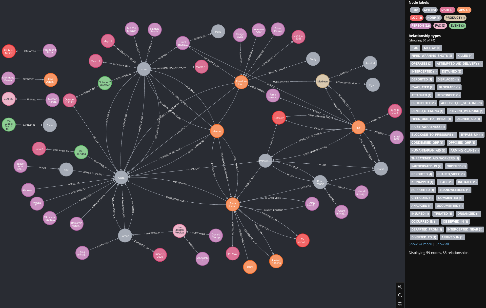
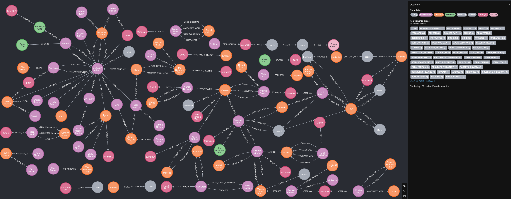
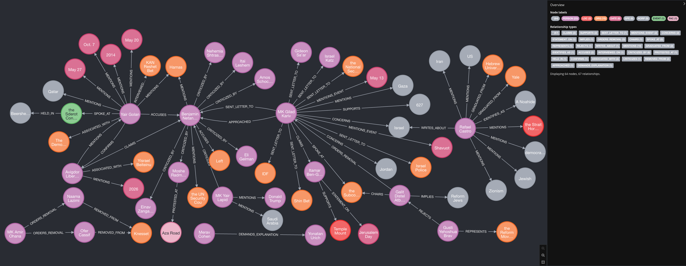

# Table of Cotents

---

# Conflict and Security
## Israel-Hamas Conflict
### Gaza Hostage Crisis
### Gaza Humanitarian Crisis
### Gaza Military Operations
### October 7 Anniversary and Impact
## Israel-Hezbollah Conflict
### Beirut and Southern Lebanon Strikes
## Israel-Houthi Conflict
### Houthi Attacks and Israeli Response
# Middle East Conflict Summary: Israel-Houthi Escalation
## Overview
## Key Events
## Military Dynamics
## Regional and Humanitarian Impact
## Outlook
## Israel-Syria Conflict
### Syrian Military Actions
### Syrian Media and Policy Shifts
## Israel-Iran Conflict
### Iranian Nuclear Program and Intelligence
### Iranian Regional Influence
### Iranian Terror Activities
## Regional and International Security
### Nuclear Proliferation
### ISIS and Other Terror Threats
## Israeli Domestic Security
### Crime and Internal Security
### Military and Defense Policy
# Politics and Diplomacy
## Israeli Politics
### Government and Coalition Dynamics
### Legal and Judicial Issues
### Political Discourse and Ideology
## International Diplomacy
### US-Israel Relations
### Argentina-Israel Relations
### Sanctions and International Criticism
### Palestinian Statehood and UN Resolutions
# Society and Culture
## Antisemitism and Hate Crimes

---

- (RAWdata)[./israel.jsonl]

# Conflict and Security
## Israel-Hamas Conflict

### Gaza Hostage Crisis
- **1630**: [Israel says Hamas Gaza chief Sinwar's body identified](https://www.bbc.com/news/articles/c62veqrq3yzo) *bbc-top*
- **1699**: [Israeli PM confirms enlisting Palestinian clans in Gaza to fight against Hamas](https://tass.com/world/1969487) *tass*
- **1733**: [Palestinian parliament speaker condemns US for vetoing resolution on Palestine](https://tass.com/world/1969379) *tass*
- **1907**: ['We still have hostages clinging to their lives': Noa Argamani recalls anniversary of release](https://www.jpost.com/israel-news/article-857019) *jpost-israel*
- **1917**: [One year on: A daring rescue in Gaza and the sacrifice of Arnon Zamora](https://www.jpost.com/israel-news/defense-news/article-857001) *jpost-israel*
- **1926**: [Israeli military kills Hamas terrorist who infiltrated Israel on Oct. 7 in Jabalya op.](https://www.jpost.com/israel-news/article-856974) *jpost-israel*
- **1952**: [Noa Argamani marks one year since rescue: A journey of strength amidst sorrow](https://www.israelnationalnews.com/news/409644) *arutz-sheva*
- **1954**: [One week after Boulder attack: Thousands gather in NYC to call for hostages' release](https://www.israelnationalnews.com/news/409642) *arutz-sheva*
- **2673**: [Trump: 'I think Greta Thunberg needs to go to an anger management course'](https://www.israelnationalnews.com/news/409704) *arutz-sheva*
- **2683**: [Unimaginable cruelty: Angrest family releases new footage of Matan’s abduction](https://www.israelnationalnews.com/news/409694) *arutz-sheva*
- **2904**: [Hamas's approach to Gaza hostage deal 'shifting,' Israeli officials tells 'Post'](https://www.jpost.com/israel-news/article-857181) *jpost-israel*
- **3177**: [Parents of Hersh Goldberg-Polin call for a ‘day of good deeds’ to mark 613th day of captivity](https://www.jpost.com/israel-news/article-857259) *jpost-israel*
- **3195**: [Netanyahu: Significant progress on Gaza hostage deal, too soon to give people hope](https://www.jpost.com/israel-news/article-857219) *jpost-israel*
- **3193**: [Family deeply concerned for hostage Bipin Joshi after recovery of slain Thai national](https://www.jpost.com/israel-news/article-857222) *jpost-israel*
- **4360**: [Uzi Dayan: Civilian control of Gaza, direct talks with Hamas could've gotten better, faster deal](https://www.jpost.com/arab-israeli-conflict/article-837730) *jpost-arabis*
- **4361**: [Qatar confirms Israel, Hamas agreement of Gaza hostage-ceasefire deal](https://www.jpost.com/arab-israeli-conflict/gaza-news/article-837325) *jpost-arabis*
- **4363**: [Trump: Election win brought hostage deal, Gaza will never become terror haven](https://www.jpost.com/breaking-news/article-837718) *jpost-arabis*
- **4364**: [Israel will not release Nukhba terrorists in possible Gaza hostage deal](https://www.jpost.com/arab-israeli-conflict/gaza-news/article-837355) *jpost-arabis*
- **4343**: [What's behind the Hamas offer to release US-Israeli hostage Edan Alexander?](https://www.jpost.com/arab-israeli-conflict/gaza-news/article-846184) *jpost-arabis*
- **4344**: [Netanyahu to hold consultations as Hamas officials say Gaza talks have 'failed'](https://www.jpost.com/breaking-news/article-846151) *jpost-arabis*
- **4348**: [Israel, Hamas fail in talks as Gaza hostage deal reaches dead end, source tells 'Post'](https://www.jpost.com/breaking-news/article-844241) *jpost-arabis*
- **4366**: [Biden: We are making some real progress on Gaza deal](https://www.jpost.com/breaking-news/article-836922) *jpost-arabis*
- **3186**: [Ex-IDF intel chief amends Egypt plan to end war, 'Day After' plan](https://www.jpost.com/israel-news/defense-news/article-857238) *jpost-israel*
- **3189**: [Qatar working to resolve wording of hostage deal, sources tell 'Post'](https://www.jpost.com/israel-news/article-857229) *jpost-israel*
- **4511**: [Hostage survivors to honor Trump envoy Steve Witkoff at United Hatzalah gala](https://www.jpost.com/israel-news/article-857285) *jpost-israel*
- **2824**: [Israeli military says it recovered body of Thai hostage from southern Gaza](https://www.egyptindependent.com/israeli-military-says-it-recovered-body-of-thai-hostage-from-southern-gaza/) *egyptian-independant*
- **3117**: [Bodies of two Israeli-American hostages recovered from Gaza in joint military operation](https://www.egyptindependent.com/bodies-of-two-israeli-american-hostages-recovered-from-gaza-in-joint-military-operation/) *egyptian-independant*
- **4712**: [Israeli forces recover bodies of two hostages in Gaza, PM says](https://www.bbc.com/news/articles/cm263j1g2rmo) *bbc-top*
- **4916**: [Israel recovers bodies of two hostages, says Netanyahu](https://www.dw.com/en/israel-recovers-bodies-of-two-hostages-says-netanyahu/a-72877405?maca=en-rss-en-all-1573-rdf) *dw*
- **4946**: [IDF recovers second body of slain Gaza hostage in Wednesday operation](https://www.jpost.com/israel-news/defense-news/article-857420) *jpost-israel*
- **4973**: [IDF recovers bodies of two hostages](https://www.israelnationalnews.com/news/409833) *arutz-sheva*
- **4468**: [Prayers for Thai hostage in Gaza echo from a rural church](https://www.jpost.com/israel-hamas-war/article-823520) *jpost-ishamas*
- **4951**: ['Bringing back hostages Argentina's top priority': Milei meets with former hostages, family members](https://www.jpost.com/israel-news/article-857387) *jpost-israel*
- **1687**: [Hamas did not reject Witkoff’s latest proposal on Gaza, leader says](https://tass.com/world/1969523) *tass*
- **2906**: [UN report claims Israel commits 'extermination' in Gaza by killing in schools](https://www.jpost.com/israel-news/article-857159) *jpost-israel*
- **4351**: [The new Nazis? Why most Israelis see Hamas terrorists as Hitler's heirs](https://www.jpost.com/arab-israeli-conflict/gaza-news/article-841717) *jpost-arabis*
- **4380**: ['A completely different movement': The revolution Sinwar created out of Hamas](https://www.jpost.com/arab-israeli-conflict/gaza-news/article-807036) *jpost-gaza*
- **4381**: [UN Rapporteur Albanese criticizes hostage rescue, shares conspiracy theories](https://www.jpost.com/arab-israeli-conflict/gaza-news/article-805564) *jpost-gaza*
- **2446**: [Mediators aim to reach Gaza truce before Eid al-Adha holiday](https://tass.com/world/1968069) *tass*
```
1630,1699,1733,1907,1917,1926,1952,1954,2673,2683,2904,3177,3195,3193,4360,4361,4363,4364,4343,4344,4348,4366,3186,3189,4511,2824,3117,4712,4916,4946,4973,4468,4951,1687,2906,4351,4380,4381,2446
```

- [mp3 of summary](01_gazahostage.mp3)

Good evening, and welcome to our in-depth report on the ongoing crisis in Gaza, where the conflict between Israel and Hamas continues to shape lives, policies, and international relations. I’m standing here with a comprehensive analysis of recent developments, drawn from a collection of news articles spanning late 2023 to mid-2025. Let’s break down the key points with precision and insight.

First, the human toll remains staggering. The Israeli military campaign in Gaza, launched in response to Hamas’s October 7, 2023, attack, has resulted in profound losses on both sides. That attack saw Hamas militants kill approximately 1,200 people in southern Israel and abduct 251 hostages. Since then, Gaza’s Hamas-run health ministry reports over 55,000 Palestinian deaths. As of June 2025, 53 hostages remain in Gaza, with at least 20 believed to be alive. The recovery of hostage bodies, like those of Yair Yaakov, a 59-year-old father from Kibbutz Nir Oz, and Thai worker Nattapong Pinta, underscores the grim reality for captives, many of whom, like Pinta, are thought to have been killed early in their captivity.

The Israeli Defense Forces (IDF) recently confirmed the death of Mohammed Sinwar, a key Hamas military leader, whose body was found in a tunnel beneath the European Hospital in Khan Younis. This discovery, alongside that of Rafah Brigade commander Mohammad Sabaneh, highlights Israel’s ongoing operations targeting Hamas’s leadership. The IDF’s footage of the tunnel, shown to foreign journalists, revealed a network used by Hamas, which Israel accuses of exploiting civilian infrastructure like hospitals as shields—a charge Hamas denies. These accusations have fueled international concern, especially as Gaza’s health system teeters on collapse due to Israeli sieges and strikes on medical facilities, condemned by UN Secretary-General Antonio Guterres for violating humanitarian law.

On the diplomatic front, ceasefire negotiations have been a rollercoaster. A three-stage hostage deal, announced by Qatar’s Prime Minister Mohammed bin Abdulrahman bin Jassim Al Thani, aims to release the remaining 98 hostages, starting with 33 in the first phase, with negotiations resuming on day 16 of a ceasefire set to begin this Sunday. This follows months of stalled talks, with Hamas showing flexibility but demanding guarantees against resumed fighting, while Israel insists on retaining territorial control, including the Philadelphi Corridor. US envoy Steve Witkoff has been pivotal, though Hamas’s recent offer to release American-Israeli hostage Edan Alexander and the remains of four others was dismissed by Israel as a deviation from the agreed framework. President-elect Donald Trump has hailed the deal as a triumph of his incoming administration’s “peace through strength” approach, crediting Witkoff’s efforts.

But the deal’s fragility is evident. Israeli Prime Minister Benjamin Netanyahu, while acknowledging progress, cautions against premature hope, facing domestic pressure from hostage families and protests demanding an end to the war. The Hostage Families Forum insists on a comprehensive agreement to bring all captives home, criticizing Netanyahu’s focus on eliminating Hamas over hostage release. Former IDF intelligence chief Tamir Hayman argues that ending the war soon, while continuing targeted raids, could secure hostages and weaken Hamas, but he warns that total destruction of the group is unrealistic. He advocates delaying Palestinian Authority governance in Gaza until Hamas’s military capabilities are further dismantled, a departure from earlier Egyptian-Arab proposals.

The emotional weight of this crisis is palpable. Noa Argamani, rescued in the daring Operation Arnon in June 2024, which cost the life of Yamam officer Arnon Zamora, shared a poignant reflection on the war’s toll. She mourns her mother’s death from cancer and her boyfriend Avinatan Or’s continued captivity, emphasizing the hostages’ dire conditions—starvation and lack of water. Families like that of Nepali hostage Bipin Joshi, last seen in a November 2023 video, and Thai worker Watchara Sriaoun, one of six Thais still held, live in agonizing uncertainty, their pleas for international action growing desperate.

Internationally, the conflict draws sharp criticism. A UN report accuses Israel of “extermination” for strikes on schools and religious sites, destroying over 90% of Gaza’s educational infrastructure. Meanwhile, a Jerusalem Post survey reveals 51% of Israelis equate Hamas’s actions to Nazi war crimes, citing its 1988 charter’s antisemitic rhetoric, rooted in Nazi propaganda. This perception frames Israel’s resolve to crush Hamas, likened by some to the Allies’ fight against Hitler in 1945, though others caution against such analogies to avoid diplomatic fallout.

Yet, alternative voices emerge. Former IDF deputy chief Uzi Dayan argues Israel could have secured more hostages alive by seizing full civilian control of Gaza early on, controlling essentials like food and water to pressure Hamas directly. He critiques reliance on mediators like Qatar and Egypt, suggesting direct talks could have clarified Hamas’s stance and saved lives. Meanwhile, Israel’s enlistment of anti-Hamas Palestinian clans, confirmed by Netanyahu, raises questions about long-term governance in Gaza, with critics like Avigdor Lieberman alleging ties to criminal groups.

As we look ahead, the ceasefire deal offers a glimmer of hope, but the path is fraught. Hamas’s ability to stall, as seen during a Ramadan ceasefire without hostage releases, suggests it believes time is on its side, assuming Israel lacks the will to fully dislodge it. For now, the world watches as mediators in Cairo and Doha navigate this delicate balance, with families, soldiers, and civilians on both sides bearing the cost of each passing day.

This is a story of resilience, tragedy, and the search for peace amid unrelenting conflict. We’ll continue to monitor developments closely. Back to you in the studio.


### Gaza Humanitarian Crisis
- **1643**: [Gaza health workers say four killed by Israeli gunfire near aid centre](https://www.bbc.com/news/articles/c5y5wpz49xlo) *bbc-world*
- **1690**: [Almost one in three Gaza residents displaced since end of ceasefire — UN](https://tass.com/world/1969515) *tass*
- **1755**: [Israel vows to prevent an aid boat carrying Greta Thunberg and other activists from reaching Gaza](https://mainichi.jp/english/articles/20250609/p2g/00m/0in/004000c) *mainichi*
- **1818**: [A Gaza-bound aid boat carrying Greta Thunberg and other activists has been diverted to Israel](https://www.lemonde.fr/en/international/article/2025/06/09/a-gaza-bound-aid-boat-carrying-greta-thunberg-and-other-activists-has-been-diverted-to-israel_6742140_4.html) *lemonde*
- **1829**: [Freedom Flotilla Ship Nears Gaza, Sailing Through Egyptian Waters With Aid and Activists](https://egyptianstreets.com/2025/06/08/freedom-flotilla-ship-nears-gaza-sailing-through-egyptian-waters-with-aid-and-activists/) *egyptian-streets*
- **1835**: [Israeli troops reportedly board Madeleine flotilla](https://en.mehrnews.com/news/232844/Israeli-troops-reportedly-board-Madeleine-flotilla) *mehr-news*
- **1869**: [Israeli forces seize Gaza aid boat carrying Greta Thunberg, ministry says](https://www.cbc.ca/news/world/israeli-military-freedom-flotilla-coalition-madleen-gaza-1.7555863?cmp=rss) *cbc-top*
- **1880**: [Palestinians say 2414* Israeli strike on school in Gaza Strip kills 18 people — TV](https://www.cbc.ca/news/world/five-killed-gaza-aid-sites-1.7555619?cmp=rss) *cbc-world*
- **1882**: [Israel stops aid ship attempting to reach Gaza](https://www.dw.com/en/israel-stops-aid-ship-attempting-to-reach-gaza/live-72838899?maca=en-rss-en-all-1573-rdf) *dw*
- **1885**: [Israel plans to stop Gaza-bound ship with Thunberg on board](https://www.dw.com/en/israel-plans-to-stop-gaza-bound-ship-with-thunberg-on-board/live-72829571?maca=en-rss-en-all-1573-rdf) *dw*
- **1909**: [Freedom Flotilla Coalition says it was attacked by drones, communications jammed](https://www.jpost.com/israel-news/article-857016) *jpost-israel*
- **1910**: [IDF takes Greta Thunberg’s 'Madleen,' to Ashdod port, flotilla passengers to watch Oct. 7 footage](https://www.jpost.com/israel-news/article-857015) *jpost-israel*
- **1916**: [New text reveals Hamas threats to aid workers, warning of 'severe consequences'](https://www.jpost.com/israel-news/article-857005) *jpost-israel*
- **1922**: [GHF pilots Gaza aid distributed by merchants, but factions warn of 'agents and thieves'](https://www.jpost.com/israel-news/article-856989) *jpost-israel*
- **2347**: [Palestinians say local gunmen and Israeli forces opened fire near Gaza aid site](https://www.bbc.com/news/articles/c79e0zxy2lro) *bbc-top*
- **2375**: [Watch: Moment Israeli forces board Gaza aid boat](https://www.bbc.com/news/videos/c629elwn1dgo) *bbc-world*
- **2583**: [Macron calls Gaza humanitarian blockade a 'scandal'](https://www.lemonde.fr/en/international/article/2025/06/09/macron-calls-gaza-humanitarian-blockade-a-shameful-scandal_6742176_4.html) *lemonde*
- **2606**: [Global condemnations pour in after Israeli attack on aid ship](https://en.mehrnews.com/news/232874/Global-condemnations-pour-in-after-Israeli-attack-on-aid-ship) *mehr-news*
- **2641**: [If Greta really wanted to help, she’d launch a flotilla sailing away from Gaza](https://www.jpost.com/israel-news/article-857114) *jpost*
- **2649**: [Greta Thunberg, Gaza flotilla activists refuse to watch Oct. 7 footage after ship siezed](https://www.jpost.com/israel-news/article-857132) *jpost-israel*
- **2666**: [Gaza flotilla passengers arrive at Ben Gurion Airport ahead of deportation](https://www.israelnationalnews.com/news/409708) *arutz-sheva*
- **2715**: [Foreign Office staff told to consider resigning if they disagree over Gaza](https://www.bbc.com/news/articles/cy8nzx1475ro) *bbc-top*
- **2814**: [Israel deports Greta Thunberg after detaining Gaza-bound aid crew](https://www.lemonde.fr/en/international/article/2025/06/10/israel-says-gaza-bound-aid-boat-activists-awaiting-deportation_6742187_4.html) *lemonde*
- **2823**: [Greta Thunberg departs Israel on flight to Paris after detention aboard aid ship](https://www.egyptindependent.com/greta-thunberg-departs-israel-on-flight-to-paris-after-detention-aboard-aid-ship/) *egyptian-independant*
- **2835**: [Israel transfers Madeliene crew to Ben Gurion Airport](https://en.mehrnews.com/news/232901/Israel-transfers-Madeliene-crew-to-Ben-Gurion-Airport) *mehr-news*
- **2882**: [Greta Thunberg deported from Israel after Gaza boat seized](https://www.cbc.ca/news/world/israel-freedom-flotilla-coalition-1.7556838?cmp=rss) *cbc-top*
- **2887**: [Israeli forces halt Gaza-bound aid boat, detain Greta Thunberg and other activists](https://www.cbc.ca/news/world/israel-freedom-flotilla-coalition-madleen-gaza-1.7555863?cmp=rss) *cbc-world*
- **2890**: [Middle East updates: Greta Thunberg deported from Israel](https://www.dw.com/en/middle-east-updates-greta-thunberg-deported-from-israel/live-72851310?maca=en-rss-en-all-1573-rdf) *dw*
- **2934**: [Greta Thunberg deported from Israel](https://www.israelnationalnews.com/news/409731) *arutz-sheva*
- **3114**: [Starving Palestinians in Gaza spend Eid al-Adha under bombardment](https://www.lemonde.fr/en/international/article/2025/06/10/starving-palestinians-in-gaza-spend-eid-al-adha-under-bombardment_6742213_4.html) *lemonde*
- **3464**: [Greta Thunberg arrives in Paris after Israel deportation: End the occupation](https://www.israelnationalnews.com/news/409786) *arutz-sheva*
- **3451**: [London-based Hamas operative linked with org. behind Greta Thunberg's Madleen vessel](https://www.jpost.com/international/article-857267) *jpost-world*
- **3467**: [Abu Shabab: Hamas steals the humanitarian aid](https://www.israelnationalnews.com/news/409783) *arutz-sheva*
- **4247**: [Gaza militia leader Abu Shabab: Haven't ruled out coordination with IDF on aid](https://www.jpost.com/israel-news/article-856904) *jpost*
- **4387**: [Israeli left-wing orgs. urge Biden to stop 'humanitarian catastrophe' in Gaza](https://www.jpost.com/arab-israeli-conflict/gaza-news/article-777814) *jpost-gaza*
- **4389**: [UN envoys say 'enough' on trip to Gaza border](https://www.jpost.com/arab-israeli-conflict/gaza-news/article-777554) *jpost-gaza*
- **3011**: [Act now to save lives in Gaza, ICRC head urges world leaders](https://www.bbc.com/news/videos/c62v52z73vdo) *bbc-me*
- **2873**: [This Palestinian boy lost his eye to an unexploded bomb. Thousands of tonnes of explosives may remain in Gaza](https://www.cbc.ca/news/world/unexploded-ordnance-gaza-1.7556731?cmp=rss) *cbc-top*
- **4385**: [Unseen Enemies: How Deteriorating Conditions in Gaza Endanger Israeli Soldiers and Captives' Lives](https://www.jpost.com/arab-israeli-conflict/gaza-news/article-780565) *jpost-gaza*
- **4727**: [Gaza doctor whose nine children were killed in Israeli strike evacuated with son](https://www.bbc.com/news/articles/cgmj09ggdnro) *bbc-top*
- **4822**: [Jordan evacuates sick and injured Palestinian children from Gaza](https://www.foxnews.com/world/jordan-evacuates-sick-injured-palestinian-children-from-gaza) *fox-world*
- **4713**: [Video shows crowds in Gaza scale fence to rush for aid](https://www.bbc.com/news/videos/c14k60lzv00o) *bbc-top*
- **4742**: [Dozens of Palestinians killed while seeking aid in Gaza, hospitals say](https://www.bbc.com/news/articles/c1mg4ld5951o) *bbc-me*
- **4388**: [UN expects wave of Palestinian refugees due to Israel-Hamas war](https://www.jpost.com/breaking-news/article-777802) *jpost-gaza*
- **4379**: [Israel’s use of aid as pressure tactic raises criticism in Gaza conflict](https://www.jpost.com/arab-israeli-conflict/gaza-news/article-824928) *jpost-gaza*
- **4375**: [War knocked human development in Gaza back to 1955, UNDP says](https://www.jpost.com/breaking-news/article-825654) *jpost-gaza*
- **4260**: [Hamas’s talk of leaving Gaza: Real change or just buying time?](https://www.jpost.com/opinion/article-856868) *jpost*
- **3015**: [Palestinian Authority President Says Hamas Must Exit Gaza](https://www.nytimes.com/2025/06/10/world/middleeast/palestinian-authority-abbas-hamas-gaza.html) *nyt-world*
```
1643,1690,1755,1818,1829,1835,1869,1880,1882,1885,1909,1910,1916,1922,2347,2375,2583,2606,2641,2649,2666,2715,2814,2823,2835,2882,2887,2890,2934,3114,3464,3451,3467,4247,4387,4389,3011,2873,4385,4727,4822,4713,4742,4388,4379,4375,4260,3015
```

- [mp3 of summary](02_gazahuman.mp3)

Good evening, and welcome to our in-depth report on the escalating humanitarian crisis in Gaza, where a complex web of violence, blockades, and aid controversies has pushed millions to the brink. I'm standing here with the latest insights drawn from a series of detailed news reports, and the situation is nothing short of dire.

Let’s start with the grim reality on the ground. Since the Hamas-led attack on southern Israel on October 7, 2023, which killed around 1,200 people and saw 251 taken hostage, Israel’s military response has been relentless. According to Gaza’s Health Ministry, over 55,000 Palestinians have been killed, with women and children making up a significant portion of the casualties. The war has displaced nearly 90% of Gaza’s 2.3 million residents, leaving them almost entirely dependent on international aid. The United Nations has warned that the entire population faces famine, with malnutrition rates among children tripling since a brief ceasefire earlier this year.

A new and controversial player in this crisis is the Gaza Humanitarian Foundation, or GHF, a US- and Israel-backed group tasked with distributing aid, bypassing the United Nations. The GHF’s system, which began operating on May 26, 2025, has been marred by chaos and violence. Reports indicate that over 223 Palestinians have been killed in the past two weeks alone while trying to access GHF aid sites, particularly in Rafah and the Netzarim Corridor. Witnesses describe apocalyptic scenes—hundreds of desperate people climbing fences and rushing for food, only to face gunfire. Disturbingly, on June 9, 2025, Palestinian gunmen, possibly linked to anti-Hamas militias or criminal gangs, were reported firing on crowds alongside Israeli forces. The Israeli military insists it only fires warning shots at “suspects” approaching troops, but the death toll tells a different story.

The GHF’s operations have drawn sharp criticism. The UN and other aid groups refuse to cooperate, arguing that the system violates humanitarian principles of neutrality and impartiality. They claim Israel is using aid as a weapon, forcing civilians into military zones to access food. A video shared by Israeli activist Alon Lee-Green, geolocated to a GHF site in Rafah, shows the desperation—people scaling barriers under the shouts of an American-accented voice, with no apparent control. The UN’s Farhan Haq put it bluntly: “No one should be forced to risk their lives to receive aid.”

Adding to the tension, Israel’s naval blockade of Gaza remains ironclad. On June 9, 2025, Israeli forces intercepted the Madleen, a British-flagged yacht operated by the Freedom Flotilla Coalition, carrying a symbolic load of aid and activists, including Swedish climate campaigner Greta Thunberg. The vessel, sailing under the UK flag, was boarded in international waters, with activists reporting drone surveillance and a “white irritant substance” sprayed on the boat. Israel’s Foreign Ministry mocked the effort as a “selfie yacht” stunt, claiming the aid—less than a truckload—would be redirected through “real humanitarian channels.” Thunberg, deported to Paris, called for an end to Israel’s blockade and occupation, undeterred by the ordeal.

The blockade, in place since Hamas seized control of Gaza in 2007, has been a flashpoint. Critics, including the UN, call it collective punishment, while Israel insists it’s necessary to prevent weapons reaching Hamas. A previous flotilla attempt last month was thwarted when drones attacked another coalition vessel off Malta, an incident the group blamed on Israel. Meanwhile, the Global March to Gaza plans to rally 2,700 people from 50 countries at the Rafah crossing on June 12, 2025, demanding unimpeded aid access.

Hamas itself faces internal and external pressures. Recent statements suggest they might consider ceding control of Gaza, but analysts see this as a stalling tactic to buy time and improve their image. The group’s leadership is weakened, with key figures like Mohammed Sinwar killed, and their military capabilities severely degraded. Yet, they retain significant civilian control, using hostages—55 remain, many believed dead—as leverage. Israel, stretched thin by conflicts with Hezbollah in Lebanon and potential threats from Iran, is unlikely to ease its campaign until Hamas is dismantled.

On the humanitarian front, efforts like Jordan’s Medical Corridor, announced by King Abdullah II in February 2025, offer a glimmer of hope. On June 11, 2025, 16 Palestinian children, including cancer patients and a malnourished 5-month-old, were evacuated to Amman for treatment. But these efforts are dwarfed by the scale of need. The UN reports that Gaza’s economy has shrunk by 35%, with poverty nearing 100%. Schools and hospitals lie in ruins, and 625,000 students have no access to education. A UNDP study estimates it will take a decade to recover, even with optimal aid flow.

The international community is divided. The US, while pressuring Israel to allow more aid, vetoed a UN Security Council ceasefire resolution last week. Vice President Kamala Harris has called for Israel to do more, but hardliners in Israel’s government advocate using aid as leverage against Hamas. Some propose empowering local clans to govern, but experts like Mkhaimar Abusada argue Gazans would still choose Hamas over these groups, seen as Israeli proxies.

As Eid al-Adha unfolds, Gaza’s plight is stark. Families, unable to share traditional meals, face bombardment and starvation. The UN’s Filippo Grandi warned of a “major human catastrophe,” urging focus on Gaza without forgetting other global crises. Yet, with no ceasefire in sight and aid distribution in disarray, civilians bear the brunt.

This is a story of survival against overwhelming odds, where every box of food comes at a deadly cost. We’ll continue to follow developments closely. For now, back to the studio.


### Gaza Military Operations
- **1841**: [Resistance enters war of attrition with Israel: Hamas](https://en.mehrnews.com/news/232840/Resistance-enters-war-of-attrition-with-Israel-Hamas) *mehr-news*
- **1846**: [Battles escalate in Khan Younis as Qassam confronts occupiers](https://en.mehrnews.com/news/232836/Battles-escalate-in-Khan-Younis-as-Qassam-confronts-occupiers) *mehr-news*
- **1850**: [Israeli army kills 108 Palestinians in Gaza in past 24 hours](https://en.mehrnews.com/news/232829/Israeli-army-kills-108-Palestinians-in-Gaza-in-past-24-hours) *mehr-news*
- **1920**: [IDF progressing on overthrowing Hamas, spokesman says in Gaza's Khan Yunis](https://www.jpost.com/israel-news/article-856993) *jpost-israel*
- **2605**: [Israeli army kills 47 Palestinians in Gaza in past 24 hours](https://en.mehrnews.com/news/232873/Israeli-army-kills-47-Palestinians-in-Gaza-in-past-24-hours) *mehr-news*
- **2886**: [Israeli gunfire kills over a dozen Palestinians near Gaza aid site, health officials say](https://www.cbc.ca/news/world/israel-gaza-aid-distribution-site-1.7556840?cmp=rss) *cbc-world*
- **3132**: [Israeli army kills 54 Palestinians in Gaza in past 24 hours](https://en.mehrnews.com/news/232911/Israeli-army-kills-54-Palestinians-in-Gaza-in-past-24-hours) *mehr-news*
- **3194**: [IDF kills two Hamas terrorists disguised as women](https://www.jpost.com/israel-news/article-857221) *jpost-israel*
- **4386**: [Al Jazeera says cameraman killed in Gaza by drone strike on school building](https://www.jpost.com/breaking-news/article-778186) *jpost-gaza*
- **4483**: [IDF evacuates tens of thousands from northern Gaza as it attacks Hamas in Jabalya](https://www.jpost.com/israel-hamas-war/article-823471) *jpost-ishamas*
- **4378**: [As few Hamas and PIJ terrorists remain in Jabalya, IDF nears full control of northern Gaza](https://www.jpost.com/arab-israeli-conflict/gaza-news/article-825528) *jpost-gaza*
- **2918**: [Israel-armed Gazan militia claims it ambushed, killed 5 Hamas terrorists](https://www.jpost.com/middle-east/article-857147) *jpost-me*
- **4891**: [Hasan raps West for silence vs Israeli seizure of aid ship](https://en.mehrnews.com/news/232961/Hasan-raps-West-for-silence-vs-Israeli-seizure-of-aid-ship) *mehr-news*
- **4384**: [With police absent in Gaza, vigilante groups arrive on the streets](https://www.jpost.com/arab-israeli-conflict/gaza-news/article-790606) *jpost-gaza*
- **4346**: [IDF told to prepare for 'immediate' return to Gaza fighting](https://www.jpost.com/breaking-news/article-845162) *jpost-arabis*
- **4347**: [Israel might return to war in 10 days if no agreement reached](https://www.jpost.com/arab-israeli-conflict/gaza-news/article-844530) *jpost-arabis*
- **4889**: [Israeli army kills 123 Palestinians in Gaza in past 24 hours](https://en.mehrnews.com/news/232959/Israeli-army-kills-123-Palestinians-in-Gaza-in-past-24-hours) *mehr-news*
```
1841,1846,1850,1920,2605,2886,3132,3194,4386,4483,4378,2918,4891,4384,4346,4347,4889
```

- (mp3 of summary)[03_gazamil.mp3]

Good evening, viewers. This is your nightly update on the escalating conflict in the Gaza Strip, based on a detailed analysis of recent reports from multiple sources. I'm here to break down the critical developments, the human toll, and the political dynamics driving this crisis.

We begin with the dire situation on the ground. According to the Palestinian Ministry of Health, over 55,000 Palestinians have been killed since October 2023, with 123 deaths reported in just the last 24 hours as of June 11, 2025. Injuries have surpassed 127,000, and many victims remain trapped under rubble, unreachable by rescuers. The Israeli military resumed its offensive on March 18, shattering a January ceasefire, and has since killed nearly 5,000 people. These figures paint a grim picture of a conflict that shows no signs of abating.

Hamas, through its military wing, the al-Qassam Brigades, has declared a war of attrition against Israeli forces. From Khan Younis to Jabalya, Palestinian Resistance fighters are employing innovative tactics, targeting Israeli troops and equipment, such as a bulldozer near the Yarmouk site. Hamas claims these operations are a response to what they call a "genocide" against civilians, asserting that Israel's escalation only deepens its losses and jeopardizes the fate of Israeli captives. They insist no resolution is possible without a comprehensive prisoner exchange agreement, a proposal Israeli Prime Minister Benjamin Netanyahu continues to reject.

On the Israeli side, the IDF is intensifying its operations. In Jabalya, the 162nd Division has evacuated tens of thousands of Palestinian civilians, aiming to pressure Hamas leader Yahya Sinwar into a hostage deal. The IDF has also confirmed the killing of Mohammed Sinwar, a senior Hamas figure, in a May 13 airstrike beneath the European Hospital in Khan Younis. The military touts these actions as progress toward dismantling Hamas, but incidents like the collapse of booby-trapped buildings, killing IDF soldiers, highlight the risks of urban combat. The IDF's evacuation of northern Gaza, including expanding humanitarian zones in Al-Mawasi, suggests a strategic shift, possibly to reduce civilian casualties amid global scrutiny or to set the stage for a broader offensive.

The humanitarian crisis is worsening. An incident on June 10 saw 17 Palestinians killed by Israeli gunfire near a Gaza Humanitarian Foundation aid distribution site, with dozens wounded. Gazans describe chaotic scenes, walking hours to reach aid points only to find supplies depleted. The UN has called the aid flow a "drop in the ocean," with looting of flour trucks underscoring the desperation. Meanwhile, vigilante groups like the People's Protection Committees, formed by Hamas and other factions, are policing Rafah markets to curb profiteering, but their masked presence has sparked unease among residents.

Politically, the conflict is at a stalemate. Negotiations for a hostage release, mediated by U.S. envoy Steve Witkoff, have stalled. Witkoff's plan proposed freeing half the hostages on day one, with the rest by day 42, but Hamas has neither accepted nor rejected it. Israeli officials warn that without progress, fighting will resume within days, potentially cutting off Gaza's water and electricity. Defense Minister Israel Katz has threatened to "open the gates of hell" if Hamas doesn't comply, while Hamas accuses Israel of undermining the ceasefire. The International Criminal Court’s arrest warrants for Netanyahu and former minister Yoav Gallant, alongside a genocide case at the International Court of Justice, loom over these tensions.

The war's ripple effects are felt beyond Gaza. In Rafah, British journalist Mehdi Hasan condemned Western silence over Israel’s seizure of the Madeleine aid ship, contrasting it with the outcry if Iran had done the same. In Lebanon, the IDF's operations against Hezbollah, including 150 airstrikes, signal a broader regional escalation. Iran’s grounding of flights after an October 1 attack reflects fears of Israeli retaliation.

Tragically, the conflict is also claiming journalists. Al Jazeera cameraman Samer Abu Daqqa was killed in a drone strike on June 6 while reporting on a school bombing in Khan Younis, with the Committee to Protect Journalists noting 64 media workers killed in the war.

As we wrap up, the Gaza conflict remains a devastating cycle of violence, with no clear path to peace. The human cost is staggering, and the political will for a resolution appears elusive. Stay with us for continued coverage as this story unfolds. Back to you in the studio.


### October 7 Anniversary and Impact
- **1934**: [Abbas praises October 7 massacre ahead of pro-Palestinian summit](https://www.jpost.com/middle-east/article-856960) *jpost-me*
- **2672**: [Jewish identity strengthened since October 7th](https://www.israelnationalnews.com/news/409701) *arutz-sheva*
- **4297**: ['The war in Gaza, will come to us:' Palestinians, Israeli Arabs share how war has impacted them](https://www.jpost.com/podcast/article-855361) *jpost*
- **4465**: [Remembering the dead, fighting for the living: Israelis mark October 7](https://www.jpost.com/israel-hamas-war/article-823538) *jpost-ishamas*
- **4472**: ['A year of hard and continuous war': Israeli leaders commemorate Oct. 7 anniversary](https://www.jpost.com/breaking-news/article-823498) *jpost-ishamas*
- **4477**: [Israel marks Oct. 7 anniversary under shadow of escalating war](https://www.jpost.com/israel-hamas-war/article-823488) *jpost-ishamas*
- **4480**: [Hamas's October 7 massacre: Reliving the day, hour by hour](https://www.jpost.com/israel-hamas-war/article-823396) *jpost-ishamas*
- **4484**: [October 7, one year on: A look at a year ravaged by the Israel-Hamas War](https://www.jpost.com/israel-hamas-war/article-822793) *jpost-ishamas*
- **4473**: [How 1,700 United Hatzalah volunteers helped save lives on Oct. 7](https://www.jpost.com/israel-hamas-war/article-822896) *jpost-ishamas*
- **4474**: [Emily Hand: A child's journey to freedom from Hamas captivity](https://www.jpost.com/israel-hamas-war/article-822797) *jpost-ishamas*
- **4476**: [Khamenei says Oct. 7 massacre brought 'Zionist regime' 70 years back](https://www.jpost.com/israel-hamas-war/article-823489) *jpost-ishamas*
- **4666**: [Can Western civilization survive? Douglas Murray speaks with Rabbi Daniel Schonbuch LMFT](https://www.israelnationalnews.com/news/409746) *arutz-sheva*
- **4382**: [Father of fallen soldier urges world: Acknowledge Gazan civilians' role in Oct. 7](https://www.jpost.com/arab-israeli-conflict/gaza-news/father-of-fallen-soldier-urges-world-acknowledge-gazan-civilians-role-in-oct-7-794098) *jpost-gaza*
- **4955**: [FBI delegation in Israel to investigate October 7 crimes on US citizens](https://www.jpost.com/israel-news/article-857373) *jpost-israel*
- **4352**: [The Jerusalem Post and KKL-JNF invite readers to plant a tree in memory of the October 7 victims](https://www.jpost.com/arab-israeli-conflict/article-840537) *jpost-arabis*
- **4471**: [IDF Capt. Roi Nahary, 23: Saving lives – in life and in death](https://www.jpost.com/israel-hamas-war/article-822729) *jpost-ishamas*
- **4520**: [Is there still a Left in Israel? How October 7 shaped Israel's political landscape](https://www.jpost.com/israel-news/politics-and-diplomacy/article-856035) *jpost-ispol*
- **4482**: [Majority of Israelis want war to end, 77% think bringing hostages home trumps toppling Hamas](https://www.jpost.com/israel-hamas-war/article-823474) *jpost-ishamas*
- **4312**: [Brains, heart, and soul: BGU’s transformative role in a Post-October 7th Israel](https://www.jpost.com/special-content/brains-heart-and-soul-bgus-transformative-role-in-a-post-october-7th-israel-851647) *jpost*
- **4289**: [Israel’s mental health crisis: The war’s hidden toll on mothers and soldiers](https://www.jpost.com/health-and-wellness/article-856873) *jpost*
- **4291**: [After October 7, 2023: Israel’s smoking rates rise, worsening COPD risks](https://www.jpost.com/health-and-wellness/article-856866) *jpost*
- **3452**: [IDF probe: IDF failed to defend Yechini area, Israel Police, civilians left to protect themselves](https://www.jpost.com/israel-news/defense-news/article-857253) *jpost-israel*
```
1934,2672,4297,4465,4472,4477,4480,4484,4473,4474,4476,4666,4382,4955,4352,4471,4520,4482,4312,4289,4291,3452
```
- (mp3 of summary)[04_oct7.mp3]

Good evening, and welcome to our special report on the ongoing impact of the October 7, 2023, Hamas attack on Israel, a day that has left an indelible mark on the nation and the region. Drawing from a collection of recent articles published by The Jerusalem Post, we’ll unpack the profound political, social, and psychological ramifications of this tragedy, which claimed 1,200 lives, saw 250 people taken hostage, and sparked a war that continues to reshape Israel and its neighbors. Let’s dive into the key insights with a focus on the human stories, strategic shifts, and the broader implications.

We begin with the controversial remarks of Palestinian Authority Chairman Mahmoud Abbas, who, in an interview published in Al-Hayat Al-Jadida, praised the October 7 attack as achieving “important goals” for the Palestinian cause. Abbas framed the assault, which killed 1,200 Israelis and abducted 250, as a strategic blow to Israel’s perceived invincibility, exposing failures in its military and intelligence systems. He acknowledged the heavy toll on Gaza’s residents but emphasized the operation’s “strategic impact.” These comments, echoed by his senior adviser Mahmoud Al-Habbash’s defense of the attack as “legitimate resistance,” have drawn sharp criticism. Itamar Marcus of Palestinian Media Watch argues that Abbas’s statements reveal the PA’s ongoing support for terrorism, raising questions about its suitability for statehood. Marcus has called on Israel and the U.S. to block PA leaders from attending UN events until these remarks are retracted, warning that a Palestinian state under such leadership risks becoming a “terror state.” This rhetoric underscores a deep divide in how the conflict is framed, with Abbas’s words to Palestinian audiences starkly contrasting his international messaging.

The attack’s anniversary has also prompted reflection within Israel. A survey by the National Jewish Identity Authority reveals that 71% of Israelis report a strengthened Jewish identity since October 7, often expressed through actions like displaying Israeli flags or Jewish symbols. Yet, 65% believe Israeli youth lack sufficient knowledge about their Jewish heritage, a concern particularly acute among religious (77%) and haredi (82%) respondents. This surge in national identity is tied to the war’s unifying effect, with 74% linking love for the land to the fighting spirit shown in the Swords of Iron Operation. However, the survey also highlights a demand for expanded education on Jewish identity, with 69% supporting efforts for youth and 65% for adults, signaling a societal push to reinforce cultural roots amid crisis.

The human cost of October 7 is vividly captured in stories of loss and resilience. At Kibbutz Be’eri, where 102 members were killed and 30 taken hostage, memorial ceremonies underscored the community’s devastation. Thomas Hand, whose eight-year-old daughter Emily was among those kidnapped but later released, shared his relief at their new temporary home in Kibbutz Hatzerim, though the trauma lingers. “Every time I talk to my neighbors, I’m counting who they’ve lost,” he said, a poignant reminder of the communal grief. Similarly, the family of Sgt. Roni Eshel, murdered at Nahal Oz, spoke of her prescient warnings about Hamas’s preparations, ignored by commanders. Her father, Eyal Eshel, emphasized that Gazan civilians, not just terrorists, participated in the massacre, complicating narratives around humanitarian aid. At Mount Herzl, the Nahary family mourned Lt. Roi Nahary, killed in Kfar Aza after saving 40 families. His twin brother, Bar, called Roi “the other half of my soul,” reflecting the personal toll on those left behind.

The IDF’s internal probe into the Yechini area attack revealed systemic failures in preparedness and communication, allowing eight Hamas terrorists to infiltrate and kill 17 people, including six civilians, two soldiers, and nine others on Highway 34. The report detailed heroic civilian and security force responses, like a Givati Brigade officer warning synagogue-goers and Border Police engaging terrorists, but underscored the lack of training and equipment for local forces. Recommendations include tailored security for strategic areas like Yechini, near major highways, to prevent future vulnerabilities.

The war’s psychological toll is equally staggering. A study from Tel Aviv University reports a sharp rise in PTSD among reserve soldiers, with 12% showing symptoms compared to 4-6% in regular service. Among women, 34% reported PTSD symptoms, with 62% experiencing war-related nightmares and 73% feeling constantly on edge. The absence of adequate mental health services has prompted calls for a national emergency response, including more trauma care professionals and community support systems. As one expert noted, “Investing in mental health is a strategic necessity for Israel’s resilience.”

On the ground, organizations like United Hatzalah have been pivotal. On October 7, 1,700 volunteers treated 12,000 people, from soldiers to civilians in distress. Eli Beer, the group’s president, recounted volunteers running from synagogues, still in prayer shawls, to respond to 556 simultaneous emergency calls—an unprecedented volume. Their helicopter unit defied government orders to airlift 50 seriously wounded from Heletz Junction, saving lives through sheer determination. Beer’s story of a 12-hour call with a boy named Michael, hiding from terrorists, highlights the organization’s life-saving ingenuity.

The war has also shifted Israel’s political landscape. A poll by the Israel Democracy Institute shows 53% of Israelis, including 93% of Arabs, want the war to end, primarily to save the 101 remaining hostages. However, only 28% of Jews support a Palestinian state, down from higher pre-war support, reflecting disillusionment with peace prospects post-October 7. Political divisions persist, with 47% favoring elections in 2024, while Netanyahu’s coalition holds steady despite declining public support. At the People’s Peace Summit, 5,000 attendees called for an end to the war and a long-term solution, though skepticism about military success in Gaza grows.

Internationally, the attack has fueled tensions. Iran’s Ayatollah Khamenei claimed the assault set Israel back 70 years, while Israel’s operations against Hezbollah in Lebanon, including the killing of Hassan Nasrallah, have escalated regional conflict. The U.S. FBI is investigating crimes against American citizens, signaling global stakes. Meanwhile, Ben-Gurion University is leading recovery efforts through education, research, and community service, embodying resilience in the Negev.

Finally, the war’s health impacts extend beyond mental trauma. Smoking rates have risen since October 7, with Prof. Zvi Fridlender noting a surge in COPD cases, linked to 70% of cases in high-income countries. Anti-smoking measures, like graphic warnings, face delays, exacerbating public health challenges.

As Israel marks this somber anniversary, the stories of heroism, loss, and resilience paint a complex picture. From the bravery of soldiers like Roi Nahary to the enduring hope of Emily Hand’s dance in the sand, Israel grapples with its scars while seeking a path forward. The question remains: can these lessons of unity and sacrifice lead to a lasting resolution? Stay tuned as we continue to follow this unfolding story. This is [Your Name], reporting for [Network Name].


## Israel-Hezbollah Conflict
### Beirut and Southern Lebanon Strikes
- **1650**: [Israel to continue striking Beirut until Lebanon disarms Hezbollah — defense minister](https://tass.com/world/1969663) *tass*
- **1681**: [Israel delivers 17 strikes on Beirut’s southern suburbs — TV](https://tass.com/world/1969541) *tass*
- **1685**: [Israel strikes Hezbollah targets in Beirut suburbs — IDF](https://tass.com/world/1969533) *tass*
- **3118**: [Israel attacks suburbs of Beirut, targeting alleged Hezbollah ‘drone factories’](https://www.egyptindependent.com/israel-attacks-suburbs-of-beirut-targeting-alleged-hezbollah-drone-factories/) *egyptian-independant*
- **4377**: [Hezbollah's gold mine catches fire: Nasrallah's bunker under hospital held half billion dollars](https://www.jpost.com/breaking-news/article-825545) *jpost-gaza*
- **4485**: [Israel obstructing search for Hezbollah's Safieddine, terror group official says](https://www.jpost.com/israel-hamas-war/article-823449) *jpost-ishamas*
- **3205**: [UNIFIL faces harassment in Lebanon as gov’t promises ‘security’](https://www.jpost.com/middle-east/article-857217) *jpost-me*
- **3465**: [UN peacekeepers targeted in south Lebanon, Lebanese PM condemns](https://www.israelnationalnews.com/news/409785) *arutz-sheva*
- **1694**: [Lebanese forces dismantle more than 500 military installations in country’s south — PM](https://tass.com/world/1969499) *tass*
- **4368**: [Blinken: Ceasefire agreement will be handed over to Trump if not completed before inauguration](https://www.jpost.com/arab-israeli-conflict/article-836722) *jpost-arabis*
- **4370**: [Lebanon’s presidential election: Testing Hezbollah’s influence after losing to Israel](https://www.jpost.com/arab-israeli-conflict/article-836712) *jpost-arabis*
```
1650,1681,1685,3118,4377,4485,3205,3465,1694,4368,4370
```

- (mp3 of summary)[05_ishez.mp3]

Good evening, and welcome to our international news segment. I'm reporting on a series of critical developments in the escalating tensions between Israel and Lebanon, centered around the activities of Hezbollah and the fragile ceasefire in the region. Drawing from a collection of recent news reports, I'll break down the key events and their implications for stability in the Middle East.

Since late April 2025, Israel has intensified its military operations against Hezbollah, a powerful Shiite militant group based in Lebanon. On June 5, the Israel Defense Forces (IDF) launched airstrikes on Dahieh, a southern suburb of Beirut and a Hezbollah stronghold, targeting what they claim were drone assembly workshops and facilities of Hezbollah’s Aerial Unit 127. These strikes marked a significant escalation, as Israel had not targeted Beirut since late April, focusing instead on southern Lebanon. The following day, June 6, reports from Al Jazeera indicated at least 17 strikes hit Beirut’s southern suburbs, with a mix of direct and warning strikes, causing widespread panic and evacuations as residents fled the area. The IDF issued urgent warnings via social media, urging residents of neighborhoods like Al-Hadath, Haret Hreik, and Burj Al-Barajneh to evacuate immediately, citing proximity to Hezbollah’s alleged underground UAV production facilities.

Israeli Defense Minister Israel Katz has taken a hardline stance, stating that Israel will continue striking Beirut unless the Lebanese government disarms Hezbollah and prevents it from producing drones that threaten Israeli settlements. Katz emphasized, “There will be no calm in Beirut, no order or stability in Lebanon, without security for the State of Israel.” This rhetoric underscores Israel’s position that Hezbollah’s military capabilities must be curtailed to ensure its own security, even at the cost of Lebanese civilian disruption.

These strikes come in the wake of a US-brokered ceasefire agreement in November 2024, intended to halt hostilities between Israel and Hezbollah. The 60-day ceasefire, set to expire on January 26, 2025, required Hezbollah to cease operations against Israel and move north of the Litani River, while Israel agreed to withdraw from Lebanese territory. The Lebanese Army and UNIFIL, the United Nations Interim Force in Lebanon, were tasked with securing southern Lebanon. However, the recent strikes, described as Israel’s largest escalation since the ceasefire, suggest that the truce is under severe strain. Lebanese President Joseph Aoun and Prime Minister Nawaf Salam condemned the attacks as violations of international agreements, particularly noting their timing on the eve of Eid al-Adha, a significant Muslim holiday.

Lebanon’s government has been actively working to disarm Hezbollah, with Prime Minister Salam reporting that the Lebanese Armed Forces dismantled over 500 military facilities and weapons depots south of the Litani River. This effort aligns with Lebanon’s broader push to restore sovereignty and regain international trust, especially as the country grapples with a collapsed financial sector and the need for massive reconstruction aid following Israeli strikes. Salam has also emphasized strengthening security at Beirut’s Rafik Hariri International Airport and using diplomatic channels to urge Israel to halt its attacks.

Meanwhile, UNIFIL peacekeepers, deployed since 1978 to monitor the Israel-Lebanon border, have faced increasing hostility. On Tuesday, June 10, 2025, a UNIFIL patrol near Hallusiyat al-Tahta was attacked by local residents, with a Finnish soldier assaulted and stones thrown at the convoy. This incident, condemned by both UNIFIL and Prime Minister Salam, highlights the challenges of maintaining security in southern Lebanon, where Hezbollah retains significant influence. Reports suggest a potential power vacuum in the region, exacerbated by Hezbollah’s weakened state following Israeli strikes, including the killing of its former leader, Hassan Nasrallah, on September 27, 2024.

Adding to the complexity, Lebanon is at a political crossroads. On Thursday, June 12, 2025, the Lebanese Parliament is set to convene for the 13th time in over two years to elect a new president, a position vacant since October 2022. The election is critical, as a new president could bolster the ceasefire’s implementation and facilitate international aid for Lebanon’s reconstruction. The leading candidate, Joseph Aoun, commander of the Lebanese Army, is seen as a unifying figure supported by the US and Saudi Arabia. However, Hezbollah’s parliamentary influence means no candidate can be elected without its approval, complicating the process.

On the broader regional stage, US Secretary of State Antony Blinken expressed optimism about a potential ceasefire and hostage deal between Israel and Hamas, which could indirectly stabilize Lebanon by reducing regional tensions. Blinken noted that the US-backed ceasefire mechanism in Lebanon is functioning, with over a third of Israeli forces withdrawn, but challenges remain as Israel continues to target Hezbollah’s infrastructure, including a reported bunker under Al-Sahel Hospital in Dahieh containing significant cash and gold reserves.

The situation remains volatile. Israel’s strikes, Hezbollah’s resilience, and Lebanon’s political paralysis threaten the fragile ceasefire. The outcome of the presidential election and Lebanon’s ability to disarm Hezbollah while securing international support will shape the region’s future. As the January 26 deadline approaches, the international community watches closely, hoping for a path to lasting peace.

This has been a comprehensive update on the Israel-Lebanon conflict. Stay tuned for further developments.


## Israel-Houthi Conflict
### Houthi Attacks and Israeli Response
- **2443**: [Houthis say their strike prevented US military plane from landing in Israel](https://tass.com/world/1968081) *tass*
- **2920**: [Israel Navy attacks Houthis for first time in Hodeidah Port strike](https://www.jpost.com/middle-east/article-857139) *jpost-me*
- **2871**: [Israeli Strikes Hit Yemen’s Hudaydah Port in New Aggression](https://tn.ai/3331644) *tasnim-news*
- **3004**: [Israeli navy strikes Houthi-controlled port city of Hudaydah](https://www.bbc.com/news/articles/c80k4kj9lyro) *bbc-world*
- **3084**: [Israel’s navy hits Houthis in Yemen in 'unique' strike after Trump promises end to US ops](https://www.foxnews.com/world/israels-navy-hits-houthis-yemen-unique-strike-after-trump-promises-end-us-ops) *fox-world*
- **3181**: [Houthi missile fired from Yemen most likely intercepted, IDF says](https://www.jpost.com/israel-news/defense-news/article-857250) *jpost-israel*
- **3211**: [Houthi chief warns of broad retaliation after Israeli port strikes](https://www.israelnationalnews.com/news/409774) *arutz-sheva*
- **3214**: [Missile launched from Yemen at Israel](https://www.israelnationalnews.com/news/409766) *arutz-sheva*
- **3261**: [Yemen’s Houthis announce new strike on Tel Aviv's Ben Gurion Airport](https://tass.com/world/1971549) *tass*
- **3266**: [Houthis call for moving embassies in Tel Aviv away from possible rebel targets](https://tass.com/world/1971539) *tass*
- **4369**: [IDF recruits Yemeni Jews to bolster intelligence efforts against Houthis](https://www.jpost.com/arab-israeli-conflict/article-836718) *jpost-arabis*
- **4535**: [Inside Houthis’ war machine: How it's organized, what it means for Middle East](https://www.jpost.com/middle-east/article-857346) *jpost-me*
- **4453**: [Yemen’s Al Qaeda leader threatens Trump, US officials, and Jews over Israel-Hamas War](https://www.jpost.com/international/islamic-terrorism/article-857325) *jpost-world*
```
2443,2920,2871,3004,3084,3181,3211,3214,3261,3266,4369,4535,4453
```

- (mp3 of summary)[06_ishouthi.mp3]

Good evening, viewers, this is your nightly update on the escalating tensions in the Middle East, where the conflict between Israel and Yemen’s Houthi movement, also known as Ansar Allah, has intensified significantly. Drawing from a series of recent news reports, I’ll break down the key developments with a focus on the military, political, and humanitarian dimensions of this complex situation.

Let’s start with the core of the conflict. The Houthis, an Iran-backed group controlling much of northwestern Yemen since ousting the internationally recognized government in 2014, have been launching missile and drone attacks on Israel in solidarity with Palestinians in Gaza. These attacks, which began in earnest after Hamas’s October 2023 assault on Israel, have included over 400 ballistic missiles and drones targeting Israeli territory. Notably, on June 4, 2025, Houthi military spokesman Yahya Saree claimed a hypersonic missile strike on Ben Gurion Airport in Tel Aviv, which he said prevented a U.S. military transport plane from landing. The Israel Defense Forces (IDF) confirmed detecting a missile launch from Yemen that day, stating it was intercepted, with no reported damage or casualties at the airport. A similar Houthi-claimed attack on June 11 targeted the same airport with two ballistic missiles, though the IDF again reported successful interception, with debris causing minor damage in areas like Beitar Ilit.

Israel’s response has been robust and multifaceted. On June 10, the Israeli Navy conducted a rare strike on Houthi-controlled ports in Hudaydah, Ras Isa, and Salif, using Sa’ar 6 vessels in a long-range operation aimed at disrupting the Houthis’ military capabilities. The IDF stated these ports serve as hubs for weapons transfers, accusing the Houthis of exploiting civilian infrastructure for terrorist activities. The strikes, which followed evacuation warnings issued by IDF Arabic spokesperson Avichay Adraee, reportedly caused significant damage to Hudaydah’s port facilities, a critical entry point for humanitarian aid in Yemen. The IDF estimates the ports will be out of operation for at least a month. Defense Minister Israel Katz framed the operation as part of a broader strategy, warning of a naval and air blockade if Houthi attacks persist.

The Houthis, undeterred, have vowed to escalate their operations. On June 10, Mahdi al-Mashat, head of the Houthi Supreme Political Council, warned of “calculated, effective, and vital” strikes on Israel, even urging foreign embassies in Tel Aviv to relocate for safety. Houthi leaders, including Mohammad al-Ghamari, Chief of Staff of Yemen’s Armed Forces, have reaffirmed their commitment to Gaza, with Ghamari stating, “Palestine is in the heart of Sanaa, and Yemen will stand with it until liberation.” The Houthis have also targeted Israeli-linked vessels in the Red Sea, disrupting global trade routes. Since November 2023, their attacks have sunk two ships, seized another, and killed four crew members, forcing major shipping companies to reroute around Africa.

The broader geopolitical context adds layers to this conflict. The U.S. has played a significant role, with CENTCOM conducting precision strikes on Houthi weapons facilities as recently as June 2025. However, a U.S.-Houthi ceasefire in early May 2025, brokered through Oman, focused on protecting American ships but did not address Houthi attacks on Israel. This has frustrated Israeli officials, who note a reduction in U.S. pressure on the Houthis compared to earlier in the war, despite an escalation under the Trump administration in early 2025. U.S. Army General Michael Kurilla emphasized Iran’s critical support for the Houthis, stating they “would die on the vine” without it.

On the ground in Yemen, the Houthis have built a formidable military structure, as detailed in a June 11 Al-Ain media report. Their forces, coordinated by a joint operations room under Major General Sadiq Al-Muqrani, include mobile combat brigades like the Third Brigade and the Samad Brigades, deployed across fronts in Marib, Saada, and Hajjah. They’ve also established naval and coastal defense units, some led by figures like Brigadier General Abdul Rahman al-Houthi, and have recruited heavily, including children, for these operations. This parallel military structure underscores their resilience despite repeated Israeli and U.S. strikes.

The humanitarian toll is a growing concern. Hudaydah port, vital for food and aid shipments to millions of Yemenis, has been repeatedly targeted, with Houthi-run media reporting significant damage and at least one death in a prior strike. The conflict’s ripple effects extend beyond Yemen, with Al Qaeda’s Yemeni leader, Saad bin Atef al-Awlaki, issuing threats against U.S. officials and allies like Egypt and Jordan for supporting Israel, further complicating the regional security landscape.

What’s clear is that neither side shows signs of backing down. The Houthis remain defiant, leveraging Iranian support and their control over Yemen’s key infrastructure to sustain their campaign. Israel, bolstered by its recruitment of Yemeni Jewish immigrants for intelligence operations, is intensifying its military response while grappling with the challenge of deterring a group that, as Israeli intelligence notes, is difficult to subdue short of a broader resolution to the Gaza conflict or a shift in Yemen’s internal power dynamics.

This is a developing story, and we’ll continue to monitor the situation closely. For now, the Middle East remains a tinderbox, with the Houthi-Israel conflict a stark reminder of the region’s interconnected crises.


# Middle East Conflict Summary: Israel-Houthi Escalation

## Overview
The conflict between Israel and Yemen’s Houthi movement (Ansar Allah) has escalated in 2025, driven by Houthi missile and drone attacks on Israel in solidarity with Gaza and Israel’s retaliatory strikes on Houthi-controlled ports. Below is a detailed summary of key events, military dynamics, and regional implications based on recent reports.

## Key Events
- **June 4, 2025**: Houthi spokesman Yahya Saree claims a hypersonic missile strike on Ben Gurion Airport, Tel Aviv, preventing a U.S. military plane landing. IDF confirms missile interception, no damage reported.
- **June 10, 2025**: Israeli Navy strikes Houthi ports (Hudaydah, Ras Isa, Salif) to disrupt weapons transfers. IDF issues evacuation warnings, estimating ports non-operational for a month.
- **June 11, 2025**: Houthis launch two ballistic missiles at Ben Gurion Airport; IDF intercepts, minor debris damage in central Israel. Houthi leader Mahdi al-Mashat vows escalated attacks and urges embassies in Tel Aviv to relocate.
- **Houthi Red Sea Operations**: Since November 2023, Houthis have attacked Israeli-linked ships, sinking two, seizing one, and killing four crew, disrupting 15% of global trade through the Red Sea.

## Military Dynamics
- **Houthi Capabilities**: Iran-backed Houthis control northwestern Yemen, with a robust military led by figures like Sadiq Al-Muqrani. Mobile brigades (e.g., Third Brigade, Samad Brigades) operate across Marib, Saada, and Hajjah, supported by naval and coastal defense units.
- **Israeli Response**: IDF uses Sa’ar 6 vessels for long-range strikes, recruits Yemeni Jewish immigrants for intelligence, and conducts air strikes on Houthi targets like Sanaa International Airport since July 2024.
- **U.S. Involvement**: CENTCOM strikes Houthi weapons facilities (June 2025), but a U.S.-Houthi ceasefire (May 2025) excludes Israel, reducing U.S. pressure on Houthis despite earlier escalation under Trump.

## Regional and Humanitarian Impact
- **Humanitarian Crisis**: Hudaydah port, vital for Yemen’s aid, repeatedly hit, with Houthi media reporting damage and one death in prior strikes.
- **Geopolitical Tensions**: Al Qaeda’s Saad bin Atef al-Awlaki threatens U.S. officials and allies (Egypt, Jordan) over Israel support, escalating regional risks.
- **Iran’s Role**: U.S. General Michael Kurilla notes Iran’s critical support for Houthis, enabling their resilience.

## Outlook
The Houthis’ defiance and Israel’s intensified strikes suggest a prolonged conflict unless Gaza hostilities end or Yemen’s internal dynamics shift. The disruption of Red Sea trade and humanitarian aid in Yemen underscores the conflict’s broader implications.

*Sources: TASS, Al Masirah, Jerusalem Post, BBC, Fox News, Al-Ain*


## Israel-Syria Conflict
### Syrian Military Actions
- **2436**: [Syrian authorities deny shelling Israeli territory](https://tass.com/world/1968099) *tass*
- **2438**: [Israeli warplanes deliver strike on Syria’s south — IDF](https://tass.com/world/1968093) *tass*
- **2448**: [Israeli artillery shells targets in southern Syria after launch of projectiles](https://tass.com/world/1968065) *tass*
- **4371**: [Inside the IDF's strike on Iran's Syrian missile factory: Shaldag's high-stakes operation](https://www.jpost.com/arab-israeli-conflict/article-835884) *jpost-arabis*
- **4968**: [Israel weighs peace negotiations with Syria, asks US to mediate](https://www.jpost.com/israel-news/article-857386) *jpost-me*
- **4983**: [Report: Netanyahu seeks US-mediated negotiations with Syria](https://www.israelnationalnews.com/news/409828) *arutz-sheva*
```
2436,2438,2448,4371,4968,4983
```

- (mp3 of summary)[07_issyria.mp3]

Good evening, viewers. This is [Your Name], reporting on a rapidly evolving situation in the Middle East, where tensions and diplomatic shifts between Israel and Syria are taking center stage. We’ve obtained exclusive news articles detailing recent military and diplomatic developments, and I’m here to break it all down for you with the latest insights.

Let’s start with a flashpoint incident on June 4th. According to reports, two projectiles were launched from Syrian territory, landing in unpopulated areas of Israel. The Israeli military, specifically the Israel Defense Forces (IDF), responded swiftly with artillery strikes on southern Syria, targeting the Dera’a governorate. Israeli fighter jets followed up with additional strikes, signaling a strong retaliation. Israel’s Defense Minister, Israel Katz, pointed the finger at Syria’s transitional government, led by Ahmed al-Sharaa, holding them responsible for the attack. However, Syria’s new authorities, speaking through their foreign ministry on Al Ekhbariya TV, denied any involvement. They condemned Israel’s strikes as a violation of Syrian sovereignty and suggested the shelling was orchestrated by forces aiming to destabilize the region. This back-and-forth highlights the fragile state of affairs between these two neighbors, with both sides quick to escalate militarily while trading accusations.

But the story doesn’t end with this tit-for-tat. On September 8th, we saw a bold and complex Israeli operation targeting an underground Iranian missile production facility near Masyaf, Syria. The IDF’s elite Shaldag unit, a special operations arm of the air force, executed a high-stakes raid. The facility, guarded by approximately 30 Syrian troops across 11 posts, was a hub for producing advanced missiles like the M-600, with a range of 250-300 kilometers, and other rockets capable of threatening Israel. Israeli aircraft, drones, and helicopters initiated the attack, softening Syrian defenses before Shaldag forces moved in on foot. Using classified methods to breach heavily secured doors, the unit deployed explosives to destroy the facility, preventing Iran, Hezbollah, and Iranian-backed militias from manufacturing hundreds of long-range missiles annually near Israel’s border. The operation was a success, but the IDF noted that Syrian reinforcements were closing in, and an hour’s delay could have turned the mission deadly for the Shaldag team. This raid underscores Israel’s determination to neutralize threats preemptively, especially those linked to Iran’s influence in Syria.

Now, let’s pivot to a surprising diplomatic development. Israeli Prime Minister Benjamin Netanyahu is reportedly seeking a historic shift: a US-mediated peace agreement with Syria’s new government under Ahmed al-Sharaa. According to Axios, Netanyahu expressed this interest during a meeting with US Envoy to Syria, Tom Barrack, last week. This would mark the first direct talks between Jerusalem and Damascus since 2011, a period when Syria was under the Assad regime. The backdrop here is the withdrawal of Iranian-backed forces from Syria and al-Sharaa’s apparent alignment with the US and Saudi Arabia, rather than Turkey or Iran. Israel sees an opportunity for normalization, starting with a non-aggression pact and building toward a full peace treaty, potentially revising the 1974 disengagement agreement to reflect current realities.

Israel has laid out clear red lines for these talks: no Turkish military bases in Syria, demilitarization of southern Syria, and no resurgence of Iranian or Hezbollah forces. The IDF will maintain its presence along the Syrian border, including on Mount Hermon, until an agreement is secured. Barrack, who recently visited both Syria and Israel, called the tensions “a solvable problem” and suggested a non-aggression agreement as a starting point. However, the Golan Heights, which Israel controls, remains a potential sticking point, though al-Sharaa’s flexibility compared to his predecessors offers hope for progress. The US, under President Donald Trump and Secretary of State Marco Rubio, is being briefed on these discussions, signaling high-level attention to this potential breakthrough.

What does this mean for the region? On one hand, the military operations, like the Masyaf raid and the June 4th strikes, show Israel’s readiness to act decisively against perceived threats, particularly those tied to Iran. On the other, Netanyahu’s push for peace talks suggests a pragmatic recognition that Syria’s new leadership might offer a rare chance for stability. Al-Sharaa’s distancing from Turkey and Iran, coupled with US and Saudi support, could reshape regional alliances. But challenges remain—any deal must navigate the contentious issue of the Golan Heights and ensure Syria remains free of hostile forces.

This is a critical moment for Israel, Syria, and the broader Middle East. Will we see a historic peace deal, or will military escalations dominate? We’ll keep you updated as this story unfolds. Back to you in the studio.


### Syrian Media and Policy Shifts
- **2917**: [Syria's new regime slashes anti-Israel media coverage, study shows](https://www.jpost.com/middle-east/article-857166) *jpost-me*
- **2936**: [JPPI study: Syrian media reduces hostility toward Israel under new regime](https://www.israelnationalnews.com/news/409729) *arutz-sheva*
```
2917,2936
```

- (mp3 of summary)[syrmed.mp3]

Good evening, and welcome to our international news segment. I’m standing here with a groundbreaking story out of Syria, where a seismic shift in media coverage is signaling potential changes in the country’s stance toward Israel. New research from the Jerusalem-based Jewish People Policy Institute, or JPPI, reveals a dramatic drop in Israel-related content in Syrian state media since the fall of Bashar al-Assad’s regime last December. Let’s dive into the details.

For years, under Assad’s iron grip, Syria’s state-run media—outlets like the Syrian Arab News Agency, SANA, and newspapers Al-Thawra and Al-Hurriya—churned out a steady stream of anti-Israel rhetoric. According to JPPI’s analysis, a staggering 43% of SANA’s reports last year focused on Israel, painting it as a colonial aggressor bent on destabilizing the region. Opinion columns in Al-Thawra were even more intense: nearly 25% of them—147 out of 595—targeted Israel, with over 95% classified as “highly negative” by AI-based sentiment analysis. Al-Hurriya, formerly known as Tishreen, echoed this hostility, with virtually no neutral or positive takes.

But fast forward to this year, under Syria’s new president, Ahmed al-Shara, and the landscape has shifted. Since Assad’s ouster on December 9 last year, al-Shara’s government has consolidated power, even earning international recognition, including a high-profile meeting with U.S. President Donald Trump in Riyadh. JPPI’s researchers, Shlomi Bereznik and Eli Kannai from the Diane and Guilford Glazer Information Center, compared media coverage from January to May 2024 with the same period in 2023. Their findings? Israel-related content in SANA plummeted to just 7%. In Al-Thawra, only 5% of opinion columns now mention Israel—down from 25%—and for the first time, 18% of these were rated “neutral,” a tone unheard of under Assad. Al-Hurriya remains more hostile, with 78% of its Israel-related pieces still “highly negative,” but even there, the volume of coverage has dropped.

What does this mean? While Syria’s media still portrays Israel as an aggressive force in many cases, the sharp decline in focus—coupled with a slight softening in tone—suggests a deliberate policy shift. Yaakov Katz, director of JPPI’s Glazer Information Center, sees this as a signal of al-Shara’s openness to the West and, potentially, to relations with Israel. He points to al-Shara’s meeting with Trump and the U.S. lifting sanctions on Syria as evidence of a broader realignment. Compared to Egypt, where 30% of opinion columns still focus on Israel, Syria under al-Shara is now among the least Israel-obsessed in the region’s state media.

Now, let’s be clear: this isn’t normalization. The tone in Syrian media remains predominantly negative, with Israel often cast as a regional threat. But the reduction in conspiratorial claims and the emergence of neutral commentary mark a departure from Assad’s era of relentless hostility. JPPI’s full findings will be presented at a conference in Jerusalem later this month, and analysts are watching closely to see if this trend continues.

So, what’s the takeaway? Syria’s new leadership appears to be dialing back its media’s fixation on Israel, possibly laying the groundwork for diplomatic openings. It’s a subtle but significant shift, and in the volatile Middle East, even small changes can have big implications. Stay tuned as we follow this developing story. Back to you in the studio.


## Israel-Iran Conflict
### Iranian Nuclear Program and Intelligence
- **1847**: [How did Iran acquire trove of strategic data about Israel?](https://en.mehrnews.com/news/232834/How-did-Iran-acquire-trove-of-strategic-data-about-Israel) *mehr-news*
- **1848**: [Israeli media confirm infiltration after Iran seizure of docs](https://en.mehrnews.com/news/232832/Israeli-media-confirm-infiltration-after-Iran-seizure-of-docs) *mehr-news*
- **1900**: [Sensitive Israeli documents obtained by Iran to be unveiled soon, minister says](https://www.jpost.com/israel-news/article-856961) *jpost*
- **2661**: [Gathered intel enables Iran to immediately counter Israeli attack, Iranian council says](https://www.jpost.com/middle-east/article-857119) *jpost-me*
- **2663**: [Nuclear watchdog head: Iranians say Israeli strike may push state to build nuke](https://www.jpost.com/middle-east/iran-news/article-857108) *jpost-me*
- **2664**: [Iran pivots strategy amid new US sanctions, eyes Europe and Arab ties](https://www.jpost.com/middle-east/iran-news/article-857092) *jpost-me*
- **2866**: [Iran Warns of Retaliatory Strike on Israel’s Clandestine Nuclear Facilities](https://tn.ai/3331696) *tasnim-news*
- **2911**: [Iranian media teases contents of alleged stolen Israeli nuclear documents](https://www.jpost.com/middle-east/iran-news/article-857198) *jpost-me*
- **3206**: [Next round of Iran-US nuclear talks could shape Tehran's retaliation strategy](https://www.jpost.com/middle-east/article-857201) *jpost-me*
- **3435**: [Iran's intelligence operation dealt ‘severe blow’ to Israel](https://en.mehrnews.com/news/232927/Iran-s-intelligence-operation-dealt-severe-blow-to-Israel) *mehr-news*
- **3143**: [Data Gained on Iran to Be Used by Iranian Armed Forces: Intelligence Ministry](https://tn.ai/3332119) *tasnim-news*
- **2845**: [Attacking Iran to cause unimaginable blow to foes](https://en.mehrnews.com/news/232892/Attacking-Iran-to-cause-unimaginable-blow-to-foes) *mehr-news*
- **2846**: [No safe haven left in Israel](https://en.mehrnews.com/news/232891/No-safe-haven-left-in-Israel) *mehr-news*
- **4555**: [Iran secretly enriching enough uranium for nine nuclear weapons, IAEA says](https://www.jpost.com/breaking-news/article-856145) *jpost-iran*
- **4543**: ['Iran is my biggest concern,' IAEA nuclear chief Grossi says](https://www.jpost.com/middle-east/iran-news/article-856846) *jpost-iran*
- **4545**: [US issues new Iran-related sanctions targeting over 35 entities](https://www.jpost.com/breaking-news/article-856819) *jpost-iran*
- **4546**: [Iran orders thousands of tons of ballistic missile ingredients from China](https://www.jpost.com/breaking-news/article-856777) *jpost-iran*
- **4548**: [Iran supreme leader rejects US nuclear proposal, vows to keep enriching uranium](https://www.jpost.com/middle-east/iran-news/article-856475) *jpost-iran*
- **3207**: [Rubio slams sanctions on Israeli ministers: Don't forget who the real enemy is](https://www.israelnationalnews.com/news/409778) *arutz-sheva*
- **3220**: [Trump: Iran is becoming much more aggressive in nuclear talks](https://www.israelnationalnews.com/news/409764) *arutz-sheva*
- **3223**: [CENTCOM Chief: Strike plans ready if Iran nuclear talks collapse](https://www.israelnationalnews.com/news/409761) *arutz-sheva*
- **3369**: [The Tough Choice Facing Trump in the Iran Nuclear Talks](https://www.nytimes.com/2025/06/10/us/politics/trump-iran-nuclear-talks.html) *nyt-world*
- **4265**: [Iranian accused by Tehran of being Israeli spy confessed because regime threatened niece](https://www.jpost.com/middle-east/iran-news/article-856829) *jpost*
- **4272**: [Iran pushes Islamic unity through high-level regional calls during Eid al-Adha](https://www.jpost.com/middle-east/iran-news/article-856888) *jpost*
- **4557**: [Saudi warns Iran to reach nuclear deal with Trump or risk Israeli strike](https://www.jpost.com/middle-east/iran-news/article-856066) *jpost-iran*
- **4653**: [Trump: Iran stalling on deal, but won’t get nuclear weapon](https://www.israelnationalnews.com/news/409809) *arutz-sheva*
- **4965**: [Facing the deadline: High stakes of US-Iran nuclear negotiations](https://www.jpost.com/middle-east/article-857403) *jpost-me*
- **4966**: [Iran using nuclear talks to weaken potential Israeli strikes, Western intel. officials tell 'Post'](https://www.jpost.com/middle-east/article-857384) *jpost-me*
- **4541**: [Russia says it is ready to help remove excess nuclear material from Iran](https://www.jpost.com/middle-east/iran-news/article-857289) *jpost-me*
```
1847,1848,1900,2661,2663,2664,2866,2911,3206,3435,3143,2845,2846,4555,4543,4545,4546,4548,3207,3220,3223,3369,4265,4272,4557,4653,4965,4966,4541
```

- (mp3 of summary)[09_iranuc.mp3]

Good evening, viewers. This is your nightly news update, and tonight, we’re diving into a complex and escalating situation in the Middle East, centered on Iran’s alleged acquisition of sensitive Israeli documents and the broader implications for its nuclear ambitions and regional power dynamics. Drawing from a series of detailed reports, let’s unpack this developing story with the precision it demands.

On June 7, 2025, Iran’s state broadcaster, IRIB, dropped a bombshell, claiming that Iranian intelligence services executed a sophisticated operation to obtain a vast trove of classified Israeli documents, including materials related to Israel’s nuclear program. According to Iran’s Intelligence Minister, Esmail Khatib, these documents, described as a “strategic intelligence treasure trove,” include thousands of files detailing Israel’s nuclear facilities, military plans, and connections with Western powers like the United States and Europe. The operation, which reportedly involved both field and cyber tactics, allegedly penetrated deep into Israel’s security apparatus, including the Ministry of Homeland Security and the HaKirya complex in Tel Aviv, a hub for Israel’s military and intelligence operations. Iranian officials claim the documents were safely transferred to Iran, with all operatives returning unharmed, and they’ve hinted at releasing parts of this cache soon, potentially to destabilize Israel further.

This revelation has sent shockwaves through Israeli media and security circles. Outlets like Channel 12, Walla, and Maariv have described the breach as a “painful blow” and a “concerning” development, with some calling it one of the most significant intelligence failures in Israel’s history, surpassing even the 1986 Dimona leak by Mordechai Vanunu. Israeli officials have largely remained silent, with the war ministry declining to comment, but the reported scale of the breach—potentially involving 7 gigabytes of data—has sparked speculation about internal shakeups, including possible dismissals of key figures like Mossad director David Barnea.

The timing of this operation is critical. It comes amid heightened tensions over Iran’s nuclear program, which the International Atomic Energy Agency (IAEA) reports has amassed enough enriched uranium to produce about 10 nuclear weapons if further refined from 60% to 90% purity. IAEA Director-General Rafael Grossi, in an interview with The Jerusalem Post, expressed grave concern, noting that Iran’s facilities, like those at Fordow and Natanz, are deeply fortified, making military strikes challenging without overwhelming force. Grossi warned that an Israeli attack could push Iran to pursue nuclear weapons or withdraw from the Non-Proliferation Treaty (NPT), a move Iran has hinted at if faced with new sanctions or resolutions accusing it of non-compliance.

Iran’s Supreme National Security Council has upped the ante, warning that any Israeli strike on its nuclear sites would trigger retaliation against Israel’s own nuclear facilities, leveraging the newly acquired intelligence. This threat coincides with ongoing indirect nuclear talks between Iran and the United States, mediated by Oman, with a sixth round scheduled for June 15, 2025. These talks, however, are faltering. Iran insists on its right to enrich uranium, a non-negotiable stance under the NPT, while the U.S., led by President Donald Trump, demands a complete halt to enrichment. Trump, in recent statements to Fox News and the New York Post, expressed frustration, noting Iran’s increasingly “aggressive” posture and his dwindling confidence in reaching a deal. He’s even threatened military action if negotiations collapse, a prospect underscored by U.S. Central Command’s General Michael Kurilla, who confirmed to Congress that he’s provided Trump with military options, including the potential to produce 25 kilograms of weapons-grade material in just one week.

Adding to the complexity, Iran is reportedly bolstering its military capabilities by ordering thousands of tons of ballistic missile ingredients, like ammonium perchlorate, from China. These materials, sourced through Hong Kong-based firms, could fuel hundreds of missiles, some destined for Iran’s proxies like the Houthis in Yemen. This move suggests Iran is preparing for both diplomatic and military contingencies, especially after setbacks to its Axis of Resistance, including the deaths of key figures like Qassem Soleimani and Hassan Nasrallah, and the collapse of the Assad regime in Syria.

Meanwhile, regional dynamics are shifting. Saudi Arabia, through Prince Khalid bin Salman, has urged Iran to take Trump’s nuclear talks seriously to avoid war, warning that a failure could lead to Israeli strikes. This diplomatic push reflects Saudi Arabia’s desire for stability, driven by economic ambitions and a 2023 détente with Iran brokered by China. Iran, in turn, is strengthening ties with Arab states like Egypt and the UAE, using the Eid al-Adha holiday to promote Islamic unity and counter Israel’s influence.

On the ground, Israel faces domestic and international pressure. The U.S. and several allies condemned sanctions imposed by the UK, Canada, and others on Israeli ministers Itamar Ben Gvir and Bezalel Smotrich for alleged incitement, highlighting tensions within the Western alliance. Israel’s Prime Minister Benjamin Netanyahu, in talks with Trump, has pushed for a harder line against Iran, arguing that only a credible military threat can force Tehran to compromise.

As the IAEA prepares to vote on a potential censure of Iran this week, possibly referring it to the UN Security Council, the stakes couldn’t be higher. Iran has warned of “serious and decisive” countermeasures, including expanding its nuclear program or exiting the NPT. With deadlines looming—particularly the October 18, 2025, sunset date for reimposing UN sanctions via the snapback mechanism—the region stands at a crossroads. Will diplomacy prevail, or are we inching toward a military confrontation?

This is a story of high-stakes espionage, nuclear brinkmanship, and shifting alliances. We’ll continue to monitor developments closely. Back to you in the studio.


### Iranian Regional Influence
- **2669**: [Trump: Iran involved in Israel-Hamas hostage talks](https://www.israelnationalnews.com/news/409707) *arutz-sheva*
- **4547**: [Iran vows to help rebuild Lebanon, potentially boosting Hezbollah](https://www.jpost.com/middle-east/iran-news/article-856486) *jpost-iran*
- **4549**: [Iran seeks to turn 'new page' in ties with Lebanon](https://www.jpost.com/middle-east/iran-news/article-856429) *jpost-iran*
- **4552**: [Why Iran’s outreach to Egypt matters: Gaza border, peace with Israel, and nuclear concerns](https://www.jpost.com/middle-east/article-856271) *jpost-iran*
- **3125**: [Iran stresses continued support for Palestinians](https://en.mehrnews.com/news/232922/Iran-stresses-continued-support-for-Palestinians) *mehr-news*
- **4490**: [US to give Israel 'compensation' if it hits acceptable targets in Iran](https://www.jpost.com/breaking-news/article-823427) *jpost-ishamas*
- **4492**: [Iraqi militias claim drone attack as Iran’s proxies continue threats](https://www.jpost.com/israel-hamas-war/article-823414) *jpost-ishamas*
```
2669,4547,4549,4552,3125,4490,4492
```

- (mp3 of summary)[10_iranreg.mp3]

Good evening, ladies and gentlemen. This is your correspondent reporting on a series of critical developments in the Middle East, where tensions, diplomacy, and strategic maneuvering are shaping a complex geopolitical landscape. Our focus tonight is on Iran’s multifaceted role in regional conflicts, nuclear negotiations, and its relationships with neighboring states and non-state actors. Drawing from recent reports, we’ll unpack the major themes and their implications for global stability.

First, let’s turn to the ongoing indirect negotiations involving Israel, Hamas, and Iran, as highlighted by U.S. President Donald Trump during a White House event. President Trump revealed that Iran is participating in talks aimed at securing a hostage release deal between Israel and Hamas, though specifics remain undisclosed. He emphasized the urgency of resolving the Gaza situation, stating, “We want to get the hostages back.” This acknowledgment of Iran’s involvement underscores its influence in the Israel-Hamas conflict, despite its historically adversarial stance toward Israel. Trump also discussed a conversation with Israeli Prime Minister Benjamin Netanyahu, which covered not only the Gaza talks but also nuclear negotiations with Iran. The President described Iran as a “tough negotiator,” particularly unwilling to compromise on uranium enrichment, a sticking point in efforts to prevent “destruction and death.” This suggests a dual-track diplomatic effort: one addressing immediate regional conflicts and another tackling Iran’s nuclear ambitions.

This brings us to our first major theme: **Iran’s nuclear ambitions and U.S.-led diplomacy**. The U.S. is actively engaging Iran to curb its nuclear program, with Trump noting that a “reasonable proposal” has been conveyed to Tehran, expecting a response soon. However, Iran’s insistence on maintaining its uranium enrichment capacity remains a significant hurdle. The stakes are high, as Iran’s potential development of nuclear weapons could destabilize the region further, particularly for Israel, which views Iran’s nuclear program as an existential threat. The U.S. is balancing diplomacy with strategic incentives, as evidenced by reports of a “compensation package” offered to Israel. This package, which includes diplomatic protection and military aid, was proposed to dissuade Israel from striking specific Iranian targets following Iran’s October 1, 2024, ballistic missile attack on Israel, which killed one Palestinian in the West Bank. Israel’s response, as articulated by its officials, emphasizes its autonomy: “We will do anything and everything we can to protect the citizens and the security of the State of Israel.” This delicate balance of deterrence and diplomacy highlights the U.S.’s role as a mediator, seeking to prevent escalation while addressing Israel’s security concerns.

Our second major theme is **Iran’s support for proxy groups and regional influence**. Iran’s backing of groups like Hezbollah, the Houthis, and Iraqi militias remains a cornerstone of its strategy to project power and counter Israel. In Tehran, the Secretary of the Supreme National Security Council, Ali Akbar Ahmadian, met with Jamil Mazhar of the Popular Front for the Liberation of Palestine, reaffirming Iran’s commitment to Palestinian resistance. Similarly, IRGC commander Hossein Salami emphasized Iran’s unwavering enmity toward Israel, stating that even a nuclear deal or Gaza ceasefire would not alter this stance. In Iraq, Iranian-backed militias, operating under the umbrella of the “Islamic Resistance in Iraq,” have escalated drone attacks on Israel, with a notable incident on October 6, 2024, following a deadly attack the previous week that killed two Israeli soldiers. These actions reflect Iran’s multi-front strategy, leveraging proxies in Iraq, Lebanon, Yemen, and Gaza to maintain pressure on Israel. The Houthis, another Iranian ally, faced U.S. strikes on October 4, 2024, targeting their military capabilities in Yemen to protect maritime navigation. Iran’s state media has played up these proxy attacks to project strength, even as its allies, particularly Hezbollah, suffer setbacks from Israeli operations.

This leads us to our third theme: **Iran’s diplomatic outreach and regional positioning**. Iran is actively strengthening ties with neighboring states to counterbalance its losses, particularly after the fall of the Assad regime in Syria and Hezbollah’s weakened state in Lebanon. Foreign Minister Abbas Araghchi’s recent visits to Egypt and Lebanon signal this shift. In Egypt, Araghchi met President Abdel Fattah al-Sisi and Foreign Minister Badr Abdelatty to discuss mutual interests, including the Gaza conflict. Egypt’s strategic position, bordering Gaza and maintaining peace with Israel, makes it a critical partner for Iran’s regional ambitions. In Lebanon, Araghchi’s visit to Beirut on Tuesday, following the assassination of Hezbollah leader Hassan Nasrallah in September 2024, aimed to “turn a new page” in bilateral relations. He expressed Iran’s willingness to aid Lebanon’s reconstruction while reaffirming support for the “resistance front” against Israel. However, Lebanon’s new government, backed by the U.S. and led by figures like Prime Minister Nawaf Salam, is pushing to curb Hezbollah’s influence, including discussions on disarming the group. Iran’s response has been to double down, condemning Israel’s “occupation” of Lebanese territory and pledging support for Lebanon’s sovereignty, revealing a tension between its diplomatic overtures and its commitment to armed proxies.

Finally, we come to the theme of **escalating regional tensions and Israel’s response**. Israel faces a multi-front challenge from Iran and its proxies, including missile and drone attacks from Iran, Iraq, and Hezbollah in Lebanon. The October 1, 2024, Iranian missile barrage, involving over 180 missiles, and subsequent drone attacks from Iraq underscore the growing sophistication of these threats. Israel’s military, the IDF, has responded robustly, intercepting drones and conducting strikes on Hezbollah targets in Lebanon and along the Syria-Lebanon border. These operations aim to disrupt Iran’s weapons smuggling to Hezbollah, a priority for Israel since the November 2024 ceasefire in Lebanon. Iran’s media has highlighted these incidents, framing them as part of a broader “Zionist” aggression, while Israel continues to assert its right to self-defense. The presence of U.S. CENTCOM Chief General Michael Kurilla in Israel underscores the close U.S.-Israel coordination in addressing these threats.

In summary, the Middle East remains a tinderbox of competing interests. Iran’s nuclear ambitions and proxy warfare strategy are at odds with U.S.-led diplomatic efforts to de-escalate tensions and secure a Gaza ceasefire. Its outreach to Egypt and Lebanon reflects a bid to maintain regional influence amid setbacks to its allies. Meanwhile, Israel’s determination to counter Iran’s threats, backed by U.S. support, risks further escalation. As negotiations continue, the world watches closely, aware that the outcome of these talks could reshape the region’s future.

This has been your correspondent, reporting on the unfolding dynamics in the Middle East. Good night.


### Iranian Terror Activities
- **2926**: [Iran recruits 13-year-old Israeli via Telegram for Iranian propaganda](https://www.israelnationalnews.com/news/409740) *arutz-sheva*
- **4566**: [Israeli citizen joins ISIS via TikTok, plans to attack Jews](https://www.jpost.com/breaking-news/article-814292) *jpost-isis*
- **4576**: [Iran leader says 'enemies' may target workers as protests rage](https://www.jpost.com/middle-east/isis-threat/article-722822) *jpost-isis*
```
2926,4566,4576
```

- (mp3 of summary)[11_iranterr.mp3]

Good evening. I'm reporting on three significant developments that underscore the escalating tensions between Iran and Israel, along with Iran's continued domestic unrest. These stories paint a troubling picture of Iran's multi-front strategy of destabilization.

**Iran's Recruitment of Israeli Children**

Our first story reveals a deeply concerning Iranian operation targeting Israeli youth. Israeli authorities have arrested a 13-and-a-half-year-old boy from Tel Aviv who was allegedly recruited by Iranian operatives through the Telegram messaging app. This isn't just another espionage case - it represents a dangerous new frontier in Iran's asymmetric warfare tactics.

The boy was reportedly paid to spray-paint graffiti in Tel Aviv and was asked to photograph an Iron Dome battery, though he didn't complete that more serious task. What's particularly alarming is how Iranian agents specifically targeted a minor, offering financial incentives to exploit his vulnerability. This follows another recent case where a 30-year-old Jerusalem resident was indicted for carrying out tasks for Iranian intelligence, including hanging politically charged signs targeting Prime Minister Netanyahu while expressing support for Shin Bet chief Ronen Bar.

**Imminent Iranian Attack Threat**

The second development is perhaps even more ominous. Israeli intelligence sources now assess that Iran has decided to launch a direct attack on Israel within days - potentially even before Thursday's crucial hostage deal negotiations. This represents a significant shift from previous assessments that suggested international pressure was restraining Iranian aggression.

The catalyst appears to be Israel's assassination of Hamas Political Bureau Chief Ismail Haniyeh. What makes this particularly concerning is the timing - Iran seems willing to risk derailing diplomatic efforts to secure hostage releases in favor of immediate retaliation. IDF Spokesperson Daniel Hagari has stated there are no changes to home front directives yet, but the military is closely monitoring Iranian and Hezbollah forces throughout the region.

**Iran's Internal Crisis**

Meanwhile, Iran continues to face significant domestic upheaval. The third story details ongoing protests at Iranian universities and cities, with Supreme Leader Ayatollah Ali Khamenei warning that the country's "enemies" may try to mobilize workers after failing to topple the government during more than two months of unrest.

These protests, sparked by the death of Kurdish-Iranian woman Mahsa Amini in police custody, represent one of the boldest challenges to Iran's clerical leadership in decades. The government's response has been characteristically harsh - the hardline judiciary has sentenced five protesters to death and plans to try over 2,000 people. According to activist reports, 402 protesters have been killed, including 58 minors, while over 16,800 people have been arrested.

**Analysis**

What we're seeing here is Iran operating on multiple fronts simultaneously. Externally, they're escalating tensions with Israel through both direct threats and proxy recruitment operations that now target children. Internally, they're facing the most significant challenge to their authority since the 1979 revolution.

The regime's decision to potentially attack Israel despite ongoing domestic unrest suggests they may view external aggression as a way to rally domestic support or distract from internal problems. However, this strategy carries enormous risks, particularly given Israel's demonstrated willingness to respond forcefully to Iranian provocations.

The recruitment of Israeli minors represents a particularly cynical escalation - using children as intelligence assets crosses ethical lines even in the murky world of espionage. It also suggests Iran may be struggling to recruit adult assets and is resorting to more desperate measures.

These developments collectively suggest we may be entering a more dangerous phase of Middle Eastern tensions, with Iran simultaneously fighting battles on multiple fronts while facing unprecedented domestic pressure. The international community will be watching closely to see whether diplomatic efforts can prevent this volatile situation from exploding into open conflict.

This is a developing story, and we'll continue monitoring these critical developments as they unfold.


## Regional and International Security
### Nuclear Proliferation
- **1668**: [US Golden Dome project could obstruct arms control, senior Russian diplomat warns](https://tass.com/politics/1969603) *tass*
- **2404**: [Total number of nuclear warheads worldwide rises to 12,340 year-on-year — experts](https://tass.com/world/1968209) *tass*
- **4324**: [Trump announces design for Golden Dome defense system based on Israel's Iron Dome](https://www.jpost.com/breaking-news/article-854742) *jpost-polus*
- **4334**: [Trump’s 2026 budget request includes plans for an Israeli-inspired ‘Golden Dome for America’](https://www.jpost.com/american-politics/article-852432) *jpost-polus*
- **4833**: [Trump's 'next-generation' missile defense plan gains momentum as US faces foreign threats](https://www.foxnews.com/politics/trumps-next-generation-missile-defense-plan-gains-momentum-us-faces-threats-adversaries) *fox-politics*
```
1668,2404,4324,4334,4833
```

- (mp3 of summary)[12_nucpro.mp3]

Good evening. I'm reporting tonight on a major defense initiative that's capturing international attention and raising serious concerns about a new arms race. President Trump's "Golden Dome" missile defense system is moving from campaign promise to reality, but it's already creating ripple effects across the globe.

Let me break down what we know. The Golden Dome is essentially America's answer to Israel's Iron Dome - but on a massive scale. Trump announced that the defense shield would cost some $175 billion and should be operational by the end of his term. The system would deploy hundreds of satellites in space to detect, track, and intercept incoming missiles, with General Michael Guetlein, vice chief of space operations, leading the project.

What makes this particularly significant is the bipartisan momentum building in Congress. House Republicans have formed their own Golden Dome Caucus, with Representatives Jeff Crank of Colorado and Dale Strong of Alabama leading the charge. They're working alongside a Senate caucus founded by Senator Tim Sheehy of Montana. As Crank put it, "Golden Dome will only be successful if we meet President Trump's timeline".

The financial scope is staggering. Trump's fiscal 2026 budget requests a 13% increase - that's $113 billion more - for Department of Defense spending, with the Golden Dome as a centerpiece. Interestingly, there are reports suggesting Elon Musk's SpaceX could be a major beneficiary, given the company's expertise in rockets and surveillance technology.

But here's where it gets geopolitically complex. Russia and China are not just watching - they're actively opposing this initiative. Russian Deputy Foreign Minister Sergey Ryabkov told TASS that the Golden Dome and similar US programs "create additional serious obstacles to any constructive consideration of potential initiatives in the sphere of nuclear and missile control".

Even more telling, Putin and Xi Jinping issued a joint statement in May calling the program "deeply destabilizing". China's Foreign Ministry went further, warning that "the project will heighten the risk of turning space into a war zone and creating a space arms race".

The timing is particularly sensitive given new data from Japan's Research Center for Nuclear Weapons Abolition. They report that global nuclear warheads have increased by 220 to 12,340, with the US adding 233 warheads to reach 5,277, while Russia actually reduced its stockpile by 120 to 5,460. This creates an interesting dynamic where America is simultaneously building up both offensive and defensive capabilities.

The strategic implications are profound. As Defense Secretary Pete Hegseth noted, "our adversaries have developed more advanced and lethal long-range weapons than ever before, including ballistic, hypersonic and cruise missiles capable of striking the homeland".

This isn't just about technology - it's about the future of global stability. The Russians argue that any effective missile defense system undermines the traditional balance between offensive and defensive weapons that has helped maintain nuclear deterrence since the Cold War. Whether the Golden Dome ultimately enhances American security or accelerates a dangerous new chapter in the arms race remains the critical question facing policymakers and our allies worldwide.

We'll continue following this story as it develops. Back to you in the studio.


### ISIS and Other Terror Threats
- **4570**: [Israeli citizen joins ISIS via TikTok, plans to attack Jews](https://www.jpost.com/breaking-news/article-756174) *jpost-isis*
- **4578**: [Islamic State cell plan to attack Nazareth Muslim school thwarted by Israeli forces](https://www.jpost.com/breaking-news/article-718715) *jpost-isis*
- **4581**: [ISIS-inspired attacks are ‘isolated incidents,’ Arab-Israelis say](https://www.jpost.com/middle-east/isis-threat/article-702539) *jpost-isis*
- **4582**: [Could ISIS and extremists targeting Israel open up a new front? - analysis](https://www.jpost.com/middle-east/isis-threat/article-702512) *jpost-isis*
- **4585**: [Biden says ISIS leader Quraishi killed in Syria raid](https://www.jpost.com/middle-east/isis-threat/article-695396) *jpost-isis*
- **4586**: [ISIS attacks jump after US Afghanistan pullout – intel. Cntr.](https://www.jpost.com/middle-east/isis-threat/article-694661) *jpost-isis*
- **4589**: [What can the Holocaust teach about German woman convicted of ISIS crimes?](https://www.jpost.com/middle-east/isis-threat/what-can-the-holocaust-teach-about-german-woman-convicted-of-isis-crimes-683134) *jpost-isis*
- **4668**: [Canada extradites terrorist who planned shooting at Chabad](https://www.israelnationalnews.com/news/409793) *arutz-sheva*
```
4570,4578,4581,4582,4585,4586,4589,4668
```

- (mp3 of summary)[14_isisother.mp3]

Good evening. I'm here to report on a deeply concerning pattern of ISIS-related terrorism and radicalization that's been unfolding across multiple countries, with particularly alarming developments in Israel and the broader international community.

**The Israeli Front: A New Wave of Homegrown Terror**

Starting with the most immediate threat, Israeli security forces have disrupted multiple ISIS cells operating within Israel's borders. Just weeks ago, the Shin Bet broke up a six-person ISIS cell in Nazareth that had been planning attacks on what they called targets operating "in the way of the infidels." Their planned targets included a local Muslim high school, bus stops, a police station, and a park frequented by Jewish residents.

This follows a troubling pattern we've seen emerge in 2022, with ISIS-inspired attacks in Beersheba and Hadera that killed six Israelis, including border police officers. What's particularly concerning is that these attacks were carried out by Arab-Israeli citizens - highlighting the challenge of homegrown radicalization within Israel's own borders.

The case of 20-year-old Hamza Abu Zaila from Rahat illustrates how this radicalization process works. Prosecutors say he began consuming ISIS content on social media about a year ago, eventually identifying as a "mujahid" or religious freedom fighter. When he couldn't travel to join ISIS abroad, the organization instructed him to carry out attacks within Israel instead - a blueprint we're seeing replicated globally.

**The International Dimension: From Syria to Brooklyn**

The threat extends far beyond Israel's borders. We've seen the dramatic takedown of ISIS leadership, including the February 2022 raid that killed Abu Ibrahim al-Hashimi al-Quraishi, ISIS's leader, in northern Syria. Despite these leadership decapitations, the organization continues to inspire and direct attacks worldwide.

Perhaps most chilling is the recent case of Muhammad Shahzeb Khan, a 20-year-old Pakistani living in Canada who was planning a mass shooting at the Chabad Center in Brooklyn. Authorities believe he specifically chose the anniversary of October 7th for his attack - showing how ISIS continues to exploit regional conflicts to motivate followers.

**The European Justice Struggle**

Meanwhile, European courts are grappling with bringing ISIS criminals to justice. The conviction of Jennifer Wenisch in Germany represents a rare success story. This German convert to Islam was sentenced to 10 years for crimes against humanity, including the enslavement and murder of a 5-year-old Yazidi girl who was chained outside and left to die of thirst.

What's particularly disturbing is how she was caught - through an FBI sting operation where she bragged to what she thought was a fellow ISIS supporter about her role in the organization's morality police, armed with an AK-47 and explosives vest.

**The Broader Pattern**

According to intelligence reports, ISIS carried out over 2,700 terrorist attacks globally in 2021 alone, with spikes coinciding with the U.S. withdrawal from Afghanistan. While major attacks in Western countries have decreased, the organization has shifted tactics toward inspiring lone-wolf attacks and exploiting local grievances.

What we're witnessing is not just traditional terrorism, but a form of ideological warfare that transcends borders. ISIS has proven remarkably adaptable, using social media platforms like TikTok to recruit and direct attacks when physical travel to their territories becomes impossible.

**The Challenge Ahead**

Arab-Israeli leaders stress that these attacks don't represent their community's values, calling them "isolated incidents" that harm Arab-Israeli relations. However, the pattern of radicalization - often involving individuals with prior ISIS connections who weren't adequately monitored - suggests systematic failures in counter-terrorism efforts.

As we've learned from both the Nazi era and now ISIS, bringing these criminals to justice remains an enormous challenge. The conviction of Jennifer Wenisch is just one case among thousands of Europeans who joined ISIS between 2013 and 2015.

The threat remains clear and present, requiring continued vigilance and international cooperation to prevent the next wave of attacks. Back to you in the studio.


## Israeli Domestic Security
### Crime and Internal Security
- **1906**: [Police investigate three separate murder incidents in Israel between Sunday and Monday](https://www.jpost.com/israel-news/article-857021) *jpost-israel*
- **1925**: [Rabbi from the South allegedly committed sexual offenses against women seeking his guidance](https://www.jpost.com/israel-news/article-856946) *jpost-israel*
- **2650**: [Israel Police arrest suspect in the arson attack on Jerusalem Synagogue](https://www.jpost.com/israel-news/article-857129) *jpost-israel*
- **2670**: [Police and Shin Bet announce: Suspect arrested in arson of Rabbi Yosef's synagogue](https://www.israelnationalnews.com/news/409706) *arutz-sheva*
- **2910**: [Border Police arrest dozens of illegal residents around Jerusalem border](https://www.jpost.com/israel-news/article-857134) *jpost-israel*
- **3448**: [Israel's crime epidemic and domestic issues demand attention, even during wartime](https://www.jpost.com/opinion/article-857257) *jpost*
- **3456**: [Israel Police detain Palestinian for attempting to smuggle vehicle parts into Jordan](https://www.jpost.com/israel-news/crime-in-israel/article-857266) *jpost-israel*
- **4271**: [Right-wing protester shattered Supreme Court window with air gun, police say](https://www.jpost.com/breaking-news/article-856886) *jpost*
```
1906,1925,2650,2670,2910,3448,3456,4271
```

- (mp3 of summary)[15_crimeint.mp3]

Good evening. I'm reporting on a troubling surge in violent crime across Israel that has unfolded over recent days, painting a disturbing picture of domestic security challenges amid the ongoing Israel-Hamas War.

The statistics are staggering and deeply concerning. In just one weekend, we've documented multiple murders across the country. On Sunday alone, three separate homicides occurred within hours of each other. In Umm al-Fahm, a 28-year-old man allegedly murdered his 60-year-old mother, Kawtar Zitaoui, and stabbed his heavily pregnant wife, who remains hospitalized in moderate condition. Police found the suspect covered in blood, attempting to attack officers with a sharp weapon. A small child was discovered sleeping in a separate room and has been placed with welfare authorities.

That same night, 27-year-old Yakub Ikhtilat was shot dead in Daburiya near Nazareth, while 22-year-old released soldier Daniel Aslan was killed in what appears to be a case of mistaken identity.

But this violent weekend was just the latest in a pattern that's been building. Last week alone saw a heartbreaking series of tragedies: 14-year-old Ori Portel was accidentally shot dead by his 13-year-old friend while playing with a gun in Rishon Lezion. A suspected murder-suicide in Modi'in claimed a mother and her 13-year-old son. In Bat Yam, 51-year-old Yelena Gealovsky was murdered by her husband, who then jumped to his death after a nine-hour standoff. A car bomb in Jaljulya killed two men and injured a 10-year-old boy riding his bicycle nearby.

The violence has touched every demographic. Eighteen-year-old delivery worker Nur Musa was shot dead. Seventy-three-year-old Sarah Richardson was found dead in Ma'aleh Levona, with her son later confessing to suffocating her. In Nahariya, 67-year-old Daniella Yaakobovich was fatally stabbed, allegedly by her son who suffers from mental health issues.

Adding to security concerns, we're also seeing targeted attacks on religious institutions. The Or Haviv synagogue in Jerusalem's Sanhedria neighborhood - the home synagogue of former Sephardi Chief Rabbi Yitzhak Yosef - was set ablaze in an arson attack. Security footage captured a suspect in his 20s entering the building around 3 AM. Christian symbols and crosses were spray-painted around the area, and police have now arrested a suspect.

The Supreme Court itself wasn't spared from violence. During a heated right-wing demonstration of approximately 10,000 protesters on Friday, one of the court's panoramic windows was shattered, likely by a non-lethal weapon like an air gun or slingshot.

We're also witnessing other forms of criminal activity. Border Police arrested dozens of illegal residents around Jerusalem's outskirts, including 16 people who were smuggled through a water culvert beneath the separation fence. In a separate operation, authorities thwarted an attempt to smuggle 406 stolen electric vehicle parts from Israel into Jordan.

Perhaps most disturbing are allegations emerging against religious authority figures. An investigative report by N12 has revealed sexual assault allegations against a prominent southern Israeli rabbi, with multiple women claiming he abused his position of power during counseling sessions.

What makes this crime wave particularly significant is its timing. As one analyst noted in our coverage, wars are easier to begin than to end, and while the nation focuses on the conflict, domestic security has deteriorated dramatically. Critics are pointing fingers at National Security Minister Itamar Ben-Gvir, arguing that while he makes appearances at photo opportunities, Israel's internal security is "bleeding out."

Opposition leaders like Yair Lapid have warned that government incitement could lead to political murder, while Democrats Party Chairman Yair Golan directly blamed government rhetoric for creating an atmosphere that enables violence against judicial institutions.

The numbers tell a stark story: these have been some of the worst recorded years for crime and violence in Israel's recent history, occurring precisely when the nation can least afford internal instability. As rumors of new elections circulate, this crisis serves as a sobering reminder of the domestic challenges that persist even amid external threats.

This is a developing story, and we'll continue monitoring these troubling trends. Back to you in the studio.


### Military and Defense Policy
- **1914**: [Israeli officials to hold assessment as new 'Tzav 8' orders considered](https://www.jpost.com/israel-news/article-857008) *jpost-israel*
- **1931**: [From Europe to Asia: Why Israel’s defense tech is in high demand](https://www.jpost.com/israel-news/article-856964) *jpost-israel*
- **1949**: [How the Israeli Navy plans to intercept the Gaza flotilla](https://www.israelnationalnews.com/news/409646) *arutz-sheva*
- **2680**: [Why Haredim must serve in the IDF](https://www.israelnationalnews.com/news/409696) *arutz-sheva*
- **2682**: [Hasidic leaders: 'IDF draft strictly forbidden by Torah Law'](https://www.israelnationalnews.com/news/409692) *arutz-sheva*
- **2905**: [Israeli gov't rolls out new program for 3,000 haredi conscripts](https://www.jpost.com/israel-news/article-857172) *jpost-israel*
- **2933**: [Service For All: Tzohar Rabbis demand draft for all Israeli citizens](https://www.israelnationalnews.com/news/409732) *arutz-sheva*
- **3180**: [Dramatic preliminary vote to disperse Knesset expected on Wednesday](https://www.jpost.com/israel-news/article-857252) *jpost-israel*
- **3187**: [Huckabee denies reports he acted to prevent collapse of Netanyahu gov't](https://www.jpost.com/israel-news/article-857233) *jpost-israel*
- **3215**: [Wounded soldiers to Netanyahu: ‘We firmly oppose ceasing the fighting’](https://www.israelnationalnews.com/news/409771) *arutz-sheva*
- **4497**: [Major change ahead: What the future of the IDF will look like in the shadow of the Gaza war](https://www.jpost.com/israel-news/defense-news/article-857341) *jpost-israel*
- **4373**: [IDF soldiers targeted with lists to dox, charge in legal cases abroad](https://www.jpost.com/arab-israeli-conflict/gaza-news/article-831505) *jpost-gaza*
- **4960**: [Professor Uriel Reichman's journey toward building a global academic home for the Jewish people](https://www.jpost.com/israel-news/culture/article-857352) *jpost-israel*
```
1914,1931,1949,2680,2682,2905,2933,3180,3187,3215,4497,4373,4960
```

- (mp3 of summary)[16_mildef.mp3]

Good evening, ladies and gentlemen. This is your correspondent reporting on a series of critical developments in Israel, drawn from recent news articles. Tonight, we delve into the complex interplay of military strategy, religious obligations, political tensions, and international relations shaping the nation’s present and future. Let’s unpack the major themes with precision and insight.

First, the ongoing war in Gaza remains a central focus. Israel’s military operation, dubbed "Gideon’s Chariots," has achieved significant operational successes but at a heavy cost, including the deaths of soldiers, such as four from the elite Yahalom unit in Khan Younis. Reservists, some serving their fifth or sixth tour, face mounting frustration over prolonged deployments—up to 250 days for many—disrupting family life, careers, and studies. Uncertainty surrounds the duration of service, with questions about replacements and future call-ups complicating planning for reservists, especially parents and students. The political leadership is set to assess the need for new emergency orders, known as Tzav 8, to balance the burden between reserve and regular forces while weighing hostage negotiations and the scope of the conflict.

Second, the contentious issue of Haredi military service dominates domestic discourse. The ultra-Orthodox community’s exemption from IDF service, rooted in a 1948 agreement to preserve Torah study post-Holocaust, has become unsustainable as exemptions have ballooned from 400 in 1948 to 63,000 in 2024. Jewish law, as cited in the Torah and codified by Maimonides, mandates universal participation in defensive wars, a principle reinforced by historical figures like Moses, King David, and the Maccabees, who combined scholarship with military leadership. Yet, leading Hasidic rabbis, including those from Gur, Belz, and Vizhnitz, have issued a halakhic ruling prohibiting enlistment, citing the IDF as a “melting pot” for secularization. Critics argue this stance lacks halakhic grounding and stems from fears of losing control over the Haredi community. Meanwhile, the Tzohar Rabbinical Council and others insist that Torah study cannot override mutual responsibility in a time of existential war, invoking the biblical admonition: “Shall your brothers go to war while you remain here?”

The government’s response, led by Education Minister Yoav Kisch, proposes expanding Haredi hesder yeshivot—combining Torah study with military service—to recruit 3,000 Haredim by 2030. However, this falls short of the immediate need for 7,000–10,000 additional soldiers, and critics argue that without sanctions, such as fines or restrictions on benefits, compliance will remain low. The Knesset faces a pivotal vote on a bill to dissolve itself, driven by Haredi parties like Shas and United Torah Judaism, frustrated by delays in codifying exemptions. If passed, this could trigger elections, destabilizing the coalition amid ongoing conflicts.

Third, Israel’s defense industry is thriving despite global controversies. In 2024, defense exports hit a record $14.7 billion, a 13% increase from 2023, with Europe accounting for nearly half, driven by rearmament amid Russia’s invasion of Ukraine. Companies like Rafael, Israel Aerospace Industries, and Elbit Systems lead the charge, exporting battle-tested systems like Arrow, David’s Sling, and Iron Dome. Emerging laser defenses, showcased at the upcoming Paris Air Show, promise cost-effective air protection. Asia, particularly India, and the Abraham Accords countries also bolster demand, though drone exports have declined due to global shifts toward cheaper, smaller models. This economic success underscores Israel’s strategic importance but contrasts with international legal challenges, as anti-Israel groups like the Hind Rajab Foundation target IDF soldiers with doxxing and ICC complaints, aiming to intimidate dual-national servicemen and tarnish Israel’s global image.

Fourth, maritime security and international activism highlight Israel’s vigilance. The Navy’s Shayetet 13 unit is preparing to intercept the “Freedom Flotilla” ship Madleen, carrying activists like Greta Thunberg and Liam Cunningham, intent on breaking Gaza’s naval blockade. Defense Minister Israel Katz has vowed to prevent this, citing the need to stop weapons reaching Hamas. Such incidents underscore the blockade’s role in Israel’s security strategy and the global propaganda battles it faces.

Fifth, military restructuring reflects lessons from the October 7, 2023, massacre, which exposed vulnerabilities to surprise attacks. IDF Chief of Staff Lt.-Gen. Eyal Zamir is establishing a new tank brigade, an air defense brigade, and a division to secure the Jordan border, partly with Haredi recruits. Enhanced training, intelligence units, and naval capabilities aim to project power against distant threats like Iran and Yemen. However, these plans hinge on resolving the Haredi draft issue and managing reservist fatigue.

Finally, the academic and cultural sphere offers a counterpoint to conflict. Professor Uriel Reichman, honored at the Jerusalem Post New York Conference, embodies Israel’s resilience. His Reichman University, a Zionist institution, is expanding its international school to attract Jewish students and scholars globally, fostering academic excellence amid rising antisemitism and boycotts. Reichman’s vision of a vibrant, connected Jewish academic hub underscores Israel’s determination to build, not retreat, in the face of adversity.

In summary, Israel navigates a precarious landscape: a grueling war in Gaza, a divisive debate over Haredi conscription, robust defense exports, maritime challenges, military reforms, and a commitment to intellectual leadership. These themes reflect a nation under pressure, striving for security, unity, and global relevance. This is your correspondent, signing off with a reminder that the stakes in Israel remain as high as ever. Good night.

# Politics and Diplomacy
## Israeli Politics

### Government and Coalition Dynamics
- **1921**: [Netanyahu, Liberman test the line between wartime strategy, political ambition](https://www.jpost.com/israel-news/politics-and-diplomacy/article-856990) *jpost-israel*
- **1946**: [Smotrich against Barkat: Name one achievement of yours since the government took office](https://www.israelnationalnews.com/news/409649) *arutz-sheva*
- **2652**: ['Israel is not a protectorate': Lapid criticizes Huckabee's efforts to avoid gov't collapse](https://www.jpost.com/israel-news/article-857123) *jpost-israel*
- **2658**: [Smotrich 'completely opposed' to Israel arming Hamas opponents in Gaza](https://www.jpost.com/israel-news/defense-news/article-857096) *jpost-israel*
- **2665**: [Rabbis decide: Degel HaTorah members to vote in favor of dissolving the Knesset](https://www.israelnationalnews.com/news/409711) *arutz-sheva*
- **3183**: [Yoaz Hendel’s reservist group begins proceedings to form new party](https://www.jpost.com/israel-news/article-857247) *jpost-israel*
- **3198**: [Shas still trying to reach coalition agreement, rabbis' council head says](https://www.jpost.com/israel-news/article-857188) *jpost-israel*
- **4514**: [Israel at a crossroads: Is Netanyahu's government on the brink of collapse?](https://www.jpost.com/israel-news/politics-and-diplomacy/article-856746) *jpost-ispol*
- **4515**: [Netanyahu falls short of forming gov't in latest voting projections](https://www.jpost.com/israel-news/politics-and-diplomacy/article-856803) *jpost-ispol*
- **4517**: [Israeli gov't pushing through dismissal of A-G Gali Baharav-Miara](https://www.jpost.com/breaking-news/article-856568) *jpost-ispol*
- **4518**: [Leading rabbi to instruct ultra-Orthodox faction to exit Netanyahu's coalition](https://www.jpost.com/breaking-news/article-856469) *jpost-ispol*
- **4521**: [Haredi minister pushing for bill to disperse Knesset, take Israel to elections](https://www.jpost.com/israel-news/article-856363) *jpost-ispol*
- **4505**: [Netanyahu using Iran tension, threats to try to stop Knesset dispersion vote](https://www.jpost.com/israel-news/article-857323) *jpost-israel*
- **4664**: [Don't topple the government!](https://www.israelnationalnews.com/news/409799) *arutz-sheva*
- **4249**: [Former Mossad chief Yossi Cohen may run if Israeli elections are announced](https://www.jpost.com/israel-news/politics-and-diplomacy/article-856896) *jpost*
- **4857**: [Israel MPs to vote on opposition bid to dissolve parliament](https://www.lemonde.fr/en/international/article/2025/06/11/israel-mps-to-vote-on-opposition-bid-to-dissolve-parliament_6742261_4.html) *lemonde*
```
1921,1946,2652,2658,2665,3183,3198,4514,4515,4517,4518,4521,4505,4664,4249,4857
```

- (mp3 of summary)[17_ispol.mp3]

Good evening, ladies and gentlemen. This is your correspondent reporting on a critical juncture in Israeli politics, where the coalition government led by Prime Minister Benjamin Netanyahu faces its most severe crisis yet, teetering on the brink of collapse. The central issue threatening to dissolve the Knesset and trigger early elections is the contentious matter of conscripting ultra-Orthodox, or haredi, men into the Israel Defense Forces—a decades-long issue reignited by the seismic events of October 7, 2023. Tonight, we’ll unpack the major themes driving this political turmoil, drawing from a series of detailed reports.

Our first theme is the haredi conscription crisis, a deeply divisive issue that has exposed fault lines in Israeli society. For years, haredi men devoted to full-time Torah study have been granted exemptions from mandatory military service, a policy rooted in Israel’s founding when the ultra-Orthodox were a small minority. But today, with over 80,000 haredi men exempt and the IDF urgently needing 10,000 additional soldiers, public frustration has reached a boiling point. The High Court’s ruling last June, declaring these exemptions legally baseless, has forced the government to act. Yet, efforts to draft a new conscription law have stalled. Knesset Foreign Affairs and Defense Committee Chairman Yuli Edelstein insists on strict quotas and sanctions for draft dodgers, including cuts to yeshiva funding and restrictions on benefits like housing subsidies and driver’s licenses. Haredi leaders, however, see these measures as an attack on their way of life. Rabbi Moshe Hillel Hirsch, a leading Lithuanian haredi figure, has warned that persecution of Torah learners is a greater threat than Iran, signaling his faction’s readiness to leave the coalition if exemptions aren’t secured. Similarly, United Torah Judaism’s Yitzhak Goldknopf is pushing to dissolve the Knesset, a move that could force elections within 90 days. This standoff has placed Netanyahu in a precarious position, as he balances his coalition’s survival against growing public demand for equal burden-sharing.

The second major theme is the specter of early elections and the political maneuvering already underway. Polls suggest that if elections were held today, Netanyahu’s Likud would secure 20 to 22 seats, but the opposition, potentially bolstered by former Prime Minister Naftali Bennett’s return, could command a majority. Bennett’s new party, “Bennett 2026,” is projected to win up to 27 seats, potentially making him a kingmaker. Meanwhile, Avigdor Liberman, leader of Yisrael Beytenu, is positioning himself as a formidable contender, capitalizing on his anti-haredi stance to appeal to secular nationalists. His party could win 10 to 19 seats, depending on Bennett’s participation. Liberman’s recent leak about Israel arming a Gaza clan with ties to ISIS—a move he claims was endorsed by Netanyahu—has sparked controversy, raising questions about whether his motives are strategic or politically calculated to undermine the prime minister. Former Mossad chief Yossi Cohen is also eyeing a new party, aiming to fill a gap for right-wing voters seeking change. These developments signal a crowded and volatile electoral landscape, with new players like Yoaz Hendel’s reservists’ party and even bereaved parents and former hostages potentially entering the fray.

Our third theme is the politicization of wartime decisions, a concern amplified by the ongoing Gaza conflict and regional threats. The reports highlight suspicions that key figures, including Netanyahu and Liberman, are making security decisions with electoral considerations in mind. Liberman’s leak about arming Gaza militias, for instance, forced a policy reversal but also painted Netanyahu as reckless, a narrative that could boost Liberman’s campaign. Meanwhile, Netanyahu is leveraging Israel’s security challenges, particularly the Iranian threat, to dissuade haredi factions from toppling the government. He argues that elections during wartime would destabilize the nation, a view echoed by Finance Minister Bezalel Smotrich, who called such a move an “existential danger.” Yet, critics like opposition leader Yair Lapid accuse Netanyahu of stalling on the draft law to prolong his tenure amid his ongoing corruption trial. The involvement of U.S. Ambassador Mike Huckabee, urging haredi leaders to maintain government stability, has further muddied the waters, prompting Lapid to denounce foreign interference in Israel’s democracy.

The fourth theme is the broader societal shift following October 7, which has reshaped Israel’s security doctrine and public sentiment. The Hamas attack exposed vulnerabilities in Israel’s reliance on a small, tech-driven army, underscoring the need for larger ground forces. This has intensified calls for haredi conscription, as the public grows weary of reservists bearing the brunt of prolonged conflicts in Gaza, Lebanon, and Syria. The reports note a growing recognition that passive deterrence is insufficient against “genocidal enemies,” prompting more aggressive military responses across multiple fronts. This shift has also fueled disillusionment with the political and military establishment, with many Israelis questioning the competence of leaders who failed to prevent the October 7 massacre. This sentiment could reshape the electoral map, favoring outsiders like Bennett or Cohen over entrenched figures like Netanyahu.

Finally, we see internal coalition tensions and governance challenges complicating the crisis. A public spat between Finance Minister Smotrich and Economy Minister Nir Barkat during a government meeting reflects broader dysfunction within Netanyahu’s coalition, one of the most right-wing in Israel’s history. Meanwhile, the push to dismiss Attorney-General Gali Baharav-Miara, accused of paralyzing government initiatives, underscores efforts by coalition hardliners like Justice Minister Yariv Levin and National Security Minister Itamar Ben-Gvir to consolidate power. These moves, criticized by opposition figures like Lapid as attempts to dodge accountability, particularly on the draft issue, highlight a deeper struggle over the balance between executive authority and judicial oversight.

In conclusion, Israel stands at a crossroads. The haredi conscription debate is not just about military service—it’s about equality, national identity, and the social contract in a nation at war. With coalition fractures deepening, new political players emerging, and wartime decisions under scrutiny, the prospect of early elections looms large. Whether the Knesset dissolves this week or limps on until October 2026, the issues of October 7 and haredi exemptions will dominate the national conversation. This is a nation wrestling with its future, and the world is watching. For now, we’ll continue to monitor this unfolding drama. Back to you in the studio.


### Legal and Judicial Issues
- **3190**: [MQG files to Supreme Court against gov’t decision on A-G dismissal](https://www.jpost.com/israel-news/article-857230) *jpost-israel*
- **4519**: [How will Netanyahu's dramatic cross-examination affect his criminal trials?](https://www.jpost.com/israel-news/article-856423) *jpost-ispol*
- **4523**: [Businessman Morris Talansky, witness in Ehud Olmert trial, passes away at 92](https://www.jpost.com/israel-news/politics-and-diplomacy/article-856143) *jpost-ispol*
- **4530**: [Netanyahu criminal trial: Mozes’ defense wraps up, cross-examination set to begin next week](https://www.jpost.com/israel-news/politics-and-diplomacy/article-855773) *jpost-ispol*
- **4528**: [Netanyahu criticizes Attorney-General for missing Arab crime meeting](https://www.jpost.com/israel-news/politics-and-diplomacy/article-855942) *jpost-ispol*
```
3190,4519,4523,4530,4528
```

- (mp3 of summary)[18_legaljud.mp3]

Good evening, ladies and gentlemen. This is your correspondent reporting on a series of critical developments in Israeli politics, centered on Prime Minister Benjamin Netanyahu and the intensifying legal and political battles shaping the nation’s future. Our coverage draws from recent reports by The Jerusalem Post, highlighting themes of legal accountability, institutional reform, political maneuvering, and public trust in governance.

First, we turn to the escalating controversy surrounding Attorney-General Gali Baharav-Miara. The Movement for Quality Government in Israel, or MQG, has petitioned the Supreme Court to block a government decision aimed at altering the hiring and dismissal process for the attorney-general. The group argues this move is a targeted effort to oust Baharav-Miara, driven by Justice Minister Yariv Levin’s proposal to replace an independent appointment committee with one composed of ministers he selects. This change, MQG contends, lacks a factual basis, deviates from established protocols set by the Shamgar Committee, and is tainted by conflicts of interest. Notably, Prime Minister Netanyahu and nine other government members face ongoing investigations or criminal proceedings, placing them at odds with Baharav-Miara, who oversees the state prosecution system. The petition underscores a broader theme: the tension between political power and the independence of Israel’s legal institutions.

Adding to this narrative, Baharav-Miara’s absence from a ministerial committee meeting on violence and crime in Arab society drew sharp criticism from Netanyahu and Deputy Minister Almog Cohen. Netanyahu questioned her commitment, while Cohen suggested her absence devalued Arab lives. Deputy Attorney-General Sharon Afek defended her, noting that professional staff were present. This episode highlights another major theme: the politicization of public safety and minority issues, with accusations of neglect being weaponized in political discourse.

Meanwhile, Netanyahu’s ongoing criminal trial remains a focal point. On his 35th day of testimony at the Tel Aviv District Court, the prime minister faced questions from Sharon Kleinman, representing Yediot Aharonot owner Arnon “Noni” Mozes, charged alongside Netanyahu in a case involving fraud, breach of trust, and attempted bribery. The trial, now in its prosecution cross-examination phase, centers on allegations of improper influence over media coverage and illicit gifts. A key moment involved testimony about gifts from billionaire Arnon Milchin, including expensive cigars and Champagne, which the prosecution claims were part of a quid pro quo arrangement. The so-called “Bugs Bunny incident,” involving a large doll gifted to Sara Netanyahu, further complicates the narrative, suggesting the prime minister’s awareness of significant gifts. The prosecution’s strategy, starting with the less severe “Illegal Gifts Affair” rather than the weightier “Bezeq-Walla Media Bribery Affair,” reflects a cautious approach, possibly due to earlier setbacks in the trial. This trial encapsulates a central theme: the question of Netanyahu’s credibility and whether his selective memory undermines his defense.

The trial’s backdrop includes political accusations from Yisrael Beiteinu Chairman Avigdor Liberman, who revealed that Netanyahu considered appointing Yair Golan, now a political rival, as IDF chief of staff in 2014. Golan, confirming the claim, accused Netanyahu of becoming “more corrupt, more paranoid, and more dangerous” over time. This exchange highlights the theme of shifting political alliances and the personal animosities driving Israel’s political landscape.

Finally, the trial unfolded against the somber milestone of the 600th day since the October 7 Hamas attack, with 58 hostages still in captivity. Netanyahu’s testimony was briefly interrupted by news of Israeli strikes on Yemen’s Sanaa International Airport in response to Houthi missile attacks, underscoring the ongoing security challenges that frame these legal and political dramas.

In summary, these stories reveal a nation at a crossroads, grappling with the integrity of its institutions, the accountability of its leaders, and the delicate balance between political power and legal oversight. As Netanyahu’s trial progresses and the battle over the attorney-general’s role intensifies, Israel’s democratic resilience is being tested. We will continue to follow these developments closely. For now, this is your correspondent, signing off.


### Political Discourse and Ideology
- **2655**: [MK Gilad Kariv claims Itamar Ben-Gvir provides backing to Temple Mount 'extremists'](https://www.jpost.com/israel-news/politics-and-diplomacy/article-857107) *jpost-israel*
- **2656**: ['Remove the reformist': Likud MK hints in debate that Reform Jews are not really Jewish](https://www.jpost.com/israel-news/article-857106) *jpost-israel*
- **4262**: [Yair Golan’s accusations against Netanyahu: A reflection of Israel’s deep divides](https://www.jpost.com/opinion/article-856872) *jpost*
- **3461**: [Israel must be more than Jewish and Democratic](https://www.israelnationalnews.com/news/409789) *arutz-sheva*
- **4531**: [Netanyahu: Opposition supports ‘losing the war’ out of lust for power](https://www.jpost.com/israel-news/article-855771) *jpost-ispol*
- **4523**: [Businessman Morris Talansky, witness in Ehud Olmert trial, passes away at 92](https://www.jpost.com/israel-news/politics-and-diplomacy/article-856143) *jpost-ispol*
```
2655,2656,4262,3461,4531,4523
```

- (mp3 of summary)[19_polidis.mp3]

Good evening, this is your correspondent reporting on a series of critical developments in Israeli politics, as detailed in recent articles from the Jerusalem Post. Tonight, we delve into the escalating tensions, ideological divides, and inflammatory rhetoric that are shaping Israel’s domestic and international landscape. These stories reveal a nation grappling with its identity, security, and future, as political factions clash over the balance between Jewish tradition and democratic values, alongside contentious issues of national security and international relations. Let’s break it down.

Our first story centers on the Temple Mount, a flashpoint of religious and political significance in Jerusalem. MK Gilad Kariv of The Democrats Party has raised alarms over what he describes as “extremist” activists exploiting a lack of enforcement and the support of National Security Minister Itamar Ben-Gvir to alter the delicate status quo at this holy site. In a letter to Prime Minister Benjamin Netanyahu and other senior officials, Kariv cited two recent incidents: an attempt on May 13 to bring a live goat onto the Temple Mount for sacrifice and a religious ceremony on Shavuot involving worshipers dressed as “high priests.” Kariv warns that these actions, which went unpunished, risk sparking violence, bloodshed, and damaging Israel’s relations with Jordan, which closely monitors the site. He accuses these activists of deliberately escalating tensions, posing a national security threat. The Prime Minister’s Office maintains that nothing has changed, but notably did not respond to Ben-Gvir’s recent statements on Jerusalem Day, May 26, raising questions about the government’s stance.

Next, we turn to a heated Knesset debate that exposed deep divisions over Jewish identity. Likud MK Galit Distel Atbaryan sparked outrage by implying that Reform Jews, like MK Gilad Kariv, a Reform rabbi, are not “real” Jews. During a session of the Subcommittee for Jewish Thought in the Education System, which she chairs, Distel Atbaryan ordered Kariv’s removal after he advocated for girls to wear tefillin in secular schools—a practice accepted in Reform Judaism but not in Orthodox tradition. Distel Atbaryan’s remarks, calling Kariv a “Reformist” and accusing him of undermining Jewish education, were condemned by Kariv as reflective of a “zealous, misogynistic, isolationist” worldview. Gusti Yehoshua Braverman of the Reform Movement called the comments offensive and alienating to millions of Reform and Conservative Jews worldwide. This incident underscores a broader ideological rift: the tension between those who prioritize Israel’s Jewish character and those advocating for a more inclusive, pluralistic vision.

This ideological divide is further explored in an analysis by Rafael Castro, who frames Israel’s political polarization as a clash between visions of a liberal-democratic state and a primarily Jewish one. Castro argues that the values of halakha—Jewish religious law—and modern liberal democracy are fundamentally irreconcilable. He warns that ideological rigidity on both sides could lead to societal collapse unless tempered by Realpolitik, a pragmatic approach prioritizing state stability over ideological purity. Castro critiques policies like exempting ultra-Orthodox men from military service and decisions that dilute Israel’s Jewish identity, both of which he sees as liabilities when taken to extremes. He also lambasts the government’s reported assurance to Washington that Israel would seek U.S. approval before striking Iran, calling it a strategic misstep that weakens Israel’s position and hands Iran a diplomatic victory. Castro’s call for Realpolitik emphasizes balancing Israel’s Jewish and democratic identities while pursuing robust security policies.

The rhetoric of betrayal and division intensifies in our next story, focusing on Yair Golan, chairman of The Democrats Party and a former IDF deputy chief of staff. At the Sderot Conference in Beersheba on May 27, Golan faced heckling and accusations of being a “traitor” after his May 20 radio interview on KAN Reshet Bet. There, he criticized the government’s war aims, arguing that Israel cannot simultaneously crush Hamas and secure the release of hostages taken on October 7. Golan prioritized the hostages, suggesting Hamas could be dealt with later, and accused the government of waging a politically motivated campaign. In response to the crowd’s hostility, Golan doubled down, labeling Netanyahu a “traitor” for fostering division and fear. He further accused Netanyahu of ties to Qatar, a charge echoed by others in the opposition. This inflammatory language, including accusations of treason from both sides, highlights a dangerous escalation in political discourse, with left-wing activists even attempting a sit-in at the Knesset and invading Likud headquarters on May 28.

Adding to this narrative, Yisrael Beiteinu chairman Avigdor Liberman revealed that in 2014, Netanyahu considered appointing Golan as IDF chief of staff, a claim Golan confirmed. Golan argued that he hasn’t changed, but Netanyahu has become “more corrupt, more paranoid, more inciting,” accusing him of endangering Israel’s security. This revelation underscores the shifting dynamics of political alliances and the deepening personal animosity toward Netanyahu.

Finally, in a fiery Knesset session on Wednesday, Netanyahu accused the opposition of “defeatism” and willingness to “lose the war” against Hamas for political gain. He claimed broad public support for continuing the fight until “total victory.” Opposition leader Yair Lapid countered that Israel’s security, economy, and international standing have deteriorated under Netanyahu’s leadership, pointing to strained relations with the U.S. and Saudi Arabia’s rising prominence. The session saw further chaos, with Hadash-Ta’al MK Ofer Cassif and Democrats MKs Naama Lazimi and Gilad Kariv forcibly removed after confrontations with the Knesset speaker and Netanyahu. Allegations of corruption, including claims against Netanyahu’s aide Yonatan Urich for ties to Qatar, further fueled the opposition’s attacks.

The major themes emerging from these reports are stark. First, the struggle over Israel’s identity—whether it should prioritize its Jewish character or its democratic principles—is tearing at the fabric of its society. Second, national security, particularly regarding the Temple Mount and the war with Hamas, remains a flashpoint, with actions and rhetoric risking escalation both domestically and internationally. Third, the use of inflammatory language, including accusations of treason, reflects a dangerous polarization that threatens political stability. Finally, the call for Realpolitik suggests a need for pragmatism to navigate these challenges, balancing ideology with the practical needs of a state under pressure.

As Israel grapples with these internal and external challenges, the path forward remains uncertain. Will pragmatism prevail, or will ideological divides lead to further strife? This is a story we will continue to follow closely. For now, this is your correspondent, signing off.

## International Diplomacy

### US-Israel Relations
- **1933**: [Israel, US agree to cease UNIFIL ops. in southern Lebanon](https://www.jpost.com/middle-east/article-857002) *jpost-me*
- **2681**: [Amb. Huckabee urges politicians to prevent elections in Israel](https://www.israelnationalnews.com/news/409695) *arutz-sheva*
- **3204**: [Huckabee: US no longer endorses Palestinian state, can be formed 'elsewhere' in Middle East](https://www.jpost.com/middle-east/article-857227) *jpost-me*
- **4318**: [Huckabee: If France wants a Palestinian state, build it in the French Riviera](https://www.jpost.com/american-politics/article-856240) *jpost-polus*
- **4319**: [Huckabee wants to remove his yellow pin, because it would mean all the hostages came home](https://www.jpost.com/american-politics/article-856219) *jpost-polus*
- **4325**: [Brian Mast to 'Post': 'Trump prefers diplomacy over bombs'](https://www.jpost.com/breaking-news/article-854612) *jpost-polus*
- **4332**: [Donald Trump – friend or foe to Israel?](https://www.jpost.com/american-politics/article-853206) *jpost-polus*
- **4337**: [Trump's cabinet reshuffle: Good for Israel at UN, not so clear on Hamas, Iran](https://www.jpost.com/american-politics/article-852313) *jpost-polus*
- **4354**: [Rubio tells Egypt of need to cooperate to stop Hamas governing Gaza again](https://www.jpost.com/breaking-news/article-839720) *jpost-arabis*
- **4620**: [What one US-Israel policy expert thinks of Trump's Defense Secretary pick](https://www.jpost.com/us-elections/article-829022) *jpost-uselec*
- **4622**: [Shifting US-Israel relations: Trump 2.0 will not necessarily be Trump 1.0](https://www.jpost.com/us-elections/article-828066) *jpost-uselec*
- **4629**: [Netanyahu speaks to Trump about Iran after election victory](https://www.jpost.com/breaking-news/article-827881) *jpost-uselec*
- **4982**: [Huckebee: Israel doing lousy job at genocide, even US doesn't give such warnings](https://www.israelnationalnews.com/news/409829) *arutz-sheva*
- **2645**: ['Israel has enough problems without kidnapping Thunberg': Trump replies to reporter](https://www.jpost.com/international/article-857130) *jpost-world*
- **4980**: [Trump admin warns world: Skip UN summit or face consequences](https://www.israelnationalnews.com/news/409830) *arutz-sheva*
- **4833**: [Trump admin slams UK, Canada, Australia and others who sanctioned Israeli officials](https://www.foxnews.com/politics/trumps-next-generation-missile-defense-plan-gains-momentum-us-faces-threats-adversaries) *fox-politics*
- **4974**: [Fmr. Amb. Friedman: Should millions of Americans expect sanctions too? Bring it on!](https://www.israelnationalnews.com/news/409837) *arutz-sheva*
- **4421**: [US to veto Gaza ceasefire proposal at UN Security Council](https://www.jpost.com/breaking-news/article-856560) *jpost-break*
- **4527**: [US backs Israel at UN, opposes France on Palestinian state](https://www.jpost.com/israel-news/politics-and-diplomacy/article-855969) *jpost-ispol*
- **4645**: [Involving US troops in Israeli conflicts requires congressional approval, House lawmakers argue](https://www.jpost.com/us-elections/article-827633) *jpost-uselec*
```
1933,2681,3204,3227,4318,4319,4325,4332,4337,4354,4620,4622,4629,4982,2645,4980,4833,4974,4421,4527,4645
```

- (mp3 of summary)[20_usis.mp3]

Good evening, this is your correspondent reporting on a series of critical developments in U.S.-Israel relations and the broader Middle East, as detailed in recent articles from The Jerusalem Post and Fox News. These reports reveal a complex web of diplomatic, military, and political maneuvers, with significant implications for regional stability and global security. Let’s break down the major themes and insights, delivering the facts with clarity and precision.

First, a pivotal shift in U.S. policy toward the United Nations Interim Force in Lebanon (UNIFIL). The United States and Israel have reportedly agreed that UNIFIL should cease operations in southern Lebanon, with the U.S. deciding not to renew its mandate, a decision Israel did not oppose. This move, set to be voted on by the UN Security Council in the coming months, signals a potential reduction in international oversight in a volatile region, raising questions about future peacekeeping efforts and the balance of power in Lebanon.

Second, the Trump administration’s approach to the Israeli-Palestinian conflict has taken a confrontational turn. U.S. Ambassador to Israel Mike Huckabee has publicly dismissed the idea of a Palestinian state in the West Bank, suggesting instead that such a state could be established in other Middle Eastern countries, like a hypothetical carve-out of the French Riviera. Huckabee’s rejection of a two-state solution, echoed by former Ambassador David Friedman, aligns with the administration’s opposition to a French-led UN conference advocating for Palestinian statehood. The U.S. has vowed to veto any UN Security Council proposal for an immediate Gaza ceasefire and has condemned sanctions by countries like the UK and Canada against Israeli ministers for undermining a Palestinian state. These actions underscore a firm U.S. stance against unilateral recognition of Palestinian statehood, framing it as a reward for Hamas’s October 7, 2023, attack, which killed 1,200 Israelis and took 250 hostages.

Third, the U.S.-Israel relationship, often described as a partnership rather than a mere alliance, is undergoing strain and recalibration. President Donald Trump’s recent moves have sparked concern in Jerusalem. His announcement of an agreement with Yemen’s Houthis to halt Red Sea attacks—without addressing their continued missile strikes on Israel—caught Israeli officials off guard, highlighting a potential “America First” divergence from Israel’s security priorities. Additionally, Trump’s disclosure that only 21 of 24 presumed hostages in Gaza are alive was seen as an overstep, complicating Israel’s delicate negotiations. Despite these tensions, Ambassador Huckabee insists the U.S.-Israel bond remains unbreakable, likening it to a marriage sustained by shared intelligence and military cooperation.

Fourth, the Iranian threat looms large, shaping U.S. and Israeli strategies. Ambassador Huckabee and Congressman Brian Mast have emphasized the need for government stability in Israel to counter Iran’s nuclear ambitions and regional aggression. The Trump administration is pushing for a “no enrichment” policy in any new Iran deal, with military options on the table if diplomacy fails. This focus on Iran dovetails with efforts to expand the Abraham Accords, with Trump eyeing Saudi Arabia’s inclusion, though recent reports suggest the U.S. might finalize a regional agreement without Israel if hostage negotiations falter.

Fifth, domestic U.S. politics intersect with foreign policy, particularly regarding Israel. The appointment of Marco Rubio as both Secretary of State and National Security Advisor—a rare consolidation of roles—signals Trump’s preference for loyalty and control over traditional institutional balance. This shake-up, coupled with the reassignment of Mike Waltz to the UN after alleged mishandling of classified material, suggests a reshaping of Trump’s national security team to prioritize trusted allies. Meanwhile, progressive House Democrats, led by Rashida Tlaib, have challenged the legality of U.S. military support for Israel, arguing it violates the War Powers Resolution. This domestic dissent contrasts with the Republican Party’s strong pro-Israel stance, bolstered by Trump’s control of the White House, Senate, and potentially the House.

Sixth, the humanitarian and symbolic dimensions of U.S.-Israel ties are evident in initiatives like the dedication of a bulletproof ambulance by Samaritan’s Purse and Harvest Christian Fellowship at Jerusalem’s Tower of David Museum. This event, attended by Huckabee and other dignitaries, highlighted evangelical support for Israel and the shared fight against terrorism, with references to the October 2023 Hamas attacks and ongoing hostage crises. The ambulance, dedicated in memory of an MDA volunteer killed by Hamas, underscores the human toll of the conflict and the solidarity of U.S. evangelical groups.

Finally, Trump’s push for a “Golden Dome” missile defense system, inspired by Israel’s Iron Dome, reflects a broader U.S. focus on national security. Backed by House and Senate caucuses, this $175 billion project aims to counter advanced missile threats from adversaries like China, Russia, and North Korea. However, international skepticism, particularly from China, warns of a potential space arms race, highlighting the global stakes of this initiative.

In summary, these developments reveal a U.S. foreign policy under Trump that is staunchly pro-Israel yet increasingly unilateral, prioritizing loyalty and strategic interests over multilateral frameworks like the UN. Tensions with allies like France, domestic debates over military involvement, and the persistent Iranian threat underscore the complexity of the Middle East landscape. As the Trump administration navigates these challenges, the world watches to see whether its bold rhetoric will translate into effective action—or, as some critics suggest, remain a “limp stick” in the face of mounting crises. This has been your correspondent, reporting on the pulse of global diplomacy. Good night.


### Argentina-Israel Relations
- **2668**: [Moving: Argentina's President sheds a tear at the Western Wall](https://www.israelnationalnews.com/news/409709) *arutz-sheva*
- **2907**: [Milei calls Israel 'cause of the West' at Kotel visit in Jerusalem](https://www.jpost.com/israel-news/article-857146) *jpost-israel*
- **3185**: [Milei in Jerusalem: A diplomatic lifeline amid amid growing isolation](https://www.jpost.com/israel-news/article-857242) *jpost-israel*
- **3216**: [Netanyahu to Milei: 'Javier, you are a real friend of Israel!'](https://www.israelnationalnews.com/news/409770) *arutz-sheva*
- **4532**: [Milei to receive $1m. Genesis prize at Knesset for Latin America–Israel outreach - exclusive](https://www.jpost.com/israel-news/politics-and-diplomacy/article-855540) *jpost-ispol*
- **4952**: [Argentina will move embassy to Jerusalem, Milei announces at Israel's Knesset](https://www.jpost.com/israel-news/article-857392) *jpost-israel*
- **4981**: [Argentinian embassy to be relocated to Jerusalem in 2026, Javier Milei tells Knesset](https://www.israelnationalnews.com/news/409815) *arutz-sheva*
- **3209**: [Milei shares video of Houthi threat from hotel in Israeli capital](https://www.israelnationalnews.com/news/409776) *arutz-sheva*
```
2668,2907,3185,3216,4532,4952,4981,3209
```

- (mp3 of summary)[21_argis.mp3]

Good evening, ladies and gentlemen. This is your correspondent reporting on a significant diplomatic development unfolding in the Middle East. Argentine President Javier Milei’s recent visit to Israel marks a bold and symbolically charged moment in international relations, underscoring a rare alignment between Buenos Aires and Jerusalem at a time when Israel faces growing global isolation. Drawing from detailed reports, let’s unpack the key events, themes, and implications of this historic trip.

President Milei arrived in Israel on Tuesday, June 10, 2025, and immediately made a pilgrimage to the Western Wall in Jerusalem, a site sacred to the Jewish people. Visibly moved, he prayed alongside Rabbi Shmuel Rabinowitz, recited Psalms, and offered a prayer for the return of hostages held by Hamas since the October 7, 2023, attack. Accompanied by his sister and Presidential General Secretary Karina Milei, Foreign Minister Gerardo Werthein, and Ambassador Shimon Axel Wahnish, Milei declared, “My support for Israel comes from the heart, because I believe this is a just cause—the cause of the West.” This emotional gesture set the tone for a 48-hour visit packed with diplomatic engagements, including meetings with Prime Minister Benjamin Netanyahu and families of the hostages.

A centerpiece of the visit was Milei’s address to the Knesset on Wednesday, June 11, where he announced that Argentina will relocate its embassy to Jerusalem in 2026, a move aligning with Israel’s claim to the city as its eternal capital. Knesset Speaker Amir Ohana hailed the visit as a “historic moment,” noting Milei’s moral clarity and unwavering support for Israel. Prime Minister Netanyahu praised Milei’s leadership, calling him a “true friend” and emphasizing shared values in the fight against terrorism. Opposition Leader Yair Lapid echoed this sentiment, commending Milei’s economic reforms and solidarity with Israel.

Milei’s visit also highlighted ambitious initiatives to deepen Argentina-Israel ties. He revealed plans for a direct Buenos Aires–Tel Aviv flight, restoring nonstop connectivity for the first time since 2019. Additionally, a draft of the “Isaac Accords,” or Memorandum of Liberty and Democracy, is circulating, proposing unprecedented cooperation on counterterrorism, cybercrime, satellite launches, and water-technology hubs along Argentina’s Paraná River. Paraguay and Ecuador have signaled interest, with their leaders designating Hamas as a terrorist organization. Milei also accepted the Genesis Prize, the “Jewish Nobel,” donating the $1 million award to foster Latin American-Israeli ties, starting with Costa Rica, Panama, and Uruguay.

Several major themes emerge from this visit. First, **ideological alignment** defines Milei’s approach. He frames Israel’s struggle as a battle between “good and evil,” aligning it with Western values of freedom and democracy. His libertarian philosophy, rooted in free-market reforms, resonates with Israel’s economic history, as he praised its 1980s reforms that tamed hyperinflation. Second, **personalized diplomacy** underscores the fragility of Israel’s alliances. Reports note that Israel’s ties with Argentina, Brazil, and others hinge on individual leaders like Milei or Jair Bolsonaro, with shifts in power—like Luiz Inácio Lula da Silva’s presidency in Brazil—causing abrupt reversals.

Third, **global isolation** contextualizes Milei’s visit. As Israel faces rising criticism over the Israel-Hamas War, with unfavorable views increasing in 20 of 24 countries per a recent Pew Research Center survey, Milei’s embrace stands out. European cities like Barcelona and institutions like Ireland’s Trinity College Dublin have cut ties, while leaders like Britain’s Keir Starmer and France’s Emmanuel Macron reflect shifting public moods. Fourth, **Latin American dynamics** reveal both challenges and opportunities. The region’s Left-leaning governments, Arab diaspora influence, and small Jewish populations complicate Israel’s outreach, but growing evangelical support offers potential.

Finally, **security and moral clarity** permeate Milei’s rhetoric. He condemned Hamas, Hezbollah, and Iran, linking Israel’s fight to a global struggle against terrorism. His social media post about witnessing Houthi missile interceptions from his Jerusalem hotel underscored the lived reality of Israel’s multi-front war.

In conclusion, President Milei’s visit is a diplomatic lifeline for Israel, showcasing a rare ally willing to defy global trends. Yet, the reliance on personality-driven alliances raises questions about sustainability. As Israel navigates a hostile international landscape, Milei’s bold gestures—prayer at the Western Wall, embassy relocation, and economic partnerships—offer a moment of warmth, but the fragility of such ties remains a sobering reality. This is your correspondent, signing off from Jerusalem.


### Sanctions and International Criticism
- **2985**: [UK sanctions far-right Israeli ministers for 'inciting violence' against Palestinians](https://www.bbc.com/news/articles/c8xgk1ek19lo) *bbc-top*
- **3019**: [Pressure Rises on Israel as U.K., Canada and Others Impose Sanctions on 2 Far-Right Ministers](https://www.nytimes.com/2025/06/10/world/canada/uk-canada-sanctions-israel-smotrich-ben-gvir.html) *nyt-world*
- **3083**: [Israel objects to foreign nations sanctioning its officials](https://www.foxnews.com/world/five-countries-hit-controversial-israeli-politicians-sanctions-travel-bans) *fox-world*
- **3154**: [Canada joins U.K. in sanctioning 2 Israeli ministers over 'extremist settler violence'](https://www.cbc.ca/news/politics/canada-sanctions-israeli-ministers-1.7556968?cmp=rss) *cbc-top*
- **3196**: ['A profound moral failure': Israeli officials react to British sanctions on Ben-Gvir, Smotrich](https://www.jpost.com/israel-news/article-857214) *jpost-israel*
- **3217**: [Sa'ar: 'The British Mandate ended. It will never return'](https://www.israelnationalnews.com/news/409769) *arutz-sheva*
- **4954**: ['Allies don't sanction allies': Finance Minister Bezalel Smotrich unfazed by UK sanctions](https://www.jpost.com/israel-news/politics-and-diplomacy/article-857379) *jpost-israel*
```
2985,3019,3083,3154,3196,3217,4954
```

- (mp3 of summary)[22_sanc.mp3]

Good evening, ladies and gentlemen. This is your correspondent reporting on a significant international development that has sent shockwaves through diplomatic circles. Five Western nations—Britain, Australia, Canada, New Zealand, and Norway—have imposed unprecedented sanctions on two far-right Israeli cabinet ministers, Itamar Ben-Gvir and Bezalel Smotrich, for inciting violence against Palestinian communities in the occupied West Bank. This coordinated action marks a sharp escalation in global pressure on Israel amid escalating settler violence and the ongoing humanitarian crisis in Gaza. Let’s unpack the details and the broader implications of this historic move.

The sanctions, announced on Tuesday, June 10, 2025, target Israel’s National Security Minister Itamar Ben-Gvir and Finance Minister Bezalel Smotrich, both prominent figures in Prime Minister Benjamin Netanyahu’s coalition government. The measures include travel bans to the five sanctioning countries and the freezing of any assets held there. British Foreign Secretary David Lammy, joined by his counterparts from Australia, Canada, New Zealand, and Norway, condemned the ministers for “inciting extremist violence and serious abuses of Palestinian human rights.” Specifically, the joint statement accuses Ben-Gvir and Smotrich of promoting “extremist rhetoric” advocating for the forced displacement of Palestinians and the expansion of illegal Israeli settlements in the West Bank.

The West Bank, occupied by Israel since the 1967 Middle East war, has seen a surge in settler violence, with 2024 described by British officials as the “worst year” for such attacks in two decades. Settlements, housing approximately 700,000 Jewish Israelis, are deemed illegal under international law by most of the global community, a stance reinforced by an advisory opinion from the International Court of Justice last year. Ben-Gvir and Smotrich, leaders of the ultra-nationalist Otzma Yehudit and Religious Zionism parties respectively, are accused of fueling this violence through inflammatory statements. Smotrich, for instance, has spoken of “cleansing” Gaza of Palestinians, while both ministers have opposed humanitarian aid to the Gaza Strip and called for Palestinian resettlement outside the territory.

This move by the five nations is not only a response to West Bank violence but also a calculated effort to pressure Israel’s government to negotiate a ceasefire in Gaza, where the humanitarian situation has reached catastrophic levels. Since Israel’s military campaign began in response to the Hamas-led attack on October 7, 2023, which killed approximately 1,200 people and took 251 hostages, Gaza’s Hamas-run health ministry reports over 54,927 deaths. The five countries emphasized that their sanctions “cannot be seen in isolation” from the crisis in Gaza, where Israel has been criticized for restricting essential aid and failing to uphold international humanitarian law.

Israel’s response has been one of defiance and outrage. Foreign Minister Gideon Saar called the sanctions “outrageous and unacceptable,” announcing that the Israeli cabinet would convene early next week to formulate a response. Smotrich dismissed the personal impact of the sanctions, stating he has no assets or desire to visit the sanctioning countries, but warned that the measures cross a “red line” for Israel as a sovereign state. He accused the nations of undermining Israel’s democratic electorate, noting that his and Ben-Gvir’s parties represent nearly 12% of Knesset seats. Ben-Gvir, referencing historical resilience, declared, “We survived Pharaoh, we will also survive Keir Starmer,” and accused the sanctioning countries of appeasing Hamas.

The sanctions have sparked a divide in international reactions. The United States, a staunch ally of Israel, condemned the move. U.S. Secretary of State Marco Rubio argued that the sanctions hinder U.S.-led efforts for a ceasefire and hostage release, urging their reversal. U.S. Ambassador to Israel Mike Huckabee called the decision “shocking.” In contrast, Canada’s Foreign Minister Anita Anand emphasized that the sanctions target the ministers’ actions, not Israel itself, and are aimed at curbing violence that threatens a two-state solution. Within Israel, opposition figure Benny Gantz criticized the sanctions as a “profound moral mistake,” arguing that pressure should target Hamas and Iran instead.

Several major themes emerge from this development. First, the growing international frustration with Israel’s policies, particularly in the West Bank and Gaza, reflects a shift in Western diplomacy. The coordinated sanctions signal a hardening stance, building on prior actions like the UK’s suspension of trade talks with Israel and joint statements from Britain, France, and Canada warning of potential breaches of international law. Second, the centrality of a two-state solution remains a cornerstone of Western policy, with the sanctions framed as a defense against actions that undermine Palestinian statehood. Third, the role of ultranationalist figures like Ben-Gvir and Smotrich in Netanyahu’s coalition highlights the fragility of Israel’s government, which relies on their parties’ 13 Knesset seats for its majority.

Another theme is the tension between sovereignty and accountability. Israel views the sanctions as an affront to its democratic process, while the sanctioning nations argue that individual accountability for inciting violence transcends state sovereignty. Finally, the broader geopolitical context—marked by Israel’s ongoing war with Hamas, Houthi missile attacks from Yemen, and legal actions against Israeli officials at the International Criminal Court—underscores the complexity of achieving peace in the region.

As the world watches, the sanctions raise critical questions: Will they compel Israel to curb settler violence and engage in ceasefire talks, or will they deepen the divide between Israel and its Western allies? For now, the stage is set for a high-stakes diplomatic showdown, with implications for the future of Israeli-Palestinian relations and the pursuit of lasting peace. This is your correspondent, signing off with a reminder to stay informed as this story unfolds. Good night.


### Palestinian Statehood and UN Resolutions
- **3222**: [Peace Now demands Trump condemn 'messianic' Amb. Huckabee](https://www.israelnationalnews.com/news/409762) *arutz-sheva*
- **3463**: [Spain to push anti-Israel resolution at UN](https://www.israelnationalnews.com/news/409787) *arutz-sheva*
- **4345**: [Millionaire refugees: The charged debate over UNRWA’s defining policy and its future](https://www.jpost.com/arab-israeli-conflict/article-845962) *jpost-arabis*
- **4873**: [France says Palestinian Authority makes ‘unprecedented commitments’ to reform ahead of conference on statehood](https://www.egyptindependent.com/france-says-palestinian-authority-makes-unprecedented-commitments-to-reform-ahead-of-conference-on-statehood/) *egyptian-independant*
- **4938**: [US warns against attending UN conference on Israel-Palestinian two-state solution](https://www.jpost.com/international/article-857405) *jpost-world*
- **4585**: [France should recognize Palestine to ‘appease’ French Muslims, gov't report says](https://www.jpost.com/middle-east/isis-threat/article-695396) *jpost-isis*
- **3312**: [Israeli attacks on Gaza’s public facilities equal to war crimes — UN](https://tass.com/world/1971417) *tass*
- **3532**: [Bowen: Israel is accused of the gravest war crimes - how governments respond could haunt them for years](https://www.bbc.com/news/articles/c0r1xl5wgnko) *bbc-world*
- **4275**: ['Genocide' complaint filed in Paris over deaths of French citizens in Gaza airstrike](https://www.jpost.com/international/article-856850) *jpost*
```
3222,3463,4345,4873,4938,4704,4585,3312,3532,4275
```

- (mp3 of summary)[23_palsta.mp3]

Good evening, ladies and gentlemen. This is your correspondent reporting on a series of critical developments in the Israeli-Palestinian conflict, drawing from a collection of recent news articles. Tonight, we delve into the complex and often contentious issues surrounding this ongoing crisis, marked by violence, diplomacy, and legal battles. Our focus is on the major themes emerging from these reports: the humanitarian crisis in Gaza, allegations of war crimes and genocide, international diplomatic tensions, the role of UNRWA, and the broader geopolitical implications.

First, let’s address the humanitarian catastrophe in Gaza. The United Nations reports that Israeli military actions have devastated Gaza’s education system, destroyed over half of its religious and cultural sites, and caused staggering civilian casualties. Since the Hamas attack on October 7, 2023, which killed 1,200 Israelis, Israel’s response has resulted in at least 54,607 Palestinian deaths and 125,341 injuries, according to Gaza’s health ministry. UNICEF highlights the tragic toll on children, with 14,500 killed and 17,000 orphaned or separated. The blockade of food and aid, particularly from March to May 2025, has pushed Gaza to the brink of famine, with Israel’s Defense Minister openly admitting to using hunger as a tactic against Hamas. This has drawn sharp criticism from humanitarian leaders like Mirjana Spoljaric of the International Committee of the Red Cross, who warns that the disregard for the Geneva Conventions is eroding global standards for protecting civilians.

This brings us to our second theme: allegations of war crimes and genocide. Legal experts, including Lord Sumption and Professor Ralph Wilde, argue that Israel’s actions—such as starvation tactics and indiscriminate bombings—may constitute war crimes or even genocide, as alleged in a case brought by South Africa at the International Court of Justice. The International Criminal Court has issued arrest warrants for Israeli Prime Minister Benjamin Netanyahu and former Defense Minister Yoav Gallant for crimes against humanity, including starvation as a method of warfare. A French woman, Jacqueline Rivault, has also filed a complaint in Paris, accusing Israel of genocide after her grandchildren were killed in an airstrike. Israel vehemently denies these charges, with Netanyahu comparing the ICC’s actions to historical antisemitic injustices. However, the growing legal scrutiny underscores a deepening divide between Israel and its critics.

Our third theme is the escalating diplomatic tensions. The United States, under President Donald Trump, remains Israel’s staunchest ally, vetoing a UN Security Council ceasefire resolution and discouraging attendance at a French-Saudi conference on Palestinian statehood. This conference, set for next week in New York, aims to outline a two-state solution, with France signaling potential recognition of Palestine. Meanwhile, European nations like the UK, France, and Canada are increasingly critical of Israel’s actions, with some imposing sanctions on Israeli officials and expressing support for Palestinian statehood. Spain, a vocal critic, is pushing an anti-Israel resolution at the UN, demanding an immediate ceasefire and supporting the controversial UN Relief and Works Agency, UNRWA. These divisions highlight a growing rift between the US and Europe over how to address the conflict.

The role of UNRWA is our fourth theme, sparking heated debate. Israel has banned the agency, alleging ties to Hamas, and severed coordination, closing schools in east Jerusalem. Critics, like Dina Rovner of UN Watch, argue that UNRWA perpetuates the Palestinian refugee crisis by granting hereditary refugee status, even to wealthy individuals like Mohamed Hadid and his daughters. With 30,000 staff serving six million refugees, UNRWA’s model contrasts sharply with the UNHCR’s approach to other global refugee populations. Defenders, including UNRWA’s Jonathan Fowler, insist the agency is a vital humanitarian lifeline, unfairly targeted by political campaigns. The ban has led to funding cuts from the US, Canada, and others, though some European nations have reinstated support, citing UNRWA’s critical role in Gaza.

Finally, we turn to the broader geopolitical implications. The conflict’s ripple effects are felt globally, from Houthi missile attacks in Yemen to protests at Oxford University. The US raid that killed ISIS leader Abu Ibrahim al-Hashimi al-Quraishi in Syria underscores the region’s ongoing instability, where multiple actors, including jihadist groups, operate. Netanyahu’s critics, both domestically and abroad, accuse him of prolonging the war to maintain his ultra-nationalist coalition and avoid corruption charges. Meanwhile, Palestinian Authority President Mahmoud Abbas has pledged reforms, including elections and excluding Hamas from Gaza’s governance, as France and Saudi Arabia push for a two-state solution. Yet, with Israel’s restrictions on aid and information, and the deaths of 181 journalists, the “fog of war” obscures the full scope of the crisis, raising questions about accountability and justice.

In conclusion, the Israeli-Palestinian conflict remains a volatile flashpoint, marked by profound human suffering, legal controversies, and diplomatic fractures. As the world watches, the challenge is clear: balancing justice, security, and humanity in a region where history and pain are ever-present. This has been your correspondent, reporting on these critical issues. Good night.

# Society and Culture

## Antisemitism and Hate Crimes
- **1800**: [Flashback: Biden repeatedly equated Islamophobia and antisemitism amid surge in attacks on Jews](https://www.foxnews.com/politics/flashback-biden-repeatedly-equated-islamophobia-antisemitism-amid-surge-attacks-jews) *fox-latest*
- **1941**: [NYC adopts IHRA definition of antisemitism in 'landmark' executive order](https://www.israelnationalnews.com/news/409656) *arutz-sheva*
- **2624**: [National Holocaust Monument in Ottawa defaced with 'feed me' graffiti](https://www.cbc.ca/news/canada/ottawa/national-holocaust-monument-in-ottawa-defaced-with-feed-me-graffiti-1.7556179?cmp=rss) *cbc-top*
- **2898**: [Apple bans pro-terror, pro-violence Telegram channel agitating LA riots](https://www.jpost.com/international/article-857185) *jpost-world*
- **3087**: [NY lawmaker lambastes failed commemoration of Oct 7 attack, as Dem leadership accused of 'antisemitism'](https://www.foxnews.com/politics/ny-lawmaker-lambastes-failed-commemoration-oct-7-attack) *fox-politics*
- **3095**: [Republican state AGs seek ‘game plan’ from FBI, DOJ amid ‘growing wave of antisemitic domestic terrorism’](https://www.foxnews.com/politics/republican-state-ags-seek-game-plan-fbi-doj-amid-growing-wave-antisemitic-domestic-terrorism) *fox-politics*
- **3450**: [Time for Australia to follow US lead in crackdown on campus antisemitism](https://www.jpost.com/international/article-857270) *jpost-world*
- **4257**: [Pride or prejudice? Anti-Zionism and antisemitism in queer spaces](https://www.jpost.com/diaspora/antisemitism/article-856875) *jpost*
- **4282**: [When fact becomes fiction: How Israeli victims became aggressors as antisemitism rises](https://www.jpost.com/opinion/article-856606) *jpost*
- **4283**: [Violent antisemitic campus protester is member of Hamas al-Qassam brigade group chat](https://www.jpost.com/diaspora/antisemitism/article-856702) *jpost*
- **4310**: [‘Israel killed JFK’: Another antisemitic conspiracy levelled against the Jews](https://www.jpost.com/opinion/article-856053) *jpost*
- **4333**: [Former Fetterman aide concerned for Senator's wellbeing - NYT](https://www.jpost.com/american-politics/article-852445) *jpost-polus*
- **4624**: [Republican efforts targeting Harris's record on Israel, antisemitism failed, survey says](https://www.jpost.com/us-elections/article-828097) *jpost-uselec*
- **4953**: [‘Nobody helped me’: Israeli tourist in Greece attacked for speaking Hebrew, handcuffed by police](https://www.jpost.com/israel-news/article-857376) *jpost-israel*
```
1800,1941,2624,2898,3087,3095,3450,4257,4282,4283,4310,4333,4624,4953
```

- (mp3 of summary)[24_anti.mp3]

Good evening, ladies and gentlemen. This is your correspondent, reporting on a series of critical news stories that highlight the alarming rise of antisemitism worldwide, the complex interplay of political rhetoric, and the ongoing tensions surrounding the Israeli-Palestinian conflict. Drawing from a comprehensive set of articles, we will unpack the major themes and provide an insightful summary of these pressing issues.

Our first major theme is the **global surge in antisemitic incidents**, which has reached unprecedented levels in recent years. In 2024, the Anti-Defamation League reported 9,354 antisemitic incidents in the United States alone, a 5% increase from 2023 and a staggering 926% rise since 1979. This wave of hatred has manifested in violent attacks, vandalism, and harassment, particularly following the Hamas-led attack on Israel on October 7, 2023. Notable incidents include the shooting of two Israeli Embassy staff members, Yaron Lischinsky and Sarah Milgrim, outside a Jewish museum in Washington, D.C., on May 21, 2025, and a terror attack in Boulder, Colorado, on June 1, 2025, where an Egyptian national, Mohamed Sabry Soliman, allegedly threw Molotov cocktails at a pro-Israel gathering. In Canada, the National Holocaust Monument in Ottawa was defaced with red paint and the words "feed me," an act condemned as antisemitic by Israel’s ambassador, Iddo Moed. In Greece, an Israeli tourist, Meidad Hozeh, was assaulted in Athens on June 10, 2025, by pro-Palestinian activists who targeted him for using Hebrew on Google Maps. These incidents underscore a disturbing trend of antisemitism transcending borders, with Jewish communities in Australia, Canada, France, Germany, the UK, and the US reporting significant spikes in hate crimes.

The second theme is the **controversy over equating antisemitism with other forms of hatred**, particularly Islamophobia, in political discourse. Former President Joe Biden faced criticism for repeatedly linking antisemitism and Islamophobia in his statements following the October 7, 2023, attack and the subsequent Israel-Hamas war. For instance, in a May 2024 White House address, Biden condemned antisemitism on college campuses but also denounced Islamophobia and discrimination against Arab and Palestinian Americans, a rhetorical approach critics like radio host Erick Erickson and Speaker Mike Johnson’s deputy, Kerry Rom, labeled as "both-sideism." They argued that this equivalence diluted the focus on antisemitism at a time when Jewish students faced targeted harassment and violence, such as at Columbia University, where protesters took over Hamilton Hall, and at UCLA, Harvard, and Yale, where encampments demanded divestment from Israel. The Biden administration’s launch of a National Strategy to Combat Islamophobia further fueled conservative criticism that it failed to address antisemitism with sufficient focus.

Our third theme is the **political and institutional responses to antisemitism**, which vary significantly by region and ideology. In the United States, the Trump administration has taken a hardline stance, with President Donald Trump signing an executive order on January 29, 2025, to combat antisemitism through federal funding restrictions on universities tolerating anti-Israel protests and investigations into the immigration status of protest leaders. Republican attorneys general from 27 states, led by South Carolina’s Alan Wilson, have also requested FBI and DOJ collaboration to address "antisemitic domestic terrorism," citing incidents like the D.C. shooting and Boulder attack. In New York City, Mayor Eric Adams signed an executive order on June 8, 2025, adopting the International Holocaust Remembrance Alliance’s (IHRA) definition of antisemitism, a move praised as a "landmark" step to combat Jew-hatred. However, in New York’s state legislature, Assemblyman Lester Chang’s bill to commemorate the October 7 attack was blocked by Democratic leadership, with Speaker Carl Heastie redirecting it to the Ways and Means committee, prompting accusations of "veiled antisemitism" from Republicans like Ari Brown. In contrast, countries like Australia, Canada, and the UK, governed by left-leaning parties, have been criticized for tolerating antisemitism on campuses. In Australia, for example, Sydney University’s vice chancellor, Mark Scott, negotiated with pro-Hamas protesters, including members of the banned Hizb ut-Tahrir, rather than enforcing strict disciplinary action.

The fourth theme is the **radicalization of protest movements and their ties to antisemitism**. The articles highlight groups like Unity of Fields (UoF), an offshoot of Palestine Action, which has openly supported Hamas, Hezbollah, and the Houthis while promoting violence against U.S. institutions and police. Apple banned UoF’s Telegram channel on June 3, 2025, following advocacy from Zachor Legal Institute, but Google and X have yet to act. Similarly, Tarek Bazrouk, a non-student protester at Columbia University, was indicted for federal hate crimes after assaulting Jewish individuals while wearing a Hamas headband and receiving updates from Hamas’s al-Qassam brigade. The "tentifada" protests on U.S., Australian, Canadian, and UK campuses in May 2024, chanting slogans like "global intifada" and equating Zionism with Nazism, further blurred the line between anti-Israel activism and antisemitism, with Jewish students reporting assaults and harassment.

The fifth theme is the **exclusion of Jewish identities in progressive spaces**, particularly within the queer community. The NYC Dyke March’s June 2025 announcement banning Zionists and Israeli flags from Pride events sparked outrage, with a lesbian Jewish writer describing the hypocrisy of a movement rooted in inclusivity now demanding queer Jews hide their identities. Profiles on dating apps specifying "anti-Zionists only" and accusations of being "Zionist propaganda" for mentioning family in Israel highlight this growing exclusion. The writer argues that anti-Zionism, framed as opposition to Israel’s existence, fuels antisemitism by recasting Jews as oppressors in intersectional hierarchies, diverting focus from issues like corrective rape in Nigeria or Taliban persecution of queer Afghans.

Finally, we address the **persistence of antisemitic conspiracy theories**, exemplified by Ron Unz’s 2022 book claiming Israel’s Mossad assassinated President John F. Kennedy. Unz’s assertions, based on circumstantial evidence and the omission of certain authors from bibliographies, were debunked by economist Walter E. Block, who sarcastically dismissed them as baseless. Such theories, alongside historical comparisons to 1930s Germany, underscore the enduring challenge of combating antisemitic narratives in modern discourse.

In summary, these articles reveal a world grappling with a resurgent antisemitism, fueled by geopolitical tensions, radical protest movements, and divisive political rhetoric. While some leaders, like Trump and Adams, push for aggressive measures, others face criticism for equivocation or inaction. The exclusion of Jews from progressive spaces and the spread of conspiracy theories further complicate efforts to foster unity. As Jewish communities worldwide face unprecedented threats, the need for decisive, focused action has never been more urgent. This is your correspondent, signing off with a call for vigilance and compassion in these turbulent times. Good night.