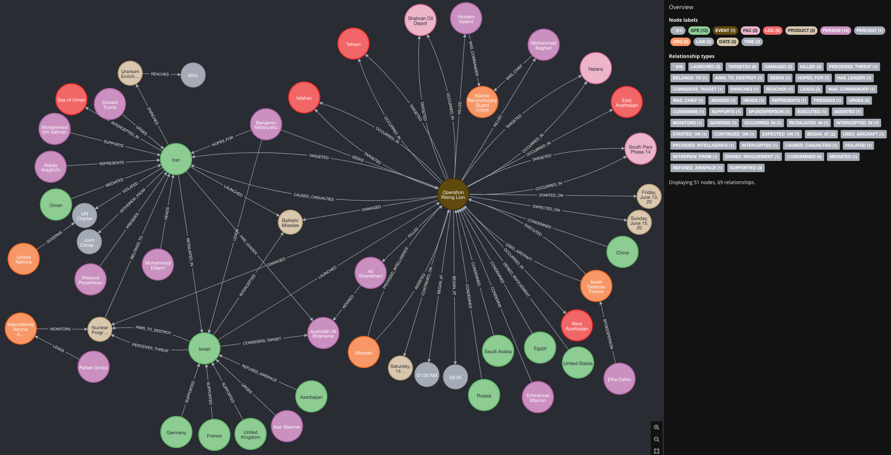

- [mp3 files of summaries](mp3)
# Middle East Conflict
## Israel-Iran Military Engagements
### 01 Israeli Strikes on Iran
- **5852** [**Israel's endgame may be regime change in Iran - but it's a gamble**](https://www.bbc.com/news/articles/c79e233j2gro) *bbc-top*
- **5854** [**Israel's overnight strike on Iran in maps and images**](https://www.bbc.com/news/articles/crr7gdr82e0o) *bbc-top*
- **5855** [**Iran is reeling from Israel's unprecedented attack - and it is only the start**](https://www.bbc.com/news/articles/cvg72ny4xeyo) *bbc-top*
- **5856** [**What satellite imagery and verified video tell us about the Israeli strikes on Iran**](https://www.bbc.com/news/videos/c04eweg57geo) *bbc-top*
- **5882** [**Israel strikes Iran in major escalation**](https://www.bbc.co.uk/sounds/play/p0lj4x2j) *bbc-top*
- **5898** [**Watch: Israel strikes targets across Iran as leaders vow to fight**](https://www.bbc.com/news/videos/czdy9nj73l8o) *bbc-world*
- **5899** [**Analysis: Why has Israel chosen to attack Iran now?**](https://www.bbc.com/news/videos/c1kv9ejy10yo) *bbc-world*
- **5902** [**Starmer urges Netanyahu to use diplomacy in Iran**](https://www.bbc.com/news/articles/c1ld0n8m4lro) *bbc-pol*
- **5981** [**Israel-Iran conflict enters second night with millions on high alert**](https://www.cnbc.com/2025/06/13/trump-urges-iran-to-reach-nuclear-deal-before-there-is-nothing-left-.html) *cnbc-top*
- **6058** [**Iran calls Israeli strikes a 'declaration of war,' swiftly replaces killed military leaders**](https://www.foxnews.com/world/iran-calls-israeli-strikes-declaration-war-swiftly-replaces-killed-military-leaders) *fox-world*
- **6059** [**Trump aware of Israel strikes on Iran beforehand, says there were no surprises**](https://www.foxnews.com/world/trump-aware-israel-strikes-iran-beforehand-says-were-no-surprises) *fox-world*
- **6088** [**Israel launches strikes on Iran's nuclear facilities and more top headlines**](https://www.foxnews.com/us/israel-launches-strikes-on-iran-more-top-headlines) *fox-us*
- **6108** [**Israel Launches Strikes Across Iran, Targets Nuclear Sites and Top Commanders**](https://egyptianstreets.com/2025/06/13/israel-launches-strikes-across-iran-targets-nuclear-sites-and-top-commanders/) *egyptian-streets*
- **6114** [**Egypt condemns Israeli strikes on Iran, warns of dangerous regional escalation**](https://www.egyptindependent.com/egypt-condemns-israeli-strikes-on-iran-warns-of-dangerous-regional-escalation/) *egyptian-independant*
- **6122** [**Israeli attack on Natanz site ‘surface damage’: AEOI chief**](https://en.mehrnews.com/news/233081/Israeli-attack-on-Natanz-site-surface-damage-AEOI-chief) *mehr-news*
- **6130** [**Tehran air defenses activated again**](https://en.mehrnews.com/news/233098/Tehran-air-defenses-activated-again) *mehr-news*
- **6131** [**Israel responsible for aftermath of strikes on Iran**](https://en.mehrnews.com/news/233097/Israel-responsible-for-aftermath-of-strikes-on-Iran) *mehr-news*
- **6133** [**Italian FM denounces Israeli airstrikes against Iran**](https://en.mehrnews.com/news/233078/Italian-FM-denounces-Israeli-airstrikes-against-Iran) *mehr-news*
- **6134** [**UN chief holds phone call with Iran FM over Israeli attacks**](https://en.mehrnews.com/news/233088/UN-chief-holds-phone-call-with-Iran-FM-over-Israeli-attacks) *mehr-news*
- **6136** [**UNSC emergency meeting begins over Israeli attack on Iran**](https://en.mehrnews.com/news/233093/UNSC-emergency-meeting-begins-over-Israeli-attack-on-Iran) *mehr-news*
- **6137** [**Iranian, French FMs discuss Israeli aggression over phone**](https://en.mehrnews.com/news/233084/Iranian-French-FMs-discuss-Israeli-aggression-over-phone) *mehr-news*
- **6139** [**Iraqi FM denounces Israeli airstrikes against Iran**](https://en.mehrnews.com/news/233089/Iraqi-FM-denounces-Israeli-airstrikes-against-Iran) *mehr-news*
- **6146** [**Putin condemns Israel aggression on Iran**](https://en.mehrnews.com/news/233082/Putin-condemns-Israel-aggression-on-Iran) *mehr-news*
- **6148** [**Swiss Envoy to Iran Summoned after Israeli Aggression**](https://tn.ai/3334930) *tasnim-news*
- **6160** [**Iran’s Natanz Nuclear Site Sustains Superficial Damage: Spokesman**](https://tn.ai/3334660) *tasnim-news*
- **7372** [**UK sending more RAF jets to Middle East**](https://www.bbc.com/news/articles/ceqg440v0gxo) *bbc-top*
- **7387** [**Global News Podcast: Israel and Iran continue strikes**](https://www.bbc.co.uk/sounds/play/p0ljb6j6) *bbc-top*
- **7442** [**Top advisor to Iranian Supreme Leader killed in Israeli strikes, state media says**](https://www.foxnews.com/world/top-advisor-iranian-supreme-leader-killed-israeli-strikes-state-media-says) *fox-latest*
- **7457** [**Benjamin Netanyahu to sit down with Fox News' Bret Baier amid Israeli conflict with Iran**](https://www.foxnews.com/media/benjamin-netanyahu-sit-down-fox-news-bret-baier-amid-israeli-conflict-iran) *fox-latest*
- **7465** [**Israel strikes at the heart of Iran's nuclear ambitions in Isfahan offensive**](https://www.foxnews.com/politics/israel-strikes-site-heart-irans-nuclear-ambitions-isfahan-offensive) *fox-politics*
- **7474** [**Israel's attack on Iran: The collapse of the pro-Tehran 'axis of resistance'**](https://www.lemonde.fr/en/international/article/2025/06/14/israel-s-attack-on-iran-the-collapse-of-the-pro-tehran-axis-of-resistance_6742345_4.html) *lemonde*
- **7476** [**Europe's paradoxical support for Israel's attack against Iran**](https://www.lemonde.fr/en/international/article/2025/06/14/europe-s-paradoxical-support-for-israel-s-attack-against-iran_6742340_4.html) *lemonde*
- **7484** [**Macron Condemns Middle East Escalation and Vows Defensive Support for Israel**](https://egyptianstreets.com/2025/06/14/macron-condemns-middle-east-escalation-and-vows-defensive-support-for-israel/) *egyptian-streets*
- **7489** [**We have destroyed Iran’s air defenses, Israeli Army Chief announces**](https://www.egyptindependent.com/we-have-destroyed-irans-air-defenses-israeli-army-chief-announces/) *egyptian-independant*
- **7490** [**VIDEO: Shahran oil depot targeted in Israeli attack**](https://en.mehrnews.com/news/233158/VIDEO-Shahran-oil-depot-targeted-in-Israeli-attack) *mehr-news*
- **7496** [**Israel seeks to drag US to war with Iran: MBS**](https://en.mehrnews.com/news/233152/Israel-seeks-to-drag-US-to-war-with-Iran-MBS) *mehr-news*
- **7500** [**Iran’s Navy intercepts UK spy destroyer in Sea of Oman**](https://en.mehrnews.com/news/233148/Iran-s-Navy-intercepts-UK-spy-destroyer-in-Sea-of-Oman) *mehr-news*
- **7501** [**Israel’s backers trying to spin blatant aggression justified**](https://en.mehrnews.com/news/233145/Israel-s-backers-trying-to-spin-blatant-aggression-justified) *mehr-news*
- **7503** [**Beijing denounces Israeli violation of Iran’s sovereignty**](https://en.mehrnews.com/news/233144/Beijing-denounces-Israeli-violation-of-Iran-s-sovereignty) *mehr-news*
- **7504** [**Fire at South Pars Phase 14 contained**](https://en.mehrnews.com/news/233146/Fire-at-South-Pars-Phase-14-contained) *mehr-news*
- **7505** [**Russia’s Lavrov denounces Israeli aggression against Iran**](https://en.mehrnews.com/news/233142/Russia-s-Lavrov-denounces-Israeli-aggression-against-Iran) *mehr-news*
- **7506** [**Israel directly strikes ambulance in Iran**](https://en.mehrnews.com/news/233143/Israel-directly-strikes-ambulance-in-Iran) *mehr-news*
- **7510** [**Israel reportedly attacks Iran's South Pars complex**](https://en.mehrnews.com/news/233139/Israel-reportedly-attacks-Iran-s-South-Pars-complex) *mehr-news*
- **7513** [**Heavy casualties reported after Israel attacked NW Iran**](https://en.mehrnews.com/news/233136/Heavy-casualties-reported-after-Israel-attacked-NW-Iran) *mehr-news*
- **7517** [**Azerbaijan not to let attacks on Iran from its territory**](https://en.mehrnews.com/news/233133/Azerbaijan-not-to-let-attacks-on-Iran-from-its-territory) *mehr-news*
- **7518** [**Azerbaijan Distances Itself from Military Action against Iran**](https://tn.ai/3335329) *tasnim-news*
- **7568** [**'The deepest we have struck in Iran': Defrin updates Israel has struck hundreds of Iranian targets**](https://www.jpost.com/israel-news/defense-news/article-857707) *jpost-israel*
- **7574** [**IDF confirms deaths of two Iranian officials in Israeli strikes**](https://www.jpost.com/israel-news/defense-news/article-857693) *jpost-israel*
- **7576** [**Iran's Supreme Leader Ali Khamenei not 'off limits,' Israeli official tells WSJ**](https://www.jpost.com/middle-east/iran-news/article-857719) *jpost-me*
- **7577** [**'Tehran is ablaze': Israel strikes massive oil depot near Iranian capital, fire rages**](https://www.jpost.com/middle-east/iran-news/article-857717) *jpost-me*
- **7578** [**Where Israel's attacks on Iran: Updates on nukes, ballistic missiles and Tehran officials**](https://www.jpost.com/middle-east/iran-news/article-857711) *jpost-me*
- **7592** [**Israeli official: Strike on Iranian Supreme Leader not off limits**](https://www.israelnationalnews.com/news/409991) *arutz-sheva*
- **7594** [**Tehran is burning: Significant strike in Iran's capital**](https://www.israelnationalnews.com/news/409989) *arutz-sheva*
```
5852,5854,5855,5856,5882,5898,5899,5902,5981,6058,6059,6088,6108,6114,6122,6130,6131,6133,6134,6136,6137,6139,6146,6148,6160,7372,7387,7442,7457,7465,7474,7476,7484,7489,7490,7496,7500,7501,7503,7504,7505,7506,7510,7513,7517,7518,7568,7574,7576,7577,7578,7592,7594
```

Good evening, ladies and gentlemen. This is your correspondent, reporting on a dramatic escalation in the Middle East that has gripped the world’s attention. Over the past 48 hours, Israel has launched an unprecedented series of airstrikes against Iran, codenamed "Operation Rising Lion," targeting its nuclear facilities, military infrastructure, and senior leadership. Iran has retaliated with waves of ballistic missiles and drones aimed at Israeli cities, plunging the region into a perilous cycle of violence. Tonight, we unpack the key developments, the major themes driving this conflict, and the global implications, drawing from a comprehensive set of reports.

On Friday, June 13, 2025, Israel initiated what it calls a preemptive strike to dismantle Iran’s nuclear program, which it views as an existential threat. The Israeli Air Force, supported by Mossad intelligence, struck over 150 targets, including the Natanz and Isfahan nuclear facilities, critical for uranium enrichment. The attacks also targeted Iran’s air defenses, ballistic missile sites, and command centers, with reports confirming the deaths of senior military figures, including the commander of the Islamic Revolutionary Guard Corps, Hossein Salami, the armed forces chief of staff, Mohammad Bagheri, and at least nine nuclear scientists. Israeli Prime Minister Benjamin Netanyahu declared the operation a necessity to “roll back the uranium threat,” vowing to continue strikes until Iran’s nuclear ambitions are eradicated.

Iran’s response was swift and forceful. By Friday afternoon, Tehran launched over 100 drones and ballistic missiles targeting Israeli military bases and cities, including Tel Aviv and Jerusalem. Iranian state media reported further missile barrages into Saturday, with air defenses activated across Tehran to counter ongoing Israeli strikes. Iran’s Supreme Leader, Ayatollah Ali Khamenei, promised “severe punishment,” while President Masoud Pezeshkian called the response “legitimate and powerful.” Iranian officials reported significant civilian casualties, with unverified claims of 78 deaths, including women and children, in residential areas hit by Israeli strikes.

Let’s turn to the major themes emerging from this crisis. First, **Israel’s Strategic Gamble for Regime Change**. Beyond neutralizing Iran’s nuclear capabilities, Netanyahu’s broader aim appears to be destabilizing the Islamic Republic’s leadership, hoping to spark a popular uprising. He urged Iranians to “stand up for freedom” against an “oppressive regime,” citing widespread discontent over economic woes, restricted freedoms, and human rights abuses. However, analysts warn this is a high-stakes gamble. Iran’s power structure, dominated by hardliners in the IRGC, remains resilient, and any unrest could lead to chaos rather than a pro-Western government. The fragmented Iranian opposition, from exiled figures like Reza Pahlavi to groups like the Mujahideen-e Khalq, lacks the cohesion to seize power, raising questions about who could replace the current regime.

Second, **The Nuclear Escalation Risk**. Israel’s strikes have dealt a significant blow to Iran’s nuclear infrastructure, with Natanz’s centrifuge fleet and enriched uranium stocks reportedly damaged. Yet, facilities like Fordow, buried deep underground, remain intact, and Iran retains enough expertise to rebuild. Hardliners in Tehran may now push to accelerate weaponization as a deterrent, potentially triggering a regional nuclear arms race involving Saudi Arabia, Turkey, or Egypt. The International Atomic Energy Agency has warned of “serious implications” for nuclear safety, urging restraint to avoid radioactive spills or broader environmental harm.

Third, **Global Diplomatic Tensions**. The strikes have derailed U.S.-Iran nuclear talks scheduled for Sunday in Oman, with Tehran withdrawing from negotiations. President Donald Trump, who was briefed on Israel’s plans, expressed frustration, urging Iran to “make a deal” while praising Israel’s use of American-supplied equipment. The U.S. insists it was not involved but has deployed naval assets and missile defense systems to protect American forces and support Israel’s Iron Dome. European leaders, including France’s Emmanuel Macron, the UK’s Keir Starmer, and Germany’s Friedrich Merz, have backed Israel’s right to self-defense but called for de-escalation, wary of being drawn into a wider conflict. Meanwhile, regional powers like Egypt, Saudi Arabia, and Turkey condemned Israel’s actions, with Iran’s foreign minister accusing the U.S. of complicity.

Fourth, **Iran’s Weakened Regional Influence**. The collapse of Iran’s “axis of resistance”—allies like Hezbollah, Hamas, and Yemen’s Houthis—has left Tehran isolated. Weakened by prior Israeli operations in Lebanon, Syria, and Gaza, these proxies offered minimal support, with only a single Houthi missile fired in retaliation. This imbalance underscores Israel’s military superiority and Iran’s limited options, which range from continued missile strikes to targeting U.S. interests, both risky moves that could draw Washington into the fray.

Fifth, **Economic and Humanitarian Fallout**. The conflict has spiked global oil prices, with strikes on Iran’s Shahran oil depot and South Pars gas facilities threatening supply chains. Civilian casualties and infrastructure damage in both countries have raised humanitarian concerns, with reports of fires in Tehran’s residential areas and injuries in Israeli cities. The UN and humanitarian groups are calling for restraint to prevent further suffering.

As the dust settles, the world watches anxiously. Israel’s campaign, now in its third day, shows no signs of abating, with Defense Minister Israel Katz warning that “Tehran will burn” if Iran persists. Tehran, meanwhile, vows to continue its “hard retaliation.” The risk of miscalculation looms large, with the potential to ignite a broader regional war. International calls for diplomacy grow louder, but with nuclear talks stalled and mutual distrust deepening, the path to peace remains elusive.

This is a developing story, and we will bring you updates as events unfold. For now, the Middle East stands at a crossroads, with the choices made in the coming days likely to shape the region’s future for years to come. This is your correspondent, signing off. Good night.

### 02 Iranian Retaliatory Attacks
- **5897** [**Explosions and huge plumes of smoke in Tel Aviv as Iran retaliates**](https://www.bbc.com/news/videos/c74q21jez82o) *bbc-world*
- **6092** [**Iran fires back at Israel after onslaught targets nuclear facilities**](https://www.lemonde.fr/en/international/article/2025/06/14/iran-fires-back-at-israel-after-onslaught-targets-nuclear-facilities_6742332_4.html) *lemonde*
- **6118** [**Iran launches 4th round of retaliatory attacks on Israel**](https://en.mehrnews.com/news/233109/Iran-launches-4th-round-of-retaliatory-attacks-on-Israel) *mehr-news*
- **6123** [**Iran launches new wave of attacks on Israel**](https://en.mehrnews.com/news/233105/Iran-launches-new-wave-of-attacks-on-Israel) *mehr-news*
- **6124** [**IRGC missiles hit sources of Israeli aggression against Iran**](https://en.mehrnews.com/news/233104/IRGC-missiles-hit-sources-of-Israeli-aggression-against-Iran) *mehr-news*
- **6126** [**Dozens injured in Iran's retaliatory attack on Israel**](https://en.mehrnews.com/news/233102/Dozens-injured-in-Iran-s-retaliatory-attack-on-Israel) *mehr-news*
- **6135** [**Iran's attack on Israel photos**](https://en.mehrnews.com/photo/233096/Iran-s-attack-on-Israel-photos) *mehr-news*
- **6140** [**VIDEO: Watch Iranian missiles hit heart of Tel Aviv**](https://en.mehrnews.com/news/233091/VIDEO-Watch-Iranian-missiles-hit-heart-of-Tel-Aviv) *mehr-news*
- **6142** [**IRGC issues statement after hitting Israel**](https://en.mehrnews.com/news/233087/IRGC-issues-statement-after-hitting-Israel) *mehr-news*
- **6143** [**Iran hits Israel's war ministry**](https://en.mehrnews.com/news/233086/Iran-hits-Israel-s-war-ministry) *mehr-news*
- **6144** [**Iran hits Israel in retaliation for Friday attacks**](https://en.mehrnews.com/live/233085/Iran-hits-Israel-in-retaliation-for-Friday-attacks) *mehr-news*
- **6150** [**Iranian Missiles Hit Tel Aviv After Launch of True Promise III Operation**](https://tn.ai/3334894) *tasnim-news*
- **7373** [**'It's heavy on the heart': Israelis survey damage in city hit by Iranian missile**](https://www.bbc.com/news/articles/cx270vklvv7o) *bbc-top*
- **7487** [**Iran unleashes advanced missile barrage on Israeli cities, escalating regional tensions**](https://www.egyptindependent.com/iran-unleashes-advanced-missile-barrage-on-israeli-cities-escalating-regional-tensions/) *egyptian-independant*
- **7493** [**Iranian missiles land in Haifa, cause fire in strategic site**](https://en.mehrnews.com/news/233155/Iranian-missiles-land-in-Haifa-cause-fire-in-strategic-site) *mehr-news*
- **7512** [**VIDEO: Moment when Iranian missile hit Rishon LeZion**](https://en.mehrnews.com/news/233137/VIDEO-Moment-when-Iranian-missile-hit-Rishon-LeZion) *mehr-news*
- **7559** [**Explosions heard, rocket impacts felt in Israel as Iranian missile attack continues**](https://www.jpost.com/israel-news/defense-news/article-857723) *jpost-israel*
- **7563** [**Four killed, at least 24 wounded in Iranian ballistic missile barrage on northern Israel**](https://www.jpost.com/israel-news/article-857714) *jpost-israel*
- **7570** [**Iran attacks on Israel kill three, wound over 200 since start of Operation Rising Lion**](https://www.jpost.com/israel-news/article-857704) *jpost-israel*
- **7579** [**Israel's message to Iran: Target population centers, IDF will strike infrastructure**](https://www.jpost.com/middle-east/iran-news/article-857709) *jpost-me*
- **7587** [**Second wave in hours: Iran launches 50 missiles at Israel**](https://www.israelnationalnews.com/news/409995) *arutz-sheva*
- **7591** [**Three dead, 20 injured, in Iranian strike on northern Israel**](https://www.israelnationalnews.com/news/409982) *arutz-sheva*
- **7597** [**Yisrael Aloni, Eti Cohen Angel, & Yevgenia Blinder killed in Iran strike**](https://www.israelnationalnews.com/news/409968) *arutz-sheva*
```
5897,6092,6118,6123,6124,6126,6135,6140,6142,6143,6144,6150,7373,7487,7493,7512,7559,7563,7570,7579,7587,7591,7597
```

Good evening, ladies and gentlemen. This is your correspondent reporting on a rapidly escalating conflict in the Middle East that has gripped the world’s attention. Over the past 48 hours, a violent exchange of missile strikes between Iran and Israel has claimed dozens of lives, caused widespread destruction, and raised fears of a broader regional war. Drawing from detailed reports, we’ll unpack the key events, analyze the major themes, and explore the implications of this crisis.

On Friday, Israel launched Operation Rising Lion, a series of unprecedented airstrikes targeting Iran’s nuclear facilities, missile sites, air defenses, and military bases. The Israeli military struck approximately 200 targets, including the Natanz enrichment plant and underground command centers, killing senior Iranian military commanders, such as the Revolutionary Guards’ aerospace commander, and at least six nuclear scientists. Iran’s Supreme Leader, Ayatollah Ali Khamenei, vowed to bring Israel “to ruin,” while Israeli Prime Minister Benjamin Netanyahu claimed the strikes dismantled significant portions of Iran’s ballistic missile arsenal and nuclear program.

In retaliation, Iran initiated Operation True Promise 3, launching waves of ballistic missiles and drones targeting Tel Aviv, Haifa, Jerusalem, and other Israeli cities. Iranian missiles struck residential areas, a 50-story building in Tel Aviv, and strategic sites, including a Haifa refinery and Israel’s Ministry of War, according to Iranian and Israeli media. The Israeli Iron Dome defense system, while partially effective, was overwhelmed by the volume of missiles, some of which breached its multilayered defenses. In Rishon LeZion, a missile strike killed 73-year-old Yisrael Aloni and 74-year-old Yevgenia Blinder, while in Ramat Gan, 74-year-old Eti Cohen Angel perished. Across Israel, at least six people were killed, and nearly 500 were injured, with significant damage reported to homes and infrastructure.

Iran’s attacks extended into Saturday night, with missiles hitting Tamra in northern Israel, killing four and wounding 13. Israeli media reported fires at strategic complexes near Haifa, while Iran’s Islamic Revolutionary Guard Corps claimed precise strikes on military targets linked to Israel’s operations in Gaza and Palestine. The human toll in Iran was far higher, with 78 deaths reported by Iran’s UN envoy on Friday, including 20 children in a Tehran apartment block, and up to 800 injuries by Saturday.

Several major themes emerge from this conflict. First, **escalation and retaliation** define the current crisis. Israel’s preemptive strikes on Iran’s nuclear and military infrastructure, described as the largest in years, triggered Iran’s fierce response, marking a shift from proxy conflicts to direct confrontation. Both nations have signaled their intent to continue attacks, with Netanyahu warning of further strikes and Khamenei promising severe punishment.

Second, **civilian suffering** is a stark reality. In Israel, families like Ifat Benhaim’s in Rishon LeZion emerged from bomb shelters to find their homes shattered, with glass and debris littering streets. In Iran, residential neighborhoods in Tehran bore the brunt of Israeli strikes, with a gaping hole in a high-rise building symbolizing the devastation. The conflict’s toll extends beyond the immediate combatants, with Gaza’s humanitarian crisis worsening as Israel resumed airstrikes, killing over 400, according to Hamas-run health authorities.

Third, **geopolitical tensions** are intensifying. The United States, while denying involvement in Israel’s strikes, provided defensive support against Iranian missiles and engaged in diplomatic talks with both sides. President Donald Trump urged Iran to negotiate, while Israeli officials expressed hope for U.S. participation in future strikes on Iran’s nuclear sites. The UN, through Secretary-General Antonio Guterres, called for an immediate ceasefire, emphasizing diplomacy over escalation. Meanwhile, Iran’s reported missile cooperation with Russia and North Korea raises concerns in Washington and Tel Aviv about a broader axis of adversaries.

Fourth, **strategic military capabilities** are under scrutiny. Iran’s arsenal of over 15 missile systems, including precision-guided ballistic missiles like the Soumar and anti-ship Raad missiles, poses a growing threat to Israel’s Iron Dome and U.S. bases in the Gulf. Israel’s ability to strike deep within Iran, targeting underground facilities, underscores its advanced intelligence and air force capabilities. However, the partial failure of Israel’s defenses highlights the limits of even the most sophisticated systems against saturation attacks.

Finally, **nuclear ambitions** remain a flashpoint. Israel’s strikes on Natanz and other nuclear facilities reflect its determination to curb Iran’s nuclear program, which Iran insists is peaceful. The International Atomic Energy Agency reported no change in radiation levels, but the destruction of above-ground sections of Natanz raises questions about the future of nuclear talks scheduled in Oman.

As sirens continue to sound across Israel and smoke rises over Tehran, the world watches with bated breath. The conflict’s trajectory remains uncertain, with both sides entrenched and global powers scrambling to prevent a wider war. The question scrawled in dust on a car in Rishon LeZion—“Until when?”—captures the anguish and urgency felt by millions. For now, the path to peace and diplomacy, as urged by the UN, seems distant, but it remains the only hope to halt this cycle of destruction.

This has been your correspondent, reporting on the Middle East crisis. Stay tuned for further updates as this story develops. Good night.

### 03 Casualties and Leadership Changes
- **5853** [**Who were the Iranian commanders killed in Israel's attack?**](https://www.bbc.com/news/articles/c2lk5j18k4vo) *bbc-top*
- **6057** [**Who were the top Iranian generals killed in Israeli strikes?**](https://www.foxnews.com/world/who-were-2-top-iranian-generals-killed-israeli-strikes) *fox-world*
- **6117** [**General Hatami appointed Iran's new Army Chief**](https://en.mehrnews.com/news/233110/General-Hatami-appointed-Iran-s-new-Army-Chief) *mehr-news*
- **6149** [**General Hatami Named Iran’s Army Commander**](https://tn.ai/3334920) *tasnim-news*
- **6162** [**IRGC Aerospace Force Commander Martyred in Israeli Attack**](https://tn.ai/3334556) *tasnim-news*
- **6163** [**Khatam al-Anbia Central Headquarters of Iran Gets New Chief**](https://tn.ai/3334484) *tasnim-news*
- **7593** [**IDF eliminated over 20 senior Iranian commanders in opening strike**](https://www.israelnationalnews.com/news/409990) *arutz-sheva*
- **7581** [**Iranian media: Supreme leader's top advisor Ali Shamkhani killed in Israeli strike**](https://www.jpost.com/middle-east/iran-news/article-857703) *jpost-me*
```
5853,6057,6117,6149,6162,6163,7593,7581
```

Good evening, ladies and gentlemen. This is your correspondent reporting on a significant escalation in the Middle East, where Israel has launched a series of devastating airstrikes on Iran in an operation dubbed "Rising Lion." The strikes, which began early Friday, June 13, 2025, targeted nuclear facilities, military sites, and residential areas, resulting in the deaths of numerous high-profile Iranian military commanders, nuclear scientists, and civilians, including children. Tonight, we bring you a detailed summary of these events and the major themes emerging from this unprecedented attack.

The Israeli operation, described as the largest strike on Iran in years, aimed at crippling Iran’s nuclear and missile infrastructure. The Israel Defense Forces, guided by precise intelligence, eliminated over 20 senior Iranian commanders, including General Mohammad Bagheri, the chief of staff of Iran’s armed forces, and General Hossein Salami, commander-in-chief of the Islamic Revolutionary Guard Corps (IRGC). Other key figures killed included Amir Ali Hajizadeh, head of the IRGC’s Aerospace Force, responsible for Iran’s ballistic missile program, and Gholamali Rashid, commander of the Khatam al-Anbiya Central Headquarters, which coordinates Iran’s joint military operations. Additionally, at least six nuclear scientists, including a former head of Iran’s Atomic Energy Organisation, were reported killed, dealing a significant blow to Iran’s nuclear ambitions.

The operation also saw the reported killing of Ali Shamkhani, a top advisor to Iran’s Supreme Leader Ayatollah Ali Khamenei and a former defense minister. However, Iran’s Tourism and Cultural Heritage Ministry later issued a statement claiming Shamkhani’s inclusion among the deceased was a mistake, though they did not clarify his status, leaving uncertainty surrounding his fate.

Iran’s response has been swift and defiant. The IRGC condemned the attacks as “criminal” and vowed “harsh revenge,” warning Israel and its allies of a decisive response. On Friday night, Iran launched a fresh wave of missiles toward Israel, signaling its intent to retaliate. Ayatollah Khamenei himself declared that Israel would face “severe punishment” for what he called a “bitter, painful fate” brought upon itself.

The strikes have exposed deep tensions in the region, with several major themes emerging. First, the targeting of Iran’s nuclear and missile programs underscores Israel’s determination to prevent Iran from advancing its nuclear capabilities and ballistic missile arsenal, which have been used in attacks on Israel in April and October 2024. The elimination of key figures like Hajizadeh, who oversaw these missile strikes, and nuclear scientists signals a strategic effort to disrupt Iran’s military and technological infrastructure.

Second, the high death toll among senior IRGC commanders highlights the IRGC’s critical role as a pillar of Iran’s power structure. Formed after the 1979 Islamic Revolution, the IRGC has evolved into a transnational force, supporting Iran’s allies in Syria, Lebanon, and Iraq, and controlling its ballistic missile arsenal. The loss of figures like Salami, known for his fiery rhetoric against Israel and the United States, and Bagheri, a veteran of the Iran-Iraq War who shaped Iran’s military doctrine, represents a significant disruption to Iran’s command structure. However, Iran has moved quickly to appoint replacements, including Mohammad Pakpour as the new IRGC commander and Abdolrahim Mousavi as the armed forces chief of staff, signaling resilience in its military hierarchy.

Third, the civilian casualties, including children, and the targeting of residential neighborhoods in Tehran have raised concerns about the humanitarian impact of the strikes. These reports, verified by BBC analysts, underscore the broader consequences of military escalation in densely populated areas. The international community, including the U.S. president, who has been pushing for peace in the region, now faces a new Middle East crisis that threatens to undermine diplomatic efforts, particularly after failed nuclear negotiations between the Trump administration and Tehran.

Fourth, the strikes reflect a broader geopolitical struggle. Iran’s military coordination with allies like Russia and Syria, as well as its history of retaliatory actions—such as the 2020 downing of a Ukrainian passenger plane, for which Hajizadeh took responsibility—places this conflict within a complex web of regional and global alliances. Israel’s actions, supported by precise intelligence from the IDF Intelligence Directorate, also highlight the ongoing shadow war between Israel and Iran, intensified by events like the 2020 U.S. killing of IRGC Quds Force commander Qassem Soleimani.

Finally, the rapid appointments of new commanders, such as Major General Amir Hatami as chief of the Iranian Army and Ali Shadmani as head of the Khatam al-Anbiya Central Headquarters, indicate Iran’s intent to maintain continuity and project strength despite the losses. Ayatollah Khamenei’s decrees emphasize a “transformative and revolutionary approach” to bolster combat readiness and ideological resolve, suggesting that Iran is preparing for further confrontation.

As the situation develops, the world watches closely. The Israeli strikes have not only reshaped Iran’s military landscape but also heightened the risk of a broader regional conflict. The international community, including the United Nations, has called for restraint, but with Iran vowing retaliation and Israel standing firm, the path to de-escalation remains uncertain. We will continue to monitor this developing story and bring you updates as they unfold. For now, this is your correspondent, signing off.

### 04 Iranian Air Defense and Military Response
- **6138** [**Iran destroys two Israeli F-35 fighter jets**](https://en.mehrnews.com/news/233092/Iran-destroys-two-Israeli-F-35-fighter-jets) *mehr-news*
- **6141** [**Iran detains Israeli female fighter jet pilot**](https://en.mehrnews.com/news/233090/Iran-detains-Israeli-female-fighter-jet-pilot) *mehr-news*
- **6145** [**Iran hits Israeli fighter jets over its soil**](https://en.mehrnews.com/news/233083/Iran-hits-Israeli-fighter-jets-over-its-soil) *mehr-news*
- **6151** [**Iran’s Air Defenses Down 2 Israeli Warplanes, Female Pilot Captured**](https://tn.ai/3334885) *tasnim-news*
- **6154** [**Tehran Air Defenses Thwart Fresh Wave of Israeli Attacks**](https://tn.ai/3334848) *tasnim-news*
- **7502** [**Iran destroys 10 Israeli military aircrafts in 1 hour**](https://en.mehrnews.com/news/233147/Iran-destroys-10-Israeli-military-aircrafts-in-1-hour) *mehr-news*
```
6138,6141,6145,6151,6154,7502
```

Good evening, ladies and gentlemen. This is a special report from the international desk, where we bring you the latest developments in a rapidly escalating conflict between Iran and Israel. Based on reports from Iranian media outlets, including Mehr News Agency and Tasnim, a series of dramatic military engagements unfolded over Iranian airspace on Friday, June 13, and into Saturday, June 14, 2025. These events have heightened tensions in the region, with profound implications for Middle Eastern stability. Let us delve into the details of these reports and the major themes they reveal.

According to Iranian sources, the Islamic Republic’s air defense systems successfully intercepted and destroyed multiple Israeli military aircraft, including two F-35 fighter jets and, in a later report, up to ten additional hostile aircraft. These engagements reportedly took place over Tehran and other cities, including Tabriz, Khorramabad, Kermanshah, Boroujerd, and Natanz. The Iranian military claims to have neutralized a significant number of Israeli projectiles, micro air vehicles, and drones. In a particularly striking claim, one report indicates that a female Israeli fighter jet pilot was taken captive, though her fate, along with that of other pilots, remains under investigation.

The backdrop to these clashes is a series of Israeli airstrikes that began in the early hours of Friday, targeting residential neighborhoods in Tehran and other strategic sites across Iran. These attacks reportedly resulted in significant casualties, including the deaths of high-ranking Iranian military officials—such as Major General Mohammad Hossein Baqeri, Chief of Staff of the Iranian Armed Forces; Major General Hossein Salami, Commander of the Islamic Revolution Guards Corps; Major General Gholam Ali Rashid, Commander of the Khatam al-Anbia Central Headquarters; and Major General Amir Ali Hajizadeh, Commander of the IRGC Aerospace Force. Additionally, at least six Iranian nuclear scientists and several civilians were reportedly killed. These strikes have been condemned by Iran’s leadership, with Ayatollah Seyyed Ali Khamenei, the Leader of the Islamic Revolution, denouncing the attacks as exposing Israel’s “vile nature” and vowing a “severe punishment” for what he described as a “bitter, painful fate” awaiting the Israeli regime.

Several key themes emerge from these reports. First, the escalation of military conflict between Iran and Israel underscores a deepening hostility. The targeting of residential areas and high-profile military and scientific figures suggests a broadening of the conflict beyond military installations, raising concerns about civilian safety and the potential for further retaliation. Second, Iran’s emphasis on its air defense capabilities, particularly the Khatam al-Anbiya Air Defense Base, highlights its determination to project strength and resilience in the face of aggression. The rapid restoration of defensive capabilities, as claimed by Iranian forces, signals a readiness for prolonged confrontation.

Third, the rhetoric from Iranian leadership, particularly Ayatollah Khamenei’s warnings, points to a narrative of defiance and retribution. The use of terms like “Zionist regime” and the promise of a “crushing response” reflect a broader ideological struggle that frames Israel as an existential threat. This rhetoric could galvanize domestic support within Iran while further polarizing relations with Israel and its allies. Finally, the reported capture of an Israeli pilot, if verified, introduces a human dimension to the conflict, potentially complicating diplomatic efforts and raising questions about prisoner treatment and negotiations.

These developments come at a time of heightened global attention on the Middle East, where proxy conflicts and direct confrontations continue to destabilize the region. The loss of key Iranian military and scientific figures could have long-term implications for Iran’s defense and nuclear programs, while Israel’s bold strikes signal its willingness to take significant risks to counter perceived threats. As the situation evolves, the international community will be watching closely to see whether Iran’s promised retaliation materializes and how it might reshape the geopolitical landscape.

We will continue to monitor this story and bring you updates as more information becomes available. For now, the world holds its breath as tensions between these two nations reach a critical juncture. This has been a special report. Good night.

### 05 Drone Attacks
- **6119** [**Drones reportedly launched from Iraq toward Israel**](https://en.mehrnews.com/news/233108/Drones-reportedly-launched-from-Iraq-toward-Israel) *mehr-news*
- **6127** [**Sirens go off in occupied Eilat Port**](https://en.mehrnews.com/news/233101/Sirens-go-off-in-occupied-Eilat-Port) *mehr-news*
- **7588** [**Several drones infiltrate northern and southern Israel**](https://www.israelnationalnews.com/news/409994) *arutz-sheva*
```
6119,6127,7588
```

Good evening, ladies and gentlemen. This is your correspondent reporting with a critical update on escalating tensions in the Middle East, based on reports from Tehran’s Mehr News Agency and other regional sources.

Over the weekend of June 14, 2025, a series of drone incursions targeting Israeli-occupied territories has heightened regional anxieties. Late Saturday, multiple drones were launched from Iraqi territory toward Palestinian lands under Israeli control, according to Palestine’s SAMA News Agency. Details regarding the drones’ type or intent remain undisclosed, but the origin of the launches—Iraq—suggests potential involvement of non-state actors or regional factions operating within Iraqi borders. This incident marks a significant cross-border escalation, as the use of Iraqi territory for such operations introduces a new dimension to the conflict.

Early Sunday, the southern Israeli port city of Eilat was jolted by warning sirens at 1:05 a.m., signaling a hostile aircraft infiltration. Israeli media attributed the alert to drone activity, and the Israel Defense Forces (IDF) confirmed that one unmanned aerial vehicle (UAV) was intercepted by the Israeli Air Force (IAF). Shortly after, at 1:41 a.m., additional sirens echoed across the Arava region, followed by alerts in the northern Jordan Valley and Jezreel Valley. The IDF reported intercepting two more UAVs in the Arava, while an ongoing aerial infiltration in the northern regions underscored the intensity and scope of these coordinated incursions.

The major themes emerging from these events are threefold. First, the proliferation of drone warfare in the region highlights a shift toward accessible, low-cost technologies that enable non-state actors or proxy groups to challenge conventional military defenses. The repeated use of UAVs in these attacks suggests a growing sophistication in their deployment, posing a persistent threat to Israeli security infrastructure. Second, the involvement of Iraqi territory as a launch point raises questions about regional stability and the influence of external actors in Iraq, potentially complicating the geopolitical landscape. Finally, the targeting of both southern and northern Israeli regions, from Eilat to the Jezreel Valley, indicates a strategic intent to stretch Israeli defenses across multiple fronts, amplifying pressure on the IDF and IAF.

As the situation develops, the international community will be watching closely to see how Israel responds and whether these incidents provoke a broader regional confrontation. For now, the skies over the Middle East remain tense, and we await further details on the actors behind these audacious drone operations. This has been your correspondent, reporting on the latest from the region. Good night, and stay informed.

## Nuclear Program and Diplomacy
### 06 Iran's Nuclear Threat
- **6074** [**How close was Iran to a nuclear weapon before Israel’s strike on Tehran?**](https://www.foxnews.com/politics/how-close-iran-nuclear-weapon-before-israels-strike-tehran) *fox-politics*
- **7440** [**Netanyahu calls on Iranian citizens to seize 'opportunity' for regime change**](https://www.foxnews.com/world/netanyahu-calls-iranian-citizens-seize-opportunity-regime-change) *fox-latest*
- **7463** [**Israel’s actions against Iran create strategic opportunity for US in nuclear talks, experts say**](https://www.foxnews.com/world/israels-actions-against-iran-create-strategic-opportunity-us-nuclear-talks-experts-say) *fox-world*
- **7573** [**Netanyahu: Israeli jets will fly over Tehran soon, we will strike every site**](https://www.jpost.com/israel-news/article-857697) *jpost-israel*
- **7589** [**Officials confirm: Israel requested US assistance in eliminating Iranian nuclear threat**](https://www.israelnationalnews.com/news/409993) *arutz-sheva*
- **7602** [**President Herzog to world leaders: Stand with Israel against nuclear Iran**](https://www.israelnationalnews.com/news/409980) *arutz-sheva*
```
6074,7440,7463,7573,7589,7602
```

Good evening, ladies and gentlemen. This is your correspondent reporting on a rapidly escalating crisis in the Middle East, where recent Israeli airstrikes on Tehran have thrust the region into a precarious moment of tension and uncertainty. Drawing from exclusive reports by Fox News, the Jerusalem Post, and Axios, we bring you an in-depth summary of these developments, highlighting the major themes shaping this critical juncture in international security.

On Friday, June 13, 2025, Israel launched precision airstrikes targeting Iran’s nuclear and military infrastructure, including facilities in Tehran and Isfahan. These strikes, described as a dramatic escalation in the long-standing proxy war between Israel and Iran, were aimed at disrupting what Israeli intelligence claims was an imminent threat: Iran’s alleged efforts to assemble a crude nuclear warhead. According to Beni Sabti of the Institute of National Security Studies, Iran was consolidating materials in a secret location near Tehran to construct a primitive nuclear device. This follows reports that Iran has been enriching uranium to 60%, perilously close to the 90% threshold required for a nuclear weapon, with no apparent civilian purpose for such enrichment.

However, conflicting narratives cloud the situation. U.S. intelligence, as stated by Director of National Intelligence Tulsi Gabbard in April 2025, maintains that Iran has not resumed its nuclear weapons program since halting it in 2003. Political scientist Rosemary Kelanic cautions against accepting Israeli claims at face value, noting that Iran could have built a bomb as early as 2022 but chose not to. She warns that these strikes may push Iran toward a "crash program" to develop and test a nuclear device, potentially to establish deterrence against Israel. This divergence in intelligence assessments underscores a central theme: uncertainty about Iran’s nuclear intentions and the risks of escalation.

The strikes have also opened a strategic window for diplomacy, albeit a complex one. Experts like Robert Greenway of the Heritage Foundation suggest that the U.S. could leverage Israel’s military actions to pressure Iran into a nuclear agreement. The Trump administration, which withdrew from the original Iran nuclear deal during its first term, has signaled openness to a revised agreement allowing limited uranium enrichment for civilian purposes. President Trump issued a 60-day ultimatum to Iran, with negotiations scheduled for this weekend, though their status remains uncertain. Israeli analyst Nadav Eyal describes this as a deliberate "bad cop, good cop" strategy, with Israel applying military pressure while the U.S. seeks diplomatic gains.

Another critical theme is the potential for regime change in Iran. Israeli Prime Minister Benjamin Netanyahu, in a direct appeal to the Iranian people, framed the strikes as an opportunity to rise against the Islamic regime, which he accused of oppressing its citizens for nearly 50 years. The regime faces internal unrest, particularly since the 2022 death of Mahsa Amini, which sparked nationwide protests. Minority groups like the Kurds, Baloch, and Ahwazis, comprising roughly 50% of Iran’s population, could play a pivotal role in destabilizing the regime, according to Yigal Carmon of the Middle East Media Research Institute. These groups, often militarily organized, have faced brutal repression, and their potential unification poses a significant threat to Tehran’s authority.

The strikes also highlight the deepening U.S.-Israel coordination. While the operation was led by the Israeli Defense Forces, with Mossad-planted drones reportedly involved, the U.S. provided real-time intelligence and assisted in intercepting Iranian retaliatory missiles targeting Tel Aviv. Avner Golov of Mind Israel emphasized Israel’s role as a responsible ally, delivering results with minimal U.S. investment. However, Israel has formally requested U.S. participation in targeting Iran’s fortified Fordow enrichment facility, which lies beyond Israel’s operational reach. The Trump administration has so far declined, wary of direct engagement that could provoke Iranian retaliation against U.S. interests.

Finally, the global response and its implications form a key theme. Israeli President Isaac Herzog, addressing the international community ahead of the G7 Summit on Monday, urged world leaders to support Israel’s efforts to prevent a nuclear-armed Iran, framing it as a threat not only to Israel but to global peace. The strikes have prompted calls from world leaders to avoid further escalation, reflecting fears that continued conflict could destabilize the Middle East further. Netanyahu’s warning on Saturday, June 14, 2025, that Israeli jets would soon fly over Tehran signals a readiness to intensify operations, raising the stakes for all involved.

In conclusion, the Israeli airstrikes on Iran represent a high-stakes gamble, balancing the disruption of Iran’s nuclear ambitions against the risk of accelerating its pursuit of a bomb or destabilizing the region further. The interplay of military action, diplomatic maneuvering, internal Iranian unrest, and international cooperation will shape the path forward. As the world watches, the question remains: will these actions lead to a new nuclear agreement, regime change, or a broader conflict? We will continue to monitor this developing story. For now, this is your correspondent, signing off.

### 07 Nuclear Deal Negotiations
- **6072** [**Trump believes Israel's strike on Iran could improve chances for nuclear deal: report**](https://www.foxnews.com/politics/trump-believes-israels-strike-iran-could-improve-chances-nuclear-deal-report) *fox-politics*
- **7507** [**Iran-US talks officially canceled**](https://en.mehrnews.com/news/233141/Iran-US-talks-officially-canceled) *mehr-news*
- **7584** [**Sunday's US-Iran nuclear talks canceled, Oman says**](https://www.jpost.com/middle-east/iran-news/article-857700) *jpost-me*
- **7585** [**Tehran expected Israel to only strike after next round of nuclear talks, officials admit**](https://www.jpost.com/middle-east/iran-news/article-857686) *jpost-me*
```
6072,7507,7584,7585
```

Good evening, ladies and gentlemen. This is your correspondent reporting on a rapidly escalating situation in the Middle East, where tensions between Israel, Iran, and the United States have reached a critical juncture, threatening the prospects of nuclear diplomacy. Drawing from recent reports, we bring you a comprehensive summary of the unfolding events and their broader implications.

On Friday, Israel launched a sweeping air offensive against Iran, targeting nuclear and ballistic missile sites, as well as killing key military commanders and nuclear scientists. The strikes, described as Israel’s largest-ever military operation against Iran, were aimed at thwarting Iran’s nuclear ambitions, according to Israeli Prime Minister Benjamin Netanyahu. Michael Oren, a former Israeli ambassador to the United Nations, stated on "America’s Newsroom" that Israel had "no choice" but to act, citing Iran’s progress toward developing a nuclear weapon. The Israeli Defense Forces’ operation caught Iranian leadership off guard, with senior officials and members of the Islamic Revolutionary Guard Corps admitting to The New York Times that they dismissed warnings of an imminent attack. This miscalculation left critical sites vulnerable, exposing what one Iranian official described as a "lack of proper air defense."

The timing of the strikes is particularly significant, as they occurred just days before a scheduled round of indirect Iran-U.S. nuclear talks set for Sunday in Muscat, Oman. These talks, mediated by Oman, were intended to revive negotiations surrounding Iran’s nuclear program. However, on Saturday, Omani Foreign Minister Badr bin Hamad Al Busaidi announced the cancellation of the talks, stating on X that "diplomacy and dialogue remain the only pathway to lasting peace." Iran’s Foreign Ministry spokesperson, Esmaeil Baghaei, declared the dialogue "meaningless" in the wake of Israel’s attack, accusing the United States of complicity. Iranian Foreign Minister Abbas Araghchi echoed this sentiment, calling the continuation of talks amid Israel’s actions "unjustifiable." Iran has since suspended its participation in negotiations "until further notice," according to state media.

The U.S. role in this crisis is complex. President Donald Trump, who withdrew the U.S. from the Joint Comprehensive Plan of Action, or JCPOA, during his first term, has made a new nuclear deal with Iran a top priority. The JCPOA, enacted in 2015, restricted Iran’s nuclear program in exchange for sanctions relief but unraveled after the U.S. exit in 2018. Efforts to revive it under former President Joe Biden yielded no results. Trump, speaking to Axios, suggested that Israel’s strike might paradoxically improve the chances of a deal, stating, "Maybe now they will negotiate seriously." He urged Iran to make a deal "before there is nothing left," signaling openness to allowing Iran to enrich uranium for civilian purposes while firmly opposing its development of nuclear weapons. However, Iran’s leadership has accused Washington of supporting Israel’s attack, further eroding trust.

The broader geopolitical fallout is significant. Turkish President Tayyip Erdogan, in a call with Iranian President Masoud Pezeshkian, condemned Israel’s actions, accusing Netanyahu of trying to "set the region on fire" and sabotage nuclear talks. Erdogan also claimed the strikes were meant to divert attention from what he called a "genocide in Gaza." Meanwhile, Netanyahu addressed the Iranian people directly, framing Israel’s fight as one against the "murderous Islamic regime" rather than the Iranian populace. Reza Pahlavi, the exiled son of Iran’s last monarch, called on Iranian military and security forces to abandon the regime, while Elon Musk announced that Starlink was operating in Iran after authorities shut down internet access for civilians.

The major themes emerging from these events are clear. First, the fragility of nuclear diplomacy, as years of efforts to curb Iran’s nuclear program face setbacks from military actions and mutual distrust. Second, the deepening regional rivalry between Israel and Iran, with Israel’s preemptive strikes underscoring its determination to prevent a nuclear-armed Iran. Third, the strained U.S.-Iran relationship, complicated by accusations of American support for Israel’s actions. Finally, the broader humanitarian and political implications, including restricted internet access in Iran and calls for regime change, highlight the domestic pressures within the Islamic Republic.

As this story develops, the cancellation of talks in Muscat leaves the path to peace uncertain. Will diplomacy prevail, or are we witnessing the prelude to further conflict? We will continue to monitor this critical situation. For now, this is your correspondent, signing off.

## Regional and International Reactions
### 08 International Condemnations and Diplomacy
- **6068** [**McCaul says Israel strikes are 'perfect opportunity' for Iranians to overthrow Islamic regime**](https://www.foxnews.com/politics/mccaul-says-israel-strikes-perfect-opportunity-iranians-overthrow-islamic-regime) *fox-politics*
- **6093** [**UN conference on Palestinian statehood postponed**](https://www.lemonde.fr/en/international/article/2025/06/14/un-conference-on-palestinian-statehood-postponed_6742329_4.html) *lemonde*
- **6128** [**Iran envoy speaks at UNSC emergency meeting**](https://en.mehrnews.com/news/233100/Iran-envoy-speaks-at-UNSC-emergency-meeting) *mehr-news*
- **6132** [**Iran, UK FMs hold phone call over Israeli aggression**](https://en.mehrnews.com/news/233094/Iran-UK-FMs-hold-phone-call-over-Israeli-aggression) *mehr-news*
- **7491** [**Russia ready to mediate between Israel, Iran: Kremlin aide**](https://en.mehrnews.com/news/233157/Russia-ready-to-mediate-between-Israel-Iran-Kremlin-aide) *mehr-news*
- **7492** [**Qatari Emir declares support for Iran amid Israeli agression**](https://en.mehrnews.com/news/233156/Qatari-Emir-declares-support-for-Iran-amid-Israeli-agression) *mehr-news*
- **7497** [**Trump, Putin discuss Iran in a phone call**](https://en.mehrnews.com/news/233150/Trump-Putin-discuss-Iran-in-a-phone-call) *mehr-news*
- **7498** [**IAEA to hold emergency meeting on Israeli attack against Iran**](https://en.mehrnews.com/news/233151/IAEA-to-hold-emergency-meeting-on-Israeli-attack-against-Iran) *mehr-news*
- **7499** [**Israeli PM seeking to set region on fire: Turkey’s Erdogan**](https://en.mehrnews.com/news/233149/Israeli-PM-seeking-to-set-region-on-fire-Turkey-s-Erdogan) *mehr-news*
- **7553** [**Trump, Putin share calls for strikes between Israel and Iran to stop post-50 minute phone call**](https://www.jpost.com/international/article-857710) *jpost-world*
- **7586** [**Mediation and condemnation: BRICS nations weigh in on Israel-Iran attacks**](https://www.jpost.com/middle-east/iran-news/article-857694) *jpost-me*
```
6068,6093,6128,6132,7491,7492,7497,7498,7499,7553,7586
```

Good evening, ladies and gentlemen, this is your correspondent reporting live with a critical update on the escalating tensions in the Middle East, where a series of Israeli airstrikes on Iran has ignited a firestorm of international condemnation, diplomatic maneuvering, and fears of a broader regional conflict. Our sources, drawn from detailed news reports, reveal a complex and volatile situation with far-reaching implications. Let’s break it down.

On Thursday night, June 12, 2025, Israel launched a barrage of pre-emptive airstrikes targeting Iranian nuclear facilities, including the safeguarded Natanz and Fordo sites, as well as military bases and civilian infrastructure in Tehran and other cities. Israel’s government, led by Prime Minister Benjamin Netanyahu, justified the strikes as a necessary response to Iran’s alleged proximity to developing a nuclear weapon. The attacks killed senior Iranian military commanders, nuclear scientists, and, according to Iranian reports, 78 civilians, including women and children. Iran retaliated on Friday, June 13, with missile strikes on Israeli territory, escalating the conflict further.

The international reaction has been swift and polarized. Iran’s Ambassador to the United Nations, Amir Saeid Iravani, addressed an emergency Security Council meeting on June 14, condemning the strikes as a “grave violation” of international law and the UN Charter. He accused Israel of state terrorism and warned of a “decisive and proportionate” response under Iran’s right to self-defense. Iranian Foreign Minister Abbas Araghchi echoed this, demanding an immediate condemnation from the International Atomic Energy Agency, which has scheduled an extraordinary meeting of its Board of Governors for Monday, June 16, to investigate the attacks on nuclear sites.

Several nations have aligned with Iran’s position. Russia’s President Vladimir Putin, in a 50-minute call with U.S. President Donald Trump on June 14, condemned Israel’s actions and offered Moscow’s mediation to de-escalate the conflict. Russian Foreign Minister Sergei Lavrov reiterated this stance to Araghchi, emphasizing diplomacy to resolve Iran’s nuclear issue. Qatar’s Emir, Sheikh Tamim bin Hamad Al Thani, expressed solidarity with Iran in a call with President Masoud Pezeshkian, condemning the “cowardly aggression.” Turkish President Recep Tayyip Erdogan, speaking with Pezeshkian, accused Netanyahu of seeking to “set the region on fire” and pledged to pressure Israel to halt its actions. The Shanghai Cooperation Organization also denounced the strikes as a breach of international law, citing risks to global stability.

On the other hand, U.S. support for Israel remains steadfast. President Trump, in an interview with Fox News on June 12, revealed he had prior knowledge of the strikes and framed them as a response to Iran’s failure to negotiate within a 60-day window to curb its nuclear enrichment. He expressed hope for renewed talks but acknowledged the deaths of Iranian leaders. Congressman Michael McCaul, a senior Republican from Texas, described the strikes as a “major setback” for Iran and a unique opportunity for Iranians to overthrow their “authoritarian Islamic government.” McCaul, who met Netanyahu last month, recounted the Israeli leader’s resolve to strike Iran “with or without” U.S. coordination, highlighting tensions over strategic alignment.

Amid this escalation, French President Emmanuel Macron announced the postponement of a UN conference on a two-state solution for Israel and Palestine, originally planned for next week in New York, citing logistical and security concerns. Macron reiterated France’s commitment to recognizing a Palestinian state, a stance complicated by the ongoing Gaza war, sparked by Hamas’s October 7, 2023, attack on Israel, which killed 1,219 people, mostly civilians. Israel’s retaliatory offensive has claimed over 55,000 lives in Gaza, according to Hamas-run health authorities, intensifying global calls for a resolution.

The major themes emerging from this crisis are stark. First, the fragility of nuclear non-proliferation is under strain. Israel’s targeting of safeguarded Iranian nuclear sites risks catastrophic radiological consequences and undermines the IAEA’s authority, raising questions about the enforcement of international agreements like the Non-Proliferation Treaty. Second, the U.S.-Israel alliance contrasts sharply with a growing coalition of nations—Russia, Qatar, Turkey, and others—backing Iran, signaling a deepening geopolitical divide. Third, the rhetoric of regime change, voiced by McCaul and implied by Israel’s actions, clashes with Iran’s assertion of sovereignty, fueling internal and external pressures on Tehran’s leadership. Finally, the interconnectedness of regional conflicts—Gaza, Iran-Israel, and broader Middle East tensions—threatens to spiral into a wider war, with Erdogan warning of potential migration waves destabilizing the region.

As the Security Council deliberates and the IAEA prepares to convene, the world watches anxiously. Will diplomacy prevail, as urged by Russia and Qatar, or will the cycle of retaliation plunge the Middle East into chaos? This is a developing story, and we will keep you informed as events unfold. For now, this is your correspondent, signing off.

### 09 Regional Impact and Responses
- **6067** [**Could the US be targeted as Iran retaliates against Israel?**](https://www.foxnews.com/politics/could-us-targeted-iran-retaliates-against-israel) *fox-politics*
- **6110** [**Russian Embassy in Cairo urges caution for tourists in Sharm El Sheikh**](https://www.egyptindependent.com/russian-embassy-in-cairo-urges-caution-for-tourists-in-sharm-el-sheikh/) *egyptian-independant*
- **6121** [**Sirens activated in US embassy in Iraq**](https://en.mehrnews.com/news/233106/Sirens-activated-in-US-embassy-in-Iraq) *mehr-news*
- **7388** [**Newscast**](https://www.bbc.co.uk/sounds/play/p0ljb81f) *bbc-top*
- **7494** [**Houthi blasts Israeli strikes on Iran as criminal**](https://en.mehrnews.com/news/233154/Houthi-blasts-Israeli-strikes-on-Iran-as-criminal) *mehr-news*
- **7560** [**Israel shuts down schools, workplaces, and air travel amid nationwide emergency**](https://www.jpost.com/israel-news/article-857722) *jpost-israel*
- **7571** [**Israel Police arrest men praising Iran attacks in Kafr Kanna, east Jerusalem**](https://www.jpost.com/israel-news/defense-news/article-857698) *jpost-israel*
```
6067,6110,6121,7388,7494,7560,7571
```

Good evening, ladies and gentlemen. This is your correspondent reporting on a rapidly escalating crisis in the Middle East, where tensions between Israel and Iran have reached a boiling point, threatening to draw in global powers and destabilize the region further. Drawing from a series of recent news reports, we will unpack the critical developments, key players, and major themes shaping this volatile situation.

On June 13, 2025, Israel launched a preemptive strike targeting Iran's nuclear program, hitting approximately 100 sites around Tehran, including the Natanz nuclear facility. Described by Israeli authorities as a "precise and integrated" operation, the strikes aimed to neutralize Iran's nuclear capabilities amid ongoing aggression. Iran responded swiftly with a forceful counterattack on Tel Aviv, prompting Israeli residents to seek shelter as the Israeli Defense Forces intercepted waves of missiles. Iran's Supreme Leader, Ayatollah Ali Khamenei, vowed to bring Israel "to its knees," accusing the United States of complicity in the Israeli operation. This accusation has heightened fears of a broader conflict, with the U.S. potentially being drawn into the fray.

The first major theme emerging from these events is the risk of escalation and regional destabilization. Analysts warn that Iran’s missile and drone capabilities, coupled with its proxy forces in Iraq, Syria, Yemen, and even potential sleeper cells in the U.S., pose a significant threat. A former Pentagon official highlighted Iran’s massive missile arsenal, which could overwhelm U.S. defenses at smaller bases in Iraq and Syria, where approximately 2,000 American troops are stationed. The evacuation of non-essential U.S. embassy staff from Baghdad this week underscores the growing concern. Meanwhile, Iran’s proxies, such as Iraq’s Shiite militias and Yemen’s Ansarullah movement, could intensify attacks on U.S. and Israeli targets, further complicating the conflict.

A second critical theme is the delicate balance of U.S. involvement. While Secretary of State Marco Rubio initially denied direct American participation in Israel’s strikes, President Donald Trump’s comments suggested tacit approval, raising questions about the U.S.’s role. Iran has a history of targeting American interests, including past attempts on the lives of Trump, Mike Pompeo, and John Bolton in retaliation for the 2020 assassination of Qassem Soleimani. Experts like Joe Truzman from the Foundation for Defense of Democracies note that Iran is currently focusing its retaliation on Israel but caution that prolonged conflict could pull the U.S. into a more active role, especially in a defensive capacity to support Israel, as seen in prior counterattacks in April and October 2024.

The third theme is the broader geopolitical and ideological struggle. Abdul-Malik al-Houthi, leader of Yemen’s Ansarullah movement, condemned Israel’s actions as “blatant and shameless” aggression, framing Iran’s retaliation as a defense of Muslim interests and Palestinian liberation. Houthi emphasized Iran’s support for Palestine as a key driver of Israel’s attack, portraying the conflict as part of a larger clash between the “Zionist enemy” and a resurgent Islamic world. This rhetoric underscores the deep ideological divide, with Iran positioning itself as a leader of Muslim resistance against Israel and its Western allies, particularly the U.S., UK, and France, which Iran has warned against aiding Israel.

A fourth theme is the domestic and regional impact of the conflict. In Israel, the Home Front Command has imposed strict measures, shutting down schools, businesses, and public gatherings, with residents urged to prepare protected spaces for potential further attacks. The arrests of individuals in Kafr Kanna and east Jerusalem for praising Iran’s attacks highlight the internal tensions within Israel. Meanwhile, the Russian Embassy in Cairo has urged its citizens in Sharm El Sheikh to exercise caution due to the proximity to Israel, reflecting the conflict’s ripple effects across the region. Alarms at the U.S. embassy in Baghdad further signal the heightened state of alert.

Finally, the strategic calculations and miscalculations of the involved parties form a critical theme. Rosemary Kelanic, director of the Middle East Program at Defense Priorities, warned that Israel’s strike may have been a “huge strategic mistake,” potentially dragging the U.S. into a broader conflict. Iran’s leadership, grappling with the emotional and strategic toll of the attack, faces pressure to retaliate forcefully to maintain credibility, yet risks provoking a stronger U.S.-Israeli response. Analysts like Beni Sabti suggest that both sides may prefer to avoid direct U.S. involvement for now, but the fluid situation could spiral unpredictably.

In conclusion, the Israel-Iran conflict is a powder keg with far-reaching implications. The interplay of military escalation, U.S. involvement, ideological divides, regional impacts, and strategic gambits threatens to reshape the Middle East and beyond. As the world watches, global calls to avoid further escalation grow louder, but the path to de-escalation remains uncertain. We will continue to monitor this developing story and bring you updates as events unfold. This has been your correspondent, reporting on the crisis in the Middle East. Good night.

## Domestic and Economic Impacts
### 10 Economic and Social Impacts in Israel
- **5932** [**Tokyo stocks fall as Israel attack on Iran stirs risk-averse mood**](https://mainichi.jp/english/articles/20250613/p2g/00m/0bu/037000c) *mainichi*
- **6070** [**Nearly half of Americans back Israeli airstrikes on Iran, poll shows**](https://www.foxnews.com/politics/nearly-half-americans-back-israeli-airstrikes-iran-poll-shows) *fox-politics*
- **7552** [**Elon Musk's X down for thousands of US users amid strikes on Tehran**](https://www.jpost.com/international/article-857721) *jpost-world*
- **7561** [**‘Israeli jets overhead in Iran now,’ Caitlyn Jenner tweets from Tel Aviv shelter**](https://www.jpost.com/israel-news/article-857720) *jpost-israel*
- **7562** [**Netanyahu war-room photo shows ‘Target Tehran’ — the playbook behind Israel’s latest strikes**](https://www.jpost.com/israel-news/article-857716) *jpost-israel*
- **7566** [**Israel's economy must function amid Iran attacks, chairman of umbrella business org says**](https://www.jpost.com/israel-news/article-857699) *jpost-israel*
- **7572** [**Ramat Gan issues instructions for residents displaced by Iranian attacks on civilian homes**](https://www.jpost.com/israel-news/article-857696) *jpost-israel*
```
5932,6070,7552,7561,7562,7566,7572
```

Good evening, ladies and gentlemen. This is your correspondent reporting on a series of critical developments unfolding across the globe, with significant implications for international markets, geopolitics, and regional stability. Our focus tonight is on the escalating tensions in the Middle East, triggered by Israel’s recent military strikes on Iranian nuclear and military facilities, and the ripple effects felt in financial markets, political alignments, and civilian life. Let’s dive into the major themes emerging from these events.

First, the geopolitical fallout from Israel’s unprecedented airstrikes on Iran, codenamed "Operation Rising Lion," has heightened global tensions. On June 13, 2025, Israel launched targeted strikes on Iranian nuclear and military sites, prompting a swift retaliatory response from Tehran, including missile attacks on Israeli cities such as Tel Aviv, Ramat Gan, and Rishon Lezion. These attacks have resulted in significant civilian impact, with reports confirming three fatalities and over 200 injuries in Israel by Saturday evening. Prime Minister Benjamin Netanyahu, addressing the nation from an underground war room, has framed the strikes as a necessary act of self-defense, a stance echoed by conservative activist Caitlyn Jenner, who praised both Netanyahu and U.S. President Donald Trump for their leadership in confronting what she described as “reckless violence.” However, Iran’s response, including a reduction of nationwide internet bandwidth by half to control information flow, underscores the regime’s efforts to maintain narrative dominance amid the crisis.

Second, the economic consequences of this conflict are reverberating globally, with Japan’s financial markets serving as a key indicator. On Friday, Tokyo stocks plummeted, with the Nikkei Stock Average dropping 338.84 points, or 0.89 percent, to 37,834.25, and the broader Topix index falling 0.95 percent. The decline was driven by fears of rising crude oil prices, which threaten Japan’s oil-dependent manufacturing sector, particularly automakers, chemical companies, and transportation industries. The U.S. dollar’s volatility against the yen—briefly dipping to the upper 142 yen range before rebounding to 143.79—reflects investor uncertainty, fueled by speculation of a Federal Reserve interest rate cut following weaker-than-expected U.S. inflation data. Meanwhile, the yield on Japan’s 10-year government bond fell to 1.385 percent, its lowest in a month, as investors sought safer assets amid the turmoil.

Third, the conflict has exposed a deep partisan divide in the United States regarding support for Israel’s actions. A recent poll by the Ronald Reagan Institute, conducted before the strikes, revealed that 45 percent of Americans support Israeli airstrikes on Iran’s nuclear facilities if diplomacy fails, while 37 percent oppose them. However, this support varies sharply by political affiliation: 60 percent of Republicans back the strikes, compared to just 35 percent of independents and 32 percent of Democrats. This polarization highlights the challenges facing U.S. foreign policy as President Trump navigates calls for decisive action while balancing domestic political pressures. The poll also underscores the broader uncertainty surrounding the upcoming sixth round of U.S.-Iran nuclear negotiations, which may take place this weekend.

Fourth, Israel’s domestic resilience and economic continuity are under strain. The Israeli Home Front Command has escalated the nation’s alert level, restricting activities to essential operations only, canceling public gatherings, and closing schools and non-essential workplaces. Despite these measures, Dubi Amitai, chairman of the Israeli Presidency of Business Organizations, emphasized the need to maintain economic activity, drawing on Israel’s experience operating under wartime conditions since the COVID-19 period. Municipalities like Ramat Gan are mobilizing to support residents whose homes have been destroyed, with emergency services and social support systems activated to address immediate needs.

Finally, the role of information and propaganda in shaping public perception is a critical theme. Iran’s deliberate reduction of internet bandwidth aims to suppress alternative narratives, while Israel’s leadership, as seen in Netanyahu’s strategic display of the book *Target Tehran* in his war room, seeks to reinforce its narrative of a decades-long campaign against Iran’s nuclear ambitions. The book, authored by Yonah Jeremy Bob and Ilan Evyatar, details Israel’s use of sabotage, cyberwarfare, and diplomacy—tactics mirrored in the recent strikes. Meanwhile, social media platforms like X, despite reported outages affecting thousands of U.S. users on Saturday, remain a battleground for public sentiment, as evidenced by Caitlyn Jenner’s vocal support for Israel’s actions.

In summary, the Middle East stands at a precarious juncture, with Israel’s strikes on Iran igniting a complex web of military, economic, and political consequences. From Tokyo’s financial markets to Tel Aviv’s bomb shelters, the world is watching as leaders navigate the brink of broader conflict. The resilience of nations, the volatility of markets, and the power of information will shape the path forward. We will continue to monitor these developments closely. For now, this is your correspondent, signing off.

### 11 Infrastructure and Civilian Impact
- **6120** [**Explosion reported in Mehrabad Airport**](https://en.mehrnews.com/news/233107/Explosion-reported-in-Mehrabad-Airport) *mehr-news*
- **6125** [**Rasht people celebrating Iran anti-Israel operation**](https://en.mehrnews.com/photo/233103/Rasht-people-celebrating-Iran-anti-Israel-operation) *mehr-news*
- **7514** [**VIDEO: Tehran people mark Ghadir, denounce Israel attacks**](https://en.mehrnews.com/news/233135/VIDEO-Tehran-people-mark-Ghadir-denounce-Israel-attacks) *mehr-news*
- **7570** [**Iran attacks on Israel kill three, wound over 200 since start of Operation Rising Lion**](https://www.jpost.com/israel-news/article-857704) *jpost-israel*
- **7583** [**IDF drone strikes Iran's largest natural gas field, gas production partially suspended**](https://www.jpost.com/middle-east/iran-news/article-857701) *jpost-me*
- **7599** [**Mossad activity in Iran sparks outrage, arrests reported**](https://www.israelnationalnews.com/news/409985) *arutz-sheva*
```
6120,6125,7514,7570,7583,7599
```

Good evening, ladies and gentlemen. This is your nightly news report, bringing you the latest developments from a volatile region in the Middle East, where tensions between Iran and Israel have escalated dramatically. Our focus tonight is on a series of news articles detailing recent attacks, retaliations, and public reactions, shedding light on a complex and rapidly unfolding conflict. Let’s dive into the details with a clear and comprehensive summary of the events and the major themes emerging from this crisis.

We begin in Tehran, where early on Saturday, June 14, 2025, an explosion rocked Mehrabad Airport. According to Mehr News Agency, the attack is believed to be a response to prior strikes by what Iranian reports refer to as the "Zionist regime," a term often used to describe Israel. While details remain scarce, this incident marks a significant escalation, targeting a critical infrastructure hub in Iran’s capital. The lack of specifics underscores the fog of war surrounding these events, but the implications are clear: Tehran, a political and symbolic center, is now a direct target.

Meanwhile, in Iran’s southern Bushehr province, another alarming development. An Israeli drone strike ignited a fire at the South Pars gas field, Iran’s largest natural gas production facility, which it shares with Qatar, where it’s known as the North Field. The semi-official Tasnim news agency reports that the strike disrupted production at Phase 14 of the facility, halting 12 million cubic meters of gas output. While the fire was later extinguished, the attack on this vital economic asset highlights the strategic targeting of Iran’s energy infrastructure. Qatar’s role, alongside global energy giants like Exxon and Shell, adds an international dimension, as the field supplies liquefied gas to Europe and Asia. This strike not only disrupts Iran’s economy but also threatens global energy markets.

On the Israeli side, the human toll of Iranian retaliation is stark. Since the start of what’s been dubbed Operation Rising Lion, Magen David Adom, Israel’s emergency service, reports 204 people wounded and three killed in Iranian attacks. In Ramat Gan, 30 were injured, including a 74-year-old woman who succumbed to her injuries. In Rishon Lezion, another 29 were wounded, with a 73-year-old man and a 60-year-old woman pronounced dead at the scene. The attacks have strained Israel’s medical infrastructure, with all ambulances and emergency vehicles deployed and 35,000 personnel mobilized. A national blood shortage has prompted urgent calls for type O blood donations. These figures paint a grim picture of civilian suffering amid the barrage of attacks.

Public sentiment in Iran is another critical piece of this puzzle. In Rasht, citizens gathered in Shahrdari Square to condemn Israel’s aggression while celebrating what they call Iran’s “crushing response” to the “child-killing regime.” In Tehran, a rally coincided with Eid al-Ghadir, a significant Shia Muslim holiday, where crowds denounced Israeli actions. These gatherings reflect a mix of nationalist defiance, religious fervor, and anti-Israel sentiment, rallying Iranians around their government’s retaliatory stance.

Finally, a chilling report of alleged Israeli covert operations within Iran. The Islamic Revolutionary Guard Corps claims to have intercepted trucks carrying Israeli drones, intended for launch from Iranian soil by Mossad agents. Five citizens in Yazd were arrested for allegedly collaborating with Israel, filming sensitive sites. This revelation has sparked outrage in Iran, with warnings of severe punishment for those aiding Israeli operations. It underscores the shadowy intelligence war playing out alongside overt military strikes.

Now, let’s examine the major themes emerging from these reports. First, **escalation and retaliation**. The tit-for-tat strikes—Israel targeting Iran’s airport and gas field, Iran launching attacks that kill and wound Israelis—signal a dangerous spiral. Both nations are striking at critical infrastructure and civilian areas, raising the stakes of this conflict.

Second, **civilian impact and human cost**. The casualties in Israel, particularly in Ramat Gan and Rishon Lezion, and the disruption in Iran’s Bushehr region, highlight the devastating toll on ordinary people. Emergency services on both sides are stretched thin, and the call for blood donations in Israel underscores the crisis’s severity.

Third, **energy as a strategic target**. The strike on South Pars is not just an attack on Iran’s economy but a blow to a globally significant energy hub. With Qatar and international companies involved, this move risks ripple effects on world markets, a reminder of how regional conflicts can have far-reaching consequences.

Fourth, **public mobilization and propaganda**. Iran’s rallies in Rasht and Tehran serve to unify the population, blending religious and nationalist rhetoric to bolster support for the regime’s actions. The celebration of Iran’s “crushing response” suggests a narrative of strength and resilience, even as the country reels from attacks.

Fifth, **covert operations and paranoia**. The reported Mossad activities in Iran, if true, reveal the depth of Israel’s intelligence penetration. Iran’s arrests in Yazd and warnings against collaboration reflect heightened internal security concerns, bordering on a climate of suspicion.

In conclusion, the Middle East stands at a precarious juncture. The cycle of violence between Iran and Israel, marked by infrastructure attacks, civilian casualties, and covert intrigue, shows no signs of abating. The involvement of global energy markets and the mobilization of public sentiment add layers of complexity. As the world watches, the question remains: can diplomacy intervene before this conflict spirals further out of control? We will continue to monitor this developing story closely. For now, this is your nightly news, signing off. Good night.

## Other Regional Conflicts
### 12 Houthi Involvement
- **7564** [**IDF targets Houthi Chief of Staff in Yemen strikes, military confirms to 'Post"**](https://www.jpost.com/israel-news/defense-news/article-857713) *jpost-israel*
- **7600** [**Israel strikes top Houthi commander in Yemen**](https://www.israelnationalnews.com/news/409984) *arutz-sheva*
```
7564,7600
```

**Summary of Israeli Strike on Houthi Leader in Yemen**

On Saturday night, the Israel Defense Forces (IDF) conducted targeted strikes in Yemen aimed at a senior Houthi military leader, identified as Muhammad Abd al-Karim al-Ghamari by the Jerusalem Post and as Chief of Staff Mohammed al-Amari in another report. The IDF is assessing whether the assassination attempt was successful. Concurrently, the IDF was striking targets in Tehran and intercepting ballistic missiles from Iran. 

The Houthis have not directly aided Iran in its ongoing conflict, but several high-ranking Houthi figures have recently expressed strong support for Tehran. Senior official Nasser al-Din Amer stated on X that “Yemeni missiles are here to say Gaza is not alone,” condemning “Zionist arrogance.” Similarly, Houthi figure Hazem al-Asad voiced solidarity with Iran, and leader Abdul-Malik Badr al-Din praised Iran during a holiday address, declaring that “Zionist aggression will not break Iran” and viewing the conflict as an opportunity to defeat Israel. 

This strike marks a significant escalation in Israel’s response to regional threats amid rising tensions with Iran and its allied militias.

### 13 Historical Context
- **6091** [**The Islamic Republic of Iran, Netanyahu's favorite enemy for 30 years**](https://www.lemonde.fr/en/international/article/2025/06/13/the-islamic-republic-of-iran-netanyahu-s-favorite-enemy-for-30-years_6742320_4.html) *lemonde*
```
6091
```

Good evening, ladies and gentlemen. This is your nightly world news report, bringing you an in-depth summary of critical global developments as reported in today’s international press. Our focus tonight is a series of articles highlighting geopolitical tensions, ideological battles, and cultural reflections, with a particular spotlight on Israeli Prime Minister Benjamin Netanyahu’s long-standing fixation on Iran as an existential threat to Israel. Let’s dive into the details and explore the major themes shaping these stories.

Our lead story takes us to Jerusalem, where correspondent Samuel Forey examines Netanyahu’s decades-long obsession with Iran’s nuclear program. Since rising to prominence in the early 1990s, Netanyahu has consistently framed Iran—not the Palestinian or Arab states—as Israel’s primary adversary. This conviction, rooted in ideological, strategic, and personal motivations, has defined his tenure as Israel’s longest-serving prime minister. Netanyahu’s worldview, described as Manichean, pits a “barbaric” radical Islamist Iran against a “Judeo-Christian” civilization, with Israel as its vanguard. This framing casts Iran as the ideal enemy, a narrative that has fueled his political maneuvers.

However, not all Israeli leaders share this perspective. In 2012, Shaul Mofaz, a former military chief born in Iran, criticized Netanyahu’s “messianic” drive to confront Iran militarily. Similarly, Meir Dagan, head of Mossad from 2002 to 2010, warned in 2015 that attacking Iran could backfire, potentially accelerating its nuclear ambitions and undermining Israel’s security. These dissenting voices highlight a pragmatic counterpoint to Netanyahu’s hardline stance, revealing a deep divide within Israel’s strategic community. This story underscores a major theme: the clash between ideological crusades and pragmatic restraint in shaping national security policy.

Beyond the Middle East, our reports touch on global geopolitical shifts. In Ukraine, the Dnipropetrovsk region faces intensified Russian threats toward Pokrovsk, raising concerns about territorial losses, though analysts note that territory may be less critical than perceived in this grinding conflict. In Lithuania, fears of Russian aggression loom large, reflecting broader European anxieties about Moscow’s ambitions. Meanwhile, the UK and EU are seeking a “fresh start” five years after Brexit, signaling a theme of reconciliation amid lingering divisions. In the Netherlands, criticism mounts against far-right leader Geert Wilders for destabilizing the government, highlighting the volatility of populist politics.

Another prominent theme is the intersection of religion and diplomacy. In Brazil, the evangelical movement is losing steam, potentially reshaping its political landscape. In China, Pope Leo XIV, following Pope Francis’s footsteps, appointed a bishop in Fuzhou, a delicate move amid tensions with Beijing. These stories illustrate how religious institutions navigate complex geopolitical terrains, balancing spiritual influence with state power.

Social justice and historical memory also emerge as key themes. In France, a French-Algerian woman faces an abrupt deportation order, raising questions about immigration policies and human rights. The persistence of France’s “Black Code,” a colonial-era legal framework, sparks debate about why it remains unrepealed, pointing to unresolved legacies of colonialism. In Geneva, two Jewish sisters honor the couple who hid them during the Holocaust, a poignant reminder of personal heroism amid historical atrocities.

Cultural and economic narratives round out our report. Economist Thomas Piketty advocates for taxing the ultra-wealthy, arguing that opponents lack historical perspective, fueling discussions on tax equity. In Paris, exhibitions celebrate overlooked artists like Gabriele Münter and explore Cleopatra’s enigma, while Alsace’s Turkish community preserves its heritage through museum donations. These stories highlight a global quest for cultural identity and historical recognition.

Finally, we note the human cost of modern conflicts and societal pressures. Russia’s use of cheap glide bombs underscores the devastating efficiency of low-cost warfare, while the UK grapples with a surge in knife attacks, lacking easy solutions. The tragic story of Julie, a 21-year-old swept into a fatal social media spiral, serves as a stark warning about the perils of digital culture.

In summary, tonight’s stories reveal a world grappling with ideological divides, geopolitical rivalries, and the weight of history. From Netanyahu’s unrelenting focus on Iran to Europe’s fears of Russian aggression, from calls for tax equity to the preservation of cultural heritage, these narratives reflect humanity’s ongoing struggle to balance power, justice, and memory. This is your world news report for June 14, 2025. Good night, and stay informed.

## Iranian Missile Capabilities
### 14 Missile Base Strikes
- **7567** [**IAF destroys Iranian missile base used in Tehran propaganda clips**](https://www.jpost.com/israel-news/defense-news/article-857706) *jpost-israel*
7567

Good evening, ladies and gentlemen. This is your nightly news report, bringing you the latest developments from the Middle East, where tensions between Israel and Iran have escalated dramatically over the past 48 hours.

On Saturday morning, the Israeli Air Force, or IAF, conducted a precision strike on an underground missile storage facility in western Iran, as confirmed by the Israel Defense Forces, or IDF, on Saturday night. The facility, a key strategic site housing surface-to-surface and cruise missiles, was targeted following intelligence provided by the IDF’s Intelligence Directorate. This operation marks a significant escalation in the ongoing conflict between the two nations.

Adding a layer of intrigue, this same facility was previously showcased in an Iranian propaganda video featuring two high-ranking Iranian military officials: the former chief of staff of the Iranian Armed Forces and the former commander of the IRGC Air Force. Both officials were killed in a separate Israeli airstrike on Friday, a strike that appears to have set the stage for the weekend’s events.

In retaliation, Tehran launched attacks on Israel, resulting in the tragic loss of three lives and over 200 injuries. These tit-for-tat strikes underscore the volatile nature of the conflict, with both sides demonstrating their military capabilities and willingness to respond forcefully.

The major themes emerging from these events are clear. First, we see a pattern of targeted military operations, with Israel leveraging precise intelligence to weaken Iran’s offensive capabilities. The strike on the missile facility and the elimination of key Iranian military figures signal a strategic effort to disrupt Iran’s military infrastructure. Second, the cycle of retaliation is intensifying, as Iran’s counterattacks on Israel have caused significant civilian harm, further fueling tensions. Finally, the use of propaganda—such as Iran’s earlier video showcasing its missile site—highlights the psychological warfare at play, with both nations seeking to project strength and resolve.

These developments raise critical questions about the potential for further escalation and the broader implications for regional stability. We will continue to monitor this situation closely. For now, this is your nightly news, signing off. Stay informed, and good night.