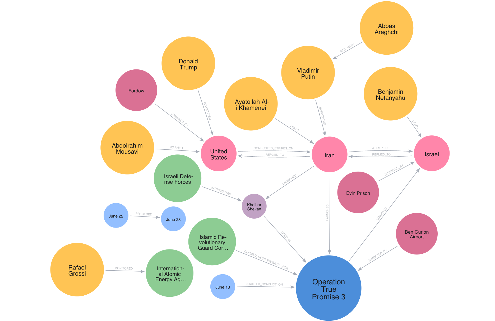

# Conflict
## Iran Attacks on Israel
### Impact on Civilians and Infrastructure
- *14500* ['I was lying in bed... The ceiling fell in': At the scene of Israeli hospital hit by Iran strike](https://www.bbc.com/news/articles/c4gel0dd5y9o) *bbc-me*
- *14501* [Israeli hospital hit by Iranian missile strike](https://www.bbc.com/news/articles/cj4edzy0vqeo) *bbc-me*
- *14633* [Missiles hit hospitals, homes and families: Inside Israel's terrifying Iranian bombardment](https://www.foxnews.com/world/missiles-hit-hospitals-homes-families-inside-israels-terrifying-iranian-bombardment) *fox-world*
```
14500,14501,14633
```
[mp3 summary](00-top100623.mp3)
Good evening. We come to you tonight with grave news from the Middle East, where the conflict between Israel and Iran has entered its seventh precarious day, marking a dangerous escalation that reverberates across the globe.

Our focus tonight turns to the devastating impact on civilian lives and infrastructure, particularly in Israel. The **Soroka Medical Center** in **Beersheba**, a crucial medical facility for Israel's entire **Negev region**, has been repeatedly struck by Iranian ballistic missiles. Witnesses like **Alon Uzi**, a patient receiving treatment, describe a harrowing scene of ceilings collapsing, thick dust, and the tang of chemicals in the air. Despite Iran's claims that it targeted a military site less than three kilometers away from the hospital, Israeli officials, including Defense Minister **Israel Katz** and Prime Minister **Benjamin Netanyahu**, have unequivocally accused Iran's supreme leader, **Ayatollah Ali Khamenei**, of deliberately targeting civilians and committing "war crimes of the most serious kind." The damage to Soroka is extensive; its northern surgical building was hit, several wards demolished, and its director, Professor **Shlomi Codish**, states that over 200 patients are being transferred to other medical centers.

Beyond the hospitals, residential areas across central Israel have borne the brunt of these attacks. Cities like **Ramat Gan**, **Holon**, **Rishon LeZion**, **Petah Tikva**, and even the predominantly Arab town of **Tamra** have seen homes destroyed, lives uprooted, and families torn apart. We've heard the chilling account of **Ariel Levin-Waldman** and his family, who narrowly escaped death in **Rishon LeZion** when a missile struck their in-laws' home, burying them in rubble before they managed to claw their way out. **Lihi Griner**, a well-known figure, described the "huge boom" and shattered reality as her Petah Tikva apartment complex was hit. And the tragic story of **Jamal Waraki**, a Muslim volunteer with the ZAKA emergency service, who, after rescuing an 80-year-old man, returned home to find his own house destroyed. This indiscriminate violence, as articulated by Israeli Opposition Leader **Yair Lapid**, who saw his one-year-old granddaughter's bed covered in glass from an explosion, highlights a horrifying reality: these missiles make no distinction between men, women, children, or political affiliations. The latest casualty figures are stark: at least 24 Israelis have been killed and over 800 wounded, with some reports citing 271 injured in specific strikes. In Iran, the Human Rights Activists News Agency, HRANA, reports a staggering 639 killed since the conflict began on June 13th.

In response to what Israel terms a "criminal" assault, Israel's military has escalated its own operations, focusing intently on Iran's nuclear infrastructure. Israeli fighter jets have reportedly bombed targets in Iran, including the "inactive" **Arak heavy water reactor** and a nuclear development building in **Natanz**, along with dozens of missile sites and radar installations. Prime Minister **Netanyahu** has vowed that Israel will "exact the full price from the tyrants in Tehran," and ominously stated that "no one is immune," referring directly to **Ayatollah Khamenei**. His stated objective is clear: to "remove the nuclear threat" and the ballistic missile threat to Israel.

This escalating crisis has drawn the focused attention of the international community and the United States. US President **Donald Trump** is currently weighing the momentous decision of direct American involvement in Israel's campaign, demanding that Iran submit to an agreement ending its nuclear enrichment. The Pentagon has even briefed on "Operation Midnight Hammer," a complex mission involving over 125 planes and 14 "bunker buster" bombs, showcasing the scale of potential US intervention. However, Iran’s deputy foreign minister, **Kazem Gharibabadi**, has warned the US that Tehran will have "no other option but to use its tools to teach aggressors a lesson" if it intervenes.

International bodies have voiced deep concern. The UN's High Commissioner **Volker Türk** condemned the "appalling" treatment of civilians as "collateral damage" and warned against "inflammatory rhetoric," calling for "maximum restraint" and a return to "good faith negotiations." The International Committee of the Red Cross and the World Health Organization have both stressed that hospitals, health facilities, and personnel must be "respected and protected" under international law.

This war, now entering its second week, is precariously balanced on the edge of a much wider conflict. Both sides demonstrate a clear capacity and, seemingly, a willingness to escalate, whether by employing different weapons or choosing different targets. The world watches, holding its breath, as the Middle East stands on the precipice of an even greater catastrophe. We will continue to monitor this developing story.

Good night.

### Military Assessments
- *15071* [Iran’s Missile Campaign Exposes Collapse of Israel’s Civil Defense Infrastructure](https://tn.ai/3340925) *tasnim-news*
- *15149* [IDF spokesman: Despite reduction, Iranian attacks still not over](https://www.israelnationalnews.com/news/410518) *arutz-sheva*
- *15163* [IDF admits: Ballistic missile, not interceptor, struck Haifa](https://www.israelnationalnews.com/news/410504) *arutz-sheva*
```
15071,15149,15163
```
[mp3 summary](01-top100623.mp3)
Good evening. The strategic landscape across the Middle East remains tense, as recent developments underscore both the fierce intensity of ongoing conflicts and the profound internal challenges faced by Israel. Our reports this evening paint a complex picture of military operations, civilian vulnerability, and a palpable sense of internal disquiet.

Firstly, let us turn to the ongoing military engagements. The Israeli Defense Forces, through **IDF spokesman Effie Defrin**, confirmed the continuation of "Operation Rising Lion," a stated aim to dismantle the existential threats posed by Iran. Defrin reported that Israeli Air Force aircraft are intensifying strikes in the **Tehran** area, specifically targeting **IRGC headquarters** and other critical infrastructure. This marks the eleventh day of this offensive. Despite the precision of these strikes, the **IDF** cautions that aerial defense systems are "not hermetic," a crucial warning reiterated to the public. Indeed, as we reported earlier, a localized failure in the detection process led to a missile warhead falling in the city of **Haifa** without an alert during an Iranian barrage, causing injuries and property damage in **Haifa**, **Be'er Ya'akov**, **Ness Ziona**, and **Tel Aviv**. **Ichilov Hospital** confirmed treating several injured, including children. The **IDF** stated lessons have been learned, but the incident highlights the real-world impact of these sustained attacks.

Meanwhile, Iran, through what it terms its retaliatory "Operation True Promise III," continues its missile barrages. The intent, seemingly, is to test and overwhelm Israeli defenses.

And it is on the home front, beyond the immediate battlefields, where a more insidious crisis is unfolding. Our reporting reveals a deeply troubling situation regarding Israel's public shelter system. Despite decades of preparation for potential conflict, the system appears alarmingly unprepared for precise and heavy missile barrages.

The numbers are stark: **Tel Aviv’s Home Front Command** admitted that nearly 40% of the city’s population lacks access to standard shelters. A Knesset report indicates that over half of the 12,000 public shelters in the occupied territories are non-operational. Even more concerning are widespread reports of communal shelters being "occupied"—seized and converted into storerooms, workshops, or even rental apartments. Over 950 such cases have been officially recorded, with significant numbers in **Haifa**, **Tel Aviv**, and particularly in occupied **Jerusalem al-Quds**.

This phenomenon of "occupied shelters" reveals a bureaucratic paralysis and lack of enforcement, leaving hundreds of thousands exposed. Settlers like **Anna Olitzky** have documented instances of neighbors locking shared shelters, while **Alon Cohen** recounted his family hiding in their apartment during Iranian drone strikes. Legal experts, such as **Yossi Havilio**, confirm that municipalities often lack the authority to intervene without court orders, creating a significant legal bottleneck. The bitter sentiment is palpable: “They’ve prepared for a war with Iran for 20 years—couldn’t they at least ensure bomb shelters?”

This internal strife is further exacerbated by the proposed solution of deploying mobile shelters, which conspicuously exclude Arab areas, underscoring systemic racial discrimination within the regime. The situation exposes not only Israel’s unpreparedness for external threats but also its crumbling internal cohesion and the shattering of long-held illusions of security.

On the Gaza front, the **IDF** continues "Operation Gideon’s Chariots," with soldiers operating in **Jabaliya** and **Khan Yunis**, dismantling terrorist infrastructure and eliminating hundreds of combatants. But the focus of recent attention remains firmly on the escalating direct confrontation with Iran and the very real vulnerabilities it exposes within Israeli society.

The events of recent days illustrate a nation caught between a fierce external foe and a deeply fractured internal structure. How these dual challenges will be managed remains the critical question in the days and weeks ahead. We will continue to bring you the facts as they unfold. Good evening.



### Missile and Drone Barrages
- *14527* [Iran uses Kheibar Shekan ballistic missile for first time in attack on Israel — IRGC](https://tass.com/world/1978759) *tass*
- *14666* [Iran launches 35 missiles on Israel, causing widespread damage and injuries](https://www.egyptindependent.com/iran-launches-35-missiles-on-israel-causing-widespread-damage-and-injuries/) *egyptian-independant*
- *14815* [Missile launched from Iran, sirens in central Israel](https://www.israelnationalnews.com/news/410490) *arutz-sheva*
- *14900* [IRGC says June 23 attack on Israel longest since start of escalation](https://tass.com/world/1979241) *tass*
- *15053* [Iran fired 500 ballistic missiles towards Israel: media](https://en.mehrnews.com/news/233545/Iran-fired-500-ballistic-missiles-towards-Israel-media) *mehr-news*
- *15057* [IRGC launches fresh wave of airstrikes on Israel](https://en.mehrnews.com/news/233542/IRGC-launches-fresh-wave-of-airstrikes-on-Israel) *mehr-news*
- *15068* [Iran launches another wave of airstrikes on Israel](https://en.mehrnews.com/live/233533/Iran-launches-another-wave-of-airstrikes-on-Israel) *mehr-news*
- *15072* [Iran Launches Multiwarhead Kheibar Missiles at Israeli Regime](https://tn.ai/3340913) *tasnim-news*
- *15081* [Iran Launches New Wave of Strikes on Occupied Territories](https://tn.ai/3340769) *tasnim-news*
- *15082* [Israeli Targets Attacked by Iranian Army Drones](https://tn.ai/3340732) *tasnim-news*
- *15092* [Iran launches missiles and drones at Israel following U.S. strikes on its nuclear targets](https://www.cbc.ca/news/world/us-israel-iran-nuclear-sites-1.7568265?cmp=rss) *cbc-top*
- *15162* [Missiles land in 5 sites | Half hour of sirens: 10 missiles in 4 barrages](https://www.israelnationalnews.com/news/410507) *arutz-sheva*
```
14527,14666,14815,14900,15053,15057,15068,15072,15081,15082,15092,15162
```
[mp3 summary](02-top100623.mp3)
Good evening. We come to you tonight with grave news from the Middle East, where the conflict between Iran and Israel has escalated dramatically, drawing in the United States and sending ripples of concern across the globe.

For days now, the world has watched as Iran unleashes what it calls 'Operation True Promise III,' a series of retaliatory strikes initiated, according to Tehran, in response to an unprovoked Israeli aggression earlier this month that targeted Iranian nuclear, military, and civilian sites, leading to significant casualties. We've seen an unprecedented barrage: reports suggest over 500 ballistic missiles and more than a thousand drones have been launched since this conflict began. This morning alone, the elite Islamic Revolutionary Guard Corps, or IRGC, declared its 21st wave of attacks, utilizing advanced solid and liquid fuel ballistic missiles, including the multi-warhead Kheibar Shekan, Emad, Qadr, and Fattah-1, all designed for maximum impact.

From Tel Aviv to Haifa, from Ness Ziona to Ashdod, and across northern, central, and southern Israel, cities have experienced widespread devastation. Eyewitnesses describe scenes of profound destruction, demolished buildings, and cars marred by shrapnel. Rescue teams have rushed to evacuate the injured, with Yedioth Ahronoth reporting at least 23 individuals transported to hospitals. The alarm sirens, Israelis report, have triggered the longest-running fear and panic since this conflict began. Indeed, we've learned that members of the Israeli Knesset themselves were forced to flee to shelters as rockets impacted industrial areas, a power plant in Ashdod, and even near an Israeli military base in Western Galilee. This relentless assault has led to significant displacement, with some 15,000 settlers reportedly fleeing their homes and tens of thousands of compensation claims being filed for property damage. Iran's IRGC has been explicit in its objective, stating that these efficiency-oriented operations will continue unabated, with the ultimate goal, they say, of the 'complete elimination of the Zionist regime.'

But the most significant development, perhaps, has been the direct intervention of the United States. In a stunning move over the weekend, American forces conducted precision strikes on critical Iranian nuclear facilities—Fordow, Natanz, and Isfahan—using powerful bunker-buster bombs. While President Donald Trump declared these attacks 'highly successful' on his "Truth Social" account, Iranian state television reported only superficial damage, denying the complete destruction claimed by Washington. The head of the UN's International Atomic Energy Agency, Rafael Grossi, however, stated he expected "very significant damage." Tehran has vehemently condemned these strikes, calling them a violation of its sovereignty, tantamount to an invasion, and a crossing of 'a very big red line.' Iran's military leadership, through General Abdolrahim Mousavi, has since warned that the United States has given its forces a 'free hand' to attack American targets. Nevertheless, we have also seen the practical effects of American involvement in defense, with a U.S. air defense system successfully intercepting an Iranian missile targeting Israel just yesterday morning. Separately, Israeli air forces have launched raids on Hezbollah targets in southern Lebanon and intercepted drones from Iran in Wadi Araba.

The international community is now grappling with the full implications of this dangerous escalation. Calls for de-escalation and a return to diplomacy have intensified from global leaders, including Prime Minister Mark Carney, who spoke with President Trump. Fears are mounting over the potential for this conflict to spill over and engulf the wider Middle East, with particular concern regarding Iran's renewed threats to close the crucial Strait of Hormuz, a vital artery for global oil transport. Russia has unequivocally condemned the U.S. strikes, with President Vladimir Putin offering support to Iran, while China has urged all parties, especially Israel, to immediately cease fire. The White House has stated its focus remains on Iran's nuclear capabilities, not regime change, though President Trump's social media posts have sown some confusion on that front. As for Israel, Prime Minister Benjamin Netanyahu says his nation is "very close to achieving our goals" in neutralizing Iran's nuclear and missile threats. Yet, the situation remains fluid, highly volatile, and deeply concerning.

We will continue to monitor these developments closely. For [Your News Network], I'm [Your Name]. Good night.

## Iran's Defense Capabilities
### Military Assets and Actions
- *14674* [Iran destroys Israeli Hermes drone](https://en.mehrnews.com/news/233524/Iran-destroys-another-Israeli-Hermes-drone) *mehr-news*
- *14680* [Wreckage of destroyed Israeli drones in Iran](https://en.mehrnews.com/photo/233518/Wreckage-of-destroyed-Israeli-drones-in-Iran) *mehr-news*
```
14674,14680
```
[mp3 summary](03-top100623.mp3)
Good evening. We come to you tonight with significant developments emanating from the Middle East, specifically reports from Iran concerning its airspace and alleged foreign incursions.

According to reports from Iran's Mehr News Agency, Iranian air defense systems have successfully intercepted and destroyed multiple Israeli drones within Iranian territory over the past 24 hours.

In one such incident, announced this morning, an Israeli Hermes drone was reportedly shot down by air defense units developed by the Islamic Revolution Guard Corps, or IRGC, in Iran's Markazi Province. Iranian officials stated the drone was intercepted and destroyed before it could carry out any offensive operations, with further details promised to be released.

In a separate, yet equally significant report, Mehr News also indicated that four advanced Israeli drones were shot down in the Shiraz region, located in Iran's Fars Province. These interceptions were attributed to the efforts of what were described as "capable armed forces" operating in the area.

Now, let's analyze the major themes emerging from these reports.

First, these incidents, if confirmed, underscore a perceived escalation in the ongoing, often undeclared, "shadow war" between Iran and Israel. The alleged presence of Israeli reconnaissance or strike drones deep within Iranian airspace suggests a heightened level of intelligence gathering or, potentially, a precursor to offensive action by one side against the other.

Second, the reports highlight what Iran is portraying as its growing air defense capabilities. The specific mention of the IRGC's role in developing the systems that reportedly downed the Hermes drone in Markazi Province serves to project an image of robust and effective indigenous military technology, capable of protecting Iranian sovereignty against advanced foreign threats. The successful downing of four additional drones in Fars Province further reinforces this narrative of defensive prowess.

Third, the geographic spread of these alleged incursions – from Markazi in the central west to Fars in the south – suggests a broader pattern of alleged Israeli drone activity across various regions of Iran. This could imply a concerted intelligence collection effort or probing of Iranian defenses.

Finally, these announcements from state-run media in Iran also serve a clear domestic and international purpose: to bolster national morale, demonstrate military readiness, and send a stern message to adversaries regarding Iran's determination to defend its borders. They frame Iran as a victim of foreign aggression while simultaneously showcasing its ability to retaliate.

The situation remains fluid and highly sensitive, indicative of the persistent tensions simmering beneath the surface in the Middle East. We will continue to monitor these developments closely.

### Missile Capabilities
- *15059* [What do you know about Iran's Sejil ballistic missile?](https://en.mehrnews.com/news/233539/What-do-you-know-about-Iran-s-Sejil-ballistic-missile) *mehr-news*
```
15059
```
[mp3 summary](04-top100623.mp3)
Good evening. We report tonight on a significant development out of the Middle East, one that casts a stark light on the evolving military landscape of the region.

Our focus is on Iran's Sejil ballistic missile, a weapon the Islamic Republic proudly touts as a cornerstone of its defense capabilities. Recent reports highlight the alleged use of this ultra-heavy, long-range missile in what Iran terms the "True Promise 3 operation" against the Israeli regime.

The Sejil, described as one of the fastest ballistic missiles in Iran's arsenal, is presented not just as an advanced piece of military hardware, but as a symbol of Iran's growing missile prowess on the global stage. Its key features are particularly noteworthy: it is a solid-fuel missile, a characteristic that dramatically reduces its launch time and significantly increases its operational speed. With a reported range capable of reaching Tel Aviv in a mere seven to ten minutes from Iranian territory, its strategic implications are profound. Military experts, including some from Israel, concede that its high speed and solid-fuel propulsion make it exceptionally challenging for existing anti-missile systems to intercept.

This missile, particularly the optimized Sejil-2 variant, is characterized by Tehran as a "first option" in responding to what it perceives as Israeli aggression. Indeed, a 2017 report by National Interest even labeled the Sejil as a "turning point" in Iran's missile industry, underscoring Iran's commitment to upgrading its defense capabilities and positioning itself at the cutting edge of ballistic missile technology. It was considered Iran's most advanced missile before the unveiling of the Khorramshahr.

This narrative brings several major themes into sharp focus:

Firstly, **the undeniable progression of Iranian military capability and its stated intent for deterrence.** The emphasis on the Sejil's advanced features and its role as a symbol underscores Iran's strategic ambition to project power and deter potential adversaries.

Secondly, we see the deepening of **regional tensions and the ever-present specter of retaliation.** The explicit linking of the Sejil to the "True Promise 3 operation" and its designation as a primary response option against Israeli actions highlights the volatile nature of Middle Eastern geopolitics and the hair-trigger readiness for military escalation.

Thirdly, the story underscores a significant stride in **technological advancement** within Iran's defense sector. The transition to solid-fuel missiles and the continuous optimization, as seen from Sejil-1 to Sejil-2, indicates a sophisticated and persistent effort to innovate in missile design and performance.

Finally, and critically, there is the emerging challenge to **missile defense systems.** The article clearly positions the Sejil as a weapon designed to bypass or overwhelm current defensive capabilities, particularly those of Israel. If proven, this could fundamentally alter the strategic calculus in any potential conflict, placing greater pressure on defensive technologies and potentially shifting the balance of power.

The Sejil missile, therefore, is more than just an weapon; it is a declaration of evolving capabilities and a potent symbol in the ongoing geopolitical chess match of the Middle East, drawing considerable global attention to Iran's military ambitions.

That's our report for tonight. Good evening.

## Israeli Military
### General Updates
- *14834* [600 Operations Each Night: IDF Central Command chief reveals war progress](https://www.israelnationalnews.com/news/410472) *arutz-sheva*
```
14834
```
[mp3 summary](05-top100623.mp3)
Good evening. Tonight, we bring you an insightful look into the ongoing security realities in Israel, specifically from the critical Samaria region. A recent high-level meeting there underscores the multifaceted challenges and the unified response by both military and civilian leadership.

Commander of Central Command, Avi Blith, joined Samaria governor Yossi Dagan for a crucial situation assessment. What emerged from this dialogue was a clear picture of determined collaboration and resilience in the face of persistent threats.

One of the central themes highlighted by both General Blith and Governor Dagan was the profound **partnership between the Israel Defense Forces and the civilian population**. Governor Dagan explicitly conveyed the sentiment that "We in Samaria operate together with all of Israel in an emergency routine," and stressed that the "IDF and the public were partners in the war." This deep trust and cooperation, he added, is "felt on the ground." General Blith, in turn, affirmed this close contact, stating, "We are in close contact with the council and will continue to work together to maintain residents' security."

The discussion also laid bare the **diverse security challenges** facing the region. These range from the immediate dangers of missile debris and interceptor parts falling within their communities, to the broader, national threat of missiles from Iran. Beyond these, the ever-present shadow of terrorism remains a primary concern, driving continuous IDF operations. Governor Dagan also brought attention to critical civilian infrastructure needs, emphasizing the challenge of "obtaining funding for the mobile home neighborhoods and unprotected sites in many communities."

From the military perspective, Commander Blith detailed the robust and aggressive posture of the Central Command under **Operation Rising Lion**. He outlined how the command continues to move "with force in defense and offense," having reinforced garrisons, the Home Front Command, and the security barrier. In a historically significant move, a new **Gilad division** has been established, specifically tasked with operating against the eastern border. Blith revealed that "every night hundreds of offensive actions take place across the Central Command," with units like the Nahal Brigade conducting operations in terror hotspots, including villages in the Sha-Nur Valley. Importantly, he clarified that the IDF's preparedness extends beyond just counter-terrorism; the Home Front Command battalion in the region is ready for a wider array of "emergency scenarios, missile strikes, and handling collapsed buildings if necessary."

Finally, the meeting underscored the **resilience and significant contribution of the Samaria residents** themselves. Governor Dagan proudly stated that the region boasts "some of the highest recruitment percentages in the country," reflecting a deep national commitment. He described a mobilized community actively assisting soldiers and their families, tirelessly working to "strengthen our national resilience by giving power to the people of Israel." Dagan's message was unequivocal: "Israel's settlement is strong. We strengthen and support the IDF and together we overcome the challenges."

In essence, the dialogue between Commander Blith and Governor Dagan painted a picture of a region facing complex security threats with unwavering resolve. It highlights not just the military's robust efforts, but the indispensable role of a unified, supportive civilian populace in fortifying national security and resilience. The challenges are real, but so too is the determination to meet them head-on.

## Israeli Strikes on Iran
### Impact Assessment
- *15047* [Renewed enemy attack on Fordow nuclear site poses no threat](https://en.mehrnews.com/news/233552/Renewed-enemy-attack-on-Fordow-nuclear-site-poses-no-threat) *mehr-news*
```
15047
```
[mp3 summary](06-top100623.mp3)
Good evening. We come to you tonight with grave news from the Middle East, as tensions between the United States, its ally Israel, and Iran appear to have escalated dramatically. Reports out of Tehran indicate a series of direct attacks on what Iran maintains are its peaceful nuclear facilities, prompting international outcry and strong warnings from the Islamic Republic.

According to Iran's Mehr News Agency, the United States, in coordination with the Israeli regime, launched strikes on at least three Iranian nuclear sites: Fordow, Natanz, and Isfahan. This initial wave of attacks reportedly occurred on Sunday morning. Adding to the tension, Morteza Heydari, a spokesperson for the crisis management department in Iran's central Qom province, stated Monday that the Fordow site was targeted once again, although he did not specify whether this subsequent aggression originated from Israel or the United States.

Tehran has swiftly condemned these actions, asserting that the attacks constitute a flagrant violation of international law and the United Nations Charter. Iranian officials, including Foreign Minister Abbas Araqchi, have emphasized that the Islamic Republic considers these strikes an act of aggression against its sovereignty and reserves all options to defend itself and its people. While officials from Iran's Atomic Energy Organization have sought to reassure citizens that there is no danger or threat from these incidents, the narrative from Tehran is one of righteous indignation and a clear intent to respond.

The major themes emerging from this alarming development are stark. Firstly, we are witnessing a significant **escalation of hostilities** in an already volatile region. Direct military actions against nuclear infrastructure, regardless of their claimed purpose, are an extremely dangerous precedent. Secondly, these incidents underscore the persistent international concern over **Iran's nuclear program**, even as Tehran insists its sites are for peaceful purposes. Thirdly, Iran's immediate invocation of **international law and its right to self-defense** lays the groundwork for potential retaliation, raising the specter of broader conflict. And finally, the explicit mention of **U.S.-Israeli coordination** highlights a unified strategic front against Iran, further complicating the geopolitical landscape.

The international community is reportedly condemning these actions, recognizing the perilous path they represent. We will continue to monitor this developing situation closely, providing updates as they become available. For now, the world watches to see how Iran will choose to exercise its stated right to respond, and what the ultimate consequences of these audacious attacks will be for stability in the Middle East and beyond. We will return after this brief break.

### Legality and Implications
- *15065* [Israeli strike on Iran's nuclear sites 'dangerous precedent'](https://en.mehrnews.com/news/233534/Israeli-strike-on-Iran-s-nuclear-sites-dangerous-precedent) *mehr-news*
```
15065
```
[mp3 summary](07-top100623.mp3)
Good evening. We come to you tonight with grave news from the Middle East, where tensions have escalated dramatically following a series of military actions targeting Iran's nuclear facilities. These developments have drawn sharp condemnations from the international community and raise serious questions about regional stability.

In a significant and alarming development, Israeli forces launched attacks on several Iranian nuclear facilities. According to reports from the International Atomic Energy Agency, or IAEA, these strikes caused damage to the main buildings currently under construction at Iran’s Khondab Heavy Water Research Reactor. Fortunately, the IAEA has indicated that no nuclear materials were present at the site at the time of the attacks, mitigating the immediate risk of radiation.

The international response has been swift and critical. Fu Cong, China’s Permanent Representative to the United Nations, speaking before the UN Security Council, strongly condemned the Israeli actions, describing them as a "dangerous precedent." He issued an urgent call for Israel to declare an immediate ceasefire, warning of "serious consequences" should the situation be allowed to escalate further. Mr. Fu emphasized China's long-held position that nuclear issues must be resolved through peaceful dialogue and negotiation, a sentiment echoed by Views Bangladesh.

Adding to the chorus of international concern, Saudi Arabia, through its Nuclear and Radiological Regulatory Commission, sharply criticized the attacks, labeling them a clear violation of international law.

Yet, even as these diplomatic condemnations were voiced, the situation took an even more perilous turn. Just two days after China's envoy made his remarks, the United States launched its own attacks on three nuclear facilities within Iran. This latest action represents a profound escalation, one that many fear could indeed push the region toward an "unimaginable crisis," as China had warned.

The major themes emerging from this rapidly unfolding crisis are stark and deeply concerning. Firstly, we are witnessing a perilous **escalation of conflict** in the Middle East. The direct targeting of nuclear infrastructure by both Israel and now the United States marks a dangerous new chapter, moving beyond proxy conflicts to direct engagement with high-value strategic sites.

Secondly, the attacks underscore profound concerns regarding **nuclear security and proliferation**. While no radiation leakage has been reported thus far, the very act of military strikes on nuclear facilities, regardless of their operational status, opens a dangerous precedent and highlights the inherent risks in a region already fraught with geopolitical tensions.

Thirdly, the concept of **international law and state sovereignty** is front and center. The condemnations from Saudi Arabia and China directly challenge the legality of these strikes, placing them firmly within the realm of violations against established international norms and the sovereignty of nations.

Finally, and perhaps most critically, the events illuminate the immense challenge to **regional stability**. The current trajectory, as China's envoy articulated, is one that threatens to destabilize an already volatile region, with the potential for widespread and catastrophic consequences. The stark contrast between calls for dialogue and the resort to military force underlines the deep divisions and the growing chasm between diplomatic solutions and armed intervention.

We will continue to monitor this developing situation closely, as the international community grapples with the implications of these actions and the path forward for peace and stability in the Middle East. Good night.

### Operational Details
- *14630* [Israeli pilot and navigator reveal inside story of unprecedented strikes against Iran’s ‘existential threat’](https://www.foxnews.com/world/israeli-pilot-navigator-reveal-inside-story-unprecedented-strikes-against-irans-existential-threat) *fox-world*
- *14829* [Report: Israel struck Iranian defenses ahead of US Fordow strike](https://www.israelnationalnews.com/news/410477) *arutz-sheva*
```
14630,14829
```
[mp3 summary](08-top100623.mp3)
Good evening. We come to you tonight with a developing and highly significant situation in the Middle East, as new details emerge regarding the extensive military operations targeting Iran. These reports paint a vivid picture of a concerted effort, both unilateral and cooperative, aimed at neutralizing what is perceived as an escalating threat.

Our reporting, including an exclusive from Fox News Digital, sheds light on the Israeli Air Force’s remarkable campaign. We've learned that Israeli pilots, including a female combat flight navigator and a pilot whose identities are being withheld for security reasons, have been in the skies, carrying out what they describe as vital missions for Israel’s security and the wider effort to confront the Iranian regime's global threat.

This operation, they explain, began with a massive preemptive strike, triggered by Israeli intelligence assessments that Iran’s growing missile deployments and advancing nuclear program posed an immediate danger. The Israeli Air Force quickly achieved complete air superiority, allowing its jets to strike over 1,000 high-value targets deep within Iran. These targets included critical infrastructure: the Natanz uranium enrichment site, long-range missile depots near Hamedan, drone production and command centers in Shiraz, the IRGC headquarters in Tehran, and sophisticated Russian-made air defense systems, specifically the S-300 and S-400 batteries.

The Israeli pilot, speaking from an undisclosed base, emphasized the profound personal and strategic stakes, stating, "Israel is now fighting the fight of the Western world and Western civilization, taking out the head of the snake and dealing with a threat that’s been imminent for the whole world." Both the pilot and the navigator underscored their patriotic commitment, viewing their actions as directly protecting the State of Israel and its citizens from what they described as Iran’s open threats of destruction.

But the picture of these operations is even more intricate. A report from Axios reveals a significant, though previously undisclosed, layer of cooperation between the United States and Israel. According to American and Israeli officials, the Israeli Air Force conducted multiple strikes against Iranian air defense systems in southern Iran in the two days leading up to the US military's strike on Iran's Fordow nuclear facility. This unprecedented joint effort was initiated at the behest of the Trump administration.

Prime Minister Benjamin Netanyahu reportedly responded directly to President Donald Trump's request for assistance, leading to Israeli strikes that effectively cleared a path for US B-2 stealth bombers. These American bombers were tasked with targeting the heavily fortified Fordow facility using specialized bunker-buster munitions. Coordination was tight, with calls between Israeli officials, including Prime Minister Netanyahu and Defense Minister Israel Katz, and US officials, specifically Vice President JD Vance and Secretary of Defense Pete Hegseth, in the final stages of the operation.

Israeli officials indicated that while Israel had not pressed the U.S. to join the conflict directly, Iran's refusal to engage diplomatically left the U.S. with few alternatives. Following the successful operation, President Trump reportedly informed Prime Minister Netanyahu of his intention to pursue peace with Tehran, while also emphasizing a readiness to respond should Iran retaliate.

What emerges from these reports are several critical themes:

First, the **preemptive nature of military action**. Both Israel's broader campaign and its specific role in aiding the US strike on Fordow highlight a strategy of preemption, aiming to neutralize perceived threats before they materialize fully.

Second, the **depth of US-Israeli strategic cooperation**. The coordination detailed by Axios demonstrates an "unprecedented joint effort" at the highest levels, underscoring a shared assessment of the Iranian threat and a willingness to act in concert.

Third, the **dual scope of the conflict – national and global**. While Israel's airmen describe their mission as a fight for national survival against an "existential threat," they simultaneously frame it as defending "Western civilization" against a broader global danger posed by Iran.

Finally, the **fragile balance between military action and diplomatic intent**. Despite the extensive military operations, there is a clear stated desire by the United States to "close this round" and pursue peace with Tehran, even as the region holds its breath, uncertain of Iran’s next move.

These developments mark a critical juncture in the ongoing tensions in the Middle East, with profound implications for regional stability and international relations. We will continue to monitor the situation closely. Good night.

### Specific Targets and Actions
- *14502* [Israel strikes unfinished Arak heavy water reactor in Iran](https://www.bbc.com/news/articles/c8rpd6p7v0po) *bbc-me*
- *14511* [Israel attacks military targets concurrently in four areas in Iran — IDF](https://tass.com/world/1978805) *tass*
- *14679* [Israel strikes another ambulance in Iran, 3 killed](https://en.mehrnews.com/news/233519/Israel-strikes-another-ambulance-in-Iran-3-killed) *mehr-news*
- *14831* [IDF strikes surface-to-surface missile production site in northern Iran](https://www.israelnationalnews.com/news/410475) *arutz-sheva*
- *14888* [Israel strikes Tehran's Evin prison and Fordo access routes](https://www.bbc.com/news/articles/cp8621gnknjo) *bbc-me*
- *14902* [IDF attacks government targets in Tehran with 'unprecedented force' — Defense Ministry](https://tass.com/world/1979199) *tass*
- *14923* [Israeli Air Force attacks military sites western Iran - army](https://tass.com/world/1978921) *tass*
- *15051* [Israel regime attacks Tehran's Shahid Beheshti University](https://en.mehrnews.com/news/233547/Israel-regime-attacks-Tehran-s-Shahid-Beheshti-University) *mehr-news*
- *15116* [Israel strikes Iran's Evin prison in Tehran](https://www.dw.com/en/israel-strikes-iran-s-evin-prison-in-tehran/live-73001224?maca=en-rss-en-all-1573-rdf) *dw*
- *15150* [IDF targets key IRGC command centers in Tehran](https://www.israelnationalnews.com/news/410517) *arutz-sheva*
- *15151* [IDF strikes IRGC and internal security command centers in Tehran](https://www.israelnationalnews.com/news/410516) *arutz-sheva*
- *15154* [Unprecedented strikes against Iranian regime targets](https://www.israelnationalnews.com/news/410511) *arutz-sheva*
- *15164* [Overnight: IDF strikes six airports in Iran](https://www.israelnationalnews.com/news/410503) *arutz-sheva*
```
14502,14511,14679,14831,14888,14902,14923,15051,15116,15150,15151,15154,15164
```
[mp3 summary](09-top100623.mp3)
Good evening. We come to you tonight with a developing situation that has sent ripples of concern across the globe. The Middle East, long a crucible of geopolitical tension, has erupted into an open and direct conflict between two regional powers, Iran and Israel, with the United States now a direct participant. What began as an escalating series of aerial exchanges has rapidly intensified into a profound strategic confrontation, raising questions about the stability of the entire region and indeed, the world.

Our reports indicate that Israel has launched an unprecedented series of wide-ranging air strikes deep within Iranian territory. The primary focus of these operations, according to Israeli officials, has been to neutralize what they term an "existential threat" posed by Iran's nuclear program. Israeli jets have relentlessly targeted key nuclear facilities. We've seen strikes on the **Arak heavy water reactor**, where the Israeli military claims to have hit the core seal to prevent its use for "nuclear weapons development." Satellite imagery has confirmed significant damage to the reactor building's roof and adjacent heavy water production plant distillation towers.

Further strikes have crippled the **Natanz** uranium enrichment plant, destroying its above-ground Pilot Fuel Enrichment Plant and damaging crucial electricity infrastructure, with indications of impacts on underground enrichment halls. The **International Atomic Energy Agency**, or **IAEA**, through its Director General **Rafael Grossi**, has acknowledged severe damage, if not destruction, to centrifuges at Natanz. The **Isfahan Nuclear Technology Centre** also suffered direct hits, with four buildings destroyed.

Most significantly, the strategically vital **Fordo** underground enrichment plant, long considered impervious, has come under assault. Reports confirm that U.S. aircraft, under the direct order of President **Donald Trump**, dropped formidable "bunker-busting bombs" on the facility. This marks a dramatic escalation, as the United States moves from a supportive role to direct military action against Iranian nuclear sites. President Trump has stated his belief that "monumental damage" was done, suggesting a "complete obliteration" of underground structures.

Beyond the nuclear sites, the scope of Israeli strikes has been sweeping, revealing a multi-pronged strategy to degrade Iran's military capabilities and potentially undermine the regime's control. Israeli Air Force fighter jets, often operating at distances of up to 2,300 kilometers, have struck numerous military targets. This includes **missile launchers** and **drone** infrastructure across four key areas: **Isfahan**, **Bushehr**, **Ahvaz**, and **Yazd**. The **"Imam Hussein" Strategic Missile Command Center** in Yazd, responsible for launching **Khorramshahr missiles** toward Israel, was hit, as was an IRGC surface-to-surface missile engine production site in **Shahroud**.

In a move that signals an intent to destabilize the Iranian regime directly, Israeli forces have also targeted what they describe as "regime targets and agencies of government repression" in the heart of **Tehran**. This includes the notorious **Evin prison**, known for holding political detainees, where CCTV footage showed an explosion at one of its gates. Strikes also hit the headquarters of the **Basij**, a central armed base of power for the **IRGC**, and the **Alborz Corps**, responsible for Tehran's security, along with the General Intelligence Directorate and General Security Police of the Internal Security Forces. Defense Minister **Israel Katz** has vowed that these strikes will persist with "unwavering resolve" until all military objectives are accomplished, holding the Iranian regime "accountable for every shot fired at Israeli territory."

The human cost of this conflict is tragically mounting. Iranian health ministry figures suggest at least 500 people have been killed, with some human rights groups putting the unofficial death toll closer to 950. In one particularly disturbing incident, a drone strike in **Najafabad** tragically hit an ambulance, killing the driver, a patient, and their companion – an act Iranian officials have condemned as "inhumane."

Iran has not stood idly by. In retaliation for the Israeli air strikes, Tehran has launched hundreds of ballistic missiles at Israel, resulting in the deaths of at least 24 people, according to the Israeli Prime Minister's office. One such missile struck an industrial area in the coastal city of **Ashdod**, causing power disruptions. Furthermore, Iran has threatened to close the **Strait of Hormuz**, a vital global oil transit point, a move that could trigger severe international economic consequences.

The international community watches with bated breath. While countries like Australia have urged de-escalation, they also support actions to prevent Iran from obtaining nuclear weapons. However, the direct U.S. involvement has ignited a geopolitical firestorm. Iran's Foreign Minister **Abbas Araghchi** has declared Israel has "crossed a new red line in international law," while Iran's UN Ambassador **Amir Saeid Iravani** told the UN Security Council that the U.S. chose to "destroy diplomacy." Iran's allies, including Russia, China, and North Korea, have condemned the U.S. actions, with North Korea calling them a violation of Iranian sovereignty.

Experts, such as Professor **Fawaz Gerges** of the London School of Economics, paint a grim picture, warning of a "massive, massive mess in the Gulf" and expressing little hope for diplomacy in the immediate future. The current trajectory suggests a deepening and broadening conflict, with unpredictable consequences for regional and global stability.

That's the latest on this critical developing story. We will continue to monitor the situation closely and bring you updates as they become available. Good night.

## Regional Conflict Dynamics
### Cyberattacks
- *14699* [Anti-Israeli hacktivist group paralyzes Israeli military ind.](https://en.mehrnews.com/news/233500/Anti-Israeli-hacktivist-group-paralyzes-Israeli-military-ind) *mehr-news*
- *14700* [Anti-Israeli Hacktivist Group Cripples Israeli Military Industry in Major Cyberattack](https://tn.ai/3340338) *tasnim-news*
- *15073* [Anti-Israeli Hacker Group Disables Key Israeli Military Contractor](https://tn.ai/3340898) *tasnim-news*
```
14699,14700,15073
```
[mp3 summary](10-top100623.mp3)
Good evening. We come to you tonight with a significant development from the realm of cyber warfare, a domain increasingly critical in geopolitical tensions. Reports emerging from Tehran describe a series of sophisticated cyber operations targeting the very heart of Israel's military-industrial complex, actions claimed by an anti-Israeli hacktivist group known as "CyberIsnaadFront."

According to statements released by CyberIsnaadFront itself, a vast segment of Israel's security and military industrial infrastructure has been infiltrated, with advanced cyber tools reportedly contaminating key systems. The group asserts that this has led to widespread malfunctioning of Israeli military products, specifically those manufactured by companies integral to the nation's defense apparatus.

The most notable claim involves RAFAEL, a prominent Israeli arms producer operating directly under the Ministry of War. CyberIsnaadFront states that a critical disruption occurred within RAFAEL's systems, with failures reportedly surfacing after components from CR Casting / EXACT were deployed. This, the group claims, has led to user-reported failures in several deployed military products, causing what they describe as "operational setbacks" for Israel's armed forces. RAFAEL, as many know, plays a central role in supplying arms for Israel's regional operations.

But the campaign, as described by CyberIsnaadFront, extends beyond mere disruption. In a more recent operation, the group announced a successful cyber assault against BenSimon Aluminum Industries. This company, directly contracted by the Israeli military and Ministry of War, is identified as a key player in the design and construction of high-security infrastructure, including underground military tunnels and facilities linked to Unit 8200, Israel's cyber-intelligence division. The attack on BenSimon reportedly shut down all operational systems, extracted sensitive data, and subsequently destroyed the original data to prevent recovery. Crucially, CyberIsnaadFront claims that all retrieved intelligence was then transferred to "missile units within the axis of resistance" for further operational use – a concerning development pointing to intelligence-sharing with adversary groups.

These incidents, according to CyberIsnaadFront, are not isolated events but rather part of a broader, multi-phase campaign. The group emphasizes that this is a "sustained strategy" aimed at eroding what they term the "Zionist regime’s offensive capabilities across land, sea, and air." They reiterate, through their Telegram channel, that substantial portions of Israel's military-industrial infrastructure are now either compromised or rendered nonfunctional.

**From our analysis, several major themes emerge from these reports:**

Firstly, **the escalating role of cyber warfare as a strategic weapon.** These operations, if confirmed in their full scope, demonstrate how non-state actors can leverage digital tools to directly impact a nation's military readiness and industrial capacity. It underscores the new front lines in modern conflict.

Secondly, we see a **deliberate targeting of the military-industrial supply chain.** By focusing on major arms manufacturers like RAFAEL and critical infrastructure providers like BenSimon Aluminum Industries, CyberIsnaadFront appears to be aiming for systemic disruption, exploiting what they perceive as vulnerabilities in the supply chain, as highlighted by the CR Casting / EXACT component issue.

Thirdly, the operations highlight the **dual objective of disruption and intelligence gathering.** It's not just about shutting down systems; it's also about extracting sensitive information and potentially using it to bolster opposing forces, as claimed with the intelligence transfer to the "axis of resistance." This adds a critical dimension to the cyber threat landscape.

Finally, the stated ambition of the group is to **degrade Israel's regional military dominance.** CyberIsnaadFront consistently frames its actions as a "strategic blow" to Tel Aviv's "fading regional posture," suggesting a geopolitical objective beyond technical sabotage. This narrative aims to sow doubt about a nation's security posture and project the efficacy of cyber-enabled resistance.

Experts monitoring the situation suggest that if these claims hold true, the full impact of these cyber operations may continue to unfold in the coming weeks, potentially affecting various sectors, including missile and naval systems. This development underscores the profound and evolving challenges faced by nations in safeguarding their critical infrastructure and defense capabilities in an increasingly interconnected and volatile world.

We will continue to monitor these developments closely.

### Escalation and War Status
- *14493* [Watch: The US has joined the Iran-Israel war. What happens now?](https://www.bbc.com/news/videos/c5ypw09gdzpo) *bbc-world*
- *14600* [A 'terrible spiral of escalation': World braces for intensifying Iran-Israel conflict](https://www.cnbc.com/2025/06/19/world-braces-for-intensifying-iran-israel-conflict.html) *cnbc-politics*
- *14646* [US attacks Iran, thrusting Middle East war into total uncertainty](https://www.lemonde.fr/en/international/article/2025/06/22/us-attacks-iran-thrusting-middle-east-war-into-total-uncertainty_6742601_4.html) *lemonde*
- *14985* [How the Israel-Iran standoff took a turn and what's next after a pivotal 24 hours](https://www.cnbc.com/2025/06/23/how-the-israel-iran-standoff-took-a-turn-and-whats-next-after-a-pivotal-24-hours.html) *cnbc-top*
- *15038* [FM warns of ‘grave consequences’ from Israel-Iran escalation, urges diplomacy](https://www.egyptindependent.com/fm-warns-of-grave-consequences-from-israel-iran-escalation-urges-diplomacy/) *egyptian-independant*
- *15067* [US officially enters war, Iran vows: 'You will pay'](https://en.mehrnews.com/news/233527/US-officially-enters-war-Iran-vows-You-will-pay) *mehr-news*
```
14493,14600,14646,14985,15038,15067
```
[mp3 summary](11-top100623.mp3)
Good evening. In a dramatic and deeply unsettling turn of events, the Middle East now finds itself gripped by an unprecedented escalation, as the United States has directly entered the ongoing conflict between Israel and Iran. This pivotal moment has sent shockwaves across the globe, leaving leaders and markets on edge.

Late Saturday, under the direct order of President Donald Trump, American B-2 Spirit stealth bombers, supported by other assets, carried out a series of what the President described as "successful" bombing attacks on three critical Iranian nuclear sites: Fordo, Natanz, and Isfahan. President Trump, utilizing his Truth Social platform, declared these facilities had been "obliterated," stating "All the planes are now out of Iranian airspace" after dropping a "full payload of BOMBS," including powerful GBU-57 bunker-busters on the deeply buried Fordo site. Israeli Prime Minister Benjamin Netanyahu quickly expressed his gratitude, praising President Trump's "bold decision" and confirming that Israel, which initiated its own wave of strikes earlier in the month under "Operation Rising Lion," was in "full co-ordination" with the U.S. in planning these significant strikes. Israel has long asserted that Iran's nuclear capability posed a "clear and present danger."

However, Tehran offers a starkly different account. Iranian officials have confirmed the strikes but vehemently deny suffering a major blow, claiming vital equipment had been moved and deeply fortified sites remain largely intact. Iranian Foreign Minister Abbas Araghchi asserted that the U.S. strikes had "obliterated" diplomacy, not their nuclear facilities. This direct American intervention, following weeks of escalating missile barrages and retaliatory actions between Iran and Israel—which began with Israeli preemptive strikes on June 13th—is seen by Iran as Washington’s forced entry into a war designed to manufacture an Israeli "victory" after initial Israeli strikes failed to prevent Iranian retaliation. Iran's President Masoud Pezeshkian accused Washington of being the "actual instigator all along."

The international community's response has been swift and varied. Urgent calls for restraint from world leaders appear, for now, to be falling on deaf ears. From London, Prime Minister Keir Starmer chaired an emergency Cobra meeting as his government worked to evacuate British embassy staff families from Tel Aviv, while the G7 leaders reiterated their commitment to "peace and stability." Yet, controversial comments emerged from Europe, with German Chancellor Friedrich Merz stating Israel was doing the "dirty work" for other countries. In contrast, Russia and China, both allies of Iran, strongly condemned the U.S. attacks at the U.N. Security Council, calling for an immediate and unconditional ceasefire and accusing Israel's actions of violating international law. Russian Foreign Ministry spokesperson Maria Zakharova warned the world is "millimeters" away from nuclear catastrophe. Regional players, including Egypt and members of the Organization of Islamic Cooperation, have also voiced grave concerns about the "extremely dangerous consequences" of continued military escalation, urging diplomatic and political solutions.

Beyond the immediate conflict, this crisis directly impacts global economic stability. Iran's parliament has threatened to close the vital Strait of Hormuz, the world's most important oil transit chokepoint, through which a fifth of the world's oil passes. This threat alone has already caused oil prices to jump significantly, highlighting the potential for severe global economic disruption. While analysts believe the risk of closure remains low due to potential self-inflicted harm to Iran's own economy, the possibility looms large.

As for what happens next, the outlook remains profoundly uncertain. President Trump's own rhetoric has been ambiguous, oscillating between demands for Iran's "unconditional surrender" and hints at "Regime Change," juxtaposed with calls for "NOW IS THE TIME FOR PEACE!" and a "return to negotiations." However, Iran's Supreme Leader, Ayatollah Ali Khamenei, has warned any American attack would be met with "irreparable damage," with Iranian officials outlining potential responses ranging from attacks on U.S. bases in the region to a shift in its nuclear doctrine, or the aforementioned closure of the Strait of Hormuz. Iranian sources suggest they are prepared for a conflict that could last up to six months.

This dangerous escalation also casts a long shadow over the already dire humanitarian crisis in Gaza. Our reports indicate that the people of Gaza continue to suffer from forced starvation under an 11-week blockade, with urgent warnings from UN humanitarian chiefs that thousands of babies could die without immediate aid. This underscores the broader, interconnected instability plaguing the region, much of which stems from prolonged conflict.

The world watches with bated breath as the Middle East stands at the precipice of a potentially wider, devastating regional conflagration. The diplomatic path appears increasingly narrow, and the consequences of miscalculation are truly immense.

And that's the way it is, this evening.

### Israel-Hamas Conflict (Regional Context)
- *14504* [At least 12 Palestinians killed waiting for aid in Gaza, say medics](https://www.bbc.com/news/articles/c0ep17gyzrzo) *bbc-me*
- *14632* [Israel recovers remains of three more bodies held by Hamas: 'No victory until last hostage returns'](https://www.foxnews.com/world/israel-recovers-remains-three-more-bodies-held-hamas-no-victory-last-hostage-returns) *fox-world*
- *14634* [Former Hamas hostage Edan Alexander returns to a hero’s welcome in New Jersey](https://www.foxnews.com/world/former-hamas-hostage-edan-alexander-returns-heros-welcome-new-jersey) *fox-world*
- *14726* [Israel recovers remains of 3 more hostages, as refugee camp in Gaza struck](https://www.cbc.ca/news/world/israel-hamas-gaza-war-1.7568104?cmp=rss) *cbc-world*
```
14504,14632,14634,14726
```
[mp3 summary](12-top100623.mp3)
Good evening. We come to you tonight with an urgent report from a deeply troubled Middle East, where a complex and escalating crisis continues to unfold on multiple fronts. From the besieged Gaza Strip to the halls of international diplomacy, and now, to the very edge of a broader regional conflagration involving Iran, the headlines are heavy with human suffering and geopolitical tension.

Let us begin with the ongoing human toll, particularly concerning the Israeli hostages taken by Hamas on October 7th, 2023. This weekend, the **Israel Defense Forces**, or **IDF**, conducted a special operation in Gaza, recovering the remains of three more hostages: 71-year-old **Ofra Keidar**, 21-year-old **Yonatan Samerano**, and 19-year-old Staff Sergeant **Shay Levinson**. All three were tragically killed during that initial brutal attack. The **Hostages and Missing Families Forum Headquarters** expressed profound grief, acknowledging the bittersweet comfort of their return while underscoring the 625 days of agony and uncertainty for their families. **Ofra Keidar** was abducted from **Kibbutz Be’eri**, a dedicated worker whose husband was also murdered. **Yonatan Samerano** was captured after fleeing the **Nova music festival**, a young DJ whose life was cut short. And **Shay Levinson**, a brave IDF tank commander, fell in combat before his abduction, remembered for his ambition and his role in fostering Jewish-Arab cooperation through sports. These recoveries are a stark reminder of the immense cost of this conflict.

Yet, amidst the sorrow, there are moments of profound relief. This past week, **Edan Alexander**, an American-Israeli soldier held captive for over 580 days, returned home to a joyous and emotional welcome in his hometown of **Tenafly, New Jersey**. The 21-year-old’s release, described as a "goodwill gesture" following quiet negotiations involving U.S. officials, brought a wave of relief to a community that had prayed weekly for his return. His story is a poignant testament to the dedication of his community and the complex, painstaking efforts behind the scenes to secure freedom. However, Mr. Alexander's physical and emotional recovery is just beginning, a stark reminder of the unknown suffering endured by those in captivity. As of now, at least 50 hostages are still believed to be held by Hamas, with less than half of them thought to be alive.

Now, to the harrowing humanitarian situation within the Gaza Strip itself. We are seeing a deeply disturbing pattern emerge: tragic incidents around aid distribution sites. Reports from central Gaza indicate at least 12 Palestinians were killed by Israeli forces while waiting for aid near a site run by the U.S.- and Israeli-backed **Gaza Humanitarian Foundation (GHF)**. While the **GHF** denies any incidents near its location and the Israeli military states soldiers fired warning shots at "suspects," the grim reality is that hundreds of Palestinians have been killed in similar incidents since late May, with casualties increasingly linked to the perilous act of seeking aid rather than direct combat.

The controversy surrounding aid distribution continues to deepen. Hamas and the United Nations, along with other international aid groups, refuse to cooperate with the new **GHF** system, insisting that the UN and its agencies should be the sole distributors, citing critical principles of neutrality and impartiality. This comes as Gaza faces catastrophic levels of hunger following an extended Israeli blockade. Even with the partial easing of restrictions, the need remains overwhelming, though there is a glimmer of hope as **World Central Kitchen** has resumed distributing hot meals, a crucial lifeline for a population on the brink.

Finally, we must address the ominous escalation of regional tensions, centering on **Iran**. Following Israel's surprise attack on Iran last week, the United States has now entered the fray, reportedly bombing key Iranian nuclear sites overnight. This development casts a long shadow over the entire region. Israeli Prime Minister **Benjamin Netanyahu** himself stated that the campaign to return the hostages is continuing "alongside the campaign against Iran," underscoring the intertwining nature of these crises. However, this has also raised deep concerns among the **Hostages and Missing Families Forum**, who fear that the burgeoning conflict with Iran could push the fate of their loved ones to the back burner.

Hamas maintains its demands for a lasting ceasefire, the release of Palestinian prisoners, and an Israeli withdrawal from Gaza as preconditions for any hostage release. Prime Minister Netanyahu, conversely, has steadfastly rejected these terms, vowing to continue the war until Hamas is defeated and all hostages are returned. The efforts of the United States, Qatar, and Egypt to broker a new ceasefire and hostage release have made little discernible progress, leaving the region in a state of precarious uncertainty.

The situation remains fluid and deeply concerning, with the human cost tragically mounting on all sides. We will, of course, continue to follow these developments closely. Good night.

### Syria Conflict (Damascus Bombings)
- *14468* [Suicide bombing at Damascus church kills 22, Syrian authorities say](https://www.bbc.com/news/articles/c307n9p43z9o) *bbc-top*
- *14508* [At least 15 die after suicide bomber’s attack on Christina church in Damascus — TV](https://tass.com/emergencies/1978831) *tass*
- *14650* [At least 20 killed in suicide attack on Damascus church](https://www.lemonde.fr/en/international/article/2025/06/22/at-least-20-killed-in-suicide-attack-on-damascus-church_6742609_4.html) *lemonde*
- *14894* [Russia resolutely denounces 'heinous' terrorist attack on Damascus church — diplomat](https://tass.com/politics/1979285) *tass*
- *15022* [ISIS behind deadly church suicide bombing near Damascus, Syrian interior minister says](https://www.foxnews.com/world/isis-behind-deadly-church-suicide-bombing-near-damascus-syrian-interior-minister-says) *fox-world*
- *15037* [Suicide bomber attack church Syria kills at least 20 people](https://www.egyptindependent.com/suicide-bomber-attack-on-church-in-syria-kills-at-least-20-people/) *egyptian-independant*
```
14468,14508,14650,14894,15022,15037
```
[mp3 summary](13-top100623.mp3)
Good evening. We come to you tonight with grave news from Damascus, Syria, where a devastating terrorist attack has shattered a fragile peace and claimed dozens of innocent lives.

On Sunday evening, the Greek Orthodox Church of the Prophet Elias, also known as Mar Elias Church, in Damascus's al-Duwaila neighborhood, was struck by a horrific suicide bomb attack. As worshippers gathered for service, a man affiliated with the jihadist group Islamic State, or IS, opened fire before detonating an explosive vest. The scene inside the church was one of utter devastation: a heavily damaged altar, pews strewn with broken glass, and blood spattered across the walls.

According to Syria's health ministry, at least 22 people were killed in the assault, and 63 others wounded. Witness Lawrence Maamari recounted how "someone entered... carrying a weapon" and began shooting, with people attempting to stop him before he blew himself up. Another witness, Ziad, described hearing gunfire followed by an explosion that sent glass flying.

This grim event carries significant weight, marking the first such attack in Damascus since Islamist-led rebel forces successfully overthrew longtime ruler Bashar al-Assad in December, bringing an end to 13 years of devastating civil war. It is also the first attack on a church in the Syrian capital since that conflict erupted in 2011.

Several major themes emerge from this tragedy:

First, **the persistent and deadly threat of the Islamic State.** Despite its military defeat in 2019, the UN has consistently warned that the threat posed by IS and its affiliates remains high. Reports from earlier this year suggested the group might exploit Syria's transitional period to surge attacks and re-establish itself as a hub for recruiting foreign fighters. This attack tragically confirms that assessment, demonstrating IS's continued capacity for organized terror.

Second, **the profound challenges facing Syria's new interim authorities.** Interim President Ahmed al-Sharaa, whose group Hayat Tahrir al-Sham, or HTS, is a former al-Qaeda affiliate, had repeatedly promised to protect religious and ethnic minorities. Yet, this attack directly targets the Christian community, highlighting the immense security burden on the new government. Interior Minister Anas Khattab quickly condemned what he called a "reprehensible crime" and affirmed investigations are underway, emphasizing that "these terrorist acts will not stop the efforts of the Syrian state in achieving civil peace." However, the Greek Orthodox Patriarchate of Antioch directly called upon the interim authorities to "assume full responsibility... to ensure the protection of all citizens."

Third, **the acute vulnerability of religious minorities in a volatile region.** Christians have frequently been targeted by groups like IS in Syria. This attack underscores the continued sectarian tensions and the desperate need for genuine protection for all communities.

The international community was swift to condemn the assault. UN Special Envoy for Syria, Geir Pedersen, expressed "outrage at this heinous crime," urging Syrians "to unite in rejecting terrorism, extremism, incitement and the targeting of any community." US Special Envoy Tom Barrack echoed this sentiment, stating, "These terrible acts of cowardice have no place in the new tapestry of integrated tolerance and inclusion that Syrians are weaving." Russia, through its Foreign Ministry Spokeswoman Maria Zakharova, also offered its "resolute condemnation" and solidarity with the Syrian people. Nations from France to Jordan, Turkey, and a host of others across Europe and the Middle East, have all voiced their strong condemnations.

This attack serves as a stark reminder of the enduring struggle for stability and peace in Syria, a nation still grappling with the scars of war and the insidious threat of terrorism, even as it attempts to forge a new future.

We will continue to follow this story and bring you any new developments. Good night.

### Threats to US Forces and Bases
- *14524* [Houthi rebels to launch attacks on US forces in Red Sea — politburo member](https://tass.com/world/1978767) *tass*
- *14665* [Iran threatens US bases in Middle East, asserts nuclear facilities undamaged](https://www.egyptindependent.com/iran-threatens-us-bases-in-middle-east-asserts-nuclear-facilities-undamaged/) *egyptian-independant*
- *14933* [US learns of attacks plotted on its military bases in Iraq, Syria — NYT](https://tass.com/world/1978883) *tass*
- *15049* [US base in Syria comes under attack](https://en.mehrnews.com/news/233551/US-base-in-Syria-comes-under-attack) *mehr-news*
```
14524,14665,14933,15049
```
[mp3 summary](14-top100623.mp3)
Good evening. We come to you tonight with a developing and gravely serious situation unfolding across the Middle East, signaling a dramatic escalation of tensions in the region. Recent hours have seen a rapid succession of military actions and retaliatory strikes, plunging the area into heightened uncertainty.

Our top story tonight centers on a significant military operation conducted by the United States against Iranian nuclear facilities, followed swiftly by Iran's forceful retaliation.

In the early hours of this past Saturday, U.S. President Donald Trump announced that American forces had successfully executed what he termed a "highly successful attack" on three key Iranian nuclear sites: **Fordow, Natanz, and Isfahan**. President Trump confirmed that a "full payload of bombs" was released on the primary site, Fordow, and that all American aircraft involved were safely en route home. He lauded the operation as a testament to American military capability.

This strike followed days of intensifying pressure, including previous daily strikes by **Israel** on Iran since June 13th, reportedly targeting its missile and nuclear programs.

The Iranian response was swift and unequivocal. The **Revolutionary Guard Corps (IRGC)** vehemently condemned the American strikes, labeling them an "unprecedented crime" and an "illegal military assault." The IRGC stated they had identified the takeoff locations of the attacking aircraft and now had them under surveillance. They further warned that the "proliferation of American bases in the region increases their vulnerability," and asserted that Iranian nuclear technology could not be destroyed.

Iran’s Foreign Minister, **Abbas Araqchi**, speaking via X, formerly Twitter, declared that Iran reserves "all options to defend itself." He accused the United States, a permanent member of the **United Nations Security Council**, of committing a "grave violation" of the **United Nations Charter**, international law, and the **Nuclear Non-Proliferation Treaty**, or NPT, by attacking peaceful nuclear facilities.

In a powerful and immediate act of retaliation, Iran launched an intense assault of over 35 missiles targeting **Israel** early on Sunday morning. Eyewitnesses from **Tel Aviv** reported a terrifying scene of widespread destruction, with buildings demolished and extensive property damage. Rescue teams rushed to the affected sites, evacuating the injured, including settlers trapped under rubble. One eyewitness described the scene, saying, "Everything is dismantled, the area is experiencing vast devastation."

But the ripple effects of these actions extend beyond the immediate conflict between the U.S., Iran, and Israel. From **Dubai**, reports emerged from **Mohammed al-Bukhaiti**, a politburo member of the Yemen-based **Ansar Allah movement**, also known as the **Houthi rebels**. He declared that his movement would launch attacks on U.S. forces in the **Red Sea** in response to the American strikes on Iranian nuclear sites. Al-Bukhaiti, in an interview with Al Jazeera, warned, "Our military response is approaching: American forces in the Red Sea will be attacked at the first stage," vowing to "escalate and expand the scale of the conflict until this aggression stops."

Adding to the regional instability, the **New York Times** reported from **New York** that U.S. military and intelligence officers have detected signs that Iran-backed groups are preparing to attack U.S. bases in **Iraq** and, potentially, **Syria**. While Iraqi officials are reportedly working to dissuade militia action, these threats highlight the broader network of potential conflict. Indeed, a report from **Tehran** confirmed a mortar attack on an American military base in Syria, specifically in the western **Hasakah province**, signaling that some of these threats have already materialized.

In summary, the major themes emerging from these rapidly unfolding events are clear:

First, there is a profound and dangerous **escalation of direct military conflict** in the Middle East, moving beyond proxy conflicts to direct state-on-state engagements involving major global and regional powers.

Second, the **Iranian nuclear program** remains a central flashpoint, with the U.S. and its allies seemingly committed to hindering its progress, even through military means.

Third, the **United States has moved into direct military engagement** in the region, a significant shift with far-reaching consequences for its regional posture and alliances.

Finally, we are witnessing a **dangerous cycle of retaliation**, where each military action triggers a counter-response, broadening the scope of the conflict and drawing in a wider array of actors, from state militaries to non-state armed groups. The stability of the entire region now hangs in a precarious balance.

We will continue to monitor these developments closely as they unfold. Good night.

## US Strikes on Iran
### Confirmation and Initial Reports
- *14478* [The US Bombs Iranian Nuclear Sites](https://www.bbc.co.uk/sounds/play/p0lksb6f) *bbc-top*
- *14669* [US launches war against Iran: Trump announces strikes on three nuclear sites](https://www.egyptindependent.com/us-launches-war-against-iran-trump-announces-strikes-on-three-nuclear-sites/) *egyptian-independant*
- *14741* [What to know after US strikes on Iranian nuclear sites](https://www.dw.com/en/what-to-know-after-us-strikes-on-iranian-nuclear-sites/a-72999834?maca=en-rss-en-all-1573-rdf) *dw*
- *15003* [Trump to meet with security team after US carried out 'Operation Midnight Hammer' and more top headlines](https://www.foxnews.com/us/trump-meet-security-team-after-us-carried-out-operation-midnight-hammer-more-top-headlines) *fox-latest*
```
14478,14669,14741,15003
```
[mp3 summary](15-top100623.mp3)
Good evening. We bring you tonight a momentous development that has reshaped the geopolitical landscape of the Middle East, and indeed, the world. In the early hours of this Sunday morning, the United States, under the direct order of President Donald Trump, formally entered the escalating conflict between Israel and Iran. This intervention marks a critical and deeply concerning escalation, with potentially far-reaching and, as some warn, "everlasting consequences."

Our reports confirm that US forces carried out a series of precision strikes, dubbed "Operation Midnight Hammer," against three key Iranian nuclear enrichment facilities: Fordow, Natanz, and Isfahan. President Trump himself announced the attacks, declaring them a "highly successful" and "spectacular military success," asserting that Iran's "key nuclear enrichment facilities have been completely and totally obliterated." The Pentagon has since confirmed that seven B-2 Spirit bombers, flying non-stop from a US Air Force base in Missouri, delivered a full payload, including formidable 30,000-pound "bunker-busting" warheads – weaponry specifically designed to penetrate deep underground and believed to be crucial for targeting Iran's subterranean nuclear infrastructure.

Iran's immediate reaction was swift and unequivocal. Foreign Minister Abbas Araqchi, responding via X, condemned the attacks as a "grave violation of the United Nations Charter, international law, and the Nuclear Non-Proliferation Treaty," calling the events "outrageous" and warning of "permanent repercussions." Iran, he stated, "reserves all options to defend itself," emphasizing its right to self-defense under the UN Charter. Amidst this high tension, Iran's diplomats are reportedly planning urgent talks with ally Russia, and its parliament has approved a measure to close the vital Strait of Hormuz, a critical global shipping channel, though this awaits confirmation by its national security council.

This unfolding drama presents several major themes that demand our close attention.

Firstly, and most immediately, is the **profound escalation of the conflict**. The US intervention transforms what was an intense, albeit regional, conflict between Israel and Iran, into a broader, more unpredictable international crisis. The war itself began on June 13th with Israeli airstrikes on Iranian nuclear targets, following five rounds of US-Iran negotiations that ultimately failed to produce a new nuclear deal. Trump’s decision to commit US forces, coming after days of deliberation and amidst Israeli calls for support, stands in stark contrast to his past campaign promises of a more peaceful world, where success would be measured "not only by the battles we win, but also by the wars that we end, and perhaps most importantly, the wars we never get into." This pivot highlights a significant shift in American foreign policy in the Middle East.

Secondly, the enduring and central theme remains **Iran's nuclear ambitions and the specter of proliferation**. For years, global powers have voiced concerns over Iran's nuclear program, despite Tehran's persistent claims of its purely civilian nature. The 2015 nuclear deal, championed by former President Barack Obama, sought to curb Iran's enrichment activities in exchange for sanctions relief. However, President Trump withdrew the US from that agreement in his first term, leading to Iran's subsequent escalation of uranium enrichment, reportedly to 60% – far beyond civilian energy requirements and dangerously close to weapons-grade levels. While President Trump has proclaimed the obliteration of key sites, the full extent of the damage remains unverified. Concerns persist, with some analysts suggesting enriched uranium may have been moved, and the International Atomic Energy Agency, or IAEA, warning of the significant risk of radiation leakage from damaged enrichment sites, and gravely concerned about the potential for attack on the Bushehr nuclear reactor.

Thirdly, the **international reaction** has been a complex tapestry of praise, condemnation, and deep concern. Israel, predictably, has welcomed President Trump's decisive action. However, many regional governments, including Saudi Arabia, Bahrain, the United Arab Emirates, Egypt, Qatar, Pakistan, India, and Iraq, have expressed profound worry, collectively calling for de-escalation and a return to negotiations, fearing they too could be drawn into a wider conflict. Traditional US allies in Europe – Germany, France, the United Kingdom, and the European Union – have echoed these sentiments, urging diplomatic solutions. Unsurprisingly, US rivals and Iranian allies, China and Russia, have vehemently condemned the American strikes.

Finally, within the United States, President Trump's decision has ignited a **fierce domestic debate**. While many Republicans in Congress, including Senate Majority Leader John Thune and House Speaker Mike Johnson, have voiced support, others, notably Representatives Warren Davidson and Thomas Massie, have joined Democrats in condemning the administration for not seeking congressional approval for military action, branding it unconstitutional. Some Republican voices, such as Congresswoman Marjorie Taylor Greene, have even asserted that the Israel-Iran conflict is "not our fight." Conversely, some of Trump's critics have paradoxically lauded his decision to strike Iran's nuclear sites. The administration, for its part, maintains it "does not seek war" with Iran, nor does it aim for "regime change," despite prior rhetoric suggesting otherwise.

As we move forward, the immediate concerns revolve around the potential for further retaliatory strikes from Iran, the humanitarian risks of radiation leaks, and the rapidly narrowing path to a diplomatic resolution. In Israel, air raid sirens immediately followed news of the US attacks, prompting civilians to seek shelter, a chilling reminder of the proximity of danger. The US has issued stark warnings against Iranian retaliation, while simultaneously calling for a return to negotiations. However, Iran's declaration that its nuclear program will continue, combined with President Trump's ominous warning that there will be "either peace or there will be tragedy for Iran," underscores the perilous precipice upon which the Middle East now stands.

We will continue to monitor these developments closely. For CBS News, I'm [Your Name/Walter Cronkite]. Good night.

### Impact Assessment (Claims and Analysis)
- *14491* [Watch: How successful have the US strikes on Iran been?](https://www.bbc.com/news/videos/cq53l9dvggjo) *bbc-world*
- *14512* [US strikes push back Iran's nuclear program for years — JD Vance](https://tass.com/world/1978797) *tass*
- *14583* [Hegseth claims Iran's nuclear ambitions 'obliterated' after U.S. strikes](https://www.cnbc.com/2025/06/22/hegseth-iran-us-attack.html) *cnbc-top*
- *14615* [JD Vance says Iranian nuclear program 'substantially' set back after 'precise, surgical' US strikes](https://www.foxnews.com/politics/jd-vance-says-iranian-nuclear-program-substantially-set-back-after-precise-surgical-us-strikes) *fox-latest*
- *14628* [Satellite image shows Fordow nuclear facility after massive bomb strike](https://www.foxnews.com/world/satellite-image-shows-fordow-nuclear-facility-after-massive-bomb-strike) *fox-world*
- *14642* [Expert confident Iran's nuclear program is 'no longer' after massive US strike](https://www.foxnews.com/politics/expert-confident-irans-nuclear-program-no-longer-after-massive-us-strike) *fox-politics*
- *14896* [Aftermath of US strikes on Iranian nuclear sites has yet to be assessed — Kremlin](https://tass.com/politics/1979279) *tass*
- *14928* [Iran’s underground nuclear sites sustained most damage — Trump](https://tass.com/world/1978903) *tass*
- *14934* [Trump claims colossal damage to Iranian nuclear facilities](https://tass.com/world/1978881) *tass*
- *14986* [Trump calls 'obliteration' accurate description](https://www.cnbc.com/2025/06/23/donald-trump-calls-obliteration-an-accurate-description-of-damage-to-irans-nuclear-facilities.html) *cnbc-top*
```
14491,14512,14583,14615,14628,14642,14896,14928,14934,14986
```
[mp3 summary](16-top100623.mp3)
Good evening. I'm [Your Name], bringing you a crucial development from the volatile landscape of international affairs. In a dramatic escalation, the United States has launched a series of "massive precision strikes" against key Iranian nuclear facilities, a move President Donald Trump has hailed as taking "the 'bomb' right out of their hands."

This extraordinary operation, codenamed "Operation Midnight Hammer," unfolded overnight, targeting three of Iran's most sensitive nuclear sites: Fordow, Natanz, and Isfahan. According to Vice President J.D. Vance, the strikes were not aimed at regime change, but rather to "neutralize the threats to our national interest posed by the Iranian nuclear program and the collective self-defense of our troops and our ally Israel."

The sheer scale and sophistication of this military action are remarkable. General Dan Caine, Chairman of the Joint Chiefs of Staff, confirmed it was the "largest B-2 operational strike in US history," involving more than 125 aircraft, including stealth B-2 bombers. Reports detail the deployment of 14 GBU-57 Massive Ordnance Penetrators – the formidable "bunker busters," used operationally for the first time – along with 30 Tomahawk missiles launched from a U.S. Navy submarine. The precision, Vice President Vance noted, allowed these advanced munitions to strike targets as small as a washing machine, deep within hardened facilities.

Now, on to the major themes emerging from this monumental event.

Firstly, there is a **stark contrast in assessing the damage inflicted.** President Trump, speaking from the White House and on Truth Social, declared the sites "completely and totally obliterated," boasting of "monumental damage" and that "Obliteration is an accurate term!" Secretary of Defense Pete Hegseth echoed this, stating Iran's "nuclear ambitions have been obliterated." Vice President Vance asserted the program had been "substantially" set back, perhaps for "many, many years." Indeed, satellite images from Planet Labs PBC and Maxar appear to show structures at Fordow "obliterated."

However, General Dan Caine, while confirming "extremely severe damage and destruction" to all three sites, maintained a more cautious stance, emphasizing that "final battle damage will take some time" to assess the full extent. Experts, such as Jonathan Schanzer of the Foundation for Defense of Democracies, believe "the nuclear program is no longer." Andrea Stricker, also from FDD, stated the program is "likely set back by years," but cautioned that "more work ahead" is needed to ensure full destruction. Yet, Iran's Foreign Minister, Abbas Araghchi, defiantly stated his country's nuclear knowledge "can't be destroyed by bombing," and there are unconfirmed reports from a senior Iranian source that highly enriched uranium at Fordow was moved prior to the strikes.

This leads us to our second major theme: **the deliberate and forceful message from Washington.** The U.S. has made it unequivocally clear: Iran will not be permitted to obtain nuclear weapons. Vice President Vance revealed that diplomacy with Tehran had failed by mid-May, leading President Trump to issue "private ultimatums." The strikes, therefore, serve as a tangible warning. President Trump has vowed that "any retaliation by Iran... will be met with force far greater." Vice President Vance reiterated this, stating that Iran must choose: "continued war... or... give up nuclear weapons permanently." "What happens next," he said, "is up to the Iranians." The BBC's security analyst Gordon Corera will no doubt be examining these strategic implications closely.

Thirdly, the **international community is grappling with the ramifications.** The International Atomic Energy Agency, or IAEA, through Director General Rafael Mariano Grossi, has acknowledged the strikes, calling an emergency meeting for Monday. While the IAEA has reported no immediate increase in off-site radiation levels, Grossi struck a cautious tone regarding assessing the full damage at Fordow. The Kremlin, through Spokesman Dmitry Peskov, also voiced "justified concerns" about potential radioactive risks, highlighting the regional and global anxieties spurred by this escalation.

This pivotal moment follows an intense period of mutual strikes between Israel and Iran. Israeli Prime Minister Benjamin Netanyahu was reportedly informed ahead of the U.S. operation, underscoring the coordination and strategic depth behind Operation Midnight Hammer.

The full impact of these strikes, both on Iran's nuclear capabilities and on the broader geopolitical landscape, will undoubtedly unfold in the days and weeks ahead. This is a developing story, and we will continue to bring you the latest details as they emerge.

For the [News Channel Name] newsroom, I'm [Your Name]. Good night.

### Justification and Legality Debate
- *14536* [US strikes on Iran were not about 'regime change' — Pentagon Chief](https://tass.com/world/1978705) *tass*
- *14537* [US’ attacks on Iran constitute flagrant violation of UN Charter — permanent mission](https://tass.com/world/1978639) *tass*
- *14689* [US attack on Iran nuclear sites 'betrayal to UNSC principles'](https://en.mehrnews.com/news/233508/US-attack-on-Iran-nuclear-sites-betrayal-to-UNSC-principles) *mehr-news*
- *14694* [US attack on Iran nuclear sites gross violation of intl. law](https://en.mehrnews.com/news/233507/US-attack-on-Iran-nuclear-sites-gross-violation-of-intl-law) *mehr-news*
- *14941* [Editorial: US attack on Iran facilities a high-handed use of force going against reason](https://mainichi.jp/english/articles/20250623/p2a/00m/0op/014000c) *mainichi*
- *15016* [GREGG JARRETT: Trump's preemptive strike on Iran's nuclear facilities was legal, likely saved lives](https://www.foxnews.com/opinion/gregg-jarrett-why-trumps-preemptive-strike-irans-nuclear-facilities-legal-likely-saved-lives) *fox-latest*
```
14536,14537,14689,14694,14941,15016
```
[mp3 summary](17-top100623.mp3)
Good evening. We interrupt your regularly scheduled programming to bring you an urgent report from the global stage, where tensions have dramatically escalated following recent military actions in the Middle East.

In a significant development, the United States has conducted precision military strikes against three key nuclear facilities within Iran: those located in Isfahan, Natanz, and Fordow. These attacks, carried out with what the Japanese press describes as "bunker buster" bombs targeting deep underground facilities, represent a critical escalation in the long-standing standoff over Iran's nuclear program.

Speaking from Washington, U.S. Defense Secretary Pete Hegseth clarified the Pentagon's position, stating unequivocally that "This mission was not and has not been about regime change." Instead, Secretary Hegseth asserted that the operation was authorized by the President as a "precision operation to neutralize the threats to U.S. national interests posed by the Iranian nuclear program and the collective self-defense of our troops and our ally Israel." Indeed, Israeli Prime Minister Benjamin Netanyahu has publicly lauded President Trump's "bold decision" to undertake these strikes.

However, the international reaction has been swift and sharply divided. Iran's Permanent Representative to the United Nations, Amir Saeid Iravani, wasted no time in condemning the strikes as a "flagrant violation of international law and the Charter of the United Nations." Iran has formally called for an emergency meeting of the UN Security Council, emphasizing its determination to defend its national sovereignty and territorial integrity under Article 51 of the UN Charter, which outlines the right to self-defense. Iranian Foreign Ministry spokesman Esmaeil Baghaei further denounced the U.S. action as a "clear betrayal" of the basic principles of the UN Security Council and the Non-Proliferation Treaty, noting the irony of a nuclear-armed permanent UNSC member engaging in such an act. Even British Foreign Secretary David Lammy expressed regret over the U.S. attack, rejecting U.K. cooperation and calling for a return to diplomacy.

Here in the United States, the military action has ignited a fervent domestic debate. While some, such as Senator John Fetterman, have praised the President's move as "the correct move" to neutralize a state he views as the "world’s leading sponsor of terrorism," others on Capitol Hill have voiced strong opposition. Liberal Senator Bernie Sanders, along with Representative Alexandria Ocasio-Cortez, has declared the strikes "grossly unconstitutional," arguing that only Congress holds the authority to approve such military force. Yet, legal analysts, including Fox News' Gregg Jarrett, argue that the President's actions are legally and constitutionally justified under the standing Authorization for Use of Military Force, or AUMF, passed after 9/11, citing Iran's historical complicity in aiding Al Qaeda terrorists. They contend that Iran's alleged proximity to developing nuclear weapons, as detailed by experts like David Albright, necessitated a preemptive strike.

The broader implications of these strikes are a cause for grave concern across the globe. UN Secretary-General Antonio Guterres has expressed himself as "gravely alarmed," warning that the use of force poses a "direct threat to international peace and security." An editorial from Japan's Mainichi newspaper starkly highlights the fear that U.S. military intervention could "lead to the spread of war in the Middle East, deepening global chaos." They point to the potential for Iranian retaliation against U.S. military bases, the activation of pro-Iranian armed groups across the region, and even the closure of the vital Strait of Hormuz, which would inevitably send global oil prices soaring and exacerbate worldwide inflation. The Mainichi also draws parallels to the Iraq War, where military action was taken under the pretext of weapons of mass destruction that were never found, and urges Japan and its European allies to press Washington for restraint, emphasizing that only diplomacy, not force, can fundamentally resolve such deep-seated issues.

In summary, the key themes emerging from this unfolding crisis are crystal clear:
Firstly, a profound **clash over international law** and the legitimacy of unilateral military action, with Iran and many international observers condemning the strikes as illegal, while the U.S. maintains they are justified for national security and self-defense.

Secondly, the central role of the **Iranian nuclear program** and the sharply diverging perceptions of its threat level, with the U.S. citing an imminent atomic breakout and Iran maintaining peaceful intentions, even as it continues uranium enrichment.

Thirdly, the stark reality of **regional instability and the risk of escalation**, with fears of a wider Middle East conflict, disruptions to global energy supplies, and a deepening of geopolitical divides between major powers.

And finally, the palpable **domestic political division** within the United States, as the President's actions become yet another flashpoint in an already polarized political landscape.

This situation remains highly fluid, and the path forward is fraught with peril. We will continue to monitor developments closely. For now, that’s the latest from the global desk. Good night.

### Operational Details
- *14460* [Decoy flights and seven B-2 stealth bombers - how US says it hit Iran's nuclear sites](https://www.bbc.com/news/articles/cew0x7159edo) *bbc-top*
- *14492* [Satellite images and decoy planes: Behind the US attacks on Iran](https://www.bbc.com/news/videos/cdezkx5nl1wo) *bbc-world*
- *14619* [Pentagon flexes US military's decoys and strategic deception that took Iran and world by surprise](https://www.foxnews.com/politics/pentagon-flexes-us-militarys-decoys-strategic-deception-took-iran-world-surprise) *fox-latest*
- *14631* [A full breakdown of Operation Midnight Hammer, the 'largest B-2 operational strike in US history'](https://www.foxnews.com/world/full-breakdown-operation-midnight-hammer-largest-b-2-operational-strike-us-history) *fox-world*
- *14644* [Hegseth, military brass describe 'incredible and overwhelming success' of US strikes on Iran](https://www.foxnews.com/politics/hegseth-military-brass-describe-incredible-overwhelming-success-us-strikes-iran) *fox-politics*
- *15014* [Midnight Hammer is 'mission accomplished' but red flag](https://www.foxnews.com/opinion/midnight-hammer-mission-accomplished-theres-one-big-red-flag) *fox-latest*
```
14460,14492,14619,14631,14644,15014
```
[mp3 summary](18-top100623.mp3)
Good evening. Tonight, we bring you a detailed account of a truly unprecedented military operation that has reshaped the geopolitical landscape of the Middle East. The United States, under the direct orders of President Donald Trump, launched a massive and highly complex precision strike against Iran's most secure nuclear facilities this past Saturday evening. The mission, codenamed "Operation Midnight Hammer," targeted three key sites: Fordo, Natanz, and Isfahan, with the declared objective of obliterating Iran's nuclear enrichment capacity.

According to Secretary of Defense Pete Hegseth and Chairman of the Joint Chiefs of Staff, four-star General Dan Caine, the operation was an "incredible and overwhelming success," designed to deny Iran nuclear capabilities and force them towards a negotiated peace. However, the true, long-term impact remains to be fully assessed.

Let's delve into the intricate details of how this complex mission unfolded. The overarching theme of "Operation Midnight Hammer" was **surprise and sophisticated deception**. US officials, including Secretary Hegseth and General Caine, confirmed that immense effort was placed on misdirection and secrecy. Just days before the strikes, President Trump had signaled a decision on Iran would be made in the "next two weeks," leading many to believe immediate action was not imminent.

The deception began just after midnight EDT, Saturday, when a fleet of B-2 Spirit stealth bombers departed Whiteman Air Force Base in rural Missouri. Critically, while the main strike package of seven B-2 bombers, each with two crew members, proceeded quietly eastward across the Atlantic, a significant decoy force of B-2s was deliberately sent west towards the Pacific Ocean and the US island territory of Guam. This ruse, General Caine stated, was a "deception effort known only to an extremely small number of planners and key leaders." This tactic proved effective, as the world's attention was drawn westward, away from the true strike path.

The execution of "Operation Midnight Hammer" showcased the **unmatched capability and precision of the United States military**. The 37-hour round-trip flight for the B-2s involved multiple mid-air refuelings. As the main strike package approached the Middle East, around 5:00 PM EDT, they were joined by a comprehensive array of support aircraft, including fourth and fifth-generation fighters like F-22s and F-35s, electronic warfare planes, and dozens of air refueling tankers. These support aircraft swept ahead, protecting the bombers and looking for enemy fighters or surface-to-air missile threats. Remarkably, US officials report that Iranian fighter jets did not take off, and no air defenses appeared to fire a shot, testament to the success of the stealth and deception tactics. General Caine noted, "We retained the element of surprise."

Simultaneously, a US submarine stationed in the Arabian Sea launched more than two dozen Tomahawk land attack cruise missiles towards the nuclear site near Isfahan, hundreds of kilometers inland. Dr. Stacie Pettyjohn, a defense expert at the Center for a New American Security, highlighted that this allowed for a "coordinated surprise attack on multiple sites."

The air strikes themselves commenced around 6:40 PM EDT, when the lead B-2 bomber dropped two GBU-57 Massive Ordnance Penetrator weapons, known as MOPs, on the Fordo nuclear facility. These "bunker buster" bombs, weighing 30,000 pounds each, are the only weapons known to penetrate concrete over 18 meters deep, or earth up to 61 meters, making them uniquely suited for Fordo, which is buried deep underground, potentially 80-90 meters below the surface. This marked the **first-ever operational use of these powerful weapons** in combat. In total, 14 MOPs were dropped on Fordo and Natanz, while the Tomahawk missiles struck their targets at Isfahan. The entire strike phase was completed in approximately 25 minutes.

The operation involved over 125 US aircraft and approximately 75 precision-guided munitions. Secretary Hegseth claimed the mission provided "powerful and clear destruction of Iran's nuclear capabilities." Dr. Pettyjohn aptly summarized the feat, stating, "This was an incredibly complicated and very sophisticated attack that no other country in the world could have performed."

The **broader themes** emerging from this operation revolve around **deterrence and non-proliferation**, as well as the **evolving dynamics of the US-Israel alliance**. President Trump emphasized that the objective was "the destruction of Iran's nuclear enrichment capacity, and a stop to the nuclear threat posed by the world's number one state sponsor of terror." He also explicitly thanked and congratulated Israeli Prime Minister Benjamin Netanyahu and the Israeli military, stating, "We worked as a team, like perhaps no team has ever worked before." General Caine clarified that while this specific strike was US-led, Israel had conducted extensive operations in the preceding weeks, "degrading Iranian capabilities" and "priming the pump" for the American bombers.

Politically, the Trump administration has declared a "spectacular military success," urging Iran to "make peace" or face "far greater and a lot easier" future attacks. Iran, while confirming the attacks, has minimized the extent of the damage. Iranian Foreign Minister Abbas Araghchi suggested that diplomacy is now an "unlikely option" following these strikes, and he is reportedly traveling to Moscow to meet with Russian President Vladimir Putin.

Looking ahead, while the tactical success of "Operation Midnight Hammer" is evident, analysts question whether it will permanently set back Iran's nuclear program. Furthermore, the operation has sparked calls within US defense circles for accelerated development and production of next-generation stealth aircraft, like the B-21 Raider, and a bolstering of missile defenses, underscoring concerns about future deterrence capabilities against other potential adversaries.

The full scope of the damage, and the long-term strategic implications of "Operation Midnight Hammer," will take time to assess. But for now, the world watches as this dramatic military action unfolds, and the Middle East grapples with its profound consequences.

And that's the way it is, this Tuesday evening. Good night.

### Political and Military Assessment (Non-US View)
- *14830* [Chief of Staff: 'US attacks a turning point'](https://www.israelnationalnews.com/news/410476) *arutz-sheva*
```
14830
```
[mp3 summary](19-top100623.mp3)
Good evening. We bring you a critical update today from the ongoing conflict in the Middle East, now in its tenth day under the banner of Operation "Rising Lion."

The Chief of the General Staff, Lieutenant General Eyal Zamir, provided a comprehensive assessment today, highlighting what he described as a significant turning point in the campaign. A major focus of these operations has been Iran's nuclear program, which General Zamir reported has sustained substantial damage. This progress, he emphasized, was dramatically accelerated by a precise and impressive strike launched last night by the United States military against key Iranian nuclear facilities.

General Zamir underscored the indispensable role of the United States in this effort, praising what he called the courageous leadership of America's partners and a combined diplomatic and military endeavor. He detailed the close coordination maintained throughout months of planning, and especially in the past week, with his American counterparts, specifically mentioning Chairman of the Joint Chiefs of Staff, General Caine, and the Commander of CENTCOM, General Michael "Erik" Kurilla. This inter-military coordination, he stated, is viewed as a major strategic asset for the State of Israel.

However, despite these achievements, General Zamir cautioned that the campaign is far from over. He stressed that targets remain to be struck and objectives to be completed. The rate of strikes continues to increase in accordance with operational plans, with a clear commitment to persist for as long as necessary.

In a parallel and deeply somber development, General Zamir also reported on a complex operation carried out by IDF and ISA forces, which successfully recovered the bodies of three hostages: Ofra Keidar, Yonatan Samerano, and Staff Sergeant Shay Levinson. He reiterated the unwavering commitment of the IDF to the paramount mission of bringing back all remaining hostages, describing it as a core duty.

The reality on the home front remains challenging. General Zamir noted that rockets were again fired at Israeli communities this morning. Yet, he credited the responsible conduct of civilians for significantly reducing casualties, highlighting that the resilience of the home front provides the essential strength for those on the front line.

In closing his remarks, General Zamir affirmed the IDF's sustained alertness and preparedness on all fronts. He declared that the military has demonstrated its determination and capabilities, issuing a clear warning: anyone who attempts to challenge Israel will pay a heavy price. The commitment, he concluded, to the security of the civilians of the State of Israel remains absolute and without compromise.

That is the latest from this developing story.

### Pre-Strike Context (Trump Decision Making)
- *14505* [Trump approves Iran attack plan but has not made final decision, reports say](https://www.bbc.com/news/articles/c4g8r8rj87vo) *bbc-me*
- *14636* [Trump to make Iran decision 'within the next two weeks' given 'chance' of negotiations, Leavitt says](https://www.foxnews.com/world/trump-make-iran-decision-within-next-two-weeks-given-chance-negotiations-leavitt-says) *fox-world*
```
14505,14636
```
[mp3 summary](20-top100623.mp3)
Good evening. We bring you tonight a somber report from a world on edge, as tensions in the Middle East escalate dramatically, centered on the increasingly volatile standoff between Israel and Iran, with the United States seemingly poised at a critical crossroads.

At the heart of this unfolding crisis is President Donald Trump, whose administration appears to be grappling with a momentous decision regarding potential direct U.S. military involvement. White House Press Secretary Karoline Leavitt announced today that the President would make a definitive choice on U.S. action within the next two weeks. This timeline, we are told, is linked to the "substantial chance" of ongoing negotiations with Iran, though details on these talks remain opaque. President Trump himself has maintained a posture of strategic ambiguity, stating publicly, "I may do it, I may not do it. I mean, nobody knows what I'm going to do." Yet, he has also issued a stark warning to Tehran: "make a deal now – or face even more brutal military action." Speculation has mounted about potential U.S. strikes, with reports of plans to target facilities like the underground uranium enrichment facility at Fordo.

A central pillar of the U.S. position, reiterated by Secretary Leavitt, is the absolute imperative that Iran must not obtain a nuclear weapon. Leavitt claims Iran is "weeks away" from achieving such a weapon, possessing all necessary components save for a final decision by Supreme Leader Ali Khamenei. Khamenei, for his part, has defiantly rejected any demands for surrender, stating "any US military intervention" would be costly and that "The Iranian nation will not surrender." This assessment underscores the immediate threat perceived by Washington and its allies, particularly Israel.

Meanwhile, the region itself remains a crucible of active conflict. Israel launched what it described as pre-emptive strikes on Iran last Friday, targeting nuclear facilities and, according to Israeli authorities, high-ranking military figures. Prime Minister Benjamin Netanyahu has affirmed that Israeli forces are "progressing step by step" towards eliminating threats. In fierce retaliation, Iran has fired approximately 400 missiles at Israel, tragically killing 24 civilians. Most recently, an Iranian missile struck Soroka Hospital in Beersheba, injuring over 70 and prompting Israeli Foreign Minister Gideon Sa’ar to condemn it as a war crime, with Prime Minister Benjamin Netanyahu vowing further retaliation. Israel claims to control the skies over Tehran and is striking key regime assets, including nuclear sites and missile arsenals. The Washington D.C.-based Human Rights Activists group reports 585 fatalities in Israeli strikes on Iran since Friday, including a significant number of civilians.

The international stage is also abuzz with diplomatic activity and military maneuvering. Secretary of State Marco Rubio is slated to meet with UK Foreign Secretary David Lammy in Washington, with Iran expected to be a primary topic. While the U.S. has reportedly not yet formally requested the use of British military bases in Diego Garcia or Cyprus for offensive operations, a British source suggests "all options" are on the table. Militarily, the U.S. is demonstrating a significant show of force, with a carrier strike group led by the USS Nimitz en route to join the USS Carl Vinson in the Gulf, complemented by various air assets, including F-22 and F-35 strike aircraft. Defense Secretary Pete Hegseth has affirmed the Pentagon's readiness to execute any presidential order. Adding to the apprehension, the U.S. embassy in Jerusalem has issued an evacuation plan for American citizens in Israel, a move reflecting the heightened state of alert. Thousands of Iranians are reportedly jamming roads out of Tehran, a city of 10 million, seeking sanctuary from the ongoing bombardment.

Even within Iran, signs of internal pressure are evident. Iranian state television recently warned viewers to disregard an "irrelevant" clip, believed to be the result of a satellite feed hack, calling for public "uprising" against the regime, featuring footage of past protests from 2022.

The major themes emerging from this complex tableau are clear:

First, **The Perilous Dance Between Diplomacy and Military Intervention.** President Trump is openly weighing his options for U.S. involvement, hinting at negotiation while maintaining the threat of force. The next two weeks are presented as a critical window for decision-making.

Second, **The Existential Threat of Nuclear Proliferation.** The prospect of Iran acquiring a nuclear weapon remains a central and urgent concern for the U.S. and Israel, driving much of the current military and diplomatic pressure.

Third, **The Escalation of Regional Conflict and its Humanitarian Cost.** The direct military exchange between Israel and Iran has resulted in significant casualties, particularly among civilians, and widespread disruption, including mass evacuations from Tehran. This underscores the devastating human impact of the deepening crisis.

And finally, **The Complex Web of Geopolitical Rivalries and Strategic Posturing.** Beyond the immediate conflict, the actions of all parties reflect broader regional and international power dynamics, with implications for global stability and economic markets, particularly oil prices.

As the world watches, the next two weeks could prove pivotal in determining the trajectory of this fraught confrontation. This is a developing story, and we will continue to bring you the latest information as it becomes available. From our news desk, good night.

# Politics & Diplomacy
## Diplomatic Engagements
### De-escalation Efforts and International Stances
- *15101* [Carney talks de-escalation with Trump, as Belgian's PM offers no sympathy for Iran](https://www.cbc.ca/news/politics/iran-us-bombing-beligium-1.7568288?cmp=rss) *cbc-politics*
```
15101
```
[mp3 summary](21-top100623.mp3)
Good evening. We come to you tonight with significant developments from the global stage following the United States' weekend airstrikes on Iran's nuclear facilities. The international reaction has been swift, nuanced, and reveals deep divisions among world powers regarding the path forward in the Middle East.

One of the most striking responses came from Europe. On Monday, newly appointed conservative Belgian Prime Minister Bart De Wever offered a stark assessment of Iran, describing it as an "evil regime" and a primary sponsor of terrorism across the Middle East and indeed, Europe. Speaking after a Second World War commemoration event in Antwerp, where he and Canadian Prime Minister Mark Carney laid wreaths, De Wever drew a direct line from Tehran to the region's most destabilizing forces. He stated unequivocally, "Without Iran, there would have been no Hamas. Without a Hamas, not a 7th of October. Without the 7th of October, [not] another war in Gaza." He further implicated Iran in supporting Hezbollah and the Houthis, concluding that it is "a hard regime to feel sorry for." De Wever’s strong words came with a reluctant acknowledgment of the necessity of military action to halt Iran’s nuclear program, though he expressed a preference for democratic change over bombing.

In contrast to Belgium's hard line, Canadian Prime Minister Mark Carney, in a social media post, indicated he had spoken with U.S. President Donald Trump overnight about "de-escalating the conflict in the Middle East." While the two leaders also discussed the upcoming NATO Summit, Carney's emphasis was clearly on easing tensions.

For his part, U.S. President Donald Trump, posting on his Truth Social platform, suggested he might welcome the toppling of the Iranian government but insisted the weekend attacks – which targeted three Iranian nuclear sites with powerful bunker-buster bombs – were not intended to bring about "regime change."

However, this public messaging belies a complex reality, particularly for European leaders. As Benjamin Jensen, a senior fellow at the Washington-based Center for Strategic and International Studies, observed, many European leaders, while publicly calling for restraint, might privately be "very at ease that an extremist-led regime that was within striking distance of Europe wasn't able to develop up to 10 nuclear weapons that they could mate with ballistic missiles and hold Europe hostage."

Yet, Jensen also cautioned against an overly aggressive strategy, warning that if these attacks were to spread to targeting Iranian leaders or a wider rollback of military capability, it would create "the risk of second- and third-order effects that would really cause concern in Europe."

This concern is amplified by Russia's reaction. While Moscow's response has so far been limited to rhetoric, the Kremlin has drawn a firm line at the notion of regime change in Tehran. Russian President Vladimir Putin's spokesperson, Dmitry Peskov, described the idea of toppling the Iranian government as "unimaginable" and "unacceptable." Despite their strategic partnership, Russia and Iran's agreement does not include direct military support requirements, giving Moscow some flexibility in its diplomatic posturing.

The major themes emerging from these developments are clear:
Firstly, **the deep international division on how to confront Iran's regional influence and nuclear ambitions.** While some Western allies, like Belgium, see military action as regrettable but necessary against a state sponsor of terrorism, others, like Canada, prioritize de-escalation.
Secondly, **Iran's pivotal role as a state sponsor of terrorism** is a central point of contention, directly linked to major regional conflicts and even foiled terror plots in Europe, such as the one described by Prime Minister De Wever that saw a suspect headed for Paris arrested on Belgian soil.
Thirdly, there is **the persistent tension between military deterrence and the specter of regime change.** While the U.S. disavows it as a primary goal of these strikes, the long-standing desire for a different leadership in Tehran is evident in the comments from leaders like De Wever and even implicitly from President Trump.
Finally, **the perilous tightrope walk of escalation.** Expert analysis points to the potential for unintended and dangerous consequences if military actions extend beyond specific targets, raising concerns about a wider conflict that could destabilize the entire region.

These latest events underscore a volatile period in global geopolitics, with the world watching closely for the next moves in this intricate and dangerous chess game.

We'll continue to follow these developments closely. Good night.

### NATO
- *14742* [NATO members agree to increase defense spending to 5%](https://www.dw.com/en/nato-members-agree-to-increase-defense-spending-to-5/a-73000676?maca=en-rss-en-all-1573-rdf) *dw*
- *14992* [NATO allies pledge defense spending – but will they deliver?](https://www.cnbc.com/2025/06/23/nato-summit-allies-to-agree-to-spending-hike-but-will-they-deliver.html) *cnbc-world*
- *15010* [What to expect in the upcoming NATO summit: Trump, spending, Ukraine, Iran](https://www.foxnews.com/world/what-expect-upcoming-nato-summit-trump-spending-ukraine-iran) *fox-latest*
- *15028* [NATO prepares for summit uneasily, as US pressures fellow members](https://www.lemonde.fr/en/international/article/2025/06/23/nato-prepares-for-summit-uneasily-as-us-pressures-fellow-members_6742615_4.html) *lemonde*
- *15078* [NATO Agrees to Higher Defense Spending Goal, Spain Says It Is Opting Out](https://tn.ai/3340754) *tasnim-news*
- *15114* [NATO summit in The Hague: Big win for Donald Trump?](https://www.dw.com/en/nato-summit-in-the-hague-a-big-win-for-donald-trump/a-72978008?maca=en-rss-en-all-1573-rdf) *dw*
```
14742,14992,15010,15028,15078,15114
```
[mp3 summary](22-top100623.mp3)
Good evening. From The Hague, a pivotal NATO summit is underway, poised to reshape the very foundations of the transatlantic alliance. The central focus, indeed the defining characteristic of this meeting, is a sweeping, unprecedented commitment to dramatically increase defense spending among member nations.

For years, the issue of burden-sharing within NATO has been a persistent point of contention, perhaps most vocally championed by U.S. President Donald Trump. Now, it appears a significant breakthrough has been reached. Members have agreed, in principle, to a new target: allocating **five percent** of their Gross Domestic Product to defense. This ambitious figure is delineated into two components: **3.5%** dedicated to core military needs, with an additional **1.5%** for security-related expenditures, such as cyber warfare capabilities and the crucial adaptation of infrastructure for military mobility.

President Trump, attending his first NATO summit since 2019, has long insisted that European allies shoulder more of the collective security burden. His consistent demands have evidently spurred action, with Secretary-General Mark Rutte playing a key role in forging consensus. The objective, as described by officials, is not merely to appease Washington, but to fundamentally "rebalance the alliance" and bolster its deterrence capabilities against evolving threats.

However, this newfound consensus comes with its complexities and notable exceptions. A major theme emerging from the pre-summit negotiations has been the staunch opposition of **Spanish Prime Minister Pedro Sanchez**. Spain, historically one of the lowest spenders on defense relative to its GDP, vehemently argued that a **5%** increase would be "disproportionate and unnecessary," even "counterproductive." In a remarkable development, Spain has secured an exemption, dropping its opposition after a deal was reached for it to contribute **2.1%** of its GDP to meet core military requirements – significantly less than the new alliance benchmark. This unique carve-out, while allowing the broader agreement to proceed, highlights the internal pressures and delicate diplomatic dance inherent in such a large multinational body.

Beyond the numbers, the geopolitical landscape underpinning this spending surge is stark. The escalating conflict in Ukraine continues to cast a long shadow, with warnings from intelligence agencies that Russia’s ambitions extend far beyond its current invasion. NATO Secretary General Mark Rutte has underscored the gravity, stating starkly that if nations fail to invest, they "better learn to speak Russian." Furthermore, the recent U.S. strikes on Iranian nuclear facilities, codenamed "Operation Midnight Hammer," have brought tensions with Tehran to the forefront, ensuring Iran becomes a leading issue of discussion. The deepening alliances between Russia, China, North Korea, and Iran are now collectively viewed as a formidable, united threat to Western interests, compelling a more robust defensive posture.

While the new spending target is a significant step, skepticism remains regarding its concrete implementation. Despite pledges from nations like the U.K., Poland, and Germany, the precise timelines for reaching the 5% goal are often vague. Experts like Kurt Volker, former U.S. ambassador to NATO, warn of an immediate "whittling down" of pledges. Defense industry leaders, including those from Leonardo, Embraer, and Saab, have stressed the need for concrete, long-term procurement contracts to enable them to scale up production and meet the anticipated demand, highlighting the gap between political commitment and industrial reality. For many European nations, this ambitious target also presents significant domestic challenges, potentially necessitating difficult trade-offs with social spending or tax increases.

Regarding Ukraine, while its defense was a driving force behind initial spending increases following Russia's 2022 invasion, its direct role and aspirations for NATO membership are expected to be somewhat muted at this summit. While Ukrainian President Volodymyr Zelenskyy is expected to attend certain events, the primary focus, particularly for the U.S. administration, remains squarely on the defense investment pledge. The summit declaration, deliberately kept "short and concise" to accommodate President Trump's preferences, is expected to reflect this shift.

In conclusion, this NATO summit in The Hague is a moment of profound adjustment for the alliance. The overwhelming push for a **5%** defense spending target, driven largely by President Trump and amplified by pressing global threats, signifies a serious recognition of a more dangerous world. While internal dynamics, as seen with Spain's exemption, underscore the complexities, the overarching message from The Hague is clear: NATO is committed to strengthening its deterrence and defense, rebalancing its internal responsibilities, and sending an unequivocal signal of resolve to its adversaries.

We will continue to monitor developments from The Hague. Good night.

### Russia-US Relations
- *14522* [Postponement of Russia-US contacts on irritants related to selection of location for talks](https://tass.com/politics/1978771) *tass*
- *14529* [Putin has no plans to talk with Trump, conversation may be organized — Kremlin](https://tass.com/politics/1978753) *tass*
- *14662* [Putin has “no plans” to speak to Trump after strikes, but call could be set up quickly, Kremlin says](https://www.egyptindependent.com/putin-has-no-plans-to-speak-to-trump-after-strikes-but-call-could-be-set-up-quickly-kremlin-says/) *egyptian-independant*
- *14889* [Trump did not notify Putin about US plans to strike Iran — Kremlin](https://tass.com/politics/1979315) *tass*
- *14890* [Putin-Trump meeting to take place only after worked-out agreements — Kremlin](https://tass.com/politics/1979313) *tass*
- *14911* [Russia mainatins contacts with the US, including on Iran — Kremlin aide](https://tass.com/politics/1979019) *tass*
- *14914* [No plans for Putin-Trump phone call today, Kremlin aide says](https://tass.com/politics/1979007) *tass*
```
14522,14529,14662,14889,14890,14911,14914
```
[mp3 summary](23-top100623.mp3)
Good evening. Tonight, we delve into the intricate and often fraught relationship between the world's two nuclear superpowers, Russia and the United States, as events in the Middle East continue to send ripples across the globe. Our top story: Moscow and Washington are navigating a delicate diplomatic dance amidst escalating tensions in Iran, even as fundamental bilateral contacts remain a challenge.

What we are witnessing is a complex tableau of ongoing communications, a significant lack of immediate high-level dialogue, and a profound divergence of views on critical regional conflicts.

Let's begin with the escalating situation in the Middle East. Over the past week, the region has been on edge following a series of aggressive military actions. It began with Israel's "Operation Rising Lion," launched on June 13th, targeting Iran's nuclear program. This was swiftly met by Iranian retaliation. The exchange of strikes, while both sides claimed limited damage, underscored the perilous instability. Then, in the early hours of June 22nd, United States President Donald Trump announced successful American strikes against three key Iranian nuclear facilities: Isfahan, Natanz, and Fordow, claiming their complete destruction. Iran, for its part, countered that these attacks were largely ineffective and vowed a tough response.

Crucially, Kremlin Spokesman Dmitry Peskov confirmed today that President Trump *did not* provide advance detailed information to Russian President Vladimir Putin about these impending U.S. strikes. While the Iranian issue had been a frequent topic of discussion between the two leaders in recent conversations, specific strike intentions were not conveyed. Russia has unequivocally condemned both Israel’s initial actions and the subsequent U.S. strikes, offering to mediate a diplomatic settlement to the ongoing conflict.

Now, concerning the broader state of U.S.-Russia relations: we’re seeing a persistent effort to maintain channels, yet with tangible setbacks. Russian Presidential Aide Yury Ushakov indicated that planned diplomatic contacts, intended to resolve outstanding "irritants" in the bilateral relationship – such as embassy normalization and property issues – have been postponed indefinitely. The stated reason for this delay, according to Mr. Ushakov, is purely logistical: a search for a mutually satisfactory location for the talks. Despite this hurdle, Russian Ambassador to the U.S., Alexander Darchiev, is reportedly maintaining contacts with the U.S. State Department and other American structures at a level described as "close to normal."

However, a direct phone call between President Putin and President Trump is not on the immediate agenda. Dmitry Peskov and Yury Ushakov have both reiterated that while no call is scheduled for today, such contact could be "swiftly organized" if circumstances necessitate it. The two leaders last spoke on June 14th – their fifth conversation this year – where they discussed the Middle East situation *before* the recent U.S. strikes on Iran. Previous calls primarily focused on the normalization of bilateral relations and aspects of the Ukraine crisis.

Looking ahead to a potential summit between the two leaders, the Kremlin's position is clear: a full-fledged meeting will only occur once preparatory talks, involving experts – particularly those related to the Russia-Ukraine conflict in Istanbul – have yielded concrete decisions and agreements. President Putin's readiness for such a summit, we are told, is contingent upon it being "well prepared."

This brings us to the emerging geopolitical landscape. Russia's condemnation of the U.S. and Israeli actions comes against the backdrop of its strengthening ties with Iran, formalized by a "comprehensive partnership agreement" signed in January. While this agreement cements a close strategic alliance, it notably stops short of requiring mutual defense in the event of an attack. Furthermore, in a significant show of unity, President Putin and Chinese leader Xi Jinping strongly condemned Israel’s actions during a call last Thursday. In a thinly veiled message directed at Washington, President Xi emphasized that "major powers" bear a special responsibility to "cool the situation, not the opposite."

In essence, we are observing a multi-layered diplomatic environment: direct bilateral issues remain challenging to resolve, high-level engagement is cautious and conditional, and perhaps most significantly, Russia is aligning itself with Iran and China in condemning Western actions in the Middle East. This complex interplay of cooperation, condemnation, and conditional engagement defines the current state of affairs between Moscow and Washington, highlighting the persistent fragility of international relations in a volatile world.

From our news desk, good evening.

### UN and International Bodies
- *14672* [Russia, China, Pakistan submit draft Res. on Iran to UNSC](https://en.mehrnews.com/news/233526/Russia-China-Pakistan-submit-draft-Res-on-Iran-to-UNSC) *mehr-news*
- *14926* [Russia, China, Pakistan’s draft resolution reflects stance of UNSC majority — envoy](https://tass.com/politics/1978907) *tass*
```
14672,14926
```
[mp3 summary](24-top100623.mp3)
Good evening. We bring you a crucial update from the international stage, where a new diplomatic initiative is unfolding amidst escalating tensions in the Middle East, centered around Iran's nuclear program.

In a significant move today, the United Nations Security Council received a draft resolution aimed at de-escalating the perilous situation. This draft, spearheaded by Russia, China, and Pakistan, represents a concerted effort to address the recent military strikes on Iranian nuclear facilities.

Russian Permanent Representative to the UN, Vasily Nebenzya, indicated that this "short and balanced" proposal reflects the stance of the vast majority of Security Council members. However, the path forward for this resolution is far from clear.

The proposal itself contains two key points, which strike at the heart of the current crisis. Firstly, it calls for the **strongest possible condemnation** of attacks on peaceful nuclear facilities in Iran that are under the supervision of the International Atomic Energy Agency, or IAEA. The resolution stresses that such attacks constitute a grave threat to international peace and security and undermine the IAEA's vital regulatory system. It's noteworthy that while the draft text itself doesn't explicitly name the United States, its submission follows what some nations describe as "US and Zionist regime aggression" against Iran.

Secondly, and perhaps most immediately impactful, the draft resolution demands an **immediate and unconditional ceasefire**. It emphasizes the urgent need for all parties to return to the path of diplomacy. This particular element is where the proposal faces its most significant hurdle. Given the call for an immediate ceasefire, there is a high probability that the United States could exercise its veto power, effectively blocking the resolution.

This diplomatic push comes in the wake of significant military action. Overnight into June 22nd, US President Donald Trump confirmed that American armed forces had successfully attacked three key nuclear sites in Iran: Fordow, Natanz, and Isfahan. President Trump stated that Tehran must agree to end the conflict. These strikes are not isolated; since June 13th, Israel has also been reportedly delivering repeated strikes on Iran as part of its own operations against Tehran’s nuclear program.

The major themes emerging from this critical situation are stark. We are witnessing a clear **escalation of hostilities** directly targeting Iran's nuclear infrastructure. This has prompted an urgent **international diplomatic response**, led by major powers seeking to prevent further conflagration. The **Iranian nuclear program** itself remains at the core of the dispute, serving as both a target and a flashpoint. And the very fabric of **international peace and security** is seen as being directly threatened, raising concerns about the stability of the entire region and the integrity of global non-proliferation efforts overseen by the IAEA.

The draft resolution has not yet been put to a vote, with the earliest possible consideration anticipated early to mid-next week. The world watches closely to see if diplomacy can prevail over military might in this increasingly volatile situation.

We will continue to follow these developments closely. Good night.

## Iran Domestic Affairs
### Leadership Status
- *14629* [THE MISSING MULLAH: Iran's 'supreme leader' a no-show for negotiations, then hid as US pounded nuke sites](https://www.foxnews.com/world/missing-mullah-irans-supreme-leader-no-show-negotiations-hid-us-pounded-nuke-sites) *fox-world*
```
14629
```
[mp3 summary](25-top100623.mp3)
Good evening. We interrupt our regular programming to bring you an urgent report from the global stage, where tensions in the Middle East have escalated dramatically. This weekend, the United States launched precision military strikes against key Iranian nuclear facilities, a move that has drawn strong reactions and significantly reshaped the geopolitical landscape.

President Donald Trump confirmed on Saturday evening from the White House that the U.S. military had "carried out massive precision strikes on three key nuclear facilities in the Iranian regime: Fordow, Natanz, and Esfahan." This decisive action follows what the administration describes as a breakdown in diplomatic efforts and a clear warning against Iran's nuclear ambitions.

The strikes come on the heels of reported attempts to de-escalate the burgeoning Israel-Iran conflict and pursue a nuclear deal. According to Axios, President Trump had been working with Turkish President Recep Tayyip Erdoğan to coordinate high-level talks in Istanbul last week. Trump reportedly offered to deploy Vice President JD Vance and White House envoy Steve Witkoff, even signaling his willingness to travel to Turkey himself to meet with Iranian President Masoud Pezeshkian. There were even "signals" from Iranian back channels suggesting a willingness to talk.

However, these crucial negotiations reportedly collapsed when Iranian President Pezeshkian and Foreign Minister Abbas Araghchi were unable to reach Iran's Supreme Leader, Ayatollah Ali Khamenei, for his sign-off. Turkish officials, including Foreign Minister Hakan Fidan, informed the U.S. that the meeting was off the table.

Adding to the intrigue, the New York Times reports that Ayatollah Ali Khamenei has since been sheltering in a bunker, suspending all electronic communications and relaying orders only through a trusted aide, amid concerns for his personal safety. This disappearance from public view is notable, especially for a leader typically active on social media, whose X account has been silent since before the U.S. strikes. President Trump himself had indicated days prior that the U.S. knew Khamenei's location, stating, "We know exactly where the so-called ‘Supreme Leader’ is hiding... We are not going to take him out (kill!), at least not for now. But we don’t want missiles shot at civilians, or American soldiers. Our patience is wearing thin."

The ramifications of these strikes are profound. Retired General Barry McCaffrey told MSNBC's Nicolle Wallace that President Trump's decision to strike Iran's nuclear sites was a "bold and good move," but he starkly warned that the U.S. was now effectively at war with Iran.

Expert analysis echoes the sentiment of a strategic shift. Lisa Daftari, an Iran expert and editor-in-chief of The Foreign Desk, conveyed to Fox News Digital that "Diplomacy was never going to work with a regime like Iran’s – a regime whose entire ideology is built on ‘Death to America’ and ‘Death to Israel.'" She asserted that the mullahs were never serious about compromise. Daftari believes that "Trump explored every avenue, including back-channel diplomacy, but when the Supreme Leader went dark, it confirmed what we’ve always known: This is a duplicitous, murderous regime that isn’t interested in dialogue." In her view, Trump made the "right decision to act with limited, precise military strikes," sending a clear message: that if the "red line was Iran getting nuclear weapons, then force – targeted and decisive – was the only responsible conclusion."

Major themes emerging from this rapidly developing situation include:

*   **Escalation of Conflict:** The U.S. strikes mark a significant escalation, with some analysts, like Gen. McCaffrey, declaring the U.S. is now at war with Iran. This moves beyond proxy conflicts into direct military engagement.
*   **The Nuclear Red Line:** President Trump's actions underscore a firm U.S. stance against Iran acquiring nuclear weapons, defining this as a critical "red line" that, if crossed, would trigger military response.
*   **Failed Diplomacy and Mistrust:** The collapse of high-level talks, largely attributed to Ayatollah Ali Khamenei's inaccessibility and perceived unwillingness to engage, highlights deep-seated mistrust and a fundamental ideological chasm between Iran and the West.
*   **Leadership and Control within Iran:** Khamenei's reported hiding and suspended communications raise questions about the stability and coherence of Iran's leadership structure, particularly in a time of crisis.
*   **Regional Instability and the Israel-Iran War:** These events are inextricably linked to the ongoing broader conflict in the Middle East, including the fight against Hamas and the persistent tensions between Israel and Iran.
*   **Strategic Messaging through Force:** The precision strikes are framed not just as destruction of facilities but as a clear, targeted message meant to alter Iranian strategic calculus.

As Iranian worshippers hold rallies, expressing unity with Ayatollah Ali Khamenei and shouting anti-U.S. and anti-Israeli slogans, the world watches on, bracing for what comes next in this increasingly volatile region.

We will continue to monitor developments closely and bring you the latest. For now, that is the current situation. Good night.

## Iran Foreign Policy & Stance
### Geopolitical Stance
- *14695* [Iran not to compromise on its independence: Govt. spox](https://en.mehrnews.com/news/233503/Iran-not-to-compromise-on-its-independence-Govt-spox) *mehr-news*
- *14918* [Iran uses G7 platform to threaten Trump, US with terror attacks — NBC News](https://tass.com/world/1978995) *tass*
```
14695,14918
```
[mp3 summary](26-top100623.mp3)
Good evening. We come to you tonight with a deeply concerning and rapidly evolving situation from the Middle East, a crisis that now carries direct implications for American soil. Our reports indicate a significant escalation in the tensions between Iran, the United States, and Israel, a situation marked by both military action and stark warnings.

From Tehran, the Iranian government spokeswoman, Fatemeh Mohajerani, has issued a defiant declaration, stating unequivocally that Iran will *not* compromise on its sovereignty and independence. Speaking for the Iranian government, Mohajerani denounced what she called the "shameless behavior" of those she labeled "false claimants and advocates of human rights," and the "humiliating" conduct of international bodies and organizations. She reserved particular scorn for countries she accused of justifying aggression against Iran, linking their actions to a perceived fear of both the "fake regime of Israel" and the United States. This rhetoric underscores a hardening stance within Tehran, a clear message of non-concession in the face of external pressure.

However, the verbal sparring has been tragically accompanied by concrete actions and grave threats. New reports from the G7 summit reveal a chilling message delivered directly to US President Donald Trump. According to NBC, citing sources, the message from Tehran warned that if President Trump ordered strikes on Iran, Tehran would activate "sleeper cells" on American soil, prepared to launch terror attacks. This is a direct, unprecedented threat of retaliation within the United States itself.

This stark warning comes on the heels of President Trump's announcement overnight into June 22nd, confirming that US armed forces had successfully attacked three Iranian nuclear sites: Fordow, Natanz, and Isfahan. Adding to this volatile mix, Israel has reportedly been conducting ongoing strikes against Iran's nuclear program since June 13th.

What we are witnessing, ladies and gentlemen, are several critical themes converging into a dangerous reality.

First, there is a clear **escalation of military conflict**. Both the United States and Israel are now actively targeting Iran's nuclear infrastructure, moving beyond rhetoric to direct military engagement.

Second, we see **Iran's unwavering defiance and assertion of sovereignty**. Tehran is making it abundantly clear through its official statements that it views these actions as aggression and will not bend under pressure, emphasizing its independence above all else.

Third, and perhaps most immediately alarming, is the **threat of direct retaliation on US soil**. The activation of "sleeper cells" represents a significant and grave shift, bringing the potential for conflict directly to American communities, a stark reminder of the global reach of these tensions.

Finally, the **diplomatic channels appear increasingly strained**, with high-stakes messages being delivered under the shadow of ongoing military operations, highlighting a profound breakdown in trust and communication. This situation represents a critical juncture in US-Iranian relations, a spiral of action and reaction that carries profound and potentially devastating consequences. The world watches with bated breath to see how this dangerous chapter will unfold. We will continue to monitor these developments closely and bring you updates as they happen. Back to you.

### Relationship with China
- *14987* [China’s support for Tehran grows more restrained as U.S. enters war between Israel and Iran](https://www.cnbc.com/2025/06/23/us-war-israel-tehran-china-beijing-blockade-closure-the-strait-of-hormuz.html) *cnbc-top*
```
14987
```
[mp3 summary](27-top100623.mp3)
Good evening. We come to you tonight with a critical look at the escalating tensions in the Middle East, particularly how the evolving conflict between Israel, Iran, and the United States is reshaping the strategic calculus of one of the world's major powers: China. Our analysis tonight centers on Beijing's intricate dance, balancing long-standing alliances with strategic self-interest amidst a volatile geopolitical landscape.

Since the United States initiated strikes on Iranian nuclear sites this past Saturday, effectively entering the war between Israel and Iran, Beijing has found itself navigating a complex and often contradictory path. On one hand, China has been a steadfast ally of Tehran for years. Their relationship deepened significantly in 2021 with the signing of a 25-year strategic partnership covering economic, military, and security cooperation. Iran, with its sizable population and abundant crude oil reserves, has been a natural fit for China's ambitious Belt and Road initiative, a project Beijing's state media, the *Global Times*, has openly described as a way to "counter U.S. hegemony."

China's primary economic lifeline to Iran runs through its access to Iranian oil, much of which transits the Strait of Hormuz. This critical chokepoint handles an astonishing 20 million barrels of crude oil per day – a fifth of global consumption – and nearly half of Beijing's oil imports. China has, ingeniously, used yuan-denominated transactions and a system of workarounds to bypass Western sanctions to maintain this vital trade.

Initially, after Israel's June 12th attack on Iran, Beijing condemned the strikes as a "violation of Iran's sovereignty." However, our reporting indicates a perceptible shift in Beijing's rhetoric. While still diplomatically aligned with Iran, China has dialed back its direct condemnation of Israel. Chinese Foreign Minister Wang Yi, for instance, informed his Israeli counterpart that the strikes were "unacceptable," yet he pointedly refrained from using the term "condemning." The Chinese Foreign Ministry spokesperson recently underscored the international community's shared interest in maintaining stability in the Persian Gulf.

This nuanced approach reflects China's desire to contain tensions and prevent a broader regional conflict that could severely impact its economic and strategic interests. However, there's another intriguing layer to Beijing's calculus. Experts, including Neo Wang, lead China economist at Evercore ISI, suggest that Beijing may find value in any chaos in the Middle East, seeing it as a significant "distraction to Washington," particularly amidst an ongoing trade war between the two global giants.

The critical Strait of Hormuz remains a focal point. U.S. Secretary of State Marco Rubio publicly urged China to dissuade Iran from closing the strait. While many expect Beijing to exert such influence for global stability, some analysts propose a surprising alternative: a blockade could, in fact, be advantageous for China. Why? Because China is arguably better prepared to absorb the economic blow than the U.S. or the European Union. China has diverse oil sources, including Russia, Saudi Arabia, Malaysia, Iraq, and Oman, with some Malaysian exports reportedly originating from Iran.

Echoing this sentiment, Robin Brooks of the Brookings Institution and Andrew Bishop of Signum Global Advisors contend that China might even welcome a significant spike in oil prices if it serves to destabilize the U.S. and Europe. Indeed, Iran's parliament backing the decision to close the strait sent oil futures soaring by over 2% in early Asian trading, with U.S. WTI crude rising to over $75 a barrel and global benchmark Brent nearing $79.

Diplomatically, China harbors ambitions of being a peacemaker, building on its successful mediation of a peace deal between Iran and Saudi Arabia in 2023, which Beijing hailed as a triumph for Chinese diplomacy. Yet, Israel remains deeply skeptical of China's neutrality, given its alignment with Iran and documented engagement with Hamas, an Iranian ally that launched the October 2023 attacks on Israel. As Shehzad Qazi, managing director of China Beige Book, succinctly puts it: "China has neither offered to mediate the conflict nor offered Iran any material support. Xi wants to, and will, have his cake and eat it too." The U.S. strikes on Iran, Qazi notes, also hand China a potent talking point: that it is America, not China, that threatens global order and peace.

In essence, China walks a tightrope: publicly advocating for stability while potentially benefiting from the very instability it claims to deplore, all while seeking to elevate its standing on the global stage. It's a high-stakes geopolitical play, the outcome of which will profoundly shape the international landscape for years to come.

That's our report for tonight. We'll continue to monitor this developing story. Good night.

### Relationship with Russia
- *14528* [Iranian foreign minister expects meeting with Putin in Moscow on June 23](https://tass.com/world/1978757) *tass*
- *14673* [Araghchi to discuss ‘common threats’ with Russia's Putin](https://en.mehrnews.com/news/233525/Araghchi-to-discuss-common-threats-with-Russia-s-Putin) *mehr-news*
- *14678* [Iran's foreign minister in Russia to meet Putin](https://en.mehrnews.com/news/233520/Iran-s-foreign-minister-in-Russia-to-meet-Putin) *mehr-news*
- *14698* [Iran, Russia have always maintained higher consultation level](https://en.mehrnews.com/news/233498/Iran-Russia-have-always-maintained-higher-consultation-level) *mehr-news*
- *14892* [Putin asks Iran’s top diplomat Araghchi to convey best wishes to Iranian leadership](https://tass.com/politics/1979309) *tass*
- *14893* [Iran’s top diplomat describes relations with Russia as close, strategic in nature](https://tass.com/world/1979291) *tass*
- *14897* [Kremlin explains how Russia can help Iran](https://tass.com/politics/1979275) *tass*
- *14904* [Putin receives Iranian foreign minister in the Kremlin](https://tass.com/politics/1979135) *tass*
- *14912* [Putin to meet with top Iranian diplomat today — Kremlin aide](https://tass.com/politics/1979015) *tass*
- *14915* [Iran seeks to coordinate with Russia as crisis escalates — top diplomat](https://tass.com/world/1979005) *tass*
- *14922* [Iran, Russia consult to face shared threats — top diplomat](https://tass.com/world/1978929) *tass*
- *14988* [Russia watches on as ally Iran is pummeled — and it's unlikely to go to Tehran's rescue](https://www.cnbc.com/2025/06/23/russia-watches-on-as-ally-iran-is-pummeled.html) *cnbc-top*
- *15036* [In strong show of support, Putin hosts Iranian foreign minister at the Kremlin](https://www.egyptindependent.com/in-strong-show-of-support-putin-hosts-iranian-foreign-minister-at-the-kremlin/) *egyptian-independant*
- *15050* [Russia will work to help Iranian people: Putin](https://en.mehrnews.com/news/233548/Russia-will-work-to-help-Iranian-people-Putin) *mehr-news*
- *15084* [Iranian FM in Moscow to ‘Coordinate Stances’ with Russia](https://tn.ai/3340649) *tasnim-news*
```
14528,14673,14678,14698,14892,14893,14897,14904,14912,14915,14922,14988,15036,15050,15084
```
[mp3 summary](28-top100623.mp3)
Good evening. We come to you tonight with grave developments unfolding in the Middle East, a region once again at the precipice, as escalating hostilities draw in major global powers. The past week has seen a dramatic intensification of conflict, transforming what began as a targeted Israeli operation into a broader confrontation involving the United States.

Our focus today centers on the diplomatic fallout and the urgent efforts by Iran to rally international support amidst these perilous circumstances.

Let us begin with the sequence of events that have brought us to this critical juncture. On June 13th, Israel launched "Operation Rising Lion," ostensibly aimed at dismantling Iran's nuclear and missile programs. Reports indicated strikes on Iranian soil, including residential areas in Tehran, leading to civilian casualties and the assassination of top Iranian military officials. Less than twenty-four hours later, Iran responded forcefully, launching waves of retaliatory strikes on sensitive sites within Israeli-occupied territories, including Tel Aviv, Jerusalem, and Haifa. The exchange of blows continued for days, with both sides reporting casualties and acknowledging hits on targets.

Then, on June 22nd, the conflict took a starkly new turn. US President Donald Trump announced that the United States had conducted successful attacks on three key Iranian nuclear facilities: Isfahan, Natanz, and Fordow. President Trump later declared these facilities "completely destroyed," an assertion Iran’s top brass swiftly dismissed as "ineffective," while threatening Washington with a tough response. This American intervention, nine days after the initial Israeli operation, marked the United States as a direct party to the aggression, a move that Iran's Supreme Leader, Ayatollah Seyyed Ali Khamenei, had warned would bring America "irreparable harm."

Against this backdrop of escalating military confrontation, Iranian Foreign Minister Abbas Araghchi embarked on an urgent diplomatic mission to Moscow, arriving on Sunday evening, June 22nd, following a stop in Istanbul for an emergency meeting of the Organization of Islamic Cooperation. Minister Araghchi's stated purpose for the visit was to hold "serious consultations" with Russian President Vladimir Putin, focusing on "common threats" and the need to coordinate positions under these "new and precarious circumstances." Both Iranian and Russian officials underscored the strategic nature of their relationship, emphasizing a long history of close consultations on regional and international developments.

Today, Minister Araghchi met with President Putin in the Kremlin. President Putin, in his opening remarks, acknowledged the "dramatic moment of sharp aggravation of the situation in the region and around your country." Russia's position, as articulated by President Putin and his Foreign Ministry, has been one of strong condemnation of both the Israeli and, particularly, the US actions. Moscow has unequivocally labeled the American attacks on Iranian nuclear facilities as an "unjustified aggression," a "groundless" decision that "grossly violates the UN Charter." Russia has called for an end to the aggression and for increased efforts to return the situation to a political and diplomatic channel, offering its mediation efforts.

President Putin conveyed his best wishes to both Iranian President Masoud Pezeshkian and Supreme Leader Ayatollah Ali Khamenei, underscoring Russia's "long-standing, good and reliable relations" with Iran and its commitment to "help the Iranian people." Minister Araghchi, in turn, expressed gratitude for Russia's "very strong and correct stance," affirming that Russia is "on the right track in accordance with international law." He also highlighted Russia's historical positive role in Iran's civilian nuclear sphere and nuclear talks.

However, beneath the surface of solidarity, our analysts point to a complex calculus for Moscow. While Russia champions its strategic partnership with Iran – a relationship that has seen Iran provide significant military support to Russia in Ukraine – there are limits to the direct assistance Moscow may offer. Russian Presidential Spokesman Dmitry Peskov noted that any support would depend on Iran's specific needs, but analysts like Holger Schmieding of Berenberg Bank suggest that Russia needs its own weapons for the war in Ukraine and may be hesitant to "annoy Trump" with significant military aid, aiming to preserve avenues for re-establishing ties with a more Russia-friendly US administration.

Furthermore, Russia has substantial economic interests at stake. Moscow has invested heavily in Iran in recent years, with investments estimated at $2.76 billion last year, and plans for some $8 billion in oil and gas projects alone. The severe destabilization of Iran could jeopardize these lucrative ventures. As Nikita Smagin, an expert on Iranian policies, noted, Russia finds itself weighing how much it has to win or lose by either helping or abandoning Iran, while simultaneously hoping that Middle Eastern instability might distract Western attention and resources away from Ukraine and lead to higher oil prices, boosting Russia's war coffers.

In summary, the major themes emerging from these developments are clear:
1.  **A Grave Escalation of Conflict:** The direct US military involvement against Iranian nuclear facilities marks a dangerous new phase in the Middle East.
2.  **Iran's Diplomatic Scramble:** Tehran is actively seeking to solidify its alliances and garner international condemnation against what it views as unjustified aggression.
3.  **Russia's Delicate Balancing Act:** Moscow offers strong verbal and diplomatic support, condemning the US and Israeli actions and reaffirming its "strategic partnership" with Iran. Yet, its practical assistance, particularly military, may be tempered by its own geopolitical priorities, economic investments, and ongoing war in Ukraine.
4.  **Shared Concerns and Strategic Alignment:** Both Iran and Russia emphasize their long-standing ties, shared threats, and the importance of coordinating their positions in a rapidly changing global order.
5.  **Geopolitical Ripple Effects:** The conflict has the potential to reshape regional alliances, impact global energy markets, and further divert international attention and resources at a time of multiple global crises.

As the situation remains highly volatile, the world watches closely to see whether diplomatic efforts can de-escalate this dangerous confrontation, or if the region is poised for an even wider and more destructive conflict.

That's our report for this evening. Good night.

### Relationship with US and Israel
- *14503* [US joining Israeli strikes would cause hell, Iranian minister tells BBC](https://www.bbc.com/news/articles/c5y0wznr7wko) *bbc-me*
- *14507* [Senior Iranian diplomat excludes any possibility of talks with US, Israel](https://tass.com/world/1978833) *tass*
- *14681* [Iran submits protest letter to US Interest Section in Tehran](https://en.mehrnews.com/news/233515/Iran-submits-protest-letter-to-US-Interest-Section-in-Tehran) *mehr-news*
- *14898* [Tehran not at war with US, Iranian envoy to France says](https://tass.com/world/1979259) *tass*
```
14503,14507,14681,14898
```
[mp3 summary](29-top100623.mp3)
Good evening. We come to you tonight with a developing crisis in the Middle East, a situation growing more perilous by the hour, as the specter of direct U.S. military involvement looms large over an escalating conflict between Iran and Israel.

At the heart of the matter are escalating military exchanges and intense diplomatic maneuvering. Iran's Deputy Foreign Minister, Saeed Khatibzadeh, has issued a stark warning to the United States, declaring that any U.S. participation in Israeli strikes would unleash "hell for the whole region." Mr. Khatibzadeh asserted this is "not America's war," cautioning that if President Donald Trump involves U.S. forces, he would be remembered as "a president who entered a war he doesn't belong in," turning the conflict into a "quagmire."

The exchange of fire has been brutal. In Israel, the Soroka hospital in the south was hit during an Iranian missile attack, resulting in 71 injuries. Iran's state media, however, reported the strike targeted a military site adjacent to the hospital, not the facility itself. Meanwhile, Israel's military has confirmed targeting Iranian nuclear sites, including the "inactive" Arak heavy water reactor, the Natanz facility, and the Fordo enrichment site. U.S. President Donald Trump later confirmed that the United States itself had also attacked these three Iranian nuclear facilities, as well as an additional site in Isfahan.

The timing of these strikes is critical. President Trump is expected to decide within the next two weeks whether the U.S. will get directly involved. Iranian officials, including Mr. Khatibzadeh, insist "diplomacy is the first option," but stress that negotiations are impossible while bombardments continue. Iran consistently frames its attacks as "self-defence under Article 51 of the UN Charter," stating they were engaged in diplomacy when Israel initiated attacks on June 13th, hitting nuclear sites and reportedly killing top generals and scientists. Mr. Khatibzadeh claimed Iran was "on the verge of reaching an agreement" in Muscat for a sixth round of nuclear talks when Israel allegedly "sabotaged" discussions.

The core dispute over Iran's nuclear program remains deeply contentious. Israel alleges Iran has "taken steps to weaponise" its enriched uranium stockpile. Iran steadfastly maintains its program is entirely peaceful. However, the International Atomic Energy Agency, the UN's nuclear watchdog, reported Iran has amassed enough uranium enriched to 60% purity—a technical step away from weapons grade. IAEA chief Rafael Grossi has unequivocally stated that nuclear facilities "must never be attacked, regardless of the context or circumstances." Iran's Deputy Foreign Minister, Majid Takht-Ravanchi, echoed this sentiment, stating it is "absolutely senseless to continue talks" under current conditions, ruling out any possibility of negotiations with the U.S. or Israel.

Tehran has formally protested the U.S. actions. Assistant to the Iranian Foreign Minister, Issa Kameli, delivered a protest letter to Swiss Ambassador Nadine Olivieri Lozano, who represents the U.S. Interest Section in Tehran. The letter strongly condemned the U.S. military aggression as a "gross violation of the UN Charter, the fundamental principles of international law and UN Resolution 2231," emphasizing Iran's inalienable right to legitimate defense of its national sovereignty and territorial integrity. Despite the severity of these actions, Iran's ambassador to France, Mohammad Aminnejad, stated that Tehran is currently *not* in a state of war with Washington, viewing the U.S. attack as an "unjustified" act based on "unverified assumptions," a severe blow to the "dignity, honor, and pride of the Iranian people."

Diplomatic channels, though strained, are not entirely severed. Reports indicate U.S. special envoy Steve Witkoff and Iranian Foreign Minister Abbas Araqchi have spoken by phone several times. However, Mr. Araqchi has conveyed that Tehran will not return to negotiations unless Israel ceases its attacks. European nations, following a G7 summit, are reportedly keen to resume ministerial-level diplomacy in Geneva.

The coming days will be critical. Iran's response, based on its "undeniable right" to self-defense, is under deliberation, its timing, scale, and form yet to be determined. The world watches, holding its breath, as this volatile situation continues to unfold.

That's the latest from our newsroom. Good night.

### Stance on Response and Retaliation
- *14485* [Retaliate now, later or never: What Iran's next move could be](https://www.bbc.com/news/articles/c80pvg5nmrdo) *bbc-world*
- *14509* [Iranian president warns US of response after strikes on its nuclear facilities](https://tass.com/world/1978825) *tass*
- *14526* [Iran has right to "resist US military aggression," defend national interests — MFA](https://tass.com/world/1978761) *tass*
- *14626* [Iran may attempt ‘face-saving’ retaliation against US for strikes, expert says](https://www.foxnews.com/world/iran-may-attempt-face-saving-retaliation-against-us-strikes-expert-says) *fox-world*
- *14677* [Iran reserves right to respond to US aggression](https://en.mehrnews.com/news/233521/Iran-reserves-right-to-respond-to-US-aggression) *mehr-news*
- *14692* [Americans must receive response to their aggression on Iran](https://en.mehrnews.com/news/233509/Americans-must-receive-response-to-their-aggression-on-Iran) *mehr-news*
- *14703* [Iran Reserves Right to Respond to US Strikes on Nuclear Sites: FM](https://tn.ai/3340315) *tasnim-news*
- *14709* [President Vows Iran’s Decisive Response to Aggression](https://tn.ai/3340162) *tasnim-news*
- *14740* [Iran says US must 'receive a response' to strikes](https://www.dw.com/en/iran-says-us-must-receive-a-response-to-strikes/live-72996785?maca=en-rss-en-all-1573-rdf) *dw*
- *14906* [US strikes 'untied hands' of Iran, Tehran has right to retaliate — Iranian top brass](https://tass.com/world/1979073) *tass*
- *14907* [Iran's army chief guarantees 'decisive response' against US for strikes on nuclear sites](https://tass.com/world/1979055) *tass*
- *15061* [US opened hands of Iran armed forces to do any action](https://en.mehrnews.com/news/233537/US-opened-hands-of-Iran-armed-forces-to-do-any-action) *mehr-news*
- *15076* [Iran Warns of Repercussions of Silence on US Attacks](https://tn.ai/3340823) *tasnim-news*
- *15083* [Army Chief Vows Iran’s Harsh Response to US](https://tn.ai/3340701) *tasnim-news*
- *15089* [US Must Get Comeuppance for Attacking Iran: President](https://tn.ai/3340600) *tasnim-news*
```
14485,14509,14526,14626,14677,14692,14703,14709,14740,14906,14907,15061,15076,15083,15089
```
[mp3 summary](30-top100623.mp3)
Good evening. We interrupt our regular programming to bring you an urgent report from the Middle East, where tensions have dramatically escalated following an unprecedented series of overnight airstrikes.

The United States, under the orders of President Donald Trump, has launched what it calls "Operation Midnight Hammer," targeting three of Iran's key nuclear facilities: Fordo, Natanz, and Isfahan. These strikes, executed with B-2 stealth bombers, "bunker-buster" bombs, Tomahawk missiles, and a formidable array of over 125 military aircraft, represent a significant and direct American intervention in a conflict previously marked by ongoing exchanges between Iran and Israel.

US officials are claiming an "overwhelming success." Defense Secretary Pete Hegseth stated the operation "obliterated Iran's nuclear ambitions," while Vice President JD Vance emphasized that the US is "not at war with Iran," but rather "at war with Iran's nuclear program," which he believes has been pushed back "many, many years." Chairman of the Joint Chiefs of Staff, General Dan Caine, described it as the largest B-2 operational strike in US history, delivering some 75 precision-guided weapons undetected.

However, Tehran's response has been swift and furious. Iranian President Masoud Pezeshkian declared that the US "must receive a response" and that his nation "will never bow to force." The Iranian Foreign Ministry has vowed "everlasting consequences," asserting Iran's "legitimate right to fully and resolutely resist the US military aggression" and defend its national security "by all necessary means." They further called the attack a "terrible blow to the nuclear non-proliferation regime."

Major General Abdolrahim Mousavi, Chief of Staff of Iran's Armed Forces, stated that the US has "untied the hands of Islamic warriors" and "directly entered the war." Lieutenant General Amir Hatami, the commander-in-chief of the Iranian army, echoed this sentiment, promising a "decisive response." Iran's Ambassador to the UN, Amir Saeed Iravani, echoed these warnings before the UN Security Council, emphasizing that the "time, type, and dimensions of Iran's proportionate and reciprocal response will be determined by our armed forces." The Islamic Revolutionary Guards Corps, or IRGC, has already issued a stark warning to US military bases in the Middle East.

This dramatic escalation follows Israel's "Operation Rising Lion," which began on June 13th, targeting Iranian nuclear and missile facilities. Iran insists it was preparing for another round of diplomatic talks, even as President Pezeshkian accused the US and what he termed "the Zionist regime," or Israel, of "blowing up" negotiations.

Now, the world watches to see how Iran will retaliate. Political analysts and security experts are identifying several potential strategic courses of action. Among them are strikes on some of the roughly 20 US bases in the broader Middle East, including the headquarters of the US Navy's Fifth Fleet at Mina Salman in Bahrain, or more isolated bases in Iraq and Syria, such as At-Tanf, Ain Al-Asad, or Erbil, potentially using proxies. Iran could also employ "swarm attacks" on US Navy warships using drones and fast torpedo boats, or ask its allies, the Houthis in Yemen, to resume attacks on Western shipping in the Indian Ocean and Red Sea.

Economically, the most damaging target would be choking off the vital Strait of Hormuz, through which over 20 percent of the world's oil supplies pass daily. Iran could achieve this by sowing sea mines. Cyber warfare is another significant option, with Iran possessing sophisticated offensive capabilities, possibly inserting destructive malware into US networks or businesses.

However, experts like Jacob Olidort, director of the Center for American Security at the America First Policy Institute, suggest that while Iran will likely undertake "face-saving efforts," such as cyber-attacks or attacks on regional infrastructure, a "significant escalation" may be limited by Iran's reduced capabilities following Israel's earlier strikes. Mr. Olidort estimates that the Israeli operations had already set back Iran's nuclear program by two to three years, and the US strikes could further delay it by "upwards of a decade." He also notes the apparent lack of immediate support from Iranian proxies as a sign of potential weakness.

The international community is calling for urgent de-escalation. French President Emmanuel Macron, in conversations with President Pezeshkian, has urged restraint and a return to diplomatic channels. UN Secretary-General Antonio Guterres warned against "another cycle of destruction," stating, "we now risk descending into a rathole of retaliation after retaliation." International Atomic Energy Agency, or IAEA, chief Rafael Grossi has also appealed to all parties to return to dialogue, cautioning that without it, "violence and destruction could reach unthinkable levels, and the global non-proliferation regime as we know it could crumble and fall." The IAEA reports that while craters are visible at the Fordo facility and entrances to tunnels hit in Isfahan, Iran has reported no increase in radiation levels.

The situation remains highly volatile. The US State Department has already ordered all non-essential personnel and families of staff to leave the US Embassy in Lebanon due to the unpredictable security situation. Around 40,000 US military personnel are stationed across the region, remaining on high alert.

The next moves, particularly from Tehran, will be critical in shaping the future of this rapidly escalating crisis. We will continue to monitor developments closely.

That's the latest on this developing story. Good evening.

## Iran Nuclear Program
### Analysis
- *14925* [Iran got bombed instead of receiving support in nuclear sphere, Russian envoy says](https://tass.com/politics/1978909) *tass*
```
14925
```
[mp3 summary](31-top100623.mp3)
Good evening. We come to you tonight from the global stage of international diplomacy, where tensions surrounding nuclear proliferation and regional conflicts have once again erupted into sharp condemnation.

At the United Nations, Russia has delivered a scathing rebuke of what it calls an "outrageous and cynical situation" concerning Iran's nuclear program and the broader stability of the Middle East. Vasily Nebenzya, the Russian Permanent Representative to the UN, addressed an emergency session of the Security Council, a session specifically called after recent US strikes against Iranian nuclear facilities.

The crux of Mr. Nebenzya's argument centers on a perceived double standard in international oversight. He highlighted that the International Atomic Energy Agency, the IAEA, has conducted inspections of Iran's nuclear infrastructure more often than any other nation. Yet, despite this extensive oversight, Tehran has found its territory and residents subjected to aerial bombardments. Specifically, US President Donald Trump confirmed that American armed forces had successfully attacked three key Iranian nuclear sites – Fordow, Natanz, and Isfahan – just overnight into June 22nd. This follows a pattern of repeated strikes by Israel since June 13th, actions framed as part of an operation against Tehran's nuclear program.

Contrast this, Nebenzya argued, with the situation of Israel. According to the Russian diplomat, Israel has still not joined the Non-Proliferation Treaty, the NPT. This means, crucially, that a full-fledged IAEA inspection system is not applied to Israel, unlike Iran. For Russia, this disparity, where one country is bombed despite compliance with inspections while another avoids scrutiny, is not only hypocritical but deeply destabilizing.

The major themes emerging from this latest international incident are clear: first, the enduring challenge of nuclear non-proliferation and the uneven application of international oversight. Second, the escalating military conflict in the Middle East, with direct actions by the United States and Israel against Iran. And finally, the deep schisms within the UN Security Council, with Russia openly challenging the actions of Western powers, casting a long shadow over prospects for regional de-escalation. It is a complex and dangerous situation, continuing to unfold on the global stage.

### Allegations of Nuclear Proliferation Support
- *14624* [Russian leader claims multiple countries prepped to give Iran nuclear weapons following US strikes](https://www.foxnews.com/politics/russian-leader-claims-multiple-countries-prepped-provide-iran-nuclear-weapons-following-us-strikes) *fox-latest*
```
14624
```
[mp3 summary](32-top100623.mp3)
Good evening. We begin tonight with a significant and deeply concerning development in the Middle East, as the United States has launched a series of calculated strikes against key Iranian nuclear facilities. This action, following days of deliberation by **President Donald Trump**, targeted three critical sites: **Fordow**, **Natanz**, and **Isfahan**.

According to **Joint Chiefs of Staff Chairman General Dan Caine**, the mission was extensive, involving more than 125 U.S. aircraft, including the formidable B-2 stealth bombers. This represents a direct and potent escalation in the ongoing tensions between Washington and Tehran.

The international reaction has been swift, and in some quarters, alarming. Perhaps most notable are the pronouncements from Moscow. **Dmitry Medvedev**, Russia's former president and current deputy chairman of the Security Council, issued a stark warning. Mr. Medvedev asserted that Iran's enrichment of nuclear material, and "the future production of nuclear weapons," would continue. More ominously, he claimed that "a number of countries are ready to directly supply Iran with their own nuclear warheads." While he did not specify which nations, Russia has historically been a key backer of Iran's nuclear program.

This statement comes amidst Russia's seemingly contradictory diplomatic overtures. Just days prior, **Russian President Vladimir Putin** offered to mediate peace talks between Iran and Israel, and Moscow has also expressed willingness to negotiate a new nuclear deal between the U.S. and Iran, recalling their role in the 2015 Joint Comprehensive Plan of Action.

However, the official stance from **Russia's Foreign Ministry** was one of sharp condemnation. They declared the U.S. strikes a "flagrant violation of international law," the Charter of the United Nations, and UN Security Council resolutions, calling for an immediate "end to aggression."

On the American side, **U.S. Secretary of Defense Pete Hegseth** addressed reporters, emphasizing that the United States would work closely with allies in the region to bolster force protection in the aftermath of these strikes. Secretary Hegseth acknowledged the sensitivities of co-locating American troops with allied forces, stating, "Ultimately, they've got a lot of assets and people in those locations also where American troops are co-located. So, that’s a consideration of ours." Notably, neither the White House nor the State Department has offered immediate comment on Mr. Medvedev's provocative remarks.

Meanwhile, Iran has consistently cautioned the U.S. against involvement in the conflict, with a history of retaliatory strikes against U.S. bases in the Middle East, most recently following the killing of a top Iranian general in 2020.

The major themes emerging from this unfolding crisis are clear:

First, a dramatic **escalation of the U.S.-Iran conflict**, moving from proxy skirmishes to direct American military action against Iran's core nuclear infrastructure. This raises profound questions about the potential for further, perhaps unforeseen, retaliation.

Second, the specter of **nuclear proliferation** looms larger than ever. Medvedev's statements about Iran continuing its nuclear weapons ambitions and potentially receiving warheads from other nations underscore a terrifying prospect for global security.

Third, we see **Russia's complex and strategic geopolitical posturing**. Moscow condemns the U.S. strikes as illegal while simultaneously making statements that could embolden Iran's nuclear ambitions and offering to mediate regional conflicts. This dual approach hints at a larger design to reshape regional power dynamics.

Fourth, the fundamental principles of **international law and national sovereignty** are now at the forefront of diplomatic debate, with Russia directly accusing the U.S. of violations.

And finally, the pressing concern for **regional stability and the safety of U.S. forces and allies**. Secretary Hegseth's comments highlight the delicate balance the Pentagon must strike to ensure the security of personnel and assets in an increasingly volatile Middle East.

This latest development casts a long shadow over an already fragile region and the global stage. We will continue to monitor the situation closely as events unfold. Good night.

### Environmental Impact (Post-Strike)
- *14664* [Egypt assures public of no direct nuclear impact from regional escalation](https://www.egyptindependent.com/egypt-assures-public-of-no-direct-nuclear-impact-from-regional-escalation/) *egyptian-independant*
- *14688* [No contamination or radiation detected outside nuclear sites](https://en.mehrnews.com/news/233510/No-contamination-or-radiation-detected-outside-nuclear-sites) *mehr-news*
- *14690* [Iran’s Health Ministry rejects radiation risk after attacks](https://en.mehrnews.com/news/233505/Iran-s-Health-Ministry-rejects-radiation-risk-after-attacks) *mehr-news*
- *14708* [Iran Health Ministry Dismisses Radiation Risk](https://tn.ai/3340230) *tasnim-news*
```
14664,14688,14690,14708
```
[mp3 summary](33-top100623.mp3)
Good evening. I'm [Your Name], bringing you a crucial update on regional stability and nuclear safety, following reports of recent military actions targeting nuclear facilities in Iran.

In a series of statements, authorities from both Tehran and Cairo have moved to reassure the public and the international community regarding the safety of nuclear installations and the absence of any widespread radiological threat.

From Tehran, the **Atomic Energy Organization of Iran**, through its spokesperson Behrouz Kamalvandi, affirmed that Iran's nuclear facilities remain "highly secure," with "no radiation contamination or nuclear radiation" detected outside the sites reportedly struck by the United States. Kamalvandi stated that Iran had anticipated such attacks and had taken preemptive measures to mitigate their impact, ensuring no personnel were harmed by radiation. He emphasized that the bombing of nuclear facilities is a clear violation of international regulations, adding that Tehran has lodged strong protests with both the International Atomic Energy Agency and the United Nations Security Council. Despite acknowledging some losses, the AEOI spokesperson underscored Iran's resolve to continue and grow its nuclear program.

Echoing these assurances, a deputy health minister for Iran, Alireza Raisi, further clarified that there is no risk of radioactive contamination threatening public health. He noted that Iranian nuclear facilities used for uranium enrichment do not involve nuclear fission, thus inherently limiting the scope of any potential incident. Raisi explained that any damage would primarily pose risks only to on-site staffers, with the worst-case scenario affecting an area within a modest radius of 500 to 1,000 meters. Crucially, he highlighted that Iran's nuclear sites are deliberately located at least 30 kilometers from population centers, minimizing public exposure. Raisi also confirmed that enriched nuclear materials had been removed from the Natanz site and that continuous monitoring systems showed no signs of radiation leakage threatening civilians, negating the need for potassium iodide tablets for nearby residents.

Looking beyond Iran's borders, **Egypt’s Nuclear and Radiological Regulatory Authority**, or ENRRA, moved decisively to calm concerns within its own populace. The authority affirmed on Sunday that Egypt remains "far removed" from any direct impact resulting from recent regional developments. ENRRA specifically stated that no neighboring countries to Iran have reported any changes or increases in their radiation levels. The authority underscored its continuous monitoring of nuclear facilities in the regional vicinity, adapting to unfolding events through ongoing review of reports issued by the International Atomic Energy Agency, and constant coordination with relevant national entities. Furthermore, ENRRA maintains its own nationwide radiological monitoring, early warning, and reporting system, utilizing advanced detection devices deployed across the country to ensure citizen safety.

The overarching themes emerging from these reports are clear: a concerted effort by regional authorities to quell fears of nuclear contamination, a strong emphasis on continuous monitoring and preparedness, and Iran's firm stance that its nuclear program will persist despite external pressures and attacks. This situation underscores the critical importance of transparency and international cooperation in managing nuclear safety in an increasingly volatile region.

For CBS News, I'm [Your Name]. Good night.

### Policy and Status
- *14506* [Iranian parliamentary committee calls for Tehran withdrawal from NPT](https://tass.com/world/1978841) *tass*
- *14513* [Iran calls on IAEA to take measures following US strikes on its nuclear facilities](https://tass.com/world/1978793) *tass*
- *14525* [Grossi says emergency meeting of IAEA Board of Governors on Iran to be held on June 23](https://tass.com/world/1978763) *tass*
- *14675* [IAEA chief calls for returning to talks on Iran nuclear issue](https://en.mehrnews.com/news/233523/IAEA-chief-calls-for-returning-to-talks-on-Iran-nuclear-issue) *mehr-news*
- *14710* [In wake of U.S. strikes, Iran faces a pivotal choice: dash to build a weapon or negotiate](https://www.cbc.ca/news/world/iran-nuclear-strikes-aftermath-1.7568003?cmp=rss) *cbc-top*
- *14917* [Iran continue to enrich uranium for peaceful purposes despite pressure — diplomat](https://tass.com/world/1978999) *tass*
- *15058* [Iran won’t halt nuclear program, uranium enrichment:Deputy FM](https://en.mehrnews.com/news/233540/Iran-won-t-halt-nuclear-program-uranium-enrichment-Deputy-FM) *mehr-news*
- *15060* [Iran has the right to peaceful nuclear technology: Zakharova](https://en.mehrnews.com/news/233538/Iran-has-the-right-to-peaceful-nuclear-technology-Zakharova) *mehr-news*
- *15086* [Iran Won’t Halt Nuclear Program: Deputy FM](https://tn.ai/3340628) *tasnim-news*
- *15054* [Parliament seeks to suspend Iran’s cooperation with IAEA](https://en.mehrnews.com/news/233544/Parliament-seeks-to-suspend-Iran-s-cooperation-with-IAEA) *mehr-news*
- *15079* [Parliament Seeks to Suspend Iran’s Cooperation with IAEA](https://tn.ai/3340784) *tasnim-news*
```
14506,14513,14525,14675,14710,14917,15058,15060,15086,15054,15079
```
[mp3 summary](34-top100623.mp3)
Good evening. We come to you tonight with grave developments from the Middle East, where the escalating conflict between Iran and its adversaries has reached a perilous new threshold. The United States, in a dramatic shift, has now directly entered the fray, launching what President Donald Trump described as a "completely and totally obliterated" strike against key Iranian nuclear facilities. This action follows days of intense Israeli bombardment targeting Iran's nuclear and missile programs.

The targets of the American attack, carried out by B-2 bombers utilizing deep-penetrating munitions, included critical Iranian nuclear sites at **Isfahan**, **Natanz**, and **Fordow**. While President Trump and Israeli Prime Minister **Benjamin Netanyahu** were unequivocal in their claims of widespread destruction, Iranian officials swiftly offered a conflicting account, suggesting that much of the highly enriched uranium at **Fordow** had been relocated prior to the strikes. Indeed, **Rafael Grossi**, Director General of the **International Atomic Energy Agency (IAEA)**, stated that the extent of the damage inside **Fordow**'s uranium enrichment halls could not be determined with certainty. The **IAEA** also reported "extensive additional damage" at **Isfahan**, a site that had already endured several Israeli strikes since June 13th.

The immediate aftermath saw a rapid escalation of rhetoric and action. Iran's **Atomic Energy Organization of Iran (AEOI)** chief, **Mohammad Eslami**, wasted no time, dispatching a letter to **IAEA** Director General **Rafael Grossi** insisting that the agency launch an investigation into the United States' actions, which Iran vehemently condemns as a "flagrant violation of international law" and an "unlawful act of aggression."

In **Tehran**, the response has been resolute and defiant. The Iranian parliamentary committee on national security and foreign policy, as reported by **Tasnim news agency**, has gone as far as to call for the country's withdrawal from the **Nuclear Non-Proliferation Treaty (NPT)** and a suspension of cooperation with the **IAEA**. **Ebrahim Rezaei**, a member of the committee, highlighted lawmakers' dissatisfaction with the **IAEA**'s conduct, viewing it as a "political instrument." Parliament Speaker **Mohammad Baqer Qalibaf** echoed this sentiment, stating the legislature is considering a bill to suspend cooperation until **Tehran** receives "tangible guarantees of the UN nuclear agency’s professional conduct."

However, Iranian Deputy Foreign Minister **Majid Takht-Ravanchi**, speaking from **Berlin**, maintained that Iran has no intention of abandoning uranium enrichment for peaceful purposes and will continue to fulfill its obligations under the **NPT**. He emphasized that Iran is a "bona fide party" to the treaty and reserves the right to respond in self-defense, citing **UN Charter Article 51**. This complex stance highlights the pressure on Iran: asserting its sovereign rights while navigating the potential repercussions of leaving the very treaty that legitimizes its nuclear activities.

**Major Themes** are clearly emerging from this crisis:

First, **The Direct Confrontation**: The **United States'** intervention marks a significant shift, escalating what was primarily an Israeli-Iranian shadow war into a direct conflict with Washington. This raises immediate questions about the scope and duration of hostilities.

Second, **The Fragility of the Nuclear Non-Proliferation Regime**: **Rafael Grossi** has voiced dire warnings, stating that the global non-proliferation regime is "at risk and could collapse under current conditions." The Iranian threats to suspend **IAEA** cooperation or even withdraw from the **NPT** are a direct challenge to the very architecture designed to prevent the spread of nuclear weapons. Analysts like **Daria Dolzikova** from the **Royal United Services Institute** are keenly watching for Iran's future within the **NPT**, noting that an exit would banish inspectors and send Iran's program "into the shadows."

Third, **The Effectiveness and Intent of the Strikes**: Conflicting reports on the damage inflicted by the strikes leave the true impact uncertain. **General Dan Caine**, head of the U.S. Joint Chiefs of Staff, acknowledged that a final damage assessment would take some time, despite claiming "extremely severe damage." Critically, the U.S. Defense Secretary affirmed the operation was *not* about "regime change." However, experts like **Robert E. Kelly** fear these strikes could *incentivize* Iranian "nuclear hawks" to "sprint for a nuclear weapon," mirroring the path of **North Korea**.

Fourth, **The Escalation Cycle and Iran's Response Options**: Hours after the U.S. strikes, **Tehran** launched two large salvos of ballistic missiles at targets in **Israel**, injuring dozens in the **Tel Aviv** area. While U.S. interests were not immediately targeted, American bases across the **Persian Gulf** have been placed on high alert. Iran faces a complex dilemma: respond forcefully to preserve domestic credibility, but avoid actions that invite even greater U.S. retaliation. Potential options range from targeting U.S. military bases or assets, disrupting shipping in the **Strait of Hormuz**, hitting energy infrastructure in **Saudi Arabia** or the **UAE**, or deploying proxy groups like **Hezbollah** and the **Houthis**. **Andreas Krieg** of **King's College London** suggests Iran might opt for limited attacks on U.S. forces in Iraq to manage escalation.

Fifth, **The Geopolitical Ripple Effects**: **Russia**, a major backer of Iran's nuclear program, has strongly condemned the U.S. and Israeli aggression. **Maria Zakharova**, spokesperson for the **Russian Foreign Ministry**, reiterated Iran's right to peaceful nuclear technology, a fact she says the **IAEA** has repeatedly verified. In a truly ominous statement, former Russian President **Dmitri Medvedev** suggested that a number of countries might be "ready to directly supply Iran with their own nuclear warheads" if **Tehran** chooses to pursue a weapon – a clear violation of the **Treaty on the Non-Proliferation of Nuclear Weapons**, to which Russia is a signatory. This underscores the potential for a dangerous, destabilizing precedent. Meanwhile, **Israel**, which is not an **NPT** signatory and possesses undeclared nuclear weapons, has made it clear through officials like **Brig.-Gen Effie Defrin** that the U.S. strikes are "far from the end of the war" and they "have more objectives."

The **IAEA** Board of Governors is set to convene an emergency meeting in **Berlin** tomorrow, June 23rd, as the international community grapples with the fallout. For now, the region holds its breath, as the choices made in **Tehran**, **Washington**, and **Jerusalem** in the coming hours and days will undoubtedly shape the future of global security and nuclear non-proliferation.

We'll continue to follow these developments closely. Good night.

## International Reactions
### Calls for Negotiation and Restraint
- *14538* [EU diplomacy chief urges Iran, Israel, US to return to negotiating table](https://tass.com/world/1978633) *tass*
- *14657* [Egypt Warns of Escalation After U.S. Strikes Iranian Nuclear Sites, Urges Political Resolution](https://egyptianstreets.com/2025/06/22/egypt-warns-of-escalation-after-u-s-strikes-iranian-nuclear-sites-urges-political-resolution/) *egyptian-streets*
- *14668* [Egypt condemns tensions in Iran, calls for restraint](https://www.egyptindependent.com/egypt-condemns-escalating-tensions-in-iran-calls-for-restraint/) *egyptian-independant*
- *14729* [Carney calls for diplomatic resolution after U.S. airstrikes on Iran](https://www.cbc.ca/news/politics/carney-calls-for-diplomatic-resolution-after-us-hits-iran-1.7568044?cmp=rss) *cbc-politics*
- *14744* [Germany's Merz says Iran should negotiate with US and Israel](https://www.dw.com/en/germany-s-merz-says-iran-should-negotiate-with-us-and-israel/a-72999825?maca=en-rss-en-all-1573-rdf) *dw*
- *14862* [Return to the negotiating table, David Lammy urges Iran](https://www.bbc.com/news/articles/c20pw5rrn0zo) *bbc-top*
```
14538,14657,14668,14729,14744,14862
```
[mp3 summary](35-top100623.mp3)
Good evening. We come to you tonight with a developing crisis in the Middle East, a situation that has escalated dramatically following direct United States military action against Iranian nuclear facilities. The world watches with bated breath as diplomatic efforts intensify amidst the growing fears of a wider regional conflict.

In the early hours of Sunday, June 22nd, the United States launched a large-scale bombing campaign targeting three of Iran's key nuclear sites: Fordow, Natanz, and Isfahan. U.S. President Donald Trump described these strikes as "successful" and "obliterating," a move swiftly confirmed by Israel, which stated the operations were conducted in "full coordination" with Washington. These actions, say the U.S. and its allies, were designed to alleviate the threat of Iran's nuclear program, reiterating a consistent message that Iran must never be allowed to develop a nuclear weapon.

However, Iran has denied suffering critical damage and has vowed "everlasting consequences" for these attacks. Iran’s Foreign Minister, Abbas Araghchi, accused the United States of crossing a "very big red line" and has since departed for Moscow for urgent talks with Russian President Vladimir Putin. Tehran has also called for an emergency meeting of the United Nations Security Council to condemn the U.S. airstrikes.

The international reaction has been swift and deeply concerned.

**Egypt** has expressed profound alarm over the mounting escalation. Its Ministry of Foreign Affairs warned of "grave consequences for regional and international security," firmly rejecting any violation of the U.N. Charter or infringement on state sovereignty. Cairo has called for immediate restraint from all parties, emphasizing political dialogue as the only viable path to resolution. In a significant diplomatic outreach, President Abdel Fattah El-Sisi spoke by phone with Iran’s newly elected President Masoud Pezeshkian – the first public contact between the two leaders since the conflict intensified. El-Sisi stressed Egypt’s "complete rejection" of the Israeli military escalation against Iran, calling for an urgent ceasefire and a revival of negotiations. Egyptian Foreign Minister Badr Abdelatty has also held talks with his Iranian counterpart Abbas Araghchi and U.S. Special Envoy Steve Witkoff, consistently advocating for peaceful negotiation over warfare.

From **Brussels**, the European Union's High Representative for Foreign Affairs, Kaja Kallas, has been vocal. She reiterated the imperative that "Iran must not be allowed to develop a nuclear weapon" and urged all sides, including Iran, Israel, and the U.S., to "step back, return to the negotiating table and prevent further escalation." EU Foreign Ministers are slated to discuss the Middle East situation at a planned meeting in Luxemburg on Monday.

**Canada**, through Prime Minister Mark Carney, echoed similar sentiments while confirming that the U.S. military action was intended to "alleviate" the nuclear threat. Prime Minister Carney, briefed on the situation en route to the Canada-EU Summit in Brussels, urged an immediate return to the negotiating table for a diplomatic resolution, aligning with recent G7 calls for de-escalation and a ceasefire in Gaza. Foreign Affairs Minister Anita Anand has advised Canadians in the region to register with Global Affairs Canada for travel updates, while Conservative Party Leader Pierre Poilievre asserted that preventing an Iranian nuclear weapon was crucial and justified the U.S. and Israeli actions.

**Germany** has also responded forcefully. Chancellor Friedrich Merz convened the government's security council and called upon Iran to negotiate a peaceful resolution. While some German politicians, like Jürgen Hardt of the Christian Democrats, supported the strikes as a setback for Iran's nuclear program, others, such as Rolf Mützenich of the Social Democrats, expressed disappointment, fearing a decades-long setback to international cooperation and treaties. Germany has also been actively evacuating its citizens from Israel, with direct evacuation flights for the first time since the conflict began, and has withdrawn some embassy personnel from Tehran.

Across the English Channel, in the **United Kingdom**, Foreign Secretary David Lammy has urged Iran to take "the off-ramp" and return to the negotiating table, warning that retaliation, such as firing at U.S. bases or blockading the Strait of Hormuz, would be a "catastrophic mistake." Prime Minister Sir Keir Starmer clarified that the UK was not involved in the U.S. strikes and stressed the nation's absolute focus on de-escalation to protect regional stability and prevent further economic impacts, such as energy price rises. While acknowledging that diplomatic efforts had not stopped Iran's uranium enrichment, Lammy maintained that ultimately, diplomacy remains the only solution. Shadow Defence Secretary James Cartlidge expressed support for the U.S. operation, emphasizing the need to prevent Iran from acquiring nuclear weapons.

The **International Atomic Energy Agency (IAEA)**, the U.N.'s nuclear watchdog, held an emergency meeting on Monday. Its director, Rafael Grossi, demanded that Iran allow IAEA inspectors access to its highly enriched uranium stockpiles, including the "400 kilograms enriched to 60%," which is a level far beyond what is needed for peaceful nuclear energy.

In essence, the major themes emerging from this escalating crisis are clear:
First, a unified international determination, particularly from Western allies, to **prevent Iran from developing nuclear weapons**.
Second, an overwhelming call for **de-escalation and a return to diplomatic negotiations and political dialogue** as the only viable path to a lasting resolution, with deep concern over the potential for a wider regional war.
Third, a strong emphasis on **respect for national sovereignty and international law**, even as some nations debate the legality of unilateral strikes.
Finally, the critical role of international bodies like the **United Nations Security Council and the IAEA** in monitoring and addressing nuclear proliferation concerns.

This latest military action marks a dangerous new phase in the long-standing tensions between Iran and Israel, a conflict that has been intensifying since Israeli strikes on Iranian nuclear and military sites on June 13th prompted retaliatory missile launches from Iran. The fears of spillover violence, regional instability, and significant global economic consequences, particularly regarding oil transit points like the Strait of Hormuz, remain paramount.

The coming days will be crucial as diplomatic channels work overtime to avert further escalation. We will continue to monitor this volatile situation and bring you the latest developments. Good night.

### Condemnation of Strikes
- *14517* [Hungarian NGO condemns attacks on Iran by Israel, US](https://tass.com/world/1978785) *tass*
- *14521* [Lavrov calls US strike on Iran another step toward unpredictable escalation](https://tass.com/politics/1978773) *tass*
- *14534* [Russia strongly condemns US attacks on nuclear facilities in Iran — MFA](https://tass.com/politics/1978727) *tass*
- *14685* [China, Russia slam US aggression on Iran at UNSC meeting](https://en.mehrnews.com/news/233514/China-Russia-slam-US-aggression-on-Iran-at-UNSC-meeting) *mehr-news*
- *14686* [Iraq denounces US military attack on Iran’s nuclear sites](https://en.mehrnews.com/news/233511/Iraq-denounces-US-military-attack-on-Iran-s-nuclear-sites) *mehr-news*
- *14687* [Kabul strongly condemns US attack on Iran’s nuclear sites](https://en.mehrnews.com/news/233512/Kabul-strongly-condemns-US-attack-on-Iran-s-nuclear-sites) *mehr-news*
- *14697* [OIC condemns US attacks on Iran nuclear sites](https://en.mehrnews.com/news/233502/OIC-condemns-US-attacks-on-Iran-nuclear-sites) *mehr-news*
- *14901* [Aggression against Iran has no basis or justification — Putin](https://tass.com/politics/1979229) *tass*
- *15026* [Europe in untenable position after US bombings of Iran](https://www.lemonde.fr/en/europe/article/2025/06/23/europe-in-an-untenable-position-after-us-bombings-of-iran_6742626_143.html) *lemonde*
- *15042* [North Korea condemns US strikes on Iran, citing sovereignty violations](https://www.egyptindependent.com/north-korea-condemns-us-strikes-on-iran-citing-sovereignty-violations/) *egyptian-independant*
- *15044* [Egypt, Bahrain warn of consequences of escalating Israeli-Iranian conflict on region](https://www.egyptindependent.com/egypt-bahrain-warn-of-consequences-of-escalating-israeli-iranian-conflict-on-region/) *egyptian-independant*
```
14517,14521,14534,14685,14686,14687,14697,14901,15026,15042,15044
```
[mp3 summary](36-top100623.mp3)
Good evening. Tonight, we bring you a grave and rapidly developing situation from the Middle East, a region already grappling with multiple profound crises. The diplomatic landscape has been shattered by a significant military escalation, as the United States has joined Israel in targeting Iran's nuclear facilities.

The latest reports confirm that overnight into June 22nd, U.S. President Donald Trump announced successful American strikes on three key Iranian nuclear sites: Isfahan, Natanz, and Fordow. This intervention comes after more than a week of daily Israeli strikes on Iran, which began on June 13th, with Israel stating its objective was to dismantle Iran's missile and nuclear programs. U.S. Secretary of Defense Pete Hegseth later claimed these American operations had "destroyed" Tehran’s nuclear program, though Iran has vehemently denied such claims and vowed retaliation. President Trump has called on Tehran to agree to end the conflict.

The international reaction has been swift, and in many corners, unequivocally condemnatory.

Leading the charge in condemnation is **Moscow**. Russian Foreign Minister Sergey Lavrov slammed the U.S. strikes as "another spiral of dangerous escalation with unpredictable consequences." The Russian Foreign Ministry went further, calling the attacks an "irresponsible decision" and a "gross violation of international law, the UN Charter, and resolutions of the UN Security Council." Moscow has emphasized the severe damage to the nuclear non-proliferation regime and is calling for an unbiased report from the International Atomic Energy Agency, the IAEA, at a special session. Russian President Vladimir Putin himself met with Iranian Foreign Minister Abbas Araghchi, describing the strikes as "unprovoked aggression with no justification," urging an immediate end to hostilities and a return to diplomacy.

Solidarity with Iran has also been voiced by a Hungarian non-governmental organization, the **Hungarian Community for Peace**, which condemned the attacks by both Israel and the United States as aggression against a sovereign state.

Across the Middle East, key players have also expressed grave concern. **Iraq's** Foreign Minister, Fuad Hussein, strongly condemned the U.S. military action, calling it a blatant violation of Iran's territorial integrity and a serious threat to regional peace and security. The interim government of **Afghanistan** denounced the strikes as unacceptable, emphasizing concern over regional instability and urging a diplomatic path forward. The **Organisation of Islamic Cooperation**, or OIC, censured the U.S. attacks, calling for de-escalation and immediate ceasefire efforts, while also stressing the need for deterrence against the Israeli regime.

Significantly, leaders from **Egypt** and **Bahrain**, President Abdel Fattah al-Sisi and King Hamad bin Isa Al Khalifa, in a phone call, not only expressed deep concern over the Israel-Iran escalation but explicitly linked it to the ongoing Israeli aggression in the Gaza Strip. They underscored the urgent necessity of an immediate ceasefire in Gaza and reiterated that the establishment of an independent Palestinian state remains the only viable guarantee for lasting regional stability.

Even **North Korea** has weighed in, vehemently condemning the U.S. strikes as serious violations of national sovereignty and international law, accusing the U.S. and Israel of escalating regional tensions.

The United Nations Security Council convened an emergency meeting at Iran's request to address what Tehran called a "blatant and unlawful act of aggression." Within the Council, divisions became starkly apparent. While **China** condemned the aggression and, along with Russia and Pakistan, presented a proposal to stop the conflict, urging the Council not to be a bystander, the **United Kingdom** and **France** adopted a more nuanced stance. Both nations called for de-escalation and urged Iran to cooperate with the UN nuclear watchdog, but conspicuously refused to explicitly condemn the U.S. attack.

This European position highlights a central theme: the predicament of **Europe**. Diplomatic efforts led by European nations to prevent escalation now appear to have been rendered futile by the U.S. strikes. While no European leader has openly condemned Washington's actions, leaders like France's Emmanuel Macron, Germany's Friedrich Merz, and Britain's Keir Starmer issued a joint statement urging Iran not to take further destabilizing action, reaffirming their commitment to diplomatic efforts to defuse tensions. Europe appears caught in an untenable and marginalized position, fearing a wider conflict while navigating its relationships with allies.

The major themes emerging from this crisis are clear:
First, a dangerous **escalation of conflict** in an already volatile Middle East, with the U.S. directly engaging in hostilities against Iran.
Second, profound questions surrounding **international law and national sovereignty**, as many nations view the strikes as direct violations of established global norms and the UN Charter.
Third, serious concerns about the integrity of the **nuclear non-proliferation regime**, with fears that such actions could undermine its foundational principles.
Fourth, the undeniable **threat to regional and global security**, with warnings of unpredictable consequences and a significant increase in the risk of a wider conflict engulfing the Middle East.
Finally, the stark divergence in the **international community's response**, highlighting a complex web of alliances and national interests that complicate efforts towards a unified diplomatic resolution.

As Tehran vows retaliation and experts debate Iran's capability to respond, the current trajectory is undeniably perilous. The call for diplomacy echoes across the globe, but for now, the sounds of conflict have once again overshadowed the hope for a peaceful path forward.

That's the latest from our news desk. Good night.

### General Global Response
- *14648* [World reacts to US attack against Iran](https://www.lemonde.fr/en/international/article/2025/06/22/world-reactions-on-us-attack-against-iran_6742599_4.html) *lemonde*
- *14701* [Global Condemnation Mounts As Trump Bows to Israeli War Agenda](https://tn.ai/3340307) *tasnim-news*
- *15085* [Global Outrage Erupts over US Aggression against Iranian Nuclear Sites](https://tn.ai/3340616) *tasnim-news*
```
14648,14701,15085
```
[mp3 summary](37-top100623.mp3)
Good evening. The world watches with bated breath tonight as an unprecedented crisis unfolds in the Middle East. The United States, on Sunday, June 22nd, dramatically escalated an already volatile situation, launching direct attacks on three Iranian nuclear sites. These strikes, following days of speculation and an earlier bombing campaign by Israel, have plunged the region into what many fear is an even deeper state of uncertainty.

From Tel Aviv, Israeli Prime Minister Benjamin Netanyahu was swift to congratulate President Trump, declaring that these attacks would "change history" and fulfilled his promise to neutralize Iran's nuclear facilities. President Trump, in turn, stated the strikes had "completely and totally obliterated" Iran's key enrichment facilities, demanding that "Iran, the bully of the Middle East, must now make peace."

However, the international reaction has been largely one of alarm and condemnation. Iran's Foreign Minister Abbas Araghchi denounced the US actions as "outrageous," "lawless and criminal behavior," and a "barbaric act that violates international law." Tehran has formally lodged a protest through the Swiss embassy, which represents US interests, asserting its right to self-defense under Article 51 of the UN Charter and holding the American government fully responsible for the consequences.

The global community has been deeply divided by this audacious move. UN Secretary-General Antonio Guterres issued a stark warning, calling the strikes a "dangerous escalation in a region already on the edge," emphasizing that "there is no military solution. The only path forward is diplomacy. The only hope is peace." The UN's nuclear agency, while reporting no immediate increase in off-site radiation, has called for an emergency meeting.

A chorus of strong condemnation has emerged from many world powers. China, Russia, Pakistan, North Korea, Venezuela, Egypt, Iraq, and Oman have all denounced the US strikes as a "flagrant violation of international law" and the UN Charter. Chinese President Xi Jinping, along with Russian President Vladimir Putin, had previously underscored the urgent need for a ceasefire. Russia's Foreign Ministry explicitly labeled the attacks "irresponsible" and "a gross violation of international law," warning of "a dangerous escalation... fraught with further undermining of regional and global security." Pakistan went so far as to say the US attacks "violate all norms of international law."

Even within Europe, while the UK's Keir Starmer supported the US in alleviating the nuclear threat, France expressed "concern," and along with other EU members, called for restraint and de-escalation. Yet, the European troika of Britain, France, and Germany faced criticism for an "arrogant stance," urging Iran not to retaliate while largely sidestepping condemnation of the US aggression itself. Spain's Foreign Minister Jose Manuel Albares Bueno echoed the sentiment that "It is not a military solution that will bring peace and stability to the Middle East, but rather diplomacy."

On the ground, in the Middle East, the Palestinian militant group Hamas and Yemen's Houthi rebel government swiftly condemned what they called "blatant US aggression" and expressed solidarity with Iran. Regional powers like Saudi Arabia and India's Prime Minister Narendra Modi expressed "great concern" and called for immediate de-escalation, dialogue, and diplomacy. Turkey warned explicitly that the ongoing developments could cause the regional conflict to "escalate to a global level."

Adding a moral voice to the mounting concern, Pope Leo XIV, in his weekly Angelus prayer at the Vatican, pleaded for peace, stating, "humanity is crying out for peace," and urging the international community to end the "tragedy of war, before it becomes an irreparable chasm."

Our analysis today also points to intriguing geopolitical dynamics. Scott Lucas, a professor of US and international politics, suggests that President Trump may have been "played by the Israelis" and "manipulated" by Prime Minister Netanyahu, who, frustrated by earlier diplomatic overtures, opted for unilateral military operations. This perspective raises questions about the ultimate motivations behind this sudden escalation and the extent of its long-term impact on Trump's domestic political base.

The central themes emerging from this unfolding drama are stark: a dramatic escalation of conflict with global repercussions, a widespread concern for the blatant violation of international law and national sovereignty, and a deeply divided international community on the path forward – whether through military might or urgent diplomacy. The effectiveness of these "bunker busters" on Iran's Fordow nuclear facility remains uncertain, as does the prospect of further retaliatory actions, leaving the world on a perilous diplomatic tightrope.

We will continue to follow this critical juncture in global affairs, keeping you informed as events unfold. Good night.

### Support for Strikes
- *14947* [Japan appears to show some support for US strikes](https://mainichi.jp/english/articles/20250623/p2g/00m/0na/027000c) *mainichi*
```
14947
```
[mp3 summary](38-top100623.mp3)
Good evening. We report tonight from a world grappling with escalating tensions in the Middle East, a situation that now casts a long shadow over global energy security and international diplomacy.

The focal point, American airstrikes over the weekend on three key Iranian nuclear facilities. These actions, coming in the wake of earlier Israeli military operations against Iranian targets, signal an intensified phase in the long-standing efforts to prevent Tehran from acquiring nuclear weapons. The United States maintains these strikes demonstrate its resolve, particularly as it has been "seriously pursuing dialogue" amidst difficult circumstances.

Japan, a crucial U.S. ally yet a nation with traditionally amicable ties to Iran, finds itself walking a diplomatic tightrope. Foreign Minister Takeshi Iwaya has articulated Tokyo's understanding that the U.S. actions demonstrate Washington's determination to de-escalate the situation while firmly blocking Iran's nuclear ambitions. Yet, there's a clear emphasis from Japan on the paramount importance of de-escalation and the urgent need for a return to dialogue between the United States and Iran. Prime Minister Shigeru Ishiba, while reiterating Japan's firm stance against Iranian nuclear arms, notably refrained from an immediate, unequivocal endorsement of the U.S. military action, underscoring the nuanced position. Chief Cabinet Secretary Yoshimasa Hayashi further highlighted this by not explicitly confirming the foreign minister's statement as outright backing. Japan pledges "all necessary diplomatic efforts" toward peace and stability in the Middle East.

The immediate and pressing concern for resource-scarce Japan, which relies on the Middle East for over 90 percent of its crude oil, is the stability of energy supplies. Reports from Iranian state-owned media suggest Iran's parliament has backed the closure of the Strait of Hormuz – a choke point through which an estimated 80 percent of Japan's oil tankers pass – in retaliation for the U.S. strikes. While the final decision rests with Iran's national security council, the mere discussion of such a move sends shivers through global markets and underscores the fragility of the world's energy lifeline. Chief Cabinet Secretary Hayashi confirmed the government is closely monitoring the impact on Japan's energy supply.

The major themes emerging from this unfolding drama are stark:
First, **the persistent concern over nuclear proliferation**, with the international community determined to keep Iran from developing atomic weapons.
Second, **the precarious balance between military deterrence and the persistent call for diplomatic solutions** – a path Japan earnestly hopes will be reopened.
Third, **Japan's own delicate geopolitical dance**, striving to maintain its vital security alliance with the United States while safeguarding its critical energy interests and advocating for regional stability, given its heavy dependence on Middle Eastern crude oil.
And finally, **the profound vulnerability of global energy security**, now more exposed than ever to the shifting sands of Middle East conflict, epitomized by the threat to the Strait of Hormuz.

These are the realities we face tonight as the world watches and waits. Good night.

### Warning of Regional Consequences
- *14920* [Israeli, US aggression against Iran fraught with consequences for entire world — diplomat](https://tass.com/world/1978939) *tass*
```
14920
```
[mp3 summary](39-top100623.mp3)
Good evening. We bring you a crucial update from the heart of international diplomacy, where escalating tensions in the Middle East continue to cast a long shadow over global affairs.

Today, Iran's Foreign Minister, Abbas Araghchi, delivered a stark and unequivocal warning upon his arrival in Moscow for a pivotal meeting with Russian President Vladimir Putin. Minister Araghchi asserted that what he termed "the aggression of Israel and the United States" against Iran is fraught with serious consequences – not only for the already volatile Middle East, but for the entire international community and the very framework of international law.

The top Iranian diplomat explicitly stated that actions attributed to Israel and the U.S. can be regarded solely as aggression, while Tehran, he maintained, is acting purely in legitimate self-defense. This framing underscores a significant and dangerous divergence in how these powers perceive the ongoing interactions.

From Minister Araghchi's powerful statement, several major themes emerge. Firstly, there is the alarming escalation of **geopolitical tensions** centering on Iran and its perceived adversaries, the United States and Israel. This is a direct challenge to the fragile stability of the region. Secondly, we see the profound concern for **regional stability** itself. Iran is explicitly warning that these actions create problems not just for their nation, but for the wider Middle East, suggesting a potential for broader conflict.

Thirdly, and perhaps most significantly, there is the emphasized **global implication** of these tensions. Minister Araghchi's remarks clearly convey that the fallout from such aggression could ripple beyond the Middle East, challenging international norms, creating problems for the international community, and potentially undermining the foundations of international law. Finally, a key theme is Iran's consistent narrative of **sovereignty and legitimate self-defense**, portraying itself as a nation under assault and responding within its rights, a critical point of its current diplomatic posture as articulated during this high-stakes visit to Moscow.

This development serves as a sobering reminder of the delicate balance of power in one of the world's most critical regions. We will continue to monitor this story closely.

## Israel Foreign Policy & Stance
### Objectives and Strategy
- *14822* [Netanyahu: 'We are close to both goals in Iran'](https://www.israelnationalnews.com/news/410483) *arutz-sheva*
- *14823* [Fmr. Mossad Chief: Work for regime change, Khamenei's assassination not ruled out](https://www.israelnationalnews.com/news/410482) *arutz-sheva*
- *15027* [Netanyahu bolstered by war with Iran and US airstrikes](https://www.lemonde.fr/en/international/article/2025/06/23/asnetanyahu-bolstered-by-war-with-iran-and-us-airstrikes_6742625_4.html) *lemonde*
```
14822,14823,15027
```
[mp3 summary](40-top100623.mp3)
Good evening. In a rapidly unfolding geopolitical landscape, the Middle East finds itself at a critical juncture, dominated this past week by dramatic military actions targeting Iran's nuclear ambitions. We bring you the latest, as leaders and analysts weigh in on the implications of what many are calling a decisive turning point.

At the heart of the matter are the recent American airstrikes on Iranian nuclear facilities, most notably Fordow. Prime Minister Benjamin Netanyahu, speaking this evening, declared that Israel is now "very close to completing the objectives of Operation Rising Lion." He praised the United States for their "excellent work" in inflicting significant damage. This sentiment was echoed by former Mossad Director Yossi Cohen, who, in an interview on Channel 12, expressed his firm belief that these US strikes have "totally halted the nuclear program."

The extraordinary coordination between Washington and Jerusalem stands out. Cohen attributed this success to a confluence of factors: the advanced readiness of the IDF, crucial intelligence from agencies including the International Atomic Energy Commission which confirmed Iran was avoiding supervision, and critically, what he termed a "different president in the White House – more seasoned, experienced, and determined," referring to President Donald Trump, who has provided "extraordinary backing" to the Prime Minister. Indeed, the entry of the United States into the conflict, with the bombing of three Iranian nuclear sites, has been widely acknowledged as a major turning point, bolstering Israeli certainty that the nuclear program has been significantly slowed.

For Prime Minister Netanyahu, these developments represent a vindication of his strategic risks. As reported by Luc Bronner in Le Monde, Netanyahu's satisfaction matches the military, diplomatic, and political gambles he took. He reaffirmed his commitment to his mission, stating, "I will be here as long as I think I can achieve them." He spoke of "great days of unity and strength" ahead, emphasizing that the operation will cease once its objectives are fully achieved, but "not end too soon." This strategic focus, some analysts suggest, has also had the political effect of making the ongoing deadlock in Gaza "less visible."

While Israel celebrates what it calls an "indisputable first victory" against an "existential threat," the path ahead for Iran remains a subject of intense debate. Former Mossad chief Yossi Cohen, for instance, boldly suggested that the next crucial step must be a "regime change in Iran," even going as far as to say he would "not rule out the elimination of Khamenei." Cohen contrasted this with what he considered "wasted many years" under the Biden administration that "didn't go in that direction." However, this sentiment is balanced by warnings from experts like geographer Bernard Hourcade, who cautions that the war could paradoxically "trigger a resurgence of Iranian nationalism and patriotism." Netanyahu himself drew a direct link to the Gaza conflict, asserting that the Iranian operation "helps to advance in Gaza because without the scaffolding of Iran the whole structure collapses, as happened in Lebanon." He believes it will take "a little more time" but will ultimately contribute to the war in Gaza.

Despite Iranian reprisals, which included the firing of some 500 missiles and unfortunately resulted in 24 Israeli fatalities and hundreds wounded, public sentiment in Israel, according to political scientist Dahlia Scheindlin, reflects "immense pride" and "total agreement" with Prime Minister Netanyahu regarding the gravity of the Iranian threat.

As the dust settles on these significant military engagements, the region watches closely. The long-standing objective of a nuclear-free Iran, whether achieved through agreement or "sustained enforcement," remains at the forefront. What is clear is that a new chapter has been opened in the complex narrative of Middle Eastern power dynamics. We will continue to monitor these developments and bring you the story as it unfolds. Good night.

### Relationship with Arab States
- *15046* [UAE official reacts to demanding fund for Israeli regime](https://en.mehrnews.com/news/233553/UAE-official-reacts-to-demanding-fund-for-Israeli-regime) *mehr-news*
- *15117* [Are Jordan and Saudi Arabia defending Israel?](https://www.dw.com/en/are-jordan-and-saudi-arabia-defending-israel/a-72977996?maca=en-rss-en-world-4025-rdf) *dw-world*
```
15046,15117
```
[mp3 summary](41-top100623.mp3)
Good evening. We come to you tonight with a deep dive into the increasingly complex and volatile dynamics gripping the Middle East, as tensions between Israel and Iran continue to escalate, drawing in regional and global powers alike. The picture that emerges is one of intricate alliances, strategic dependencies, and a stark duality between public pronouncements and private actions.

Our analysis of recent reports reveals several major themes: the **escalation of conflict**, the **complex web of regional alliances and dependencies**, the **pervasive influence of the United States**, and the delicate balance between **domestic political pressures and strategic imperatives**.

Firstly, we turn our attention to the diplomatic front, where the recent Israeli aggression against Iran has drawn sharp criticism. An Emirati official, **Anwar Gargash**, a diplomatic advisor to the President of the United Arab Emirates, has vocally denounced Israeli Finance Minister **Bezalel Smotrich**. Smotrich, in what Gargash described as a "moral failure" of a "far-right individual," made the audacious demand for financial assistance from the **Persian Gulf littoral states**, alongside **Germany, France, and the U.K.**, to fund Israel's military actions against Iran. These actions, reportedly commencing on June 13th, have targeted critical infrastructure, including Iranian nuclear facilities at **Natanz, Isfahan, and Fordow**, and have even resulted in the assassination of military officials and civilian casualties. Mr. Gargash underscored that the Persian Gulf states have already condemned these attacks, calling for diplomatic solutions vital for regional stability. Adding to this already charged atmosphere, the **United States** joined Israel in this aggression on June 22nd, bombing Iranian nuclear sites, a move Iran has vehemently denounced as a violation of its sovereignty, vowing to take all necessary measures to protect its people and territory under international law.

However, the narrative grows even more nuanced when we examine the actions of other key Arab nations. Despite a public statement issued by 21 Arab and Muslim-majority countries—including both **Jordan** and **Saudi Arabia**—condemning Israel's attacks and calling for de-escalation, their actions tell a more complicated story.

**Jordan**, for instance, has confirmed shooting down Iranian missiles and drones crossing its airspace en route to Israel. The Jordanian military justified this as an act of self-defense, citing the risk of these projectiles falling onto populated areas within Jordan. This position is crucial for Jordan's government, which faces significant domestic antipathy towards Israel, particularly given that a substantial portion of its population, including the Queen, is of Palestinian descent. Analysts like **Edmund Ratka**, head of the Konrad Adenauer Foundation's office in Amman, emphasize that Jordan's government is keen to avoid any perception of solidarity with Israel. **Stefan Lukas**, founder of Middle East Minds, notes that while self-defense is the official line, this decision inadvertently escalates tensions. Jordan's strategic position is further complicated by its deep dependence on the **United States**, underscored by a 2021 defense cooperation agreement allowing U.S. forces significant freedom of movement within the kingdom.

Similarly, **Saudi Arabia**, while officially referring to Iran as a "brotherly nation" and signing the condemnatory statement, appears to be pursuing a very different course behind the scenes. Experts suggest Riyadh has likely allowed Israel to use its airspace for defense operations and may have cooperated on surveillance. **Stefan Lukas** confirms unofficial security cooperation, with Saudi Arabia reportedly providing radar data and tolerating Israeli aircraft access, particularly in the northern regions where Iranian missiles would typically traverse. Saudi Arabia, too, is heavily reliant on the **United States** for its security, especially given its historical animosity with Iran, despite a recent, albeit delicate, reconciliation.

In essence, what we are witnessing is a region caught between official diplomacy and strategic pragmatism. Arab nations, while publicly aligning against Israeli aggression, find themselves compelled by their own security imperatives, domestic political landscapes, and profound dependencies on powers like the United States, to engage in actions that, at times, appear to contradict their stated positions. The fundamental theme remains the deeply intertwined nature of regional security, where every action, even those intended for self-preservation, has the potential to reshape the delicate balance of power and further inflame an already volatile landscape.

Good night.

### Relationship with US
- *14621* [Israeli President Herzog: Israel 'not dragging' US into war with Iran](https://www.foxnews.com/world/israeli-president-herzog-israel-not-dragging-us-war-iran) *fox-latest*
- *14817* [Danon at UN Security Council: When time ran out, America showed courage](https://www.israelnationalnews.com/news/410488) *arutz-sheva*
- *14820* [Ambassador Danon: The world should say thank you to Trump](https://www.israelnationalnews.com/news/410485) *arutz-sheva*
- *14824* [Knesset flies US flag for Operation Midnight Hammer](https://www.israelnationalnews.com/news/410481) *arutz-sheva*
- *15148* [Political analyst: 'Trump-Netanyahu partnership strongest'](https://www.israelnationalnews.com/news/410520) *arutz-sheva*
```
14621,14817,14820,14824,15148
```
[mp3 summary](42-top100623.mp3)
Good evening. I'm [Your Name], bringing you a crucial update on the seismic shifts underway in the Middle East following the United States' decisive military action against Iran. Our focus tonight is on the reverberations of President Donald Trump's authorization of strikes on three key Iranian nuclear facilities: Fordow, Natanz, and Isfahan. This operation, executed with bunker-buster bombs and Tomahawk missiles, marks a significant departure in U.S. foreign policy and has ignited a firestorm of international reaction.

The dominant theme emerging from these developments is a **stark division in global perspectives** on the use of force to prevent nuclear proliferation. From Jerusalem, there is resounding approval. Israeli President Isaac Herzog, appearing on CNN, unequivocally stated that Israel is "not dragging America" into a war, emphasizing that the U.S. action was a matter of America's own national security interests and "the right step to do" given Iran's nuclear program posed a "clear and present danger."

This sentiment was echoed forcefully at the United Nations. Israel’s Ambassador to the UN, Danny Danon, addressed the Security Council, offering a profound "Thank you" to President Trump and the United States for acting when "others would not," and for "protecting the free world with strength and moral clarity." Acting US Ambassador Dorothy Shea defended the strikes as an exercise of collective self-defense, asserting that all diplomatic tools had been exhausted in confronting Iran's long-standing nuclear ambitions and its role as a state sponsor of terror.

Indeed, a major analytical theme has been the **invocation of the "Begin Doctrine."** Amit Segal, a chief political analyst for Israel's Channel 12 News, observed that the United States, for the first time, has adopted this Israeli principle, established by the late Prime Minister Menachem Begin in 1981, which dictates that there shall be no nuclear weapon in the Middle East. Segal highlighted the contrast with Ronald Reagan's condemnation of Begin's strike on Iraq, noting President Trump's alignment with this doctrine, thus signaling a significant shift in American strategic thinking regarding regional nuclear threats. The illumination of the Knesset building in the colors of the American flag, at the initiative of Knesset Speaker Amir Ohana, further symbolized Israel's profound gratitude and recognition of President Trump's "historic, courageous and moral move."

However, this assertive action has drawn fierce condemnation and deep concern from other quarters. Iranian Ambassador to the UN, Amir Saeid Iravani, vehemently condemned the U.S. attack, labeling it a "violation of international law" and a "stain" on American history. He asserted Iran's legitimate right to self-defense, warning that the "scale and nature of Iran's response will be decided by its armed forces."

Adding to the global anxiety, UN Secretary-General Antonio Guterres voiced grave alarm, describing the use of force as a "dangerous escalation" and a "direct threat to international peace and security." He warned of a growing risk of the conflict spiraling "out of control" with catastrophic consequences, and unequivocally stated, "There is no military solution. The only path forward is diplomacy." This underscores a critical **tension between preemptive military action aimed at deterrence and calls for diplomatic de-escalation.**

The regional implications are profound. Secretary of State Marco Rubio, while asserting the U.S. is "not at war" and that "regime change is not the goal," emphasized that Washington still offers a diplomatic path forward. Yet, the strike places immense pressure on Iran's leadership, particularly Ayatollah Khamenei. Amit Segal speculated that any Iranian retaliation against U.S. troops would be "extremely stupid," given the disproportionate response the U.S. could unleash, even suggesting the targeting of Iran's economic choke points or its leadership.

For Israel, this operation is seen as a turning point in its long-standing conflict with Iran. Prime Minister Netanyahu's strategy, coupled with President Trump's actions, is perceived as a powerful alliance. The articles suggest that Israel is nearing completion of its own campaign against Iran's nuclear facilities and ballistic missile program. Analyst Segal even posited that the horrific events of October 7th, 2023, were not merely the beginning of the Israel-Hamas war, but rather the "Pearl Harbor" of a broader regional conflict against Iran. He suggested that defeating Iran, along with Hezbollah and Syria, could open doors to new solutions in Gaza, potentially leading to a collapse or surrender of Hamas elements, and even a peace agreement with Saudi Arabia. This highlights a major theme of **potential regional realignment and the pursuit of a broader peace in the wake of significant military intervention.**

Domestically in Israel, President Trump's popularity has soared, with Segal humorously suggesting Israel could be the "reddest state" in the U.S. were it to join the union, starkly contrasting it with support for figures like Kamala Harris. This underscores the **deep appreciation within Israel for the unwavering U.S. support under the current administration.**

In summary, the strikes represent a bold and controversial gambit by the United States to dismantle Iran's nuclear capabilities and fundamentally alter the strategic calculus in the Middle East. While lauded by allies like Israel, they are fiercely condemned by Iran and viewed with deep apprehension by the broader international community, which fears a wider conflagration. The path forward remains uncertain, but one thing is clear: the landscape of Middle Eastern geopolitics has been dramatically reshaped.

We will continue to monitor these developments closely. Good night.

## Regional Politics
### Gulf States Diplomacy
- *14661* [Trump’s Gulf Arab allies race to avoid all-out war in Iran](https://www.egyptindependent.com/trumps-gulf-arab-allies-race-to-avoid-all-out-war-in-iran/) *egyptian-independant*
```
14661
```
[mp3 summary](43-top100623.mp3)
Good evening. The Middle East, a region perpetually on the brink, finds itself once again at a critical juncture, navigating the perilous waters of escalating tensions and fervent diplomatic pleas for de-escalation. We report tonight on a week of unprecedented regional clashes that have left the area rattled and its key players scrambling to avert a wider catastrophe.

At the heart of this latest crisis are the direct military actions between **Israel** and **Iran**. Last week, **Israel** launched what's described as an unprecedented attack, targeting **Iran's** top military brass and several nuclear scientists, and reportedly destroying part of its nuclear program. **Iran** responded swiftly with a barrage of missile strikes on **Israeli** cities, signaling a dangerous new phase in their long-simmering animosity.

This dramatic escalation has triggered intense anxiety across the **Gulf Arab states**, who now find themselves caught in the crossfire. Fearing the profound repercussions of a total regime collapse in **Iran**—a scenario experts like **Hasan Alhasan** of the **International Institute for Strategic Studies** warn could lead to a fragmented **Iran** and a proliferation of "multiple bad actors" rather than just "one bad actor"—these nations have intensified their outreach to both the **Trump** administration in Washington and the leadership in **Tehran**.

The **United Arab Emirates**, a staunch US ally, has been at the forefront of these efforts. **Anwar Gargash**, adviser to the **UAE** president, confirmed their diligent contacts with both sides, emphasizing that "concerns have to be resolved diplomatically." He delivered a letter from **US President Donald Trump** to **Iran’s Supreme Leader Ayatollah Ali Khamenei** in March, calling for nuclear talks, highlighting a past diplomatic channel now seemingly under strain. **Gargash** underscored the severe consequences, stating any military escalation would be "detrimental" for the entire region and would set back progress towards economic prosperity.

Similarly, **Saudi Arabia’s Crown Prince Mohammed bin Salman** spoke with **President Trump** just hours after the **Israeli** strike, echoing the call for de-escalation. The **Emir of Qatar**, **Sheikh Tamim bin Hamad Al Thani**, also joined the chorus, urging a resolution "through diplomatic means," with his foreign ministry spokesperson **Majed Al Ansari** confirming extensive regional and international communications to "find a way out of the rabbit hole."

The major themes emerging from this volatile situation are clear:

Firstly, the **perilous dance between escalation and de-escalation**. While **Israel’s** actions and **President Trump’s** initial shift towards teasing **US** military intervention seemed to push the region closer to open conflict, the overwhelming sentiment from **Gulf Arab states** is a fervent desire to pull back from the brink through diplomacy.

Secondly, the overarching fear of **regional instability and chaos**. A complete breakdown in **Iran** is seen not as a victory, but as a dangerous quagmire far more challenging than the wars in **Iraq** and **Afghanistan**. This fear is magnified by the potential for **Iranian** reprisal attacks against the **US** on **Gulf Arab soil**, where a significant **US** military presence resides.

Thirdly, **energy security and the critical choke point of the Strait of Hormuz**. The **Gulf states**, major exporters of energy, live with the constant threat that **Iran** could shut this vital waterway, through which a third of seaborne oil passes, triggering a global economic crisis.

Fourthly, the **complex and shifting role of the United States and its alliances**. **President Trump’s** rhetoric has been fluid, from grand welcomes and trillion-dollar deals with **Gulf Arab nations** and intentions to sign a nuclear deal with **Iran**, to hints of military intervention after **Israel's** strike. This has left his **Arab allies** concerned about being drawn into a conflict that could exact a heavy toll on their own security and economic stability.

Finally, the underlying issue of **Iran’s nuclear ambitions and its support for proxy militias** remains central. While **Gulf states** have long been critical, they have recently softened their stance towards **Tehran**, recognizing that diplomacy and rapprochement might be the only path to stability. **Firas Maksad**, managing director for the Middle East at **Eurasia Group**, notes that while a weakened **Iran** is positive for **Gulf states**, stability through diplomacy is far preferred over a chaotic collapse. He also raises the critical concern that **Israeli Prime Minister Benjamin Netanyahu** might "drag the region and drag **President Trump** into further escalation," potentially by targeting **Iran's** ability to export oil, risking devastating blowback against **Gulf oil facilities**.

In a glimmer of hope, **President Trump’s** announcement on Thursday of a two-week diplomatic window has offered his **Gulf Arab allies** crucial breathing space. It's a fragile opportunity to push for de-escalation, to ensure that the "language of conflict," as **Anwar Gargash** put it, does not overpower the desperate need for dialogue and a return to stability. The situation remains fluid, but the stakes for the entire Middle East, and indeed the world, could not be higher.

We’ll continue to monitor these developments closely. Good night.

### India's Stance
- *14751* [Iran-Israel war: Will India need to pick a side?](https://www.dw.com/en/iran-israel-war-will-india-need-to-pick-a-side/a-72983963?maca=en-rss-en-world-4025-rdf) *dw-world*
```
14751
```
[mp3 summary](44-top100623.mp3)
Good evening. We bring you a crucial report tonight on the escalating tensions in the Middle East and the profound diplomatic challenge they pose for a key global player: India. As the conflict between Israel and Iran intensifies, New Delhi finds itself walking a precarious tightrope, balancing deep-seated strategic interests and a long-standing foreign policy of non-alignment.

India maintains amicable, yet contrasting, relations with both Israel and Iran—a delicate balancing act honed over many years. On one hand, over the last decade, India has significantly strengthened its ties with Israel, particularly in defense and technology. We've seen India acquire advanced weaponry, including Barak 8 defense missiles, unmanned aerial vehicles, loitering munitions, and sophisticated radar systems. In a recent conflict with Pakistan, New Delhi reportedly utilized various Israeli-origin weapons, underscoring the strategic depth of this partnership.

Yet, on the other hand, India values its historical and cultural connections with Iran. Tehran remains New Delhi's second-largest supplier of crude oil, vital for India's energy security. More strategically, Iran serves as India's crucial gateway to Afghanistan and Central Asia. The Chabahar Port project on the Gulf of Oman, developed jointly by India and Iran, is central to this strategy, providing direct access to the region while deliberately bypassing Pakistan.

Now, as the Israel-Iran conflict appears to be escalating, India's measured response has been one of "strategic ambiguity." India's Ministry of External Affairs has issued statements expressing "deep concern," urging both sides to avoid escalatory steps and to utilize existing channels of dialogue and diplomacy. New Delhi has also affirmed its close and friendly relations with both countries, standing ready to extend all possible support.

Perhaps the most telling sign of India's independent stance came recently when it pointedly distanced itself from a Shanghai Cooperation Organization, or SCO, statement that denounced Israel's actions against Iran. India, a member of the China and Russia-led SCO, chose to prioritize its national interests and geopolitical balancing over bloc-based declarations.

Experts underscore the wisdom of this approach. Shanthie Mariet D'Souza, founder of the Mantraya Institute for Strategic Studies, emphasizes that India must maintain this balancing act to protect its security ties with Israel and safeguard its strategic and economic commitment to the Chabahar Port. She notes that strategic ambiguity serves to prevent India from being dragged into a conflict that could widen. P.R. Kumaraswamy, a professor specializing in Israeli politics at Delhi's Jawaharlal Nehru University, describes India's strategic silence and refusal to endorse the SCO statement as a "calculated, nuanced, and matured approach" rooted in its national interests, akin to its neutrality during the Ukraine-Russia war.

However, this policy will face its true test should the conflict prolong. D'Souza cautions that if the war drags on, India's every move will be scrutinized, and its impartiality will be severely tested, challenging the very core of India's diplomacy.

In a practical demonstration of its commitment to its citizens, India recently launched "Operation Sindhu," successfully evacuating Indian nationals, beginning with students, from northern Iran, and subsequently extending the operation to those in Israel.

Former diplomat Anil Wadhwa states unequivocally that India will resist pressure to take a clear side unless its vital interests—be it energy, connectivity, or security—are directly threatened. He argues that India prioritizes "strategic autonomy" and is building trust through tailored bilateral partnerships rather than engaging in bloc-based confrontations.

This ongoing crisis in the Middle East is, without doubt, a profound test for India's decades-old policy of non-alignment and its carefully cultivated relationships across a volatile region. How New Delhi navigates these treacherous diplomatic waters will be watched closely by the entire world.

That's our report for tonight. Good evening.

### UK Stance
- *14462* [Chris Mason: UK's position on Iran is clear but will the US listen?](https://www.bbc.com/news/articles/cwyep25p5d0o) *bbc-top*
- *14499* [Is the UK about to get dragged into Iran-Israel conflict?](https://www.bbc.com/news/articles/c36x1d071k8o) *bbc-pol*
```
14462,14499
```
[mp3 summary](45-top100623.mp3)
Good evening. We bring you a crucial update from the world stage, where tensions in the Middle East have escalated dramatically following America's recent strikes against Iran's nuclear facilities. The unfolding situation has placed a spotlight on the delicate balancing act being performed by the United Kingdom, caught between its close ally, the United States, and its own persistent calls for de-escalation and diplomatic resolution.

Our reports indicate several major themes emerging from this complex and volatile environment.

Firstly, there is **the UK's intricate diplomatic balancing act**. While the British government was informed in advance of America's decision to bomb three nuclear sites in Iran, including the uranium enrichment facility at Fordo, London was conspicuously *not* asked to participate, nor did it take part. This averted, at least for now, a potentially difficult "yes or no" decision for the prime minister regarding authorizing US warplanes to use UK military bases like Diego Garcia in the Indian Ocean. The UK position, as articulated by officials, is that it "wills the ends America is pursuing" – that is, a nuclear-free Iran – but "is conspicuously not endorsing the means" – the military strikes themselves.

This has led to the second major theme: **the tension between strategic autonomy and alliance loyalty**. On one hand, the UK has repeatedly pressed publicly for "de-escalation," a stance reiterated by figures such as Sir Keir Starmer. There have even been questions raised privately within government regarding the legality of offensive UK military involvement. On the other hand, the UK has invested months in cultivating a strong relationship with President Trump. The US decision to launch planes directly from America meant the UK didn't face that massive, binary choice this time. However, depending on Iran's retaliation, such difficult trade-offs could soon return.

A third significant theme is **the persistent push for diplomacy amidst escalating conflict**. Foreign Secretary David Lammy has been at the forefront of these efforts. Before the attacks, Mr. Lammy, alongside counterparts from France, Germany, and the European Union, met Iran's Foreign Minister in Geneva, Switzerland, to explore diplomatic avenues – efforts President Trump publicly dismissed. In the aftermath of the strikes, Mr. Lammy has spoken repeatedly with US Secretary of State Marco Rubio, his Iranian opposite number Abbas Araghchi, Israeli Foreign Minister Gideon Sa'ar, and officials from Egypt and Cyprus, continuously pressing the case for a diplomatic solution. The UK's belief remains that negotiation is the best long-term path to securing an Iran free of nuclear weapons, a sentiment seemingly unheeded by Washington prior to the strikes. Questions now linger as to whether diplomacy will find fertile ground post-attack.

This brings us to a fourth critical theme: **the potential for catastrophic escalation and the risks of "blowback."** Many observers are wondering if this moment echoes 2003, when Britain joined a controversial US military campaign in Iraq. While the UK is far from being a central player in the immediate Israel-Iran conflict, it is almost certain to be affected. There are concerns that Israel, reportedly viewing the UK as "not a reliable partner" due to recent sanctions against Israeli cabinet ministers, did not inform London in advance of its attack. Iran has explicitly warned that any nation assisting an attack will face retaliation. BBC security analyst Gordon Corera has examined the likely damage to Iran's nuclear sites, but the bigger concern is the broader regional stability.

Finally, we must address the **UK's military assets and the legal constraints surrounding their use**. The UK possesses key strategic assets in the region:
*   **Diego Garcia**: This tiny, jointly-operated UK/US base in the Indian Ocean could serve as a staging point for US B2 Spirit heavy bombers carrying the massive GBU-57 "Massive Ordnance Penetrator" – a "mountain-buster" bomb designed for deeply buried targets like Fordo. Any US use of Diego Garcia would require UK permission. Crucially, Attorney General Richard Hermer has reportedly advised the UK government that any British military involvement must be purely *defensive* in nature to remain within the law.
*   **Cyprus**: RAF Akrotiri, home to RAF Typhoon jets involved in Operation Shader against the Islamic State group and al-Qaeda, and the secretive Ayios Nikolaos signals intelligence station on the island's Sovereign Base Area, are key assets. While UK warplanes reportedly helped shoot down Iranian drones for Israel last year, no such assistance has been sought or offered in this current conflict.
*   **Royal Navy**: A small, vital Royal Navy presence, including the minesweeper HMS Middleton, remains in the Gulf to keep the Strait of Hormuz – through which flows 20-30% of the world's oil – free from sea mines. However, these vessels have not been retasked for combat operations.
*   **Other Bases**: Small UK military presences exist in Iraq and at the port facility of Duqm in Oman.

The risk of "blowback" is real. Should the UK authorize the use of Diego Garcia for an attack, retaliation could include ballistic missiles aimed at RAF Akrotiri. Domestically, the Security Service, MI5, remains on alert for hostile acts like sabotage or arson.

Looking ahead, Foreign Secretary David Lammy is expected to face questions in the Commons on Monday afternoon. And on Tuesday, the prime minister will join President Trump and other Western leaders in The Netherlands for the annual summit of the Nato military alliance, where these critical issues will undoubtedly dominate discussions.

And that's the way it is, for this evening.

### Yemen's Stance
- *14670* [Yemen awaits Iran decision before responding to US aggression](https://en.mehrnews.com/news/233530/Yemen-awaits-Iran-decision-before-responding-to-US-aggression) *mehr-news*
- *14683* [Yemen says it will enter war with the US, Israel](https://en.mehrnews.com/news/233516/Yemen-says-it-will-officially-enter-war-with-the-US-Israel) *mehr-news*
```
14670,14683
```
[mp3 summary](46-top100623.mp3)
Good evening. We bring you a crucial update from the Middle East, where tensions have reached a new and alarming peak. In a significant development, Yemen has formally declared its entry into the conflict against both the United States and Israel, explicitly warning that their vessels in the vital Red Sea shipping lanes will now be legitimate targets.

This stark announcement, conveyed by Brigadier General Yahya Saree, the spokesperson for the Yemeni Army, came swiftly on the heels of recent U.S. airstrikes against Iranian nuclear facilities—actions Yemen has unequivocally condemned as a violation of international law and the United Nations Charter. General Saree's message on social media platform X was unequivocal, stating, "Yemen will officially enter the war. Keep your ships away from our territorial waters." This declaration underscores an earlier warning from Saree, who had indicated that Yemeni forces would resume attacks on American ships in the Red Sea should the U.S. join Israel's military actions against the Islamic Republic.

Adding another layer to this volatile situation, the Ansarallah movement in Yemen has affirmed its operational coordination with the so-called "axis of resistance." Mohammad al-Bukhaiti, a senior political council member of Ansarallah, made it clear that their response to the recent U.S. aggression against Iran is imminent, but critically, they are awaiting a signal from Tehran regarding the precise timing of their actions. Mr. Al-Bukhaiti condemned the American strikes on Iranian nuclear sites as both "shameless and aggressive," asserting that neither the United States nor Israel could ever break the collective resolve of the people of Palestine, Yemen, and Iran. He reiterated Ansarallah's unwavering commitment to their struggle until Israel is ultimately destroyed, stating, “We are in coordination with the axis of resistance to prepare a response to the recent U.S. aggression toward Iran. We are awaiting Iran’s decision regarding the timing to begin our own reaction.”

The major themes emerging from these pronouncements are profoundly concerning:

Firstly, we are witnessing a significant **escalation of regional conflict**. What was previously a proxy confrontation is now being overtly declared as direct entry into warfare by a key regional actor, specifically targeting the United States and Israel.

Secondly, the narrative of the **"axis of resistance"** is gaining prominent operational weight. The explicit mention of coordination between Ansarallah and Iran, awaiting Tehran's green light for action, highlights a tightly woven network poised to react collectively to perceived aggressions.

Thirdly, there is a clear and present **threat to maritime security in the Red Sea**. Yemen’s direct warning to U.S. and Israeli ships signals a dangerous expansion of the conflict into one of the world's most critical shipping arteries, with potentially severe ramifications for global commerce and energy supplies.

Lastly, these statements underscore a deeply rooted **anti-Israel stance**, intertwined with the broader regional power dynamics and the Palestinian cause. Ansarallah's stated long-term objective of Israel's destruction frames their immediate actions within a much larger, ideological struggle.

This rapidly unfolding scenario demands close attention. The explicit declarations of war and coordination within the "axis of resistance" signify a dangerous shift, increasing the risk of a wider regional conflagration and posing immediate challenges to international navigation. The world watches as the timing and nature of these promised responses remain a critical unknown.

That's the latest from the region. We'll continue to monitor these developments closely. Good night.

## Trump's Global Role
### Engagement in International Issues
- *14475* [Belarus opposition leader's husband urges Trump to help other prisoners](https://www.bbc.com/news/articles/c07dgmymd1eo) *bbc-top*
- *15006* [Trump's week ahead will include a trip to The Hague to meet with NATO leaders as Iran crisis grows larger](https://www.foxnews.com/politics/trumps-week-ahead-include-trip-hague-meet-nato-leaders-iran-crisis-grows-larger) *fox-latest*
```
14475,15006
```
[mp3 summary](47-top100623.mp3)
Good evening. We come to you tonight at a pivotal moment in international affairs, as global tensions demand the focused attention of leaders worldwide. Our reports tonight paint a vivid picture of the complex web of diplomacy, human rights, and geopolitical strategy that defines our current era.

We begin in Eastern Europe, with a remarkable development out of Belarus. **Sergei Tikhanovsky**, the prominent Belarusian opposition activist and husband of opposition leader **Svetlana Tikhanovskaya**, was unexpectedly released from prison this past Saturday after five harrowing years in solitary confinement. He, along with thirteen other political prisoners, was immediately forced into exile and reunited with his wife in Lithuania.

This release coincides directly with the first high-profile American visit to the Belarusian capital of **Minsk** in many years, that of US special envoy **Keith Kellogg**, who met with the country's authoritarian leader, **Alexander Lukashenko**.

In an emotional press conference, a visibly shaken **Sergei Tikhanovsky** described his imprisonment as a "nightmare," detailing the inhumane conditions under the "strictest possible regime": no letters, no calls, no access to a priest or lawyer, and a complete denial of basic necessities like soap or a toothbrush. He spoke of his struggle to find words after years of speaking only to prison guards, emphasizing that even "murderers get to watch TV in prison," while he endured unimaginable deprivation.

His powerful plea was directed squarely at US President **Donald Trump**, urging him to "just say the word" to secure the freedom of more than a thousand political prisoners still behind bars in Belarus. He stated that President Trump possesses "such power and such possibilities" to bring about this change.

**Svetlana Tikhanovskaya**, wiping away tears as her husband spoke, confirmed that **Lukashenko** received only **Kellogg's** visit in return for the prisoners, a move the Belarusian leader will undoubtedly present as a diplomatic breakthrough after years of international isolation for his brutal repression of domestic dissent and his staunch support for **Russia's full-scale invasion of Ukraine**. However, **Sergei Tikhanovsky** noted that what Belarus truly desires is the removal of US sanctions.

Recall, it was **Sergei Tikhanovsky**, a former video blogger and activist who urged people to "stop the cockroach" – referring to **Lukashenko** – who was arrested in 2020 as he prepared to challenge the long-standing leader in that summer's elections. His wife, **Svetlana**, stepped in to run in his place, igniting the largest protests Belarus has ever seen, which were then ruthlessly crushed, forcing her to flee the country. While acknowledging his past role, **Sergei Tikhanovsky** today affirmed his wife's leadership, saying, "The leader of the opposition is **Svetlana Tikhanovskaya**, my wife, and I don't make any claim to anything." However, he did offer a defiant message to Belarusians, stating, "If you were waiting for a symbol, this is it," urging them to stand up to **Lukashenko**. Human rights group **Viasna** estimates tens of thousands have been arrested for political reasons in the last five years, and hundreds of thousands have fled the country since the 2020 crackdown.

Meanwhile, the breadth of American foreign policy concerns will be on full display this week, as President **Donald Trump** is set to attend a crucial **NATO summit in The Hague**, Netherlands. The agenda, initially expected to focus heavily on the ongoing war in Ukraine, has taken a dramatic turn following President Trump's recent decision to launch dozens of bombs against Iranian nuclear facilities, including the uranium enrichment facility at **Fordo**.

This significant military action, which Senator **Tom Cotton** stated leaves it now in Iran's 'court' to decide on peace, came after President Trump abruptly departed the G7 economic summit to address the escalating situation in the Middle East. Consequently, discussions about Iran and the broader Middle East conflict are now expected to dominate a major portion of the NATO summit's attention, overshadowing even the vital ongoing assistance to Ukrainian President **Volodymyr Zelenskyy's** nation.

Other key topics at The Hague will include NATO Secretary-General **Mark Rutte's** proposal that each member country contribute at least five percent of their gross domestic product to defense spending – an idea framed as a "Trump win," yet one that has met with resistance from some members like Spain. President Trump's schedule for the summit has seen a slight adjustment, with his arrival delayed until late Tuesday. Heavy security measures are in place, and protesters have already taken to the streets in The Hague ahead of the two-day gathering.

Taken together, these events underscore the immense pressures on global diplomacy and the intricate balance leaders must strike between defending human rights, managing geopolitical flashpoints, and maintaining international alliances. From the harrowing personal stories of political prisoners in Belarus to the high-stakes decisions impacting the Middle East and the future of NATO, the world watches on as leaders navigate an increasingly complex landscape.

That's the news for tonight. Good evening.

## US Intelligence
### Iran Nuclear Program Status
- *14895* [Washington unaware of Iran’s uranium stockpiles after US strikes — media](https://tass.com/world/1979283) *tass*
```
14895
```
[mp3 summary](48-top100623.mp3)
Good evening. We bring you tonight a most serious and unfolding situation from the Middle East, where the regional landscape has been dramatically altered by recent military actions targeting Iran's nuclear program.

The United States has confirmed significant strikes on Iranian nuclear facilities, an operation President Donald Trump announced as successful on the night of June 22nd. Targets included three critical sites: Fordow, Natanz, and Isfahan. Following these operations, President Trump has called upon Tehran to agree to an end to the conflict.

However, the immediate aftermath of these strikes has brought forth a grave concern, one with profound implications for global security. According to reports from The New York Times, top US officials, including Vice President JD Vance, along with International Atomic Energy Agency Director General Rafael Grossi, are reportedly unaware of the current whereabouts of a substantial quantity of Iran’s enriched uranium. Specifically, we are speaking of 400 kilograms of uranium enriched to a purity of 60% – a level dangerously close to weapons-grade material. This material was known to be in Iran's possession prior to the US military action.

While the strikes themselves are estimated to have set back Iran’s nuclear program by a considerable two to five years, the uncertainty surrounding this highly enriched uranium introduces a volatile new dimension to an already fraught situation.

This latest military action by the United States also occurs within a broader context of escalating hostilities. We must note that Israel has been conducting daily strikes against Iran since June 13th, as part of its own ongoing operation against Iran's nuclear ambitions. This continuous military pressure from both Israel and now the United States underscores a significant regional commitment to preventing Iran from developing nuclear weapons capabilities.

The major themes emerging from this development are stark and demand our attention.

Firstly, and perhaps most critically, is the **heightened risk of nuclear proliferation**. The disappearance of such a significant quantity of highly enriched uranium represents a critical security nightmare, raising urgent questions about its potential diversion or seizure, and who might now control it.

Secondly, we are witnessing a clear and dangerous **escalation of conflict in the Middle East**. What began with daily Israeli strikes has now drawn in the United States directly, transforming a long-standing geopolitical tension into overt military confrontation aimed at dismantling a nation's nuclear infrastructure.

Thirdly, this situation highlights significant **challenges in international oversight and intelligence gathering**. The fact that both US leadership and the IAEA, the world’s nuclear watchdog, lack knowledge of the uranium's location after these strikes, suggests either a failure in post-strike intelligence or an inherent difficulty in tracking such sensitive materials in a conflict zone.

Finally, this represents a forceful demonstration of **US foreign policy through coercive military action**. President Trump’s call for Iran to end the conflict immediately after the strikes suggests a strategic use of force designed to compel a specific diplomatic outcome from Tehran.

The ramifications of these events will undoubtedly unfold in the days and weeks to come, shaping not only the future of the Middle East but potentially the global nuclear non-proliferation landscape. We will continue to monitor this story closely. Good night.

## US Policy on Iran
### Conditions for Improved Relations
- *14515* [US can establish good relations with Iran if it gives up nuclear ambitions — JD Vance](https://tass.com/world/1978791) *tass*
```
14515
```
[mp3 summary](49-top100623.mp3)
Good evening. We report tonight on significant diplomatic signals emerging from the United States regarding its complex relationship with Iran. In a notable statement, US Vice President J.D. Vance has outlined Washington's conditions for establishing what he describes as "good relations" with Tehran.

Speaking in New York, and as reported by TASS, Vice President Vance conveyed a message of conditional peace. He asserted that while the United States genuinely desires peace with Iran, this aspiration is fundamentally predicated on two critical elements. Firstly, and perhaps most prominently, is the absolute cessation of Iran's nuclear weapons program. Vance emphasized that peace can only exist "in the context of them not having a nuclear weapons program." This underscores Washington's enduring and deep-seated concern over nuclear proliferation in the Middle East.

Secondly, the Vice President clearly stipulated that for a good relationship to materialize, Iran must cease any attacks on American forces stationed in the Middle East. This condition highlights the immediate and tangible security interests of the United States in a volatile region. The broader context of Vance's remarks also implicitly acknowledges the potential for US military action, specifically Washington's strikes on Iranian nuclear facilities, and the expectation that Iran would not retaliate against American personnel in such a scenario.

In essence, the major themes emerging from Vice President Vance's pronouncement are clear:

First, there is **conditional diplomacy**. The US is extending an offer of improved ties, but it is not an unconditional olive branch. It comes with explicit demands that directly address perceived threats to American interests and regional stability.

Second, **nuclear non-proliferation remains paramount**. The specter of an Iranian nuclear weapon continues to be the primary driver of US policy and a non-negotiable red line. This suggests a continued commitment to preventing Iran from achieving nuclear breakout capability, whether through diplomatic pressure or other means.

And third, **regional security and the protection of American assets** are a critical component. The safety of US troops in the Middle East is presented as a fundamental prerequisite for any meaningful de-escalation or normalization of relations.

This statement from Vice President Vance provides a concise, yet firm, articulation of the Biden administration's current posture towards Iran: an offer of peace, but strictly on Washington's terms, with nuclear ambitions and regional aggression being the primary impediments to better relations. How Tehran will interpret and respond to these conditions remains the critical question in the ongoing geopolitical calculus.

### Congressional and Domestic Political Debate
- *14461* ['Necessary' or 'unfounded'? Americans in Texas respond to US strikes](https://www.bbc.com/news/videos/c07dg04ke45o) *bbc-top*
- *14603* [Secretary of State Marco Rubio clashes with CBS host over Iranian nuclear ambitions](https://www.foxnews.com/media/secretary-state-marco-rubio-clashes-cbs-host-over-iranian-nuclear-ambitions) *fox-latest*
- *14611* [Trump slams Republican Massie as 'not MAGA' following congressman's criticism of Iran strikes](https://www.foxnews.com/politics/trump-slams-republican-massie-not-maga-following-congressmans-criticism-iran-strikes) *fox-latest*
- *14613* [Top Democrats, media declare US at war after Iran strikes as White House pushes back on narrative](https://www.foxnews.com/media/top-democrats-media-declare-us-war-after-iran-strikes-white-house-pushes-back-narrative) *fox-latest*
- *14614* [Thomas Massie feels ‘misled’ by Trump after Iran strikes: 'He's engaged in war'](https://www.foxnews.com/politics/thomas-massie-says-he-feels-misled-trump-after-iran-strikes-hes-engaged-war) *fox-latest*
- *14616* ['Squad' erupts in fury as Trump takes bold action against Iranian nuclear threat](https://www.foxnews.com/politics/squad-erupts-fury-trump-takes-bold-action-against-iranian-nuclear-threat) *fox-latest*
- *14637* [Sen Cotton warns Iran to seek peace, lists targets not yet hit: 'Do not tempt fate'](https://www.foxnews.com/politics/sen-cotton-warns-iran-seek-peace-lists-targets-not-yet-hit-do-not-tempt-fate) *fox-politics*
- *14638* [Gabbard was in Situation Room on Iran, still key player despite Trump saying she was 'wrong' on intel](https://www.foxnews.com/politics/gabbard-situation-room-iran-still-key-player-despite-trump-saying-she-wrong-intel) *fox-politics*
- *14639* [AOC, other angry Democrats, call for Trump impeachment over attack on Iran](https://www.foxnews.com/politics/aoc-other-angry-democrats-call-trump-impeachment-over-attack-iran) *fox-politics*
- *14643* [Fetterman backs Trump after Iran strikes: 'The correct move'](https://www.foxnews.com/politics/fetterman-backs-trump-iran-strikes-correct-move) *fox-politics*
- *14826* ['Pathetic loser': President condemns GOP holdout on Iran operation](https://www.israelnationalnews.com/news/410479) *arutz-sheva*
- *14879* [Why Trump’s Iran decision is splitting the Republican party](https://www.bbc.co.uk/sounds/play/m002dljf) *bbc-top*
- *14998* [Former Dem advisor blasts 'unhinged calls for impeachment' after Trump's Iran attack as 'truly TDS'](https://www.foxnews.com/media/former-dem-advisor-blasts-unhinged-calls-impeachment-after-trumps-iran-attack-truly-tds) *fox-latest*
- *15008* [Schiff condemns Trump's Iran strikes / nuclear setback positive](https://www.foxnews.com/media/schiff-condemns-trumps-iran-strikes-suggests-only-positive-setback-nuclear-program) *fox-latest*
- *15015* [Prominent Trump critics laud president's decision to strike Iran nuclear sites](https://www.foxnews.com/media/trump-critics-john-bolton-adam-kinzinger-praise-presidents-decision-strike-iran) *fox-latest*
```
14461,14603,14611,14613,14614,14616,14637,14638,14639,14643,14826,14879,14998,15008,15015
```
[mp3 summary](50-top100623.mp3)
Good evening. We come to you tonight with a significant and rapidly evolving story from the Middle East, where the United States has launched a series of "massive, precision strikes" against key Iranian nuclear facilities. This bold move by President Donald Trump has immediately ignited a fierce debate both domestically and internationally, shaping the narrative from Washington to Tehran.

On Saturday evening, the President announced what he termed a "spectacular military success," confirming that U.S. forces had targeted and "obliterated" three critical nuclear enrichment sites in Iran: Fordow, Natanz, and Isfahan. We're told B-2 bombers dropped "bunker buster" bombs, while U.S. submarines fired Tomahawk missiles, all aimed at dismantling Iran's nuclear enrichment capacity and halting what the administration describes as the world's number-one state sponsor of terror from acquiring nuclear weapons. President Trump himself stated that the objective was to take "the 'bomb' right out of their hands," and despite the decisive action, he concluded his address with a call for peace, stating, "NOW IS THE TIME FOR PEACE!"

This military action comes amidst intensifying regional tensions, following a week-long conflict involving Israel and Iran. Iranian officials have confirmed the sites were struck but, crucially, have denied suffering any major damage. Iranian Foreign Minister Abbas Araghchi condemned the U.S. strikes as "warmongering and lawless," crossing "a very big red line," and stated that Washington would be "solely and fully responsible for the dangerous consequences." Mr. Araghchi also indicated he would immediately travel to Moscow to coordinate positions with close ally Russia.

Here in the United States, the strikes have cleaved a deep divide across the political spectrum, raising fundamental questions about presidential authority and the nature of war.

One of the most prominent themes emerging from this unfolding situation is the intense debate over the **constitutionality of the President's actions**. Many Democrats, and even some Republicans, argue that President Trump acted without congressional authorization, a clear violation of War Powers. Figures like Senator Chris Van Hollen, Senator Elizabeth Warren, and Senator Bernie Sanders have characterized the strike as "grossly unconstitutional" and a "horrific war of choice." The progressive "Squad," including Representatives Alexandria Ocasio-Cortez, Rashida Tlaib, Ilhan Omar, Ayanna Pressley, Summer Lee, Delia Ramirez, and Gregorio Casar, have been particularly vocal. Representative Ocasio-Cortez, for instance, called the decision "disastrous" and "absolutely and clearly grounds for impeachment," a sentiment echoed by Representative Sean Casten. House Minority Leader Hakeem Jeffries and Senate Minority Leader Chuck Schumer have also expressed grave concerns about American entanglement in a "potentially disastrous war" without proper congressional oversight.

Perhaps most notably, Republican Congressman Thomas Massie of Kentucky has emerged as a staunch critic from within President Trump’s own party. Representative Massie called the strikes "not constitutional" and an "act of war," arguing that engaging in a hot war without congressional approval is a dangerous precedent. This prompted a swift and scathing public rebuke from President Trump, who took to social media to label Massie a "LOSER," asserting that "MAGA doesn’t want him, doesn’t know him, and doesn’t respect him," and even threatening to campaign against him in the next primary. Representative Massie, alongside Representative Ro Khanna and Senator Tim Kaine, is pushing for a War Powers Resolution to force a congressional vote on military intervention in Iran.

However, the administration maintains the President acted within his authority. Vice President JD Vance explicitly stated, "We’re not at war with Iran, we’re at war with Iran’s nuclear program," emphasizing the President's authority to prevent the proliferation of weapons of mass destruction. Secretary of Defense Pete Hegseth affirmed that Congress was notified "after the planes were safely out," arguing compliance with notification requirements of the War Powers Act.

Another significant theme centers on **Iran's nuclear capabilities and the intelligence assessments** surrounding them. Secretary of State Marco Rubio, also serving as National Security Advisor, has forcefully argued that Iran has "everything they need to build a weapon," including 60% enriched uranium, dismissing questions about specific orders for weaponization as "irrelevant." He stated, "The only countries in the world that have uranium at 60% are countries that have nuclear weapons."

This stance contrasts with earlier testimony from Director of National Intelligence Tulsi Gabbard, who, in March, stated that the intelligence community assessed Iran was "not building a nuclear weapon." This apparent discrepancy led President Trump to publicly declare Gabbard "wrong" on the matter. However, White House officials have since clarified that Gabbard's testimony reflected that Iran was not *actively* building a weapon *at that time*, but that she also warned Iran possessed the resources to produce one quickly. We now know that DNI Gabbard was indeed present in the Situation Room during Saturday's strikes, confirming her "key player" status on the President's national security team despite public disagreements.

The strikes have also highlighted **unconventional alliances and surprising bipartisan support** for the President's actions. While many Democrats condemned the move, some, like Senator John Fetterman of Pennsylvania, openly backed President Trump's decision, calling it "correct" and saluting the military. Furthermore, several prominent Trump critics, including former National Security Advisor John Bolton and former New Jersey Governor Chris Christie, praised the strikes. Mr. Bolton, a long-time advocate for tougher action against Iran, called it the "right decision" and "better late than never." Even some New York Times columnists, typically critical of the President, like Bret Stephens and David French, supported the move, though French also called for a congressional vote. Retired generals, including Barry McCaffrey and Mark Kimmitt, lauded the strikes as "decisive, bold, and consequential."

Ultimately, the central question remains: **Is the United States now at war with Iran?** The Trump administration firmly denies this, characterizing the actions as limited, defensive strikes. However, many lawmakers and pundits contend that joining an ongoing "hot war" between Israel and Iran fundamentally alters the dynamic, pulling the U.S. into a new, potentially "endless Middle East war." As the BBC observed, Texans and others across the nation are grappling with what this decision means for the future.

The immediate consequences and long-term implications of "Operation: Midnight Hammer" are still unfolding. What happens next, as Senator Tom Cotton suggested, "is really up to Iran to decide." The international community watches intently as the U.S. and Iran stand at a critical juncture, with the echoes of "massive, precision strikes" reverberating across the globe.

We will continue to follow this story and bring you updates as they develop. For CBS News, I'm [Your Name]. Good night.

### Defining the Conflict
- *14584* [U.S. isn't at war with Iran, 'we're at war with Iran's nuclear program,' Vance says](https://www.cnbc.com/2025/06/22/vance-us-is-at-war-with-irans-nuclear-program.html) *cnbc-top*
```
14584
```
[mp3 summary](51-top100623.mp3)
Good evening. We come to you tonight with significant developments from the Middle East, where the geopolitical landscape has been dramatically reshaped following late-night strikes by the United States.

In a meticulously executed operation, the Trump administration launched targeted attacks on three of Iran's key nuclear facilities – specifically at **Fordo**, **Natanz**, and **Isfahan**. These actions, according to Washington, represent a decisive blow against Tehran's nuclear ambitions.

This afternoon, **Vice President JD Vance** addressed the nation, asserting that the United States is not at war with Iran, but rather with "Iran's nuclear program." His remarks echoed those of **Defense Secretary Pete Hegseth**, who declared earlier that Iran's "nuclear ambitions have been obliterated." The administration, including **President Trump** himself, has been quick to laud the success of these missions, emphasizing their aim to achieve peace by dismantling Iran's capacity to develop nuclear weapons. When pressed by **NBC News' Kristen Welker** on how the U.S. would respond to potential Iranian retaliation, Vice President Vance reiterated a desire for peace, but "peace in the context of them not having a nuclear weapons program." He expressed confidence that the strikes have "substantially delayed their development of a nuclear weapon," though he declined to elaborate on specific intelligence regarding the extent of the damage or any remaining capacity at the sites.

However, the ripple effects are already being felt across the region. **Iranian Foreign Minister Abbas Araghchi** swiftly condemned the U.S. attacks, stating Sunday that Iran "reserves all options to defend itself." This strong declaration has immediately raised grave concerns among international observers about a dramatic escalation of tensions in an already volatile part of the world.

The major themes emerging from this rapidly unfolding situation are clear. Firstly, there is the **precision of military intervention** – a deliberate targeting of specific capabilities rather than an all-out confrontation. The U.S. is very careful to frame this as an action against a *program*, not against the *nation* of Iran itself. Secondly, and at the heart of this crisis, is the enduring global challenge of **nuclear non-proliferation**. Washington's actions underscore its unwavering commitment to prevent Iran from acquiring nuclear weapons.

But with these decisive actions come significant risks. The third critical theme is the **inherent danger of escalation**. Iran's strong rhetoric suggests that a retaliatory strike is not out of the question, and the potential for a wider conflict looms large. Finally, there is the lingering question of **information and assessment**. While the White House is touting success, the true extent of the damage to Iran's nuclear infrastructure remains unconfirmed by independent sources, and the long-term impact on Iran's program and its strategic calculus is yet to be fully understood.

This is a developing story, and its implications will undoubtedly shape global politics for the foreseeable future. We will continue to bring you updates as they become available. Good night.

### Impact Assessment (Threat Reduction Claim)
- *14516* [US takes action to alleviate Iran’s nuclear threat — British PM](https://tass.com/world/1978789) *tass*
```
14516
```
[mp3 summary](52-top100623.mp3)
Good evening. We have a significant development to report from the Middle East, where tensions have escalated following a series of strikes targeting Iran's nuclear facilities.

Late last night, June 21st, US President Donald Trump announced that the United States had conducted successful attacks on three key nuclear sites within Iran: Isfahan, Natanz, and Fordow. These actions, according to the President, were taken to alleviate what the US views as Iran's growing nuclear threat.

Prime Minister Keir Starmer of the United Kingdom commented on these developments, emphasizing the grave nature of Iran's nuclear program. Quote, "Iran can never be allowed to develop a nuclear weapon, and the US has taken action to alleviate that threat," he stated. However, Starmer also confirmed that the United Kingdom did not participate in these specific US strikes. The UK's position remains focused on regional stability, with calls for Iran to return to the negotiating table to achieve a diplomatic resolution to this ongoing crisis.

These recent US strikes come on the heels of a sustained period of daily attacks by Israel on Iran, which began on June 13th. Israel's stated objective in its operations has been the destruction of Iran's missile and nuclear programs.

The major themes emerging from this unfolding situation are clear: Firstly, the persistent and escalating international concern over Iran's nuclear ambitions and its potential to develop nuclear weapons. Secondly, we see a stark demonstration of military intervention as a tool to counter perceived threats, with both the United States and Israel engaging in significant operations. This highlights the ongoing debate between the use of force and the pursuit of diplomatic solutions. Finally, the volatile nature of the Middle East region remains a central focus, with international actors like the UK stressing the urgent need for stability and de-escalation through negotiation.

The call for diplomacy persists amidst the military actions, underscoring the complexities of navigating this critical geopolitical challenge. We will, of course, continue to monitor developments closely.

### Trump Administration Stance and Decisions
- *14542* [Trump open to regime change in Iran, after his administration said that wasn't the goal](https://mainichi.jp/english/articles/20250623/p2g/00m/0in/004000c) *mainichi*
- *14602* [Trump hints at regime change in Iran while declaring 'MAKE IRAN GREAT AGAIN' after US strikes](https://www.foxnews.com/politics/trump-hints-regime-change-iran-while-declaring-make-iran-great-again-after-us-strikes) *fox-latest*
- *14623* [Auburn's Bruce Pearl maintains Trump 'wants peace,' US isn't at war with Iran](https://www.foxnews.com/sports/auburns-bruce-pearl-maintains-trump-wants-peace-us-isnt-war-iran) *fox-latest*
- *14647* [Trump mentions regime change in Iran, after his administration said that wasn't the goal](https://www.lemonde.fr/en/international/article/2025/06/23/trump-mentions-regime-change-in-iran-after-his-administration-said-that-wasn-t-the-goal_6742614_4.html) *lemonde*
- *14667* [Trump warns of “much larger” attacks if Iran fails to make peace](https://www.egyptindependent.com/trump-warns-of-much-larger-attacks-if-iran-fails-to-make-peace/) *egyptian-independant*
- *14739* [Trump posts about Iran 'regime change' after US strikes](https://www.dw.com/en/trump-posts-about-iran-regime-change-after-us-strikes/live-73001224?maca=en-rss-en-all-1573-rdf) *dw*
- *14819* [Trump wonders: Why wouldn’t there be a regime change in Iran?](https://www.israelnationalnews.com/news/410486) *arutz-sheva*
- *14935* [Trump does not rule out change of power in Iran](https://tass.com/world/1978873) *tass*
- *15013* [DOUG SCHOEN: Trump's Iran strategy could ignite regime change. My Serbia experience is a guide](https://www.foxnews.com/opinion/doug-schoen-trumps-iran-strategy-could-ignite-long-awaited-regime-change-my-serbia-experience-guide) *fox-latest*
```
14542,14602,14623,14647,14667,14739,14819,14935,15013
```
[mp3 summary](53-top100623.mp3)
Good evening. We come to you tonight at a moment of profound uncertainty in the Middle East, following the United States' decisive military action against Iran. Over the weekend, in an operation the Pentagon dubbed "Operation Midnight Hammer," U.S. forces carried out strategic strikes against three key Iranian nuclear facilities: Fordow, Natanz, and Isfahan.

According to Defense Secretary Pete Hegseth and Air Force General Dan Caine, Chairman of the Joint Chiefs of Staff, these coordinated aerial bombings were a spectacular success. General Caine reported that initial assessments indicate "extremely severe damage and destruction" to all three sites. Vice President JD Vance added that the U.S. feels "very confident that we've substantially delayed their development of a nuclear weapon," perhaps for "many, many years." The strikes, which involved B-2 stealth bombers and other advanced aircraft, were reportedly conducted without Iranian resistance, benefiting from what U.S. officials described as weakened Iranian air defenses and effective deception tactics.

However, the aftermath of these strikes has plunged the region, and indeed global diplomacy, into a state of heightened tension, exacerbated by what appears to be conflicting messages emanating from Washington.

**The Major Themes Unfolding:**

First, and perhaps most significantly, is the **Pivotal Question of "Regime Change."** While Defense Secretary Hegseth and Vice President Vance initially stated quite clearly that "this mission was not and has not been about regime change" and that America "does not seek war" with Iran, President Donald Trump delivered a dramatic shift in tone just hours later. In posts on Truth Social, the President provocatively questioned: "It's not politically correct to use the term, 'Regime Change,' but if the current Iranian Regime is unable to MAKE IRAN GREAT AGAIN, why wouldn't there be a Regime change??? MIGA!!!" This stark divergence in messaging has created considerable confusion, leaving the world to ponder the administration's ultimate objective. Secretary of State Marco Rubio, meanwhile, warned on Fox News that any Iranian retaliation would "put the regime at risk."

Second, we are observing a **Global Reckoning with Escalation Risks.** Iran's Foreign Minister, Abbas Araghchi, swiftly condemned the U.S. actions as a "gross violation of international law" and a crossing of a "very big red line." He declared that Tehran "reserves all options to defend itself," implicitly threatening potential retaliation. The international community is bracing for what those options might entail, including the possibility of Iran blocking oil shipments through the critical Strait of Hormuz, attacking U.S. bases in the region, engaging in cyber attacks, or even accelerating its nuclear program as a perceived necessity. Russia and China have echoed Iran's condemnation, advocating for a return to diplomacy, while British Prime Minister Keir Starmer announced the UK is moving military equipment into the area to protect its interests. Leaders from Italy, Canada, Germany, and France have all called for a rapid resumption of negotiations, a sentiment shared by the Saudi crown prince and the sultan of Oman.

Third, the **Delicate Balance Between Negotiation and Further Conflict.** U.S. officials, including Vice President Vance, have framed the strikes as an opportunity to "reset" the relationship and bring Iran back to the negotiating table in good faith. However, given Iran's defiant stance and the strong international reactions, the critical question remains: Will these strikes compel Iran to negotiate out of caution, or will they ignite a far more brutal phase of fighting in a region already grappling with the ongoing conflict between Israel and Iran?

Finally, there's a burgeoning **Internal Debate on the Feasibility of Regime Change.** Political analysts, such as Douglas E. Schoen, drawing parallels to the downfall of Slobodan Milosevic in Serbia, argue that foreign airstrikes, despite initial nationalist sentiment, can in fact weaken an internally unpopular regime. Schoen points to widespread economic dissatisfaction, youth disillusionment, and consistent protest movements within Iran, suggesting the current regime is far more vulnerable than it appears externally. He, along with Israeli Prime Minister Benjamin Netanyahu and others like John Bolton, believes this moment presents a unique "opportunity" for internal change, arguing that the destruction of military and symbolic targets could embolden the Iranian people. Conversely, some, including French President Emmanuel Macron, express skepticism, fearing that such efforts could lead to chaos, echoing concerns from past interventions in Iraq and Libya. This complex discussion weighs the potential for a more democratic outcome against the risk of an even more extreme government.

Domestically, the strikes have also sparked political debate, with President Trump using social media to lambaste critics like Republican Representative Thomas Massie, who had objected to military action without specific congressional approval.

As the dust settles, the world watches with bated breath. The coming days will be crucial in determining whether the audacious "Operation Midnight Hammer" serves as a catalyst for renewed diplomacy or as an unfortunate prelude to a wider, more unpredictable conflict in the Middle East.

We will continue to follow these developments closely. Good night.

# Economy & Markets
## Economic Impact of Conflict
### Impact of Strait of Hormuz Closure Threat
- *14514* [Attempts to close Strait of Hormuz would be suicidal for Iran's economy](https://tass.com/world/1978787) *tass*
- *14905* [Closing the Strait of Hormuz by Iran will be a huge threat — Kallas](https://tass.com/world/1979099) *tass*
- *14929* [Blocking of Strait of Hormuz to trigger 'oil shock' — RDIF CEO](https://tass.com/economy/1978897) *tass*
- *14982* [Iran’s parliament backs blocking Strait of Hormuz. Its closure will alienate Tehran further](https://www.cnbc.com/2025/06/23/irans-parliament-approves-blocking-strait-of-hormuz.html) *cnbc-top*
- *15102* [Strait of Hormuz shipping at risk as Iran threatens to block waterway](https://www.dw.com/en/strait-of-hormuz-shipping-at-risk-as-iran-threatens-to-block-the-waterway/a-72952336?maca=en-rss-en-all-1573-rdf) *dw*
```
14514,14905,14929,14982,15102
```
[mp3 summary](54-top100623.mp3)
Good evening. We come to you tonight with a grave and developing situation from the Middle East, a situation that threatens to send ripples through the global economy and further escalate an already tense geopolitical landscape. At the heart of this unfolding crisis lies the Strait of Hormuz, the world’s most critical chokepoint for oil transit, now under a potential threat of closure by Iran.

Reports from Tehran indicate Iran's parliament has given its approval to close this vital waterway, a move stated to be in response to recent U.S. strikes on Iranian nuclear facilities. While the final decision rests with Iran's Supreme National Security Council, the mere prospect has ignited widespread international concern.

The overwhelming consensus from capitals and experts alike is stark: a closure of the Strait of Hormuz would be nothing short of "economic suicide" for Iran itself. As U.S. Vice President **J.D. Vance** stated in an interview with **NBC News**, "Their entire economy runs through the Strait of Hormuz." He questioned, "Why would they do that? I don't think it makes any sense." This sentiment is echoed across the Atlantic. **Kaja Kallas**, the **EU High Representative for Foreign Affairs and Security Policy**, upon arrival at a meeting of **EU foreign ministers**, underscored the immense danger this would pose, emphasizing that it would be "not good for anybody," including Iran itself. Experts such as **Vandana Hari**, founder of energy intelligence firm **Vanda Insights**, and **Andrew Bishop** of **Signum Global Advisors**, speaking on **CNBC's "Squawk Box Asia,"** highlight that Iran has the most to lose, risking the alienation of its neighbors and crucial trade partners. After all, Iran shipped some 1.5 million barrels per day through the Strait in the first quarter of 2025, with **China** accounting for the majority of its oil exports.

Should Iran make such a move, the global repercussions would be immediate and severe. **Kirill Dmitriev**, CEO of the **Russian Direct Investment Fund (RDIF)** and Special Presidential Representative for Investment and Economic Cooperation with Foreign Countries, warned on the **X social network** that "No one is immune from a global oil shock - prices at the pump will skyrocket." Indeed, forecasts from **Goldman Sachs** suggest Brent crude oil could briefly jump to around $110 a barrel, with **Patrick De Haan**, head of petroleum analysis at **GasBuddy**, predicting U.S. pump prices climbing to $3.35-$3.50 per gallon.

The **U.S. Energy Information Administration (EIA)** describes the Strait as the "world's most important oil transit chokepoint." Approximately 20 million barrels of oil and oil products traverse this narrow passage daily, accounting for roughly 20% of the world's crude. But it's not just oil; **Qatar's** immense liquefied natural gas (LNG) exports, representing 20% of global supply, also depend heavily on the Strait. **S&P Global Commodity Insights** warns that a complete closure could remove over 17 billion barrels of oil from global markets and severely impact natural gas flows. The impact would be felt from Asia, where **China**, **India**, **Japan**, and **South Korea** are top destinations for Gulf oil, to Europe and North America.

The international community is keenly focused on de-escalation. **China's Foreign Ministry Spokesman Guo Jiakun** has called for efforts to prevent instability from spilling into the global economy, recognizing Beijing's significant reliance on the Strait for its energy needs. U.S. Secretary of State **Marco Rubio**, in an interview with **Fox News**, has directly urged the Chinese government to impress upon Iran the severity of closing the Strait, stating, "If they [close the Strait]... it will be economic suicide for them. And we retain options to deal with that."

Experts like **David Roche**, strategist at **Quantum Strategy**, suggest that a full blockade could involve mining the waterway, while a partial disruption might use small boats. However, bypass options are extremely limited; the **Commonwealth Bank of Australia** points out that pipelines in **Saudi Arabia** and the **United Arab Emirates** have only about 2.6 million barrels per day of spare capacity, a fraction of the 20 million barrels that transit the Strait daily.

The broader geopolitical implications are also significant. A closure would antagonize not only global powers but also Iran's immediate neighbors like **Saudi Arabia**, the **UAE**, **Kuwait**, and **Qatar**, nations Iran has recently worked to improve relations with. It would also likely draw a swift response from the **United States**, with the **US Fifth Fleet**, based in nearby **Bahrain**, tasked with protecting commercial shipping. The ongoing electronic interference with commercial ship navigation systems in the region is adding to the unease.

This crisis unfolds against the backdrop of the protracted Iranian nuclear issue. While **Kaja Kallas** mentioned the possibility of new **EU sanctions** if Iran resumes its nuclear program, she also reiterated the EU's commitment to the diplomatic path, referencing the **Joint Comprehensive Plan of Action (JCPOA)**. This 2015 agreement, signed by **Iran**, **Russia**, **China**, the **United States**, the **United Kingdom**, **Germany**, and **France**, and coordinated by **Federica Mogherini**, sought to limit Iran's nuclear program in exchange for sanctions relief. Its effectiveness was severely undermined when the **Donald Trump administration**, pushed by **Israel**, withdrew from the accord in 2018.

As **JP Morgan analysts Natasha Kaneva, Prateek Kedia, and Lyuba Savinova** conclude, "Cutting off the Strait of Hormuz would be counterproductive to Iran's relationship with its sole oil customer, China."

The situation remains fluid, with markets on edge. The world watches closely, hoping that diplomacy and a clear understanding of the devastating economic consequences will prevail, preventing a full-scale disruption to this vital global artery.

That's our report for now. Good night.

### Shipping and Maritime Costs
- *14595* [Shipping insurance costs spike in the Middle East as Israel-Iran conflict rages](https://www.cnbc.com/2025/06/19/israel-iran-conflict-shipping-insurance-costs-jump-in-the-middle-east.html) *cnbc-us*
- *14983* [Shipping groups avoid the Strait of Hormuz to reduce exposure after U.S. strikes on Iran](https://www.cnbc.com/2025/06/23/us-iran-crisis-shipping-groups-seen-avoiding-the-strait-of-hormuz.html) *cnbc-top*
```
14595,14983
```
[mp3 summary](55-top100623.mp3)
Good evening. We come to you tonight with a deeply concerning report from the Middle East, where escalating geopolitical tensions are casting a long shadow over global commerce and energy security. The simmering conflict between Israel and Iran, now markedly complicated by direct U.S. intervention, is sending tangible ripples across the world's most critical maritime pathways.

Our analysis reveals several major themes emerging from this volatile situation.

**Firstly, the most immediate and palpable impact is on the global shipping industry and its associated costs.** We're seeing a dramatic surge in marine insurance rates, particularly for vessels navigating the Red Sea and the Persian Gulf. According to data from Marsh McLennan, the world's largest insurance broker, war risk insurance for journeys into the Gulf has jumped from 0.125% of a ship's value to 0.2% following Israel's recent actions against Iran. Furthermore, coverage for ports in Israel itself has more than tripled, reaching 0.7%. This escalation directly reflects the deteriorating security environment. Insurers are now, in a clear sign of heightened risk, cutting the validity of their quotes from 48 hours down to a mere 24 hours. As Marcus Baker, global head of marine, cargo and logistics at Marsh, noted, while risks are still being underwritten to allow cargo flow, the situation is increasingly precarious.

**Secondly, we are witnessing a noticeable disruption to vessel traffic through the strategically vital Strait of Hormuz.** This narrow waterway, situated between Iran and Oman, connects the Persian Gulf to the Arabian Sea and serves as one of the world's most indispensable oil chokepoints. Prior to the recent American attacks on three major Iranian nuclear enrichment facilities – including sites at Fordo, Natanz, and Isfahan – the impact on shipping was somewhat limited. However, Jakob Larsen, head of security at Bimco, which represents global shipowners, confirms a "modest drop" in the number of ships sailing through the area. Since the U.S. strikes, indications suggest this reduction in transiting vessels has become more pronounced. Shipowners are now closely monitoring developments, with some reportedly pausing transits.

**This brings us to our third major theme: the direct escalation of the conflict and its potential for a wider conflagration.** The U.S. attacks, described as a massive escalation in its involvement with Israel's efforts to cripple Tehran's nuclear program, have drawn condemnation from Iran, which asserts its right to defend its sovereignty. The most alarming consequence of this heightened tension is the reported approval by Iran's parliament to close the Strait of Hormuz. While any final decision rests with the country's national security council, the very prospect sends shivers through global markets. It underscores the profound unease within the industry, with companies like Japan's Nippon Yusen and Mitsui O.S.K Lines implementing "standby" policies, advising their vessels to limit time spent loitering in the Gulf. Andy Critchlow of S&P Global Commodity Insights confirms anecdotal evidence of a slowdown, with tankers waiting for opportune moments to enter. Even German container firm Hapag-Lloyd, while continuing operations, acknowledges the situation is "unpredictable and could change within a matter of hours." Peter Sand, chief analyst at Xeneta, highlights that companies are now assessing risks multiple times a day, in close dialogue with intelligence agencies and their own captains.

**Finally, the economic consequences are severe and far-reaching.** The Strait of Hormuz is not merely an oil chokepoint; in 2024 and early 2025, flows through it constituted roughly 20% of global oil and petroleum product consumption, and last year, around 20% of global liquefied natural gas, primarily from Qatar. Any significant disruption, even temporary, would inevitably ratchet up global energy prices, raise shipping costs across the board, and create significant supply chain delays impacting industries worldwide. Washington has already called upon Beijing to exert its influence to prevent any closure of the strait, underscoring the international community's deep concern over the potential for economic fallout and aggravated geopolitical tensions.

In summary, the Middle East stands at a critical juncture. The intricate web of alliances and antagonisms, underscored by the direct U.S. action against Iran, has profoundly destabilized a region critical to global energy and trade. The world watches with bated breath, hoping that diplomacy can prevail over a dangerous escalation that could have dire consequences for us all.

That's our report for tonight. Good evening.

## Market Reactions to Conflict
### Cryptocurrency Markets
- *14592* [Bitcoin briefly sinks below $99,000 as U.S. strikes on Iran trigger crypto market sell-off](https://www.cnbc.com/2025/06/22/bitcoin-iran-attack-crypto-market-sell-off.html) *cnbc-world*
```
14592
```
[mp3 summary](56-top100623.mp3)
Good evening. We report tonight on a significant wave of turbulence that swept through the digital asset markets over the weekend, triggered by a confluence of geopolitical tensions and renewed inflation fears.

Bitcoin, the world's largest cryptocurrency, experienced a sharp selloff, plummeting to its lowest level since May, dropping below the **$99,000 mark on Sunday**. Other major digital assets, including **Ether**, **Solana**, **XRP**, and **dogecoin**, also posted steep losses, with **Ether** at one point plunging over 10%. This dramatic market movement was, in essence, the first to price in an escalating global risk premium.

The primary catalyst for this swift decline appears to be mounting tensions in the Middle East. Reports circulating of **Iran** threatening to block the **Strait of Hormuz** – a vital shipping lane responsible for approximately 20% of global oil supply – sent immediate shockwaves through the markets. **JPMorgan** has issued a stark warning that a full closure of this strait could propel oil prices as high as **$130 per barrel**.

This geopolitical concern quickly intertwined with macroeconomic anxieties. A prominent macro research firm highlighted that such a surge in oil prices could potentially send U.S. inflation back toward **5%**, a level not witnessed since March 2023. This unnerving outlook has prompted traders to rapidly reassess the likely path of interest rates, leading to a noticeable rotation out of speculative assets like cryptocurrency.

What we observed, strikingly, was **Bitcoin** behaving less like the inflation hedge it's sometimes pitched as, and more like a high-beta tech stock. Data from crypto provider **Kaiko** illustrates that **Bitcoin's correlation with the tech-heavy Nasdaq** has climbed sharply in recent weeks, reversing a multi-month low seen earlier this year.

The selloff was further exacerbated by a significant shift in institutional investor sentiment. While **spot Bitcoin ETFs** had seen robust inflows of over **$1.04 billion** from Monday through Wednesday last week, according to **CoinGlass** data, these inflows dramatically collapsed as the weekend approached. Thursday saw zero net movement, with just **$6.4 million** on Friday. This shift in institutional positioning coincided precisely with **President Donald Trump's early G7 departure** and the announcement of a two-week review of U.S. options concerning **Iran**.

Adding fuel to the fire was a critical technical breakdown. **CoinGlass** research indicates that **Bitcoin's drop below $99,000** triggered a cascade of forced selling across offshore derivatives platforms such as **Binance** and **Bybit**. At its peak on Sunday, over **$1 billion in crypto positions were liquidated** within a 24-hour span, with a staggering 95% of these liquidations stemming from long bets. This underscores just how overexposed the market had become heading into the weekend.

By late Sunday, there were signs of a modest recovery in digital assets. **Bitcoin** was trading just under **$101,000**, down approximately 1% over the prior 24 hours, while **Ether** had pared some of its losses, settling at around **$2,200**.

What this weekend's events clearly demonstrate is the acute sensitivity of the digital asset market to global geopolitical tensions and fundamental macroeconomic concerns, reaffirming their current status as a highly volatile, risk-on asset class.

That's our report for tonight. Good night.

### Currency Markets (Dollar)
- *14989* [Dollar surge could be short-lived after U.S. strike on Iran](https://www.cnbc.com/2025/06/23/dollar-surge-to-be-short-lived-after-us-strike-on-iran.html) *cnbc-top*
```
14989
```
[mp3 summary](57-top100623.mp3)
Good evening. Tonight, our attention turns to the global financial markets, where the intricate dance between geopolitical tensions and underlying economic fundamentals continues to unfold. The recent U.S. military strikes on Iran have sent ripples across financial centers, offering a momentary surge to the U.S. dollar, yet experts warn this newfound strength may prove to be fleeting.

In early trading following the strikes, the U.S. dollar, often seen as a traditional safe haven in times of crisis, indeed surged. We saw the dollar index rise by nearly half a percent, gaining ground against major currencies such as the Japanese Yen, the Euro, and the British Pound. As Kirstine Kundby-Nielsen of Danske Bank observed, this initial reaction aligns with the classic safe-haven effect, bringing with it expectations of rising oil prices and lower equity valuations.

However, beneath this immediate reaction, a growing consensus among financial analysts suggests a more complex narrative. Many are cautioning that the dollar's surge is merely masking deeper, long-standing concerns regarding U.S. fiscal policy, the ongoing trade wars, and a potential weakening in international demand for U.S. assets. These underlying issues, they contend, are poised to reassert themselves once the acute crisis-driven demand for the dollar subsides. Indeed, the dollar index has already seen a significant decline of more than eight percent this year, reflecting this longer-term apprehension.

A focal point of the current geopolitical anxieties is the Strait of Hormuz, a critical waterway vital for global oil transit. Fears of Iranian retaliation, potentially including a closure of this strategic choke point, are certainly on the minds of investors. Yet, experts offer a nuanced view. Halima Croft, a former CIA analyst now with RBC Capital Markets, cautions against an "all or nothing" scenario. She suggests Iran possesses asymmetric capabilities, allowing them to target individual tankers or key ports, thereby raising economic costs without necessarily enacting a full closure. Jordan Rochester of Mizuho, meanwhile, expressed some skepticism regarding a full closure, citing potential pressure from Iranian allies like China, who would seek to maintain oil flows, and signaling the U.S. may have already designated energy infrastructure as a "red line" in its support of Israel.

Curiously, the U.S. Treasury market, typically the ultimate safe haven in global crises, has displayed an unusually muted reaction. This stands in stark contrast to historical patterns where investors flock to U.S. government debt. Danske Bank's Kundby-Nielsen points to the significant U.S. trade deficit and existing tariffs, combined with a potential increase in Treasury supply due to what's described as "soft fiscal policy," as factors contributing to this uncertainty.

Adding to these fiscal concerns is the looming specter of a global trade war. With a July 9th deadline approaching, the U.S. is threatening substantial tariffs, up to 50 percent, on most imports from the European Union. As Macquarie strategists Thierry Wizman and Gareth Berry noted even before the recent strikes, the dollar would likely be sinking lower were it not for the conflict, given the negative news surrounding U.S. import tariffs and the relatively stable, albeit weak, data from outside the U.S.

Finally, a broader market sentiment assessment by Bank of America FX strategists revealed that investors were already heavily betting on a decline in the U.S. dollar. Their global fund manager survey, conducted before the U.S. involvement in the Middle East conflict, indicated that "shorting" the U.S. dollar was the third most crowded trade among fund managers. This suggests a significant segment of the market was already positioned for dollar weakness, adding momentum to any downward shift.

In sum, while the U.S. dollar has seen a temporary boost from its safe-haven status in a volatile geopolitical climate, its underlying vulnerabilities, rooted in fiscal policy, trade disputes, and pre-existing bearish sentiment, remain significant. The situation is complex, with the immediate crisis masking deeper economic currents that could dictate the dollar's long-term trajectory.

And that's the way it is, this Monday evening.

### Market Reaction Analysis
- *14994* [Why global markets are brushing off U.S. strikes on Iran](https://www.cnbc.com/2025/06/23/why-global-markets-are-brushing-off-us-strikes-on-iran.html) *cnbc-world*
```
14994
```
[mp3 summary](58-top100623.mp3)
Good evening. Today, we bring you an in-depth look at the geopolitical landscape, specifically the aftermath of the recent U.S. military strikes against Iranian nuclear sites, and the surprisingly muted reaction from global financial markets. What might appear, at first glance, to be a severe escalation in the Middle East has, in fact, been met with a peculiar calm on the world's trading floors.

The major themes emerging from this unfolding situation are multi-faceted. Firstly, there is the **paradox of geopolitical conflict and market stability**. Contrary to expectations that military action would trigger widespread panic and sell-offs, investors have largely shrugged off the escalation. We saw the MSCI World index, tracking thousands of global companies, barely budge, holding steady or showing only marginal declines before recovering. European and U.S. stock futures also ticked higher, rather than collapsing. Even traditional safe-haven assets, such as gold and the Swiss franc, showed surprisingly little movement, indicating a lack of widespread fear.

This leads us to our second significant theme: **the market's interpretation of risk containment**. Experts like Dan Ives of Wedbush describe the market's view of the attack as a "relief," with the grave nuclear threat to the region now perceived as diminished or even gone. The consensus among many strategists is that the conflict, while serious, is seen as "contained" and "isolated," not posing a systemic risk to global markets. This suggests that investors believe the situation will not spiral into a broader regional war that would significantly disrupt global trade or energy supplies.

A third crucial theme is **Iran's strategic response and the recurring threat to the Strait of Hormuz**. Following the U.S. strikes, Iran's foreign minister warned of reserving "all options" to defend its sovereignty. Moreover, Iranian state media reported parliamentary approval to close the Strait of Hormuz, a vital chokepoint through which some 20 million barrels of oil and oil products traverse daily. However, experts are quick to point out that this threat, while serious in its implications for global oil supply, is largely seen as improbable. It's a recurring rhetorical device from Tehran, one that has been voiced in 2011, 2012, and 2018, but never acted upon. Analysts suggest that Iran understands the severe, swift, and brutal retaliation from the U.S. that would follow such a move, making it a highly unlikely course of action. This underlying confidence is why oil prices have not, as yet, surged past the $100 mark, which would be the immediate consequence of the Strait's closure.

Finally, we observe the theme of **re-establishing deterrence and the "peace through strength" doctrine**. Some analysts, such as Ed Yardeni of Yardeni Research, interpret these events as the U.S. re-establishing its military deterrence capabilities, thereby bolstering the credibility of a "peace through strength" mantra. This perspective suggests that the decisive action, rather than signaling endless conflict, may usher in a period of "radical transformation" for the Middle East, particularly with key Iranian nuclear facilities now destroyed. This interpretation further underpins the confidence seen in the markets, with some strategists even maintaining bullish targets for major indices like the S&P 500 for the coming years.

In essence, while the headlines speak of military action and heightened tensions, the underlying narrative from the financial world suggests a perceived de-escalation of a different kind: the removal of a significant nuclear threat and the belief in the containment of regional conflict, coupled with a healthy skepticism towards Iran's most disruptive threats. It's a complex picture, indeed, but one that, for now, seems to have left markets largely unfazed.

That's our report for this evening. Thank you for joining us.

### Oil Prices and Stock Markets
- *14539* [Oil rises and US stock futures slide as markets react to US strike on Iran nuclear sites](https://mainichi.jp/english/articles/20250623/p2g/00m/0bu/010000c) *mainichi*
- *14591* [Oil prices jump more than 2% after U.S. strikes on Iran raise fears of supply disruption](https://www.cnbc.com/2025/06/22/oil-prices-jump-after-us-strikes-on-iran-raise-fears-of-supply-disruption.html) *cnbc-world*
- *14948* [Tokyo stocks fall after US attacks Iran, oil prices surge](https://mainichi.jp/english/articles/20250623/p2g/00m/0bu/032000c) *mainichi*
```
14539,14591,14948
```
[mp3 summary](59-top100623.mp3)
Good evening. The global stage is once again seized by mounting tensions in the Middle East, with financial markets reacting to a dramatic escalation in the ongoing conflict between Israel and Iran. This weekend, the United States launched direct military strikes against Iranian nuclear and military facilities, a move that has sent ripples of uncertainty across economies worldwide.

Our financial desks report a swift, though initially measured, response. Crude oil prices, the lifeblood of the global economy, have seen an immediate uptick. Brent crude, the international benchmark, jumped 2.6 percent to nearly 79 dollars a barrel, while U.S. crude rose similarly. In Tokyo, the Nikkei stock average saw a modest dip, reflecting concerns over Japan's vulnerability to surging oil costs. The U.S. dollar, often viewed as a safe haven in times of crisis, strengthened against the Japanese yen, while U.S. stock futures showed relatively small declines, indicating that some analysts believe markets are, for now, taking this latest development in stride.

At the heart of the market's anxiety lies the strategic choke point of the Strait of Hormuz. This narrow waterway, through which an estimated 20 percent of the world's daily crude consumption passes, presents a profound vulnerability. Fears that Iran could disrupt or even attempt to close this vital artery have sent shivers through energy markets.

Analysts are divided on the likelihood of such a drastic move. Some, like Tom Kloza of Turner Mason & Co. and long-time analyst Ed Yardeni, suggest that while it's a "scorched earth possibility," it's "not probable," believing Tehran leaders are not "crazy" and would avoid economic self-sabotage, as Iran relies on the Strait for its own oil exports, primarily to China. However, others, such as Andy Lipow, a veteran oil market analyst, caution that nations don't always act rationally, driven instead by political or emotional factors. Should the Strait be fully shut down, Lipow warns, oil prices could skyrocket to 120 to 130 dollars a barrel, translating to around $4.50 a gallon at the pump for consumers and sparking broader inflationary pressures that could complicate efforts by central banks, including the Federal Reserve, to manage interest rates.

The geopolitical implications extend far beyond oil prices. Iran's foreign minister has declared that the Islamic Republic reserves "all options" to defend its sovereignty. U.S. Secretary of State Marco Rubio has issued a stark warning against any attempt to close the Strait, labeling it "economic suicide" for Iran and a "massive escalation" that would warrant a decisive international response. Washington has also called upon Beijing to exert its influence, given China's substantial dependence on oil transiting the Strait of Hormuz and its role as Iran's primary oil customer.

Further destabilization of the Iranian regime, reminiscent of the 2011 ousting of Muammar Gaddafi in Libya, remains a concern, as do rising tensions in neighboring Iraq, where pro-Tehran militias have previously issued threats. Iran's Revolutionary Guard has also warned that U.S. bases in the region are their "greatest vulnerability." On the diplomatic front, the recently revived ties between Iran and Saudi Arabia are being closely watched, with Riyadh expressing "deep concern" over the targeting of Iranian facilities, hinting at a potential pathway for de-escalation from key regional players. Meanwhile, the International Energy Agency has affirmed it is monitoring developments closely and stands ready to release 1.2 billion barrels of emergency stocks if needed.

As investors and policymakers alike adopt a "wait-and-see" approach, the world watches to see how Iran will respond to this unprecedented American action. The future trajectory of this volatile region, and indeed the global economy, hangs in the balance.

### Regional Market Reactions
- *14586* [Gulf markets end higher, shielded from major turmoil after the U.S. strike on Iran](https://www.cnbc.com/2025/06/22/gulf-markets-end-higher-iran-strike.html) *cnbc-top*
```
14586
```
[mp3 summary](60-top100623.mp3)
Good evening. We bring you an urgent report from the global financial centers, as events in the Middle East continue to send reverberations across markets and capitals. The major development today centers on the direct intervention by the United States in the escalating conflict between Israel and Iran. This past Sunday, following U.S. President Donald Trump's move to enter the war, the U.S. launched strikes on three critical Iranian nuclear sites: Fordo, Natanz, and Isfahan. This action follows Israeli strikes on Iranian targets less than two weeks prior, marking a significant escalation in the regional hostilities.

The immediate reaction from markets has been diverse, reflecting the inherent complexities of the situation. In Tel Aviv, stocks surged to an all-time high, with the broader TA-125 index climbing nearly 1.8% and the blue-chip TA-35 up 1.5%. Investors there appear to be betting that Washington's direct engagement might ultimately lead to a quicker resolution of the conflict.

However, elsewhere in the region, the picture is more mixed. While Egypt's benchmark EGX30 saw a significant gain of 2.7%, the Gulf markets experienced varied fortunes. Saudi Arabia's Tadawul, after initial gains, closed down 0.3%. Qatar and Bahrain saw modest increases, though Bahrain, notably home to the U.S. Central Command, issued a "work from home" mandate, underscoring local concerns for public safety.

According to Fadi Arbid, founding partner and CIO of Amwal Capital Partners, the Gulf states have been actively seeking to distance themselves from the conflict, advocating for appeasement and peaceful resolution, and even condemning what they term "Israeli aggression." This diplomatic stance, he notes, has helped them to mitigate short-term market impacts, with a potentially positive mid-term outlook as the market prices in the removal of what he terms "the Iranian threat."

Diplomatic reactions from the region highlight the deep divisions and anxieties. The Iranian Foreign Minister maintains that diplomacy is impossible "while under attack." Meanwhile, the UAE has urged an immediate halt to escalation to "avoid serious repercussions," Saudi Arabia has expressed deep concern, and Qatar has stated it "deplored deterioration" in the conflict.

A paramount concern for global investors remains the oil market. All eyes are on the crucial Strait of Hormuz, a vital waterway through which a quarter of the world's oil supply transits. While Tanker Trackers confirmed that traffic was still flowing freely on Sunday afternoon, analysts anticipate significant volatility. Giovanni Staunovo, a commodity analyst at UBS, expects oil prices to open higher on Monday, reflecting an increased geopolitical risk premium. Edward Bell, acting chief economist at Emirates NDB, concurs, calling the U.S. attacks a "substantial escalation" that will undoubtedly elevate security of supply risks. He cautions that markets are currently driven by headlines rather than underlying fundamentals, and we should brace for "big swings" in the days ahead, despite no immediate interruption to oil flows.

In summary, the direct entry of the United States into this conflict marks a pivotal moment, shaping market dynamics and diplomatic efforts across the Middle East. The central themes emerging are the profound impact of geopolitical escalation on global markets, the immediate concerns over oil supply and price volatility, and the diverging approaches of regional powers in navigating this intensifying crisis. The world watches closely as events unfold.

# Security
## Iran Security
### Espionage and Executions
- *14691* [Iran executes Mossad spy](https://en.mehrnews.com/news/233504/Iran-executes-Mossad-spy) *mehr-news*
- *15062* [Iran executes another Mossad spy](https://en.mehrnews.com/news/233536/Iran-executes-another-Mossad-spy) *mehr-news*
```
14691,15062
```
[mp3 summary](61-top100623.mp3)
Good evening. We report tonight from the tense landscape of the Middle East, where Iran has dramatically escalated its response to what it describes as an ongoing Israeli aggression. In a series of swift and severe actions, Tehran's judiciary has carried out the executions of individuals accused of espionage for Israel.

On Sunday, June 22nd, in the central Iranian city of Isfahan, Majid Mosayyebi was hanged. Mosayyebi had been convicted by the Islamic Revolution's Court of the grave charges of 'muharebeh' – waging war against God – and 'corruption on earth.' According to Iranian authorities, Mosayyebi was deeply embedded in an espionage network, maintaining weekly contact with a Mossad agent identified only as 'David,' operating from one of the Persian Gulf littoral countries. His mission, we are told, involved furnishing classified information on sensitive Iranian locations and specific individuals, for which he was compensated in cryptocurrencies.

Then, just yesterday, Monday, June 23rd, the Iranian state news agency Mehr reported yet another execution. Mohammad Amin Mahdavi Shayesteh met a similar fate, also convicted of spying for the Zionist regime's Mossad spy agency. These executions, authorities emphasize, come in the wake of what they term an 'Israeli war of aggression against Iran,' which they state began on June 13th.

The scale of this crackdown appears significant. Iranian security forces claim to have apprehended dozens of individuals deemed to be in the service of the 'enemy.' Reinforcing this intensified posture, Iran's Judiciary Chief, Gholam Hossein Mohseni Ejei, has issued a directive to the courts, urging the immediate processing of espionage cases and explicitly calling for an end to lengthy bureaucratic delays.

These developments underscore several major themes in the region. Firstly, they highlight the escalating shadow war between Iran and Israel, now seemingly moving into a phase of overt judicial retaliation. Secondly, they project Iran's resolve to quickly and decisively punish perceived threats to its national security, particularly in the realm of intelligence. And finally, the specific details of Mosayyebi's operation, involving an agent in a Persian Gulf state and cryptocurrency payments, offer a glimpse into the sophisticated, albeit clandestine, nature of modern intelligence gathering and the volatile regional tensions that fuel it. We will continue to monitor these developments closely.

### Internet Access
- *15159* [Iran restores partial internet access after nationwide blackout; but only for government](https://www.israelnationalnews.com/news/410509) *arutz-sheva*
```
15159
```
[mp3 summary](62-top100623.mp3)
Good evening. Tonight, we report on the unfolding situation in Iran, where the very fabric of digital communication has become a central tool in the government’s efforts to maintain control.

After several days of a near-total internet blackout across the country, there has been a partial restoration of connectivity in Iran. However, this access appears severely limited, primarily to wired networks and seemingly only those serving government ministries. For private citizens, particularly mobile users, the internet remains almost entirely inaccessible. Networks like *IranCell* and the *Mobile Communication Company of Iran* still lack meaningful access to the global internet. In stark contrast, we understand the wired *RASANA network* has reportedly returned to its pre-strike levels of data traffic.

This isn't an isolated incident, but rather the latest development in Iran's long-standing efforts to control information. Iran is known for its sophisticated censorship system, painstakingly developed over years alongside a dedicated security apparatus tasked with enforcing control over the online space. This body, known as the "Cyber Police," is based in *Tehran*, and we note reports indicate its website was targeted in a recent *Israeli Air Force airstrike*.

Beyond basic methods such as domain and website blocking, Iran employs far more advanced tools. These include direct control over internet routing, known as *BGP*, deep content filtering, and even the deliberate disconnection of major access points to the global network.

In parallel with these control mechanisms, Iran has for years operated a domestic intranet known as *NIN* — the *National Information Network*. This is effectively a local, isolated internet that allows users to browse Iranian websites only, encompassing local commerce, government services, and content platforms like *Aparat*, Iran’s equivalent of YouTube. Crucially, the *NIN* does not provide access to international websites, making the service limited, slow, and subject to strict *Islamic-government oversight*.

What makes this latest outage particularly significant is its apparent nature. It did not follow the usual *BGP*-based disruption patterns. Instead, it appears to have involved the physical disconnection of internet providers from the global network.

The implications are profound. This suggests an attempt at an almost complete digital isolation of Iran from the outside world. This is not merely partial censorship; it signifies a full-scale block of the global internet, while simultaneously maintaining internal communications through Iran’s national intranet. It underscores a clear strategy by the Iranian authorities to sever digital ties with the rest of the world, thereby controlling the narrative and managing internal dynamics by limiting access to outside information.

For now, the digital curtain remains largely drawn over Iran. We will continue to monitor the situation. Good night.

## Maritime Security
### Shipping Risks
- *14587* [Shipping threats around Arabian Peninsula rising, largest global shipowners organization warns](https://www.cnbc.com/2025/06/22/threat-to-commercial-shipping-around-arabian-peninsula-is-rising-largest-global-shipowners-organization-warns.html) *cnbc-top*
```
14587
```
[mp3 summary](63-top100623.mp3)
Good evening. We bring you a critical update tonight from the Middle East, where the geopolitical landscape has taken a sharp turn, sending ripples through the world's vital shipping lanes and threatening global commerce. The recent U.S. attack on Iran's nuclear facilities on Saturday has significantly escalated tensions, prompting immediate and widespread concerns across the maritime industry.

Our reporting indicates that the threat to commercial shipping in the waters surrounding the Arabian Peninsula, particularly the strategic Strait of Hormuz, the Red Sea, and the Gulf of Aden, has risen dramatically. **Bimco**, the world's largest direct-membership organization for shipowners, charterers, shipbrokers, and agents, has issued a stark warning. According to **Jakob Larsen**, Bimco's head of security, while it remains unclear how Iran will retaliate, the danger is palpable. The **Houthi** threat, already a concern in the Red Sea and Gulf of Aden, has intensified, now explicitly targeting merchant ships with affiliation to Israel or the U.S., though attacks on other vessels cannot be ruled out. Expected targets, Larsen notes, are U.S. warships and merchant vessels linked to Israel or the U.S.

The potential for disruption in the **Strait of Hormuz**, one of the world's most important oil chokepoints, is a major theme. This narrow waterway, connecting the Persian Gulf to the Arabian Sea, sees approximately 20.9 million barrels of oil flow through it daily, accounting for roughly 20% of global petroleum consumption, according to the **U.S. Energy Information Administration**. Any impediment, even temporary, could send global energy prices soaring, significantly raise shipping costs, and create substantial supply delays.

Indeed, the economic consequences are already manifesting. Even prior to Saturday's U.S. strikes, the escalating conflict had sparked a surge in ocean freight rates. Data from **Xeneta**, a freight intelligence firm, shows average spot rates from Shanghai to **Jebel Ali**, the Arabian Gulf's largest port, have increased by a staggering 55% month-over-month. For very large crude carrier voyages between the Middle East and China, spot rates jumped 154% week-over-week. Similar spikes are seen for long-range and very large gas carriers. These increases are driven by added security measures, higher bunker fuel prices, and increased fuel consumption as vessels speed through high-risk zones. Furthermore, **Marsh McLennan**, the world's largest marine insurance broker, reports that hull and machinery insurance rates for vessels transiting the Strait of Hormuz have escalated by more than 60%.

The industry's response reflects the gravity of the situation. While **Hapag Lloyd** confirmed it is still crossing the Strait of Hormuz, it emphasized that the "alert level is high, though, and things might change by the hour." Integrated logistics provider **Maersk** has announced the temporary suspension of port calls to **Haifa**, Israel's largest container port, a facility owned by **Adani Group**, whose CFO, **Jugeshinder "Robbie" Singh**, recently had to debunk misinformation regarding a strike on the port.

The primary themes emerging from this crisis are clear: **escalation of regional tensions**, leading directly to a **critical threat to global maritime trade**. This, in turn, is creating **significant economic ramifications** felt worldwide through surging shipping and insurance costs, and the potential for broader energy market disruption. The **vulnerability of global supply chains** reliant on these key chokepoints is starkly evident.

In response, **Bimco** is strongly advising shipowners to review their security risk assessments and implement mitigation measures. Recommendations include routing vessels away from the Iranian coast, maintaining close contact with naval forces through **UK Maritime Trade Operations (UKMTO)**, exercising strong vigilance, increasing lookout, and enhancing ship resilience through watertight integrity and readiness of damage control and firefighting capabilities. While Bimco does not directly recommend avoiding conflict areas altogether, the ultimate decision rests with the shipowner, weighing all factors including the threat, the ship's vulnerabilities, and the risk acceptance level of all involved.

The situation remains fluid and highly volatile. We will continue to monitor developments closely as the international community grapples with the far-reaching implications of this heightened instability in a critical region.

That's our report for now. Good night.

## US Security
### Domestic Security Threats Post-Strikes
- *14530* [US preparing for possible retaliatory strike on American facilities by Iran — NBC](https://tass.com/world/1978749) *tass*
- *14609* [‘Open borders’ under Biden could help Iran retaliate with US terror sleeper cells: former FBI boss](https://www.foxnews.com/us/open-borders-under-biden-could-help-iran-retaliate-us-terror-sleeper-cells-former-fbi-boss) *fox-latest*
- *15020* [Americans vulnerable to cyberattacks, lone wolf threats in wake of Iranian airstrikes: former FBI agent](https://www.foxnews.com/us/americans-vulnerable-lone-wolf-threats-cyberattacks-wake-iranian-airstrikes-former-fbi-agent) *fox-latest*
```
14530,14609,15020
```
[mp3 summary](64-top100623.mp3)
Good evening. Tonight, we bring you an urgent report on the escalating tensions in the Middle East and their immediate, profound implications for national security here at home.

The week began with a significant military escalation as **US President Donald Trump** ordered what he termed a "successful attack" on three key Iranian nuclear sites: **Isfahan, Natanz, and Fordow**. This decisive action, dubbed **"Operation Midnight Hammer,"** marked a direct American intervention, following daily strikes on Iran initiated by **Israel** on June 13th. President Trump has stated that the aim is to compel Tehran to agree to end the conflict, vowing to target additional sites "if peace does not come quickly."

However, this military success has immediately brought forth a grave new set of concerns. The **Trump administration** is now actively preparing for a possible retaliatory strike on American facilities by Iran, reportedly within the next 48 hours, according to **NBC**. While the specific targets remain unclear, earlier intelligence suggested Iran planned to strike American bases and facilities in the Middle East "if necessary."

But perhaps the most immediate and unsettling threat is the one much closer to home. Here in the United States, officials are sounding the alarm regarding a "heightened threat environment." The Department of Homeland Security, or **DHS**, has released a new memo, echoed by the **National Terrorism Advisory System**, warning of the potential activation of terror-backed "sleeper cells" and "lone wolves" within our own borders.

Experts, including **Michael Balboni**, former Homeland Security advisor for New York state and a cybersecurity expert, and former FBI assistant director **Chris Swecker**, emphasize the critical vulnerabilities we face. There are fears of significant cyberattacks targeting our nation's vital infrastructure – our electrical grids, water systems, transportation hubs, and even medical facilities. Former FBI investigator **Bill Daly** underscored this, stating that state-sponsored Iranian actors could "overwhelm the internet infrastructure" and disrupt systems critical to daily American life.

A major theme emerging from these reports is the profound concern over border security. Multiple experts, including Mr. Swecker and Mr. Daly, have highlighted what they describe as "open borders" under the **Biden administration**. It’s been reported that over 1,200 Iranian nationals have entered the U.S. during former President **Joe Biden’s** time in office, with many unaccounted for. This lack of vetting and tracking, they contend, constitutes "gross negligence" and has created a dangerous window for foreign adversaries to infiltrate the country, making the threat of domestic terror far more acute. The question is, as Mr. Swecker put it, "We don't know where those thousand Iranians are and who knows how many others got across the border."

This concern extends beyond just physical attacks. The bulletin points to the potential for increased antisemitic hate crimes, fueled by the ongoing **Israel-Iran conflict**.

Despite these grim assessments, law enforcement agencies, led by the **FBI** and its Joint Terrorism Task Forces, are reportedly on high alert, working to monitor and disrupt potential plots. The director of the Federal Bureau of Investigation, **Kash Patel**, has been mentioned in connection with these ongoing efforts. The consensus among security experts is a call for "calm, professionalism, information sharing, and heightened awareness."

For now, the nation remains on edge, as the repercussions of "Operation Midnight Hammer" resonate from the Middle East to our very own neighborhoods. We will continue to monitor this developing story with vigilance. Good night.

### Travel Warnings and Evacuations
- *14540* [US boosts emergency Mideast evacuations and travel warnings after Trump orders strikes in Iran](https://mainichi.jp/english/articles/20250623/p2g/00m/0in/008000c) *mainichi*
- *14601* [State Department issues worldwide caution for US travelers following Trump's Iran strikes](https://www.foxnews.com/us/state-department-issues-worldwide-caution-us-travelers-following-trumps-iran-strikes) *fox-latest*
- *14627* [Hundreds of US citizens evacuated Iran with 'numerous' issues ahead of strike on nuclear sites: report](https://www.foxnews.com/world/hundreds-us-citizens-evacuated-iran-numerous-issues-ahead-strike-nuclear-sites-report) *fox-world*
- *14635* [US Ambassador to Israel Mike Huckabee indicates US is working to offer evacuation options](https://www.foxnews.com/world/us-ambassador-israel-mike-huckabee-indicates-us-working-offer-evacuation-options) *fox-world*
- *14736* [Canada organizing flights in neighbouring countries for Canadians fleeing Israel, Iran](https://www.cbc.ca/news/politics/canadians-fleeing-israel-iran-flights-1.7565467?cmp=rss) *cbc-politics*
- *15040* [US issues global travel alert amid soaring Middle East tensions](https://www.egyptindependent.com/us-issues-global-travel-alert-amid-soaring-middle-east-tensions/) *egyptian-independant*
```
14540,14601,14627,14635,14736,15040
```
[mp3 summary](65-top100623.mp3)
Good evening. We report tonight on a rapidly escalating crisis in the Middle East, a situation demanding the immediate attention of the world and posing significant challenges for international diplomacy and the safety of citizens abroad. The core of this heightened tension lies in the recent U.S. military strikes against Iranian nuclear facilities, an action that has, predictably, drawn threats of retaliation from Tehran and further destabilized an already volatile region.

**The Major Themes:**

First and foremost, the **escalation of direct conflict** between the United States and Iran, intertwined with the ongoing hostilities between Israel and Iran, is the defining theme. President Donald Trump's administration ordered strikes, reportedly under "Operation Midnight Hammer," on three key Iranian nuclear sites. This move has been met with explicit warnings from Iranian officials of "irreparable" consequences and vows of retaliation against the U.S. In parallel, we've seen a dangerous exchange of missile and drone fire between Israel and Iran, with reports of hundreds of missiles and drones launched by Iran, causing casualties and disruption in Israel, and reciprocal strikes by Israel on Iranian military and nuclear targets. This perilous cycle has closed airspace across the Middle East, affecting global travel.

Secondly, a critical theme is the **urgent and complex efforts to ensure the safety and facilitate the evacuation of American citizens** from the conflict zones. The U.S. State Department has issued a "Worldwide Caution" advisory, urging all U.S. citizens abroad to exercise increased vigilance due to the potential for demonstrations against U.S. interests. In response to the crisis, the State Department has significantly ramped up emergency evacuation flights from Israel, with destinations including Athens, Greece, Rome, and Cyprus. A cruise ship also transported over a thousand American citizens, including Jewish youngsters on an organized tour, from Israel to Cyprus. Non-essential staff and their families have been ordered to depart U.S. Embassies in Beirut, Lebanon, and Baghdad and Erbil in Iraq – a process that began even before the recent U.S. strikes. Additionally, specific warnings have been issued for Americans in Saudi Arabia and Turkey, advising increased caution, limiting non-essential travel to military installations, and maintaining a low profile, particularly near the Incirlik NATO airbase.

The situation for Americans in Iran presents unique difficulties, given the absence of U.S. diplomatic presence since the Iranian Revolution in 1979. Hundreds of U.S. citizens have reportedly evacuated Iran, but "numerous" individuals faced "delays and harassment," with some even detained. The State Department has explicitly stated it does not anticipate offering direct U.S. government-assisted departure from Iran, advising citizens to use overland routes via neighboring Azerbaijan, Armenia, or Turkey. Dual U.S.-Iranian nationals face particular challenges, as the Iranian government does not recognize dual nationality and treats them solely as Iranian citizens. The State Department has provided guidance to over 25,000 people in Israel, the West Bank, and Iran, and Ambassador Mike Huckabee has been actively communicating evacuation options for Americans in Israel, noting that while travelers won't pay upfront, they will be expected to sign a promissory note for government-assisted departures.

A third major theme is the **broader international response and geopolitical implications.** Other nations, such as Canada, are also grappling with the need to protect their citizens. Foreign Affairs Minister Anita Anand announced Canada's plans to organize commercial flights for Canadians fleeing Israel and Iran via neighboring countries like Jordan, Turkey, and Armenia, while boosting consular services. Prime Minister Mark Carney has emphasized the global desire for a resolution that prevents Iran from acquiring nuclear weapons. The situation has intensified the debate within the U.S. administration regarding further military intervention, with President Trump declaring "AMERICA FIRST means many GREAT things, including the fact that, IRAN CAN NOT HAVE A NUCLEAR WEAPON." He has also hinted at wanting "something much bigger" than a ceasefire. The Pentagon has confirmed significant damage to Iran's nuclear program from the strikes, further escalating the stakes.

Finally, the **humanitarian impact and challenges for those caught in the conflict** are deeply concerning. Reports indicate a significant number of casualties in both Iran and Israel, with hundreds killed and wounded. Thousands of citizens, including Uri Man, an American stuck in Israel, find themselves in precarious situations, some struggling with transit and the complexities of leaving. The psychological toll of the conflict, the disruptions to daily life, and the fear of further escalation are palpable.

The situation remains fluid and highly unpredictable. The concerted efforts to evacuate civilians underscore the gravity of the crisis, while the rhetoric from all sides suggests that the path to de-escalation will be a difficult one. We will continue to monitor these developments closely.

That's our report for tonight. Good evening.

# Society & Impact
## Impact on Civilians
### Impact on Iran
- *14490* ['Paralysed and constantly caught by surprise': Voices from Iran after US strikes](https://www.bbc.com/news/articles/cpwq2vnd827o) *bbc-world*
- *14671* [President visits wounded Iranians at Tehran hospital](https://en.mehrnews.com/news/233528/President-visits-wounded-Iranians-at-Tehran-hospital) *mehr-news*
- *14714* [As airstrikes intensify, Iranians are flocking to the borders](https://www.cbc.ca/news/world/as-airstrikes-intensify-iranians-are-flocking-to-the-borders-1.7568034?cmp=rss) *cbc-top*
- *15094* [As airstrikes intensify, Iranians are flocking to the borders](https://www.cbc.ca/news/world/iranians-turkey-1.7568034?cmp=rss) *cbc-top*
```
14490,14671,14714,15094
```
[mp3 summary](66-top100623.mp3)
Good evening. We come to you tonight with a developing situation that has sharply escalated tensions in the Middle East, drawing the United States directly into a conflict already raging between Iran and Israel. The past few days have seen a dramatic intensification of military action, casting a long shadow of uncertainty and fear over the region.

At the heart of the latest developments, the United States, under President Donald Trump, launched overnight strikes targeting three of Iran's most critical nuclear facilities: Isfahan, Natanz, and Fordo. President Trump declared these sites "obliterated" and presented Iran's leadership with a stark choice: "peace or tragedy." This follows an earlier large-scale air campaign by Israel against Iran, citing existential threats from Tehran's nuclear and ballistic missile programs. Iran, in turn, retaliated with missile strikes on Israeli cities, causing casualties.

Iranian Foreign Minister Abbas Araghchi wasted no time in condemning the US strikes, asserting that Washington had crossed "a big red line" and warning of "everlasting consequences." He affirmed Iran's right to reserve "all options to defend its security, interests and people," while the Islamic Revolution Guard Corps, or IRGC, ominously described US bases in the Middle East as "vulnerabilities, not strengths." Previously, hardliners within Iran have even called for targeting US Navy vessels in the Gulf and the closure of the strategically vital Strait of Hormuz.

The human toll of this escalating conflict is profound and tragic. Reports from the ground paint a grim picture of widespread fear, anger, and disruption. Citizens like Shahla and Mehri describe feeling "paralysed" by anxiety, haunted by the question of "what will happen next." The Iranian Health Ministry reports hundreds killed and thousands wounded, though human rights groups, such as Virginia-based Human Rights Activists in Iran, suggest a death toll more than double that figure, with a significant number of civilian casualties.

Tehran, the capital, has experienced a mass exodus, with an estimated one-third of its 10 million residents having fled. Witnesses like Hamed describe chaotic scenes of traffic-clogged roads, exploding sounds, and a desperate struggle to survive. Internet access has been severely restricted by the Iranian government, ostensibly to guard against cyber attacks, but effectively limiting the flow of information and hindering families from communicating. This blackout has made it incredibly challenging for both those inside and outside Iran to grasp the full extent of the devastation.

The perspectives within Iran are complex and, at times, contradictory. While figures like Homayoun voice defiance and unwavering support for their country, others express deep frustration with the current regime. Some citizens openly criticize the immense cost of Iran's nuclear ambitions, labeling facilities like Fordo and Natanz as "the tears of my eyes and the blood of your hearts," arguing that the nuclear program has "cut the nation's throats for years." There is a longing for peace and a "new Iran," one that focuses on its people's well-being rather than enforcing strict religious laws or engaging in costly international confrontations.

However, even among those critical of the Islamic Republic, there is a strong sentiment against foreign-imposed regime change. A young woman fleeing Tehran for Armenia articulated this clearly: "We were trying to make changes ourselves inside, and I don't think a change coming from US or Israel would be a good change." Hamed echoed this, noting a rising "hatred toward Israel and the U.S." and dismissing the "fantasy that a foreign power… could somehow lead us to freedom."

Yet, some, like the 70-year-old Homa, voice a fervent hope that this war might indeed "bring an end to the dictatorship of the Islamic Republic," criticizing Supreme Leader Ayatollah Ali Khamenei for keeping the Iranian people in "sorrow, grief and misery" for decades.

President Masoud Pezeshkian has been seen visiting hospitals to meet with the wounded and attending rallies in Tehran, seeking to project an image of solidarity and national resolve. Meanwhile, Ayatollah Seyyed Ali Khamenei, having already appointed new military commanders, has warned the US that its intervention would bring America "irreparable harm" and promised to "open the gates of hell" to Israel.

The situation remains highly volatile. The direct engagement of the United States marks a critical turning point. The question now is whether diplomacy, as advocated by some international leaders, can find a path forward, or if the current trajectory will lead to further, unforeseen consequences in an already fragile region.

That's the latest from the global stage tonight. We will continue to monitor these developments closely. Good night.

### Impact on Israel
- *14649* [In Tel Aviv, after Iran's retaliation, residents hope for decisive blow to nuclear threat](https://www.lemonde.fr/en/international/article/2025/06/22/in-tel-aviv-after-iran-s-retaliation-residents-hope-for-decisive-blow-to-nuclear-threat_6742610_4.html) *lemonde*
- *14827* [ZAKA360 equipment depleted after non-stop emergency response](https://www.israelnationalnews.com/news/410451) *arutz-sheva*
```
14649,14827
```
[mp3 summary](67-top100623.mp3)
Good evening. We bring you tonight a deeper look into the escalating tensions in the Middle East, a region perpetually subjected to the primacy of force. Recent events have thrust this conflict into a new, uncertain chapter, reverberating from Tel Aviv to the global stage.

Our reports from Israel paint a stark picture. In Tel Aviv, a city that has weathered multiple missile alerts – now numbering 24 since the latest phase of hostilities began – residents are grappling with the immediate aftermath of Iranian retaliation. Following American B-2 bomber strikes on what the U.S. termed Iranian nuclear sites, including Fordo, Natanz, and Isfahan, Iran launched its own salvo of missiles. While air defenses intercepted many, some did impact civilian areas, causing significant damage. Yet, amidst the shattered windows and ravaged rooms, a remarkable resolve persists.

We hear from citizens like Mr. Irving Kaplan, a 92-year-old survivor who praised the American strikes, asserting, "Iran is a poison for the world." His son, Yeremi, echoed this sentiment, describing a widely shared conviction: "We saw on October 7 that the Iranians do what they say. They sent Hamas, they sent Hezbollah and they were building a nuclear bomb. They don't want us here. They want to devour us. We must defend ourselves." This reflects a deeply ingrained belief that Iran's nuclear ambitions and its support for regional proxies pose an existential threat to Israel, propelling what many there now perceive as a direct war against the ayatollahs’ regime.

The human cost of this conflict is palpable, and on the front lines of aid are organizations like ZAKA360. These dedicated volunteers are the unsung heroes, often the very first responders at every missile impact site across Israel. They perform hazardous, specialized work – from searching for trapped individuals in collapsed structures to delivering critical first aid and ensuring dignified burials. However, their essential life-saving equipment is now critically depleted. As intelligence suggests further missile strikes may be imminent, their urgent call for replenishment underscores the continuous, grinding reality of emergency response in a conflict zone. Without immediate restocking, their ability to save lives is severely curtailed.

Looking at the broader themes emerging from these developments, we see several critical points:
First, the undeniable **escalation of regional conflict**. What was once a proxy struggle has now, by many accounts, become a direct confrontation between Israel and Iran, with the United States actively involved in targeting Iran’s nuclear infrastructure.
Second, the profound **impact on civilian life and the resilience of those living under fire**. Despite direct attacks and the constant threat, there is a clear determination among the populace to confront what they view as an existential threat.
And third, the critical need for **robust humanitarian and emergency preparedness**. The struggles of ZAKA360 highlight the urgent need to support the logistical backbone of disaster response in an environment where attacks can occur without warning.

The specter of Iran's nuclear program remains a central driver of these tensions, a constant, ominous backdrop to the daily lives of millions. As this situation continues to unfold, we will, of course, continue to bring you the latest developments and in-depth analysis. Good night.

## Israel Domestic Affairs
### Response to Conflict Impact
- *14816* [Lapid proposes: Establish a 'Home Front Cabinet'](https://www.israelnationalnews.com/news/410489) *arutz-sheva*
```
14816
```
[mp3 summary](68-top100623.mp3)
Good evening. From the news desk, we bring you the latest developments from a region grappling with heightened tensions and the very real human cost of ongoing conflict.

In a significant move today, **Opposition leader Yair Lapid** has formally proposed the establishment of what he terms a 'Home Front Cabinet.' This dedicated governmental body, Mr. Lapid asserted, is urgently needed to manage the civilian response amidst ongoing fighting and a recent wave of attacks across the country.

Mr. Lapid's proposal centers on providing a swift and effective response to those directly affected by missile strikes, including victims, small businesses struggling to cope, and issues surrounding protection measures and compensation. In a gesture of potential bipartisan cooperation, the opposition leader stated his faction would be "happy to appoint a representative" to facilitate emergency legislation and the crucial transfer of funds should they be necessary.

This call for a dedicated home front focus comes against a backdrop of what Lapid described as "heightened security tensions."

Earlier in the day, during a visit to a missile impact site in Tel Aviv, Mr. Lapid offered some striking remarks concerning international events. He stated, and I quote, "After nuclear sites were attacked last night by the American military, they are now targeting children, women, and civilians." He then went on to express profound appreciation, saying, "From here, we express our appreciation to President Trump, the American military, and the United States. Thanks to last night’s operation, the world is a safer place."

What are the major themes emerging from these statements?

Firstly, there's a clear emphasis on **Domestic Crisis Management**. The proposal for a Home Front Cabinet underscores a perceived governmental shortfall in effectively addressing the civilian impact of ongoing conflict, highlighting issues from direct aid to long-term recovery for businesses and individuals.

Secondly, we see an attempt at **Political Cooperation**, or at least an overture from the opposition. Lapid's willingness to appoint a representative suggests a recognition of the severity of the situation that potentially transcends typical partisan divides, aiming for a unified response to a national crisis.

Thirdly, the **Humanitarian Impact of Conflict** is front and center. The focus on missile victims, small businesses, and compensation directly speaks to the civilian toll of the current security environment.

And finally, Lapid's earlier remarks touch upon **Geopolitical Interplay and International Allegiances**. His specific praise for the United States and President Trump following an operation he described as targeting "nuclear sites" offers a glimpse into how a prominent political figure views the broader international security landscape and the role of global powers in maintaining stability.

These developments will undoubtedly fuel further debate on both the efficacy of the current government's domestic response and the implications of its leaders' views on international security. We will, of course, continue to follow these stories as they unfold.

## Public Opinion & Protests
### Anti-NATO Protest (Regional Context)
- *14955* [Hundreds protest in The Hague against NATO, days before the Dutch city hosts alliance summit](https://mainichi.jp/english/articles/20250623/p2g/00m/0in/018000c) *mainichi*
```
14955
```
[mp3 summary](69-top100623.mp3)
Good evening. From The Hague, Netherlands, a city now at the heart of international strategic discourse, we bring you a report on the significant developments unfolding ahead of a crucial NATO summit.

As reported by Mainichi Japan, just this Sunday, The Hague saw hundreds of protestors take to the streets, voicing strong opposition to military spending and, crucially, against any potential conflict with Iran. This demonstration, which was initially billed as a protest against NATO and the ongoing situation in Gaza, took on heightened urgency following reports that the United States had launched attacks against three of Iran's nuclear sites just the day prior.

The central theme echoing from the protestors was a profound call for peace and a re-prioritization of global investments. Belgian politician Jos d'Haese captured the sentiment, urging that funds be directed towards "peace and sustainable energy" rather than military expenditure. This sentiment was echoed by individuals like Hossein Hamadani, a 74-year-old Iranian living in The Netherlands, who questioned the allocation of resources to war amidst pressing environmental concerns.

These public demonstrations serve as a potent backdrop to the NATO alliance's annual meeting, hosted by The Netherlands, which begins Tuesday. The primary objective for leaders of the 32-nation alliance, scheduled to convene on Wednesday, is to finalize an agreement on a significant hike in defense spending. This push for increased budgets has been a consistent demand from U.S. President Donald Trump.

The drive to ramp up defense spending among U.S. allies gained considerable momentum following Russian President Vladimir Putin's full-scale invasion of Ukraine more than three years ago. Despite this, a substantial number of member states still fall short of NATO's current target of allocating at least 2% of their gross domestic product to defense.

However, this push is not without its internal challenges. Spain's Prime Minister Pedro Sanchez recently penned a letter to NATO Secretary General Mark Rutte, expressing strong reservations about committing Madrid to a 5% GDP defense spending target, deeming it "unreasonable" and "counterproductive." This highlights a significant point of contention within the alliance itself, balancing perceived security needs with economic realities and domestic priorities.

The high stakes of this summit and the charged atmosphere of the protests have necessitated an unprecedented security operation in The Netherlands, code-named "Orange Shield." Thousands of police and military personnel, alongside drones, no-fly zones, and cybersecurity experts, are in place, underscoring the delicate nature of these international deliberations.

In essence, The Hague is witnessing a convergence of major themes: a fervent public desire for peace and alternative investments, juxtaposed against a determined alliance's drive for increased military preparedness in a world marked by escalating geopolitical tensions, from Ukraine to Iran. The challenge for NATO leaders will be to navigate these complex internal and external pressures as they chart the alliance's future course.

And that's the way it is, from The Hague.

### Prayer Gathering Response
- *14828* [Mizrachi holds global prayer gathering after US strikes in Iran](https://www.israelnationalnews.com/news/410478) *arutz-sheva*
```
14828
```
[mp3 summary](70-top100623.mp3)
Good evening. In a rapidly evolving geopolitical landscape, where the profound weight of conflict casts a long shadow, a powerful demonstration of faith and unity unfolded today.

Against the stark backdrop of the ongoing war with Iran—a conflict that notably saw the United States officially join its ranks just last night—the World Mizrachi Organization convened a significant live online event. The primary purpose: a joint prayer, a collective plea for the success and safety of Israeli forces.

This gathering was a testament to global solidarity, drawing thousands from around the world. Participating in this vital spiritual assembly were a roster of distinguished religious leaders, including the Chief Rabbis of Israel, Rabbi Kalman Bar and Rabbi David Yosef, along with former Chief Rabbi Rabbi Yisrael Meir Lau, Rabbi Yosef Tzvi Rimon, and Rabbi Doron Perez, who serves as Nasi and Executive Chairman of World Mizrachi. Rabbi Perez also carries a deeply personal burden, as his son, Captain Daniel Perez, is a fallen soldier still held hostage in Gaza. The event also featured an inspiring address from Rabbanit Yemima Mizrachi, and crucial security updates provided by military experts, Lt. Col. (res.) Jonathan Conricus and Colonel Richard Kemp.

**The major themes emerging from this event are strikingly clear:**

Firstly, **Global Jewish Unity and Resilient Faith in Adversity**. The profound necessity for collective prayer was a central pillar, voiced by Rabbi Doron Perez, who articulated the dual nature of these times: "Miraculous times of remarkable salvation as well as challenging times of danger, loss, hostages in captivity and war." This sentiment underscores a deep wellspring of both appreciation for divine intervention and fervent supplication during immense hardship. Rabbi Reuven Taragin, Educational Director of World Mizrachi, further emphasized the imperative for unity, faith, and *tefillah*—prayer—especially as the people of Israel confront complex security challenges both at home and abroad.

Secondly, the event powerfully highlighted **Unwavering Support for Israeli Forces and National Security**. The prayers were explicitly for "our brothers and sisters on the front lines," signifying a deep national and spiritual commitment to those in harm's way. The inclusion of security updates from military analysts further reinforced the practical and immediate concerns intertwined with the spiritual endeavor.

Finally, the gathering underscored **The Core Mission of the World Mizrachi Organization**. As stated, the event reflected the movement's essence: a powerful synthesis of spirit, meaning, and action. It brought together Jewish communities globally for collective prayer, inspirational messages, and firsthand information, affirming a shared bond and a unified stand with Israel.

In these challenging and unprecedented times, the World Mizrachi event served as a poignant reminder of the enduring power of faith, community, and collective resolve in the face of profound geopolitical and personal turmoil.

That's the latest from here. Good night.

### Protest Claims (Fact Check)
- *15119* [Fact check: Protests against the Israel-Iran conflict?](https://www.dw.com/en/fact-check-protests-against-the-israel-iran-conflict/a-72985421?maca=en-rss-en-world-4025-rdf) *dw-world*
```
15119
```
[mp3 summary](71-top100623.mp3)
Good evening. Tonight, we turn our attention to the volatile landscape of the Middle East, where the ongoing tensions between Israel and Iran continue to grip global headlines. In an era increasingly defined by digital information, it becomes paramount to distinguish fact from fiction. And it is precisely this challenge that brings us to a significant development regarding public perception and the conflict.

A video has gone viral across social media platforms, including Facebook, purporting to show hundreds of Israelis protesting against their nation's actions toward Iran. The video depicts crowds waving Israeli flags, reportedly chanting, "Stop the war. Iran, we are sorry. We want peace!" This clip garnered more than 4.9 million views, leading many social media users to believe it was genuine, even suggesting "regime change in Israel" based on its content.

However, a meticulous investigation by DW Fact Check reveals a starkly different reality. This video is, in fact, entirely AI-generated. Our analysis, supported by digital forensics experts like Hany Farid, a distinguished professor at the University of California, Berkeley, highlights several undeniable tells. Watch closely: the unnatural mouth movements of the purported protesters, arms that inexplicably appear and disappear, and a conveniently poor video quality designed to mask its artificial nature. Crucially, a "Veo" watermark in the corner points directly to its origin: the Google AI tool, Veo3. Professor Farid notes a common characteristic of videos generated by Veo3: their maximum continuous shot length of eight seconds. And indeed, this particular viral video is exactly eight seconds long, fitting the pattern of artificial creation.

What then is the truth on the ground? Contrary to the video's deceptive narrative, there are no reports of large-scale protests within Israel against the current conflict with Iran. Our own DW correspondents in Israel confirm the absence of any significant demonstrations at the time of publication. In a striking contrast to the video's claim, recent opinion polls reveal broad support among Jewish Israelis for the strikes against Iran, with 83% expressing confidence in Israel's security institutions and preparedness for a prolonged conflict. It is important to note, however, that the majority of Palestinian Israeli citizens hold a differing view, opposing the strikes and favoring diplomacy over military action.

This situation underscores several critical themes. First, the profound challenge of **disinformation** in the digital age, where sophisticated AI tools can fabricate compelling, yet entirely false, narratives designed to shape public opinion. Secondly, it highlights the increasingly significant role of **artificial intelligence** as a tool not just for creation, but for potential deception, directly impacting the integrity of public information. Finally, it reminds us of the complex and often divergent **public opinion** within conflict zones, and the critical need for verified reporting amidst ongoing **geopolitical tensions**.

As the region remains on edge, with widespread attacks by Israel and Iran continuing, leading to reported casualties of at least 224 people in Iran according to Iranian authorities – and significantly higher numbers from human rights groups, exceeding 650 – and 24 deaths in Israel, with thousands injured on both sides. The global community watches closely, especially as US President Donald Trump is expected to decide within two weeks whether the United States will join the conflict on Israel's side.

For now, the facts remain clear: the viral protests are a digital phantom. We will continue to monitor this complex situation and bring you the verified facts as they emerge. Good night.

### Protests in Germany (Regional Context)
- *14747* [Europe rights chief flags Germany's Gaza protest response](https://www.dw.com/en/europe-rights-chief-flags-germany-s-gaza-protest-response/live-72956536?maca=en-rss-en-all-1573-rdf) *dw*
```
14747
```
[mp3 summary](72-top100623.mp3)
Good evening. From Berlin, to Brussels, to Tokyo and Washington, Germany finds itself at a pivotal moment, navigating complex global dynamics while addressing critical challenges at home. Our reports today highlight a nation grappling with its international standing, its economic future, and the very foundations of its democratic society.

We begin with a significant development concerning human rights and freedom of expression in Germany. **Council of Europe Human Rights Commissioner Michael O'Flaherty** has expressed serious concerns to **German Interior Minister Alexander Dobrindt** regarding Berlin's handling of protests related to the war in Gaza. Mr. O'Flaherty cited reports of restrictions on events and symbols, as well as instances of police using excessive force against demonstrators, including minors. Crucially, the Commissioner also raised alarm over the interpretation of the International Holocaust Remembrance Alliance's definition of antisemitism, fearing it is being misapplied to stifle legitimate criticism of the state of Israel. This comes as hundreds of demonstrators assembled for a march in Frankfurt, protesting what organizers termed the "genocide in Gaza," under the slogan, "First Gaza, now Iran — What is Israel's next goal?"

Turning to Germany's international diplomacy, we saw significant movements this week. **German President Frank-Walter Steinmeier** concluded a three-day visit to Japan, underscoring the vital importance of the partnership between democratic middle powers in an increasingly unpredictable world. In Tokyo, President Steinmeier lauded the "reliable" relationship with Japan, advocating for deepened cooperation in science, technology, and space. He emphasized that "security in Europe and security in Asia are very closely connected," affirming Germany's intent to maintain a military presence in the Indo-Pacific. While concerns persist in Tokyo about China's growing territorial ambitions, particularly around the Senkaku Islands and Taiwan, President Steinmeier assessed the danger of greater Chinese military activities as "rather low," primarily due to Beijing's dependence on Middle East oil.

Meanwhile, **Germany's Economics Minister Katherina Reiche** embarked on her first visit to Washington, D.C., where she met with **US Trade Representative Jamieson Greer** and **Treasury Secretary Scott Bessent**. Her mission: to resolve the ongoing tariff dispute with the United States. Ms. Reiche stressed the deep interconnectedness of prosperity and stability across the Atlantic, acknowledging that the US was Germany's most important trading partner in 2024. The European Union faces a 10% global baseline tariff from the Trump administration, potentially rising to 50% if a deal isn't reached by July 9th, with additional significant tariffs already in place on steel, aluminum, and cars. Data from the German Federal Statistical Office already shows a decline in German iron, steel, and aluminum exports to the US due to these tariffs.

On the eastern front, **Russian President Vladimir Putin** has indicated a willingness to speak with **German Chancellor Friedrich Merz**, but not without a stark warning. Mr. Putin cautioned that the delivery of Taurus cruise missiles to Ukraine would cause "very serious damage" to German-Russian relations. While Chancellor Merz had previously expressed support for such a move, German Defense Minister Boris Pistorius stated earlier this month that Germany is not currently considering delivering the long-range missiles. Mr. Putin further declared that he does not consider Germany a neutral mediator in the Ukraine conflict, viewing Berlin as a party supporting Ukraine, and in some cases, "accomplices in these hostilities."

Domestically, Germany faces a confluence of challenges. A Berlin district court found four men, aged 17 to 20, guilty of dangerous bodily harm in a politically motivated attack on members of the Social Democratic Party, the SPD, last December. The men received prison terms ranging from four months to two years, highlighting concerns about extremist violence.

Economically, the nation is confronting questions of competitiveness. Experts note that Chinese companies are rapidly catching up, and in some sectors, even surpassing German industry, particularly in digitalization and generative artificial intelligence. German exports fell by 1.7% last year, while Chinese exports rose. High energy costs are cited as a primary factor in Germany losing its competitive edge in energy-intensive industries. Furthermore, a proposed federal program to boost the economy, offering investment incentives and tax deductions, has drawn criticism from German states. They fear a substantial loss of tax revenue for municipalities, potentially totaling 48 billion euros, which could force highly indebted local governments to raise trade taxes, thus negating the federal incentives.

In infrastructure, **Deutsche Bahn**, Germany's national railway operator, announced a delay in the refurbishment of over 40 key lines, pushing completion from 2031 to the mid-2030s. This modernization effort aims to address the neglected state of the network, which has led to increasing delays and cancellations.

The housing crisis continues to deepen in Germany's largest cities. An analysis by the Housing Ministry reveals that advertised rents in 14 major independent cities have almost doubled on average over the past decade, with Berlin seeing the steepest rise at 107%. Despite laws in place to limit rent increases, enforcement remains a significant challenge, relying on tenants to report violations.

And finally, in intelligence matters, **Martin Jäger**, Germany's ambassador to Ukraine, has been selected to become the new president of the BND, the foreign intelligence service. Mr. Jäger, an experienced diplomat, will succeed **Bruno Kahl**, who headed the BND for nearly a decade.

From human rights and geopolitical maneuvers to economic competitiveness and domestic stability, Germany finds itself at a critical juncture, navigating the complexities of a changing world while striving to uphold its core values and secure its future.

That's the news from Germany. Good evening.

### Protests in Iran
- *14676* [Iranians hold anti-US gathering in Mashhad](https://en.mehrnews.com/photo/233522/Iranians-hold-anti-US-gathering-in-Mashhad) *mehr-news*
- *14682* [VIDEO: Tabriz people gather to denounce Israel attack on Iran](https://en.mehrnews.com/news/233517/VIDEO-Tabriz-people-gather-to-denounce-Israel-attack-on-Iran) *mehr-news*
- *14684* [Anti-Israeli, US rally Tehran](https://en.mehrnews.com/photo/233513/Anti-Israeli-US-rally-at-Tehran-s-Enghelab-e-Eslami-Square) *mehr-news*
- *15055* [Iranians will resist against US, Israel blatant aggression](https://en.mehrnews.com/news/233543/Iranians-will-resist-against-US-Israel-blatant-aggression) *mehr-news*
- *15063* [Mass Mobilizations in Iran Condemn Israeli , US Strikes](https://en.mehrnews.com/news/233535/Mass-Mobilizations-in-Iran-Condemn-Israeli-US-Strikes) *mehr-news*
- *15064* [Qom people hold anti-US gathering](https://en.mehrnews.com/photo/233531/Qom-people-hold-anti-US-gathering) *mehr-news*
- *15088* [Mass Mobilizations in Iran Condemn Israeli Strikes, Decry US Complicity](https://tn.ai/3340598) *tasnim-news*
```
14676,14682,14684,15055,15063,15064,15088
```
[mp3 summary](73-top100623.mp3)
Good evening. We bring you now to the escalating tensions in the Middle East, where Iran is gripped by a wave of nationwide protests and strong condemnation following recent military actions.

Across the Islamic Republic, from the holy city of Qom to the northwestern city of Tabriz, and extending to Mashhad, Tehran, Yazd, and Ardabil, citizens have poured into the streets. Their message is clear and unified: a resounding denunciation of what they term "blatant aggression" from both the United States and the Israeli regime.

These demonstrations come in the wake of significant incidents. In Yazd, a brutal Israeli assault reportedly claimed the lives of nine Iranian civilians, prompting heartfelt motorbike and vehicle convoys where flags were waved as a symbol of fallen martyrs. Meanwhile, the city of Tabriz has reported Israeli airstrikes, and in Tehran, a massive rally at Enghelab-e-Eslami Square specifically condemned recent American attacks against Iran’s peaceful nuclear facilities at Natanz, Fordow, and Isfahan. The demonstrators also called for the immediate expulsion of American forces from the region.

Adding to the strong public sentiment, Iranian Foreign Ministry spokesperson Esmaeil Baghaei, speaking from Tehran, affirmed the nation's unwavering resolve. He declared that Iran "will resist with all its might" against these aggressions. Mr. Baghaei asserted that the Israeli regime’s actions were carried out with the "coordination and support of the United States," and unequivocally stated that such attacks on Iran’s peaceful nuclear sites cannot be justified on any international level. He went further, warning that the "evils of the Zionist regime" could extend beyond the region, potentially reaching European countries.

The intensity of these protests is palpable. Chants of “Death to America” and “Death to Israel” have echoed through city streets, particularly prominent in Ardabil. There is a powerful display of loyalty and unity with Iran’s armed forces, with participants in Yazd renewing vows for resistance and demanding retaliation for the lives lost. This appears to be a deeply national and religiously-tinged assertion of sovereignty and defiance.

The major themes emerging from these events are multifaceted: firstly, a widespread public and governmental *condemnation of external aggression*, specifically targeting both the United States and Israel. Secondly, there is a clear *declaration of resistance and resolve* from both the Iranian people and their leadership, with a strong emphasis on defending the homeland and its facilities. Thirdly, the incidents have fostered a powerful sense of *national unity and unwavering support for Iran's armed forces*, visible in the large-scale rallies and patriotic displays. Finally, the rhetoric consistently frames the Israeli actions as being *coordinated with and supported by the United States*, portraying a unified front of adversaries.

The situation remains fluid and highly charged, demonstrating a strong, unified front within Iran against external pressures. We will continue to monitor these developments closely. For now, that is the latest from the region.

### Protests in UK (Regional Context)
- *14465* [Met Police chief 'shocked' by planned Palestine Action protest](https://www.bbc.com/news/articles/c79q1jv8p24o) *bbc-top*
- *14865* [Palestine Action holds protest ahead of expected crackdown on group](https://www.bbc.com/news/articles/c4g83l33wdeo) *bbc-top*
```
14465,14865
```
[mp3 summary](74-top100623.mp3)
Good evening. We are witnessing a pivotal moment unfold in the heart of London, where the delicate balance between the right to protest and national security is being tested as never before. At the center of this escalating tension is the group known as Palestine Action, facing an imminent proscription by the British government as a terrorist organization.

Today, hundreds gathered near Trafalgar Square, shifting their planned demonstration after police enforced an exclusion zone across much of Westminster. This protest comes in the wake of a highly controversial incident last week at RAF Brize Norton in Oxfordshire, where Palestine Action activists breached the base and spray-painted military planes in a stark protest against the UK's support for Israel amidst the war in Gaza.

The actions of Palestine Action, which claims its "whole reason for being is to break the material supply chain to genocide," have drawn sharp condemnation. Prime Minister Sir Keir Starmer described the Brize Norton incident as "disgraceful." Chancellor Rachel Reeves has unequivocally condemned Palestine Action's behavior as "totally unacceptable," stating that damage to military and private assets is indefensible, regardless of one's views on the Middle East conflict.

The gravity of the situation is underscored by the strong reaction from law enforcement. Metropolitan Police chief Sir Mark Rowley has voiced his "shock and frustration" about the planned protest. While affirming the essential right to demonstrate, Sir Mark stressed that "actions in support of such a group go beyond what most would see as legitimate protest." He confirmed that while the Met lacked the immediate legal power to prevent the protest before proscription, they would "robustly" impose conditions to prevent disorder and disruption.

The anticipated move by the government, with Home Secretary Yvette Cooper expected to announce the proscription today, marks a significant escalation in how the state intends to confront protest activities it deems extreme. If enacted, this proscription would effectively brand Palestine Action as a terrorist organization, granting police significantly broader powers to disrupt and prosecute its members.

This proposed ban, however, has ignited a fervent debate across the political spectrum and among human rights advocates. Former Home Secretary Suella Braverman has welcomed the move as "absolutely the correct decision." Yet, the decision faces considerable opposition. Saeed Taji Farouky, a member of Palestine Action, has dismissed the government's plans as "absurd," warning that such a move "rips apart the very basic concepts of British democracy and the rule of law." Labour MP Zarah Sultana has drawn parallels to the 2003 Iraq war protests, questioning the application of such powers. Amnesty International UK has expressed deep concern "at the use of counter terrorism powers to target protests," a sentiment echoed by Labour peer and activist Baroness Shami Chakrabarti, who, while not advocating criminal activity, views proscription as a "step too far."

At the heart of this unfolding story lie several major themes. First, **the ongoing tension between the fundamental right to protest and the state's imperative to maintain public order and national security.** Where is the line drawn, and who defines it? Second, **the escalating nature of protest tactics and the government's response.** Palestine Action's direct action has pushed the government to deploy its most severe legal tools. Third, **the contentious redefinition of what constitutes 'terrorism' versus 'legitimate, albeit disruptive, dissent.'** Critics argue that using counter-terrorism powers against activist groups sets a dangerous precedent for civil liberties. Fourth, and crucially, this entire situation is **a direct reflection of how deeply the war in Gaza has resonated within domestic British politics,** fueling protests and prompting a decisive government reaction.

As Westminster prepares for this landmark announcement, the implications for future protest movements and the broader landscape of civil liberties in the United Kingdom remain profound. We will continue to monitor these developments closely. Good evening.

### US Public Opinion
- *14645* [Americans found to have increasing appetite for active US global leadership, led by MAGA Republicans: Report](https://www.foxnews.com/politics/americans-found-have-increasing-appetite-active-us-global-leadership-led-maga-republicans-report) *fox-politics*
```
14645
```
[mp3 summary](75-top100623.mp3)
Good evening. We come to you tonight with significant new insights into the evolving landscape of American foreign policy, drawn from a comprehensive annual survey by the **Ronald Reagan Presidential Foundation & Institute**. The findings suggest a notable shift in the public's appetite for global engagement, moving distinctly away from isolationism.

According to this latest survey, conducted by **Beacon Research** and **Shaw & Company Research**, a remarkable 64% of Americans now favor the **United States** taking a robust leadership role in international affairs. This represents a substantial increase of over 20% since just last year, signaling a pronounced change in the national mood. Perhaps even more compelling, this growing support for international involvement spans the political spectrum, with strong backing from **Republicans**, **Democrats**, and even the self-described "America-first MAGA wing" of the Republican Party. The survey’s introduction itself states, and I quote, "Americans are not retreating from the world. They are rallying around a foreign policy grounded in peace through strength, strong alliances, and morality in foreign policy."

Central to current geopolitical concerns, the survey also delves into public sentiment regarding **Iran**. A recent **Fox News** national survey found that approximately 73% of registered voters view **Iran** as a real security threat to the **United States**. In a telling finding, 45% of those questioned in the Reagan Institute survey expressed support for **Israel** conducting targeted airstrikes against **Iran's nuclear facilities** should diplomatic efforts falter. This sentiment comes as the **Trump administration** recently ordered a significant, surprise strike on **Iranian nuclear sites**, underscoring the high tensions in the region. President **Donald Trump** has consistently taken a hardline stance, vowing not to permit **Iran** to develop nuclear weapons, even amidst the backdrop of challenges from **China** and **Russia** on the world stage. While general international engagement enjoys bipartisan support, opinions on direct military action against **Iran** show a clear partisan divide, with **Republicans** far more inclined to support **Israeli airstrikes** than **Democrats** or **Independents**. We've seen reports highlighting the role of military leaders like **General Kurilla** as the **US** navigates these complex regional dynamics.

Beyond immediate threats, the survey explored an intriguing appetite for "territorial expansion," a concept President **Donald Trump** has previously floated. A majority of Americans, 55%, supported the idea of pursuing the acquisition of the **Panama Canal**, and 47% supported acquiring **Greenland**. However, these questions revealed sharp partisan divides, with **Republicans** largely in favor and most **Democrats** opposed. When it came to the more sensitive issue of potentially garnering control of the **Gaza Strip** – a region gripped by ongoing issues with terrorism – overall support dropped significantly to 33%, though nearly half of **Republicans** surveyed were in favor.

In sum, the findings from the **Ronald Reagan Presidential Foundation & Institute** survey paint a nuanced picture: a nation seemingly ready to re-engage with the world, prioritizing a "peace through strength" approach. Yet, beneath this broad consensus, lie significant partisan disagreements on the specific tools and targets of American power, particularly concerning military intervention and novel ideas like strategic territorial acquisitions.

And that, for now, is the way it is.

### International Protests
- *14886* [US strikes on Iran trigger protests internationally](https://www.bbc.com/news/videos/c4g2wxwel5qo) *bbc-world*
```
14886
```
[mp3 summary](76-top100623.mp3)
Good evening. We come to you tonight amidst a complex and rapidly evolving global landscape, marked by significant geopolitical shifts and widespread domestic unrest.

Our top story takes us to the international stage, where President Donald Trump’s decision to launch a strike on Iranian nuclear facilities has ignited a firestorm of protest across the globe. From the streets of **France** and **Pakistan** to **Greece** and the **Philippines**, demonstrators have taken to the streets, condemning what many view as a significant escalation in the ongoing tensions between **Iran** and **Israel**. This action, perceived as a decisive and perhaps dangerous maneuver, has clearly resonated far beyond the immediate region, drawing sharp rebukes and calls for de-escalation from a diverse array of international voices.

Closer to home, the United States is grappling with a profound wave of social unrest, centered largely on immigration policies. **Protests against immigration arrests and intensified deportation efforts** have flared up in numerous cities, illustrating a deep-seated public discontent. We've seen significant demonstrations in **Los Angeles**, where unrest continued for a second day following federal raids in which dozens were reportedly taken into custody. While initially confined to relatively small pockets, these demonstrations have spread, with our own reporters describing violent clashes with police outside a federal building. The intensity has been such that Channel Nine's **Lauren Tomasi** was reportedly hit by a non-lethal round while reporting from the scene.

This wave of opposition isn't isolated to California. In **Washington, D.C.**, despite a curfew, protests have reignited in the downtown area. And the spirit of defiance has spread to other major U.S. cities, including **Chicago**, where protesters clashed with police earlier this week, and further demonstrations have been observed in places like **Boston** and **Houston**, echoing the displays of opposition witnessed in Los Angeles. The BBC's **Carl Nasman** has shed light on how the ramping up of deportation efforts has served as a primary catalyst for these nationwide protests.

Meanwhile, President Trump himself remains a central figure in these narratives. Beyond the critical international response to his Iran policy, his domestic activities and relationships continue to draw scrutiny. He received a mixed reception while attending Les Misérables in Washington, D.C., a small but telling vignette of his public standing. More notably, his dynamic with tech billionaire **Elon Musk** has come into sharper focus. While Musk campaigned for the president in **Philadelphia** – even notably giving away multi-million dollar checks – President Trump expressed surprise at Musk's recent criticism of his signature tax and spending bill, stating he had "always liked" the entrepreneur. This evolving relationship suggests an interesting political calculus at play. Elsewhere, the President recently met with **Friedrich Merz**, who won elections on May 6th, marking their first meeting since that significant electoral outcome. And the "war of words" continues to escalate, both at the White House and across digital platforms like **X**.

In this age of rapid information, the veracity of visual content is also being tested. **BBC Verify** has highlighted how **AI chatbots** have been demonstrably wrong about photos emerging from the Los Angeles protests, underscoring the critical need for careful verification in our digital news environment.

Finally, in other news, Hawaii's **Kilauea volcano**, one of the world's most active, has erupted for the 25th time since December of 2024. And on a lighter note, "Ed the zebra," who had been on the loose since May 31st, was successfully captured and airlifted to safety. We also remember the late **Beach Boys co-creator**, who in 2011, spoke to the BBC's **David Silitto**, reflecting on his remarkable career.

That's our report for tonight. We'll continue to track these developing stories and bring you the latest. Good night.

# Analysis & Opinion
## Conflict Analysis
### Strategic Assessments
- *14459* [An unprecedented moment - but what US and Iran do next could be even more momentous](https://www.bbc.com/news/articles/cy0w94yj68xo) *bbc-top*
- *14535* [US will bog down in regional conflict if Iran retaliates, Swiss expert warns](https://tass.com/world/1978715) *tass*
- *14663* [Analysis: Iran faces hard choices as it calibrates next move against US and Israel](https://www.egyptindependent.com/analysis-iran-faces-hard-choices-as-it-calibrates-next-move-against-us-and-israel/) *egyptian-independant*
- *15158* [European wimps want Israel to do the dirty work so they can then blame it](https://www.israelnationalnews.com/news/410510) *arutz-sheva*
```
14459,14535,14663,15158
```
[mp3 summary](77-top100623.mp3)
Good evening.

We begin tonight with news that has sent shockwaves across the globe, as the Middle East finds itself at a perilous precipice following direct military strikes by the **United States** on **Iran's** nuclear facilities. For decades, a dangerous "red line" of direct confrontation between Washington and Tehran was carefully avoided by successive administrations. Now, **President Trump**, who once pledged to keep America out of lengthy wars, has crossed that line, unleashing what the Pentagon describes as the "largest B-2 operational strike in US history" against key Iranian nuclear sites at **Natanz**, **Isfahan**, and the deeply buried **Fordow** facility.

This unprecedented escalation comes on the heels of ten days of intense **Israeli** strikes that have already inflicted severe damage on Iran's military and security infrastructure, eliminating top ranks within the **Islamic Revolutionary Guard Corps (IRGC)** and several leading nuclear scientists.

The immediate focus, and the gravest concern, centers on **Iran's** next move. The nation's 86-year-old **Supreme Leader, Ayatollah Ali Khamenei**, is reported to be sheltering in a bunker, facing what analysts call the most consequential decision of his nearly four-decade rule. As **Sanam Vakil**, Director of the Middle East and North Africa programme at Chatham House, observes, Khamenei finds himself in a "poisoned chalice" moment, similar to the agonizing choice faced by Ayatollah Khomeini in 1988. He must respond to prevent losing face and eroding the image of **Iran** as a strong regional power, yet any significant overreaction could lead to catastrophic consequences.

Political and global affairs analyst **Barak Ravid** warns that **Iran** has repeatedly stated it will retaliate against **US** forces and interests in the region if its nuclear facilities are attacked. **Hicheme Lehmici** of the Geneva International Peace Research Institute concurs, stating that **Iran** "is still capable of retaliating thanks to their missile potential," possibly targeting **US** bases in **Iraq**, **Syria**, and the **Gulf**, or even "petrochemical industrial facilities."

Another critical option for **Iran** is the **Strait of Hormuz**, a vital waterway for a fifth of global oil traffic. Closing this "choke point" would undoubtedly trigger severe economic shocks worldwide, potentially influencing the entire global economy by sending energy prices soaring and driving inflation. Indeed, a prominent advisor to **Ayatollah Khamenei**, **Hossein Shariatmadari**, editor-in-chief of the hardline Kayhan newspaper, has already called for missile strikes and the closure of the Strait. However, such a move carries immense risks for Tehran, potentially alienating key Arab allies in the region and even China, **Iran's** main oil customer, and drawing in Western naval powers.

Beyond military options, the path of diplomacy appears deeply fractured. **President Trump** has urged **Iran** to "come to peace," demanding that Tehran reduce its nuclear enrichment to zero. However, **Iran's Foreign Minister Abbas Araghchi** has vehemently rejected this, calling it a violation of **Iran's** sovereign right to a civilian nuclear program. He states that **Washington's** diplomatic efforts, including five rounds of indirect talks led by **Special Envoy Steve Witkoff**, are now viewed as an "elaborate deception," especially given the strikes occurred after a two-week window for diplomacy and just two days before scheduled negotiations in **Muscat**. **Mr. Araghchi**, speaking in **Istanbul**, stated emphatically: "It was not **Iran**, but the **US** who betrayed diplomacy."

The international community's reaction has been mixed. The 57-member **Organisation of Islamic Conference** has condemned "the aggression of **Israel**" and expressed "great concern regarding this dangerous escalation." The **International Atomic Energy Agency (IAEA)** has issued warnings that nuclear facilities should never be attacked. European leaders, including the **UK's David Lemmy** and **Germany's Heiko Maas**, have called for urgent de-escalation and a path to curb **Iran's** nuclear program through mediation, not missiles, while simultaneously reiterating that **Iran** cannot be allowed to acquire a nuclear bomb, citing concerns over its 60% uranium enrichment, which is perilously close to weapons-grade.

However, a critical analysis by **Giulio Meotti**, an Italian journalist, casts a harsh light on Europe's role, criticizing what he perceives as "exasperating European inertia" and "impotence." He argues that European chancelleries have largely offered "ritual calls for moderation," carefully avoiding offense to **Tehran**, while expecting others, namely **Israel** and now the **United States**, to carry out the necessary actions. He points to instances like **French President Emmanuel Macron's** perceived appeasement and the historical context of **Israel's** 1981 destruction of **Iraq's** Osirak nuclear reactor, an action he contrasts sharply with Europe's perceived inaction.

The full extent of the damage to **Iran's** nuclear sites remains uncertain. The **US** claims "extremely severe damage," while **Ellie Geranmayeh** of the European Council on Foreign Relations suggests **Iran** is likely to "underplay the damage," just as the **US** may "over-exaggerate the damage" to claim military victory without further entanglement.

Domestically, **President Trump** faces pressure from lawmakers regarding congressional authorization for the strikes, and from supporters who believe he has broken his promise to keep America out of lengthy wars.

Finally, and perhaps most ironically, analysts like **Ellie Geranmayeh** warn that despite **President Trump's** stated aim to eliminate the nuclear threat from **Iran**, these strikes may have made it "far more likely that **Iran** becomes a nuclear state." The severe pressure could, in fact, concentrate the minds of **Iran's** hardline decision-makers on how to definitively restore deterrence.

The region, and indeed the world, holds its breath tonight, as all eyes remain fixed on **Tehran** and the momentous choices that lie ahead.

That's the way it is. Good night.

## Legal Interpretation
### International Law and Strikes
- *14533* [Right to self-defense with no consideration of UN Charter leads to chaos — Lavrov](https://tass.com/politics/1978731) *tass*
```
14533
```
[mp3 summary](78-top100623.mp3)
Good evening. We come to you tonight with a critical update from the global stage, focusing on the rapidly intensifying situation in the Middle East, a region perpetually on the brink. Our analysis delves into the unfolding military actions and the profound diplomatic fallout, as viewed through the lens of international law.

This morning, reports indicate a significant escalation, with **US President Donald Trump** having reported a successful American military operation overnight into June 22nd. The targets, according to these reports, were three crucial Iranian nuclear sites: **Isfahan, Natanz, and Fordow**. This direct US engagement follows a period of heightened tension, marked by **Israel's** daily strikes on Iran, which commenced on June 13th. The stated objective of these Israeli operations has consistently been the dismantling of **Iran's** missile and nuclear programs. In the wake of these strikes, President Trump has explicitly called for Tehran to agree to an end to the conflict.

The gravity of these developments has drawn sharp commentary from international players, most notably **Russian Foreign Minister Sergey Lavrov**. Speaking to VGTRK journalist Pavel Zarubin, Mr. Lavrov issued a stern warning concerning the interpretation of the right to self-defense under the **United Nations Charter**. He emphasized that if nations unilaterally define and exercise this right without adherence to the Charter's principles, the inevitable outcome would be "complete chaos," utterly destroying any semblance of world order. Lavrov's remarks directly address the current actions, implying a critique of the justification for the strikes on Iran.

From our vantage point, several major themes emerge from this unfolding crisis.

Firstly, and perhaps most critically, is the **Interpretation and Application of International Law**, particularly the principle of self-defense. Minister Lavrov's powerful statement underscores a fundamental concern among some global powers: that the selective invocation of self-defense could unravel the very fabric of international stability. It raises pressing questions about when and how force can be legitimately used without descending into anarchy.

Secondly, we are witnessing a clear and alarming **Escalation of Conflict** in the Middle East. What began as daily Israeli strikes has now reportedly involved direct American military action against Iranian nuclear facilities. This represents a significant broadening of the conflict and carries immense risks of further retaliation and regional destabilization. The call for Tehran to end the conflict, while understandable from one perspective, comes amidst these forceful actions, highlighting a complex interplay of military pressure and diplomatic demands.

Thirdly, the underlying **Concern over Nuclear Proliferation** remains a central driver of these hostilities. Israel's consistent targeting of Iran's nuclear and missile programs points to deep-seated anxieties about Iran's potential acquisition of nuclear weapons. The reported US strikes on nuclear sites further cement this as a primary motivation, illustrating the lengths to which some nations may go to prevent such an outcome.

Fourthly, we observe the intricate dance of **Geopolitical Alliances and Strategic Posturing**. Russia, through Minister Lavrov, is positioning itself as a proponent of established international norms and a critic of what it perceives as unilateral actions. This stance not only frames Russia as an advocate for global stability but also subtly challenges the actions of the United States and Israel on the international stage. It reminds us that every action in this complex region reverberates through global power dynamics.

Finally, the incident highlights the ongoing **Narrative Battle and Information Dissemination**. The reporting originates from TASS, a Russian state news agency, providing a specific perspective on the events, particularly through Lavrov's lens. The very nature of President Trump "reporting" on a successful attack also speaks to the strategic communication and justification of military actions in the public sphere.

As these events continue to unfold, the world watches with bated breath, understanding that the delicate balance of power, and indeed, global peace, hangs precariously in the balance. We will, of course, continue to bring you the latest developments as they emerge. Good night.

## Media Coverage
### Reporting on Conflict
- *14903* [Press review: Trump shocks world by striking Iran while Tehran's response yet to be seen](https://tass.com/pressreview/1978967) *tass*
```
14903
```
[mp3 summary](79-top100623.mp3)
Good evening. Our top story tonight: the world awakens to a dramatic escalation in the Middle East, as **US President Donald Trump** takes decisive action against **Iran**, a move that has sent shockwaves across the globe and ignited a fierce debate within the United States itself.

In a stunning development, the **White House** confirmed that **Operation Midnight Hammer**, a large-scale strike on **Iran's** nuclear infrastructure, was executed on Sunday morning. Key Iranian nuclear sites in **Fordow**, **Natanz**, and **Isfahan** were targeted using strategic US aircraft, including **B-2 stealth bombers**, which delivered the devastating **GBU-57 bombs**, renowned for their ability to destroy deeply fortified targets.

**Pentagon chief Pete Hegseth** lauded the strike as an "incredible and overwhelming success," though **US Chairman of the Joint Chiefs of Staff Dan Caine** offered a more cautious assessment, stating the full extent of the damage was yet to be assessed. This apparent divergence, coupled with open condemnation from members of Congress, including **US Representative Alexandria Ocasio-Cortez**, who vocally called for **Trump's** impeachment, highlights significant rifts within the US political landscape. Critics argue **Trump** has reneged on his election pledge to be a president of peace, not war.

For **Russia**, this "u-turn" in **White House** policy, as reported by **MOSCOW, June 23. /TASS/**, could signal the end of **Trump's** peacemaking efforts on the Russia-Ukraine track. **Vladimir Vasilyev**, senior research fellow at the **Russian Academy of Sciences’ Institute for US and Canadian Studies**, told **Nezavisimaya Gazeta** that **Trump** has now "crossed the Rubicon," facing a stark choice: either see the conflict through or risk being seen as neither a president of peace nor war.

Internationally, only **Israel**, under **Prime Minister Benjamin Netanyahu**, expressed unconditional support, praising **Trump's** "bold decision." Other US allies, however, remained guarded, wary of being drawn into what is now unequivocally the US-Iranian conflict.

**Iran**, for its part, confirmed the attack, asserting its right to self-defense and warning of serious consequences. In **Moscow**, **Iranian Foreign Minister Abbas Araghchi** has arrived for a potential meeting with **Russian President Vladimir Putin**. Analysts like **Tigran Meloyan** from the **HSE Mediterranean Studies Center** suggest that **Iran's** potential exit from the **Non-Proliferation Treaty** will be a likely topic of discussion. **Dmitry Kornev**, editor-in-chief of the **Military Russia project**, provided further details on the precise nature of the attack to **Izvestia**.

**Meloyan** outlines two primary courses of action for **Tehran**: either capitulate and negotiate, or block the **Strait of Hormuz**. The latter, he suggests, is the more probable scenario, a move that would send global oil prices skyrocketing, impacting fuel costs in the US and hurting European economies. **Iran** might also continue ballistic missile attacks on **Israel**. The challenge for **Iran** is crafting a "carefully calibrated response" to preserve its internal legitimacy and global standing without further escalating the conflict.

---

Turning now to another significant diplomatic development: **Belarusian President Alexander Lukashenko** recently met with **US President's Ukraine envoy, Keith Kellogg**, a visit that **Reuters** and **BelTA** indicate is a step toward jump-starting peace talks on Ukraine and, more broadly, restoring bilateral relations between **Minsk** and **Washington**. This meeting follows the release of 14 Belarusian prisoners, including the husband of ex-presidential candidate **Svetlana Tikhanovskaya**, a move confirmed by **Lukashenko’s press secretary Natalia Eismont**, and carried out at **President Donald Trump's** request.

**Vyacheslav Sutyrin**, an associate professor at **MGIMO University**, explained to **Vedomosti** that while this doesn't open new channels for direct Russia-Ukraine negotiations, its significance lies in the restoration of US-Minsk ties. He highlights **Trump's** apparent disregard for previous **Biden administration** or **EU** policies aimed at regime change in **Belarus**. The US, analysts like **Alexander Nosovich** of **RuBaltic.Ru and Eurasia.Expert** suggest, is strategically trying to drive a wedge between **Minsk** and **Moscow**, offering the "carrot" of normalized relations for concessions. For **Belarus**, restoring relations with the US serves to strengthen its own negotiating position in the regional power dynamics.

---

Meanwhile, across Europe, **Great Britain** continues to play a pivotal role in the **Ukraine** conflict. The **Russian embassy in London** informed **Izvestia** that the UK has trained a staggering 55,000 Ukrainian soldiers since 2022 and plans to move further training to western Ukraine, backed by 13 countries, including the self-proclaimed republic of **Kosovo**.

**London's** strategic objective, as senior research fellow **Kira Godovanyuk** from the **Institute of International Studies at MGIMO** notes, remains the infliction of a strategic defeat on **Russia**, actively working to derail any peace process. This commitment, supporting the Ukrainian armed forces, is presented as a vital "trump card" to the British electorate by both current and past governments. **Vasilisa Kuznetsova**, an analyst also from **MGIMO University's Institute for International Studies**, goes further, asserting that **London**, more so than Washington or even Kyiv, has been the "biggest thorn" in hampering peaceful resolution efforts, with its strategic documents explicitly outlining a policy aimed at defeating **Russia**, which it designates as the principal threat.

---

Finally, we turn our attention to the **Russian economy**, where a significant shift is underway. After 28 months of ultra-high interest rates, there are now growing calls to stimulate the stagnating economy. **Russian President Vladimir Putin's** recent statements about the need to avoid stagnation or recession are widely expected to trigger a series of rate cuts by the **Central Bank**, or **CBR**.

The government confidently states that inflation is already below the **CBR's** 4% target, urging the regulator to "move fast" to unfreeze economic activity. While **CBR Governor Elvira Nabiullina** has reaffirmed commitment to the 4% inflation target and willingness to lower the key rate, she has also noted that the trend toward slower inflation still needs to prove its sustainability.

Experts point to a relevant discussion at **SPIEF 2025** as a turning point. **Vadim Kovrigin**, an associate professor at **Plekhanov University**, observes that **Nabiullina's** rhetoric has "softened significantly," anticipating a gradual period of monetary easing from July. However, he also warns that unless the current "cooling period" is addressed, **Russia** could face "major stagflation." Conversely, **Ivan Petrov**, a professor at **Financial University**, told **Nezavisimaya Gazeta** that the combination of economic growth, lowering inflation, and consistently low unemployment suggests the Russian economy has indeed reached a point of stability.

That's the news for this evening. Good night.

### Reporting on Nuclear Threat
- *14518* [Western media reluctant to acknowledge imminent nuclear threat to whole world — diplomat](https://tass.com/economy/1978779) *tass*
```
14518
```
[mp3 summary](80-top100623.mp3)
Good evening. Tonight, we bring you a critical diplomatic development from the international stage, highlighting growing concerns over global stability and the selective focus of international discourse.

From the St. Petersburg International Economic Forum, Russian Foreign Ministry Spokeswoman Maria Zakharova has voiced a sharp critique of what she describes as a dangerous oversight by the Western mass media. Her central contention: a palpable nuclear threat emanating from the escalating conflict between Iran and Israel is being deliberately downplayed, or even ignored, by global news outlets.

Ms. Zakharova asserts that just a year ago, these same Western media platforms were, in her words, "hyping up" the topic of nuclear weapons, largely, she claims, to instill fear regarding Russia. Yet, now, with what she describes as "shells exploding in millimeters, in meters," and missiles in flight within the Iran-Israel theater, the very topic of nuclear risk, particularly from Israeli strikes near sensitive nuclear material facilities, seems to have lost its urgency for them.

She drew a direct parallel to the situation at the Zaporozhye Nuclear Power Plant, where, she notes, the Kiev regime has been accused of sustained attacks, while international bodies like the IAEA and the UN Security Council appear, in her view, to be slow or unwilling to react decisively. Zakharova suggested these instances might be "links within a single logic."

This sharp diplomatic statement underscores several major themes currently resonating across the international landscape. First, there is the pervasive issue of perceived double standards in global media coverage and international response, particularly concerning nuclear safety and proliferation. Second, it highlights the escalating regional instability in the Middle East and its potential, often under-discussed, global ramifications, specifically in the context of nuclear danger. Finally, it presents a broader critique from Moscow regarding the narratives propagated by Western institutions and media.

The St. Petersburg International Economic Forum itself, themed "Shared Values: The Foundation of Growth in a Multipolar World," provides a significant backdrop for Russia's vision of an evolving global order, where such critiques of Western dominance are increasingly vocal.

In essence, Ms. Zakharova's remarks, delivered to TASS, serve as a pointed challenge to the prevailing international narrative, suggesting a deliberate neglect of critical dangers when they do not align with certain geopolitical agendas. It is a stark reminder of the complex and often contentious nature of information dissemination in our modern world.

## Policy Analysis
### Argument for Regime Change
- *14821* [Regime Change in Iran Is essential- here is how to do it and why](https://www.israelnationalnews.com/news/410484) *arutz-sheva*
- *15109* [Iran: What are the chances for regime change?](https://www.dw.com/en/iran-what-are-the-chances-for-regime-change/a-72995153?maca=en-rss-en-all-1573-rdf) *dw*
- *15156* [Regime change in Iran is a strategic necessity](https://www.israelnationalnews.com/news/410512) *arutz-sheva*
```
14821,15109,15156
```
[mp3 summary](81-top100623.mp3)
Good evening. The geopolitical chessboard, always dynamic, now presents us with one of its most intricate and potentially perilous challenges: the future of Iran. As tensions mount and military actions unfold, a profound debate has intensified in policy circles and media outlets: the viability, necessity, and perils of regime change in the Islamic Republic of Iran.

Our analysis of recent reports reveals a deeply divided perspective on this critical issue.

On one side, a powerful argument is made for the urgent necessity of altering the current leadership in Tehran. For over four decades, the Islamic Republic of Iran has been characterized as the world’s most dangerous theocracy—a regime hostile to democratic values, regional stability, and global order. It is cited as an exporter of terror from Lebanon to Latin America, a brutal suppressor of dissent, and a builder of a nuclear program that threatens to ignite an arms race in the world’s most volatile region. Advocates for change point to a deeply disenfranchised Iranian population: women weary of oppressive social restrictions, older Iranians yearning for a Western lifestyle known prior to the current regime, and a vast youth demographic, connected by the internet, seeking freedom. They contend that the regime's legitimacy is brittle, propped up primarily by brute force and propaganda.

Yet, a grave warning echoes from those who have witnessed the disastrous consequences of past interventions. The concept of foreign-imposed regime change, they caution, is fraught with peril, often violating national sovereignty and leading to power vacuums, violence, and profound instability. The cautionary tales of Afghanistan after 2001, where the Taliban eventually returned to power, or Iraq following the 2003 overthrow of Saddam Hussein, which descended into civil war between Sunni and Shia Muslims, serve as stark reminders. Libya, too, in the wake of the Arab Spring and the fall of Moammar Gadhafi, remains deeply fragmented. Experts like Eckart Woertz of the German Institute of Global and Area Studies emphasize that external imposition of regime change is "extremely doubtful" to achieve success without immense, costly, and potentially destructive ground forces.

Indeed, the mainstream media, including The Washington Post, Time Magazine, and NBC News, has consistently raised alarms about the potential for chaos, civil war, and state collapse, particularly given Iran’s deep ethnic fragmentation, encompassing Persians, Kurds, Azeris, Baluchis, Arabs, and Lurs. A fragmented Iran, they warn, could resemble post-2001 Afghanistan—a lawless zone endangering global oil supply through the Strait of Hormuz and serving as a haven for criminal cartels and international terrorist organizations.

However, a compelling counter-narrative challenges this historical fatalism. Critics argue that simply pointing to past failures in Iraq, Afghanistan, and Libya is not analysis, but paralysis. They contend that these missions were undermined by strategic incoherence and poor planning, not because regime change is inherently unworkable. Iran, they assert, is profoundly different. It possesses a highly educated population, a long history of interaction with the West, and an overwhelmingly young and disaffected society actively yearning for freedom, as evidenced by major uprisings since 2009.

This perspective suggests that the strategic landscape has been radically altered by recent U.S. airstrikes against Iranian nuclear installations. For some, this signals that regime change is no longer a hypothetical taboo but an unavoidable policy decision. They propose a path forward that is neither naive appeasement nor reckless invasion, but rather strategic democratic pressure combined with calculated covert support. This could involve the United States and Israel publicly demanding free and fair elections, or more discreetly, coordinating efforts between the CIA and Mossad to identify key generals within the Iranian military or even the Revolutionary Guards who are disillusioned with Supreme Leader Ayatollah Ali Khamenei. The goal would be an internal palace coup leading to a transitional council committed to holding democratic elections and avoiding anarchy. Historical precedents like the Allies prodding Admiral Darlan in Vichy North Africa or General Badoglio deposing Benito Mussolini are cited as examples where flawed insiders facilitated democratic transitions.

Furthermore, these proponents highlight the need for a comprehensive program to retain Iran’s talented nuclear scientists and engineers, preventing them from being hired by other nations like Turkey, Egypt, or Saudi Arabia, or worse, non-state actors, after any potential regime change.

The debate also delves into historical reinterpretation, challenging the "tired mythology" surrounding the 1953 CIA-backed coup against Mohammad Mossadegh, arguing it is often misrepresented as the genesis of Iran's anti-Western stance. They contend that anti-Americanism was institutionalized by the 1979 Islamic Revolution and Khomeini’s political Islam, which was vehemently opposed to Mossadegh's secularism.

As U.S. President Donald Trump and Israeli Prime Minister Benjamin Netanyahu make public statements, even contradictory ones, about the possibility of "regime change" as a "result" of ongoing operations, the stakes could not be higher. This is not merely an academic discussion; it is a live debate unfolding in the corridors of power and in the whispers of dissent echoing through Iranian cities.

What replaces the current regime in Iran, should its days truly be numbered, must be strong, yet democratic. And above all, it must be built not for exiled princes like Reza Pahlavi or for foreign powers, but for the Iranian people themselves.

Good night.

## Political Commentary
### Interpretation of Trump's Actions and Rhetoric
- *15157* [Trump is 'Our Generation's Cyrus' - we are experiencing miracles](https://www.israelnationalnews.com/news/410506) *arutz-sheva*
```
15157
```
[mp3 summary](82-top100623.mp3)
Good evening. We turn our attention tonight to the latest insights from Jerusalem, where the Communications Minister, Dr. Shlomo Karhi, has offered a remarkable and detailed assessment of Israel’s ongoing strategic operations, both on the international stage and within its own borders. His statements provide a rare glimpse into the mindset shaping the nation's most critical decisions.

At the heart of Minister Karhi's commentary lies the profound significance he attaches to the relationship with the United States, particularly under the previous administration. In an interview with *Arutz Sheva-Israel National News*, Minister Karhi went as far as to describe former US President Donald Trump as "the Cyrus of our times, and even more than that." This powerful historical allusion, comparing Trump to the Persian king who allowed Jews to return to the Land of Israel, underscores Karhi’s belief that Trump not only permitted but *actively participated* in what he termed the "subterfuge" preceding, and the "attack itself," against Iran. This suggests a highly coordinated, perhaps covert, effort to neutralize the Iranian nuclear threat. Karhi also highlighted the provision of essential weapons to Israel. This perspective underscores a deep-seated belief in divine assistance, or "Siata D’Shmaya," which Karhi notes Prime Minister Netanyahu himself has described as "the largest influence in the Knesset." He expressed unwavering confidence that Israel would complete its mission, alone if necessary, but gratefully acknowledging the crucial help received.

Shifting focus to Israel's core strategic objectives, Karhi asserted that the existential threat from Iran is being systematically dismantled. He declared that the nuclear threat has been "likely destroyed completely," though "perhaps a few remnants remain." The focus now, he emphasized, is on eliminating Iran’s ballistic missile production capabilities. He sees this ongoing campaign as a moment of national rectification, a "rectification for the biblical Sin of the Spies," where the Israeli people, like a lion, have risen with courage, both in the spirit of the IDF soldiers and the resilience of bereaved families. While acknowledging that a regime change in Iran, where he estimates 80% of the people do not support the current rule, might be a potential outcome, Karhi clarified it is not the primary goal of the war. The goal, he reiterated, is the singular elimination of the threat to the State of Israel.

Yet, the Minister's portfolio also encompasses the volatile arena of media and information control. He spoke at length about his vigorous campaign against what he terms "freedom of incitement," specifically targeting journalists who breach censorship orders by reporting on missile strike locations. While praising Israeli reporters for adhering to guidelines, he noted that entities like *Al Jazeera* and *Al Mayadeen* were legally shut down, but expressed concern about foreign reporters inadvertently broadcasting sensitive information. He revealed that new, stringent censorship regulations have been issued, requiring censor approval for filming or documenting missile impact sites. This initiative, however, has placed him in direct contention with the Attorney General, whom Karhi accused of reluctance, stemming perhaps from a *Haaretz* report on freedom of expression. He stated that the Attorney General should be defending Israel, not obstructing its efforts, and voiced hope for her swift dismissal. He pointed out that police, prosecution, and legal departments were involved in implementing these regulations, suggesting the Attorney General's office itself was part of the process.

The broader implications of these Iranian developments, according to Karhi, directly ripple into the ongoing conflict in Gaza. He posited a clear strategic link, likening Iran to the "head of the snake," stating, "When the head of the snake is cut off, its arms weaken." This suggests that neutralizing Iran’s capabilities will inevitably increase pressure on Hamas. While acknowledging that the hostage situation continues to constrain Israel's full operational force, he believes the new strategy in Gaza, moving from "raids and retreats" to seizing areas "one by one," coupled with humanitarian aid being transferred via the Americans rather than falling into Hamas hands, signals a better and more correct approach towards achieving war goals and securing the return of the hostages. As a resident of a Gaza Envelope community, Karhi affirmed hearing the continuing explosions, reflecting this sustained pressure.

Domestically, Minister Karhi expressed confidence that elections would be held on schedule. He ventured that even the opposition is likely pleased with the blow dealt to Iran and the coordinated cooperation with the US, perhaps now realizing that "mocking Netanyahu was misplaced," and that elections at this juncture would not serve them well.

In essence, Jerusalem appears to be charting a course of robust military and political assertiveness, driven by a deep conviction in its strategic direction and a belief in the efficacy of its actions. This is Walter Cronkite, reporting. Good night.

# History & Geopolitics
## Geopolitics
### Critique of US Regional Role
- *14693* [US seeks to keep entire region insecure: Pezeshkian](https://en.mehrnews.com/news/233506/US-seeks-to-keep-entire-region-insecure-Pezeshkian) *mehr-news*
```
14693
```
[mp3 summary](83-top100623.mp3)
Good evening. We come to you tonight with grave developments emerging from West Asia, as escalating tensions have reportedly boiled over into direct military confrontation.

In a stunning turn of events, Iranian President Masoud Pezeshkian has vehemently accused the United States of directly attacking Iran's nuclear facilities. According to reports from Tehran this June 22nd, President Pezeshkian stated that the United States joined an Israeli war of aggression against Iran by conducting these strikes, claiming Washington had given a "greenlight" to Israel's initial military actions.

Speaking in a phone call with Pakistani Prime Minister Shehbaz Sharif, President Pezeshkian asserted that the United States is deliberately attempting to maintain a state of insecurity in the West Asia region. He alleged that this strategy is designed to divide Muslim nations, plunder the rich resources of Islamic countries, and divert wealth towards weapons and ammunition rather than development. Pezeshkian also charged that the U.S. had initially feigned a desire for peaceful negotiations regarding Iran's nuclear program, but ultimately incited the Zionist regime to attack Iran before carrying out its own acts of aggression. The Iranian leader emphasized that during nuclear talks, Iran's "logic and reasoning were winning," which he implied led to the escalation.

The reported attacks on Iran's nuclear facilities have drawn strong condemnation from Islamabad. Pakistani Prime Minister Shehbaz Sharif expressed deep concern, branding the overnight U.S. strikes a "serious violation of international law." Sharif specifically highlighted that the facilities targeted were under the safeguards of the International Atomic Energy Agency, or IAEA, thereby violating both international law and the IAEA statute. He conveyed his sincere condolences for the lives lost in these attacks and reiterated Pakistan’s "unwavering solidarity" with Iran. While acknowledging Iran's inherent right to self-defense under Article 51 of the UN Charter, Prime Minister Sharif underscored the urgent necessity for a return to dialogue and diplomacy as the only practical path forward.

Ladies and gentlemen, the major themes emerging from this critical situation are manifold. Firstly, we see a dramatic escalation of the long-standing **US-Iran geopolitical rivalry**, moving from proxy conflicts and sanctions to direct military strikes, according to Tehran. This introduces a volatile new chapter in regional dynamics. Secondly, the narrative strongly emphasizes **regional instability and the geopolitical motives** behind it. Iranian leadership asserts that the US aims to keep West Asia in turmoil for strategic and economic gain, painting a picture of deliberate destabilization. Thirdly, the focus on **Iran's nuclear program** remains paramount, with allegations of attacks on IAEA-safeguarded sites raising serious questions about adherence to international non-proliferation treaties and the rule of law. Fourthly, the concept of **international legality and sovereignty** is front and center, with Pakistan's strong condemnation on grounds of international law violations. And finally, the stark contrast between **military aggression and the enduring call for diplomacy** highlights the profound challenges in de-escalating what could become a far wider regional conflagration.

This is a developing story, and its implications are profound for global security. We will continue to monitor the situation closely.

### Strait of Hormuz Significance
- *14861* [What is the Strait of Hormuz and why it matters?](https://www.bbc.com/news/articles/c78n6p09pzno) *bbc-top*
- *14510* [US calls on China to convince Iran not to close Strait of Hormuz — Rubio](https://tass.com/world/1978815) *tass*
- *14582* [U.S. calls on China to prevent Iran from closing Strait of Hormuz and disrupting global oil flows](https://www.cnbc.com/2025/06/22/us-calls-on-china-to-prevent-iran-from-closing-strait-of-hormuz.html) *cnbc-top*
- *14885* [US asks China to stop Iran from closing Strait of Hormuz](https://www.bbc.com/news/articles/c056pyv723vo) *bbc-world*
- *14993* [The Iran-Israel conflict isn't denting Chinese business optimism in the Middle East](https://www.cnbc.com/2025/06/23/-what-china-thinks-about-the-escalating-iran-israel-conflict.html) *cnbc-world*
```
14861,14510,14582,14885,14993
```
[mp3 summary](84-top100623.mp3)
Good evening. We come to you tonight with a developing situation in the Middle East, where tensions are once again at a heightened state, centered on a critical artery of global commerce: the Strait of Hormuz. This narrow waterway, connecting the Persian Gulf to the open ocean, has become the focal point of a geopolitical standoff following recent U.S. strikes on Iranian nuclear facilities.

Our reporting indicates several major themes emerging from this complex situation.

Firstly, and perhaps most critically, is **the undeniable strategic importance of the Strait of Hormuz itself**. This is not merely a shipping lane; it is the world's most vital oil transit choke point. Some 20 million barrels of crude oil pass through this strait daily, accounting for roughly 20% of global oil consumption and an estimated $600 billion in energy trade annually. Its closure would have profound and immediate consequences for the global economy, sending oil prices skyrocketing, inflating the cost of goods and services worldwide, and severely impacting major industrial economies, particularly in Asia. Nations like China, India, Japan, and South Korea are extraordinarily reliant on crude oil that flows through this passage.

This brings us to our second major theme: **Iran's retaliatory threats and the U.S. response.** Following the American strikes on its nuclear sites, Iranian officials have hinted at "everlasting consequences," with state media reports suggesting Iran's parliament backed a plan to close the Strait of Hormuz. However, the final decision rests with Iran's Supreme National Security Council. The United States has been unequivocal in its stance. U.S. Secretary of State **Marco Rubio**, in an interview with Fox News, made it clear that a potential closure of the Strait of Hormuz would be "economic suicide" for Iran, as its entire economy, heavily reliant on oil exports, flows through this very waterway. U.S. Vice President **J.D. Vance** echoed this sentiment, calling such a move "suicidal" for the Iranian economy and implicitly warning of a U.S. "red line." The U.S. Fifth Fleet, stationed in Bahrain, stands ready, and American officials have asserted that the U.S. retains significant options to deal with any attempt to block the strait, though analysts like Bob McNally warn that the market may be underestimating the potential for prolonged disruption.

Our third major theme highlights **China's pivotal, and perhaps mediating, role in this crisis.** Beijing is Iran's most important oil customer, purchasing the vast majority of its exported crude. Recognizing this leverage, Secretary **Marco Rubio** publicly called upon the Chinese government to persuade Iran not to close the Strait, emphasizing China's own heavy dependence on the waterway for its energy needs. While China's Ministry of Foreign Affairs has "strongly condemned" the U.S. attacks on Iran and called for an immediate ceasefire, Beijing also has a strong vested interest in the stability of oil prices and uninterrupted trade routes. Analysts suggest China has "little to gain and too much to lose" from a Hormuz closure, risking not only its own economic stability but also the ire of its key oil supplier. Despite the tensions, Chinese businesses express relative optimism about opportunities in the broader Middle East, positioning China as a constructive power in the region.

Finally, we observe the **broader geopolitical and economic ramifications, alongside potential alternatives.** The current situation has already caused oil prices to react nervously, with Brent crude briefly hitting five-month highs before stabilizing. The long-term implications for global inflation and supply chains are significant. Historically, Iran has threatened to close the Strait of Hormuz multiple times but has never fully followed through, even during the "tanker war" of the late 1980s. While experts believe the U.S. Navy could swiftly re-establish maritime traffic if disrupted, the immediate economic shock would be immense. Some alternative oil export routes exist, notably pipelines in Saudi Arabia and the UAE, capable of bypassing the Strait. However, their collective capacity of around 3.5 million barrels per day only represents a fraction of the total oil currently transiting Hormuz.

The stakes are exceedingly high. As the international community watches closely, the calculus for all parties involved remains fraught with peril, balancing economic imperative against geopolitical posturing in a region perpetually on edge.

And that's our report for now. Good night.

## Iran-Israel Relations (Historical)
### Past Alliance
- *14652* [Once, Israel and Iran were allies – even under the ayatollahs](https://www.lemonde.fr/en/international/article/2025/06/22/once-israel-and-iran-were-allies-even-under-the-ayatollahs_6742603_4.html) *lemonde*
```
14652
```
[mp3 summary](85-top100623.mp3)
Good evening. I'm [Your Name], bringing you a comprehensive look at the headlines shaping our world. From the volatile geopolitics of the Middle East to significant shifts within Europe and across global society, our news desks have been working diligently to uncover the layers of these complex stories.

Our lead story tonight centers on the Middle East, where tensions remain acutely high following Iran's recent retaliation against Israel. In Tel Aviv, residents are expressing a fervent hope for a decisive blow against Iran's nuclear threat. This current climate, however, stands in stark contrast to a forgotten chapter of history. As Jean-Pierre Filiu, historian and professor at Sciences Po Paris, reminds us, Israel and Iran were once allies, a strategic partnership that endured even under the early years of the ayatollahs' rule. For three decades, Israel maintained a crucial alliance with the shah's regime, and remarkably, even provided decisive support to the Islamic Republic of Iran during its war against Iraq.

We are learning more about Israel's latest offensive, dubbed "Rising Lion" by Prime Minister Benjamin Netanyahu – a name echoing both biblical scripture and the historical Persian imperial flag. This campaign, as reported, aims not only at Iran's nuclear program but also, more broadly, to destabilize the Islamic Republic of Iran established by Ayatollah Ruhollah Khomeini after the fall of Shah Mohammad Reza Pahlavi in 1979. This historical perspective reveals that Shah Mohammad Reza Pahlavi de facto recognized Israel in 1950, making it official in 1960. This move, breaking with Islamic solidarity, was driven by his staunch anti-communism during the Cold War. Israel's founder, David Ben-Gurion, actively pursued this partnership, seeking an anti-Arab alliance of convenience that included military expertise for Iranian oil. Geographer Bernard Hourcade notes that the current war could ironically trigger a resurgence of Iranian nationalism and patriotism. Yet, amid this complex conflict, historian Vincent Duclert cautions that focusing solely on whether genocide is taking place in Gaza may be counterproductive, urging a broader view of the region's challenges, which remain subjected to the primacy of force. Further compounding regional instability, reports indicate US attacks on Iran, thrusting the Middle East war into total uncertainty.

Shifting our focus to Europe, we find a continent grappling with diverse challenges and changes. In Brussels, EU lawmakers are urgently seeking to end the statute of limitations for child sex abuse cases, a move aimed at ensuring justice for victims. Five years after Brexit, the United Kingdom and the European Union are now aiming for a fresh start, signaling a desire to rebuild and redefine their relationship. Political dynamics are shifting in the Netherlands, where criticism is mounting against Geert Wilders, whose political actions led to the downfall of the government. In Lithuania, a palpable fear of war with Russia lurks just around the corner, underscoring ongoing geopolitical anxieties on Europe's eastern flank.

France, too, is navigating its own set of unique circumstances. The nation has been marred by a wave of troubling syringe attacks during its music street festival. On the political and social front, the French left is reportedly looking across the Channel for inspiration. Meanwhile, a conservative backlash is targeting the new Socialist and lesbian head of the French Catholic scouts organization, highlighting cultural and ideological divides. Law enforcement has been busy with five arrests made over a cryptocurrency kidnapping case. Questions are also being raised about France's "Black code" and why it hasn't been repealed, bringing historical legal frameworks into contemporary debate. Culturally, Paris is making news with the Centre Pompidou, not even 50 years old, announcing a five-year closure for renovation, and a new exhibition attempting to answer the enduring mystery of Cleopatra. For those with culinary tastes, Michelin-starred chef Guy Savoy reflects on his early passion, while Paris's vibrant food scene is highlighted by its delicious banh mi sandwiches. The art world sees Gabriele Münter, a framing prodigy, emerging from the shadows in a new Paris show.

Beyond Europe, we note the significant rise of 'Monseñor Roberto de Chiclayo' from Peru, now known to the world as Leo XIV, reminding us of the intricate process by which the conclave picks a new pope. The Heritage Foundation, a prominent conservative think tank, has notably set its sights on Europe, indicating a strategic interest in influencing the continent's political landscape. Across the Atlantic, on the Canadian side of Lake Ontario, a new identity is emerging, seemingly in the shadow of American political figures like former President Trump. And for film enthusiasts, the classic 'Jaws' turns 50 this year, a foundational film that indelibly changed cinema.

From the complex historical currents influencing today's geopolitical flashpoints to the social and cultural shifts unfolding in major capitals and beyond, these stories collectively paint a vivid picture of a world in constant motion.

That's our report for tonight. I'm [Your Name]. Good evening.

